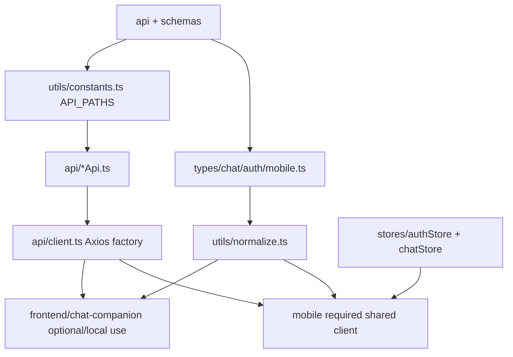

# Module: `packages`

Source-verified: 2026-06-02 from `packages/shared/src/**`, root `package.json`, web/mobile clients, and backend API contracts.

## Purpose

`packages` contains workspace packages shared by web/mobile clients. The active package is `@rag/shared`.

## Workspace Contract

Root `package.json` workspaces:

```json
[
  "packages/*",
  "frontend/chat-companion",
  "mobile"
]
```

`@rag/shared` is consumed by `mobile` and is also available to the web app.

## `packages/shared` File Map

```text
packages/shared/src/
  api/
    client.ts          Axios factory with Bearer token injection and refresh retry.
    chatApi.ts         /chat/v3 helpers and identity resolution.
    authApi.ts         /auth/register, /auth/login, /auth/me.
    sessionApi.ts      /sessions, /sessions/me, /session/:id, create session.
    bookmarkApi.ts     Bookmark/folder endpoints.
    feedbackApi.ts     Feedback endpoints.
    lookupApi.ts       Lookup and suggested-question endpoints.
    notificationApi.ts Notification endpoints.
  types/
    chat.ts            Chat requests/responses, retrieved docs, trace types.
    auth.ts            Auth/user/token/refresh types and normalizeUser().
    mobile.ts          Bookmark/feedback/lookup/notification types.
  stores/
    authStore.ts       Zustand auth store factory with optional refresh token.
    chatStore.ts       Zustand chat state factory.
  utils/
    constants.ts       API_PATHS.
    normalize.ts       Normalize raw /chat/v3 or metadata payload.
    sanitize.ts        Text/user-context sanitizers.
  index.ts             Public package exports.
```

## API Path Contract

`utils/constants.ts` defines frontend/mobile paths such as:

- `/chat`
- `/chat/v3`
- `/chat/stream`
- `/health`
- `/auth/login`
- `/auth/register`
- `/auth/me`
- `/auth/refresh`
- `/sessions`
- `/sessions/me`
- `/session`
- `/bookmarks`
- `/bookmark-folders`
- `/lookup/ctdt`
- `/lookup/regulations`
- `/lookup/calendar`
- `/lookup/compare`
- `/chat/suggest`
- `/notifications`
- `/notifications/subscribe`
- `/notifications/unsubscribe`

Keep these aligned with FastAPI routes.

## Normalization Contract

`utils/normalize.ts` mirrors the web chat normalizer and converts raw backend `/chat/v3` or stream metadata payloads into typed `ChatV3Response`.

If backend chat metadata changes, update:

- `packages/shared/src/types/chat.ts`
- `packages/shared/src/utils/normalize.ts`
- web local `services/chatApi.ts`
- mobile chat UI

## Module Flow



External module boundaries:

- `packages/shared` is client-side contract glue; it should not contain app-specific UI.
- Backend route/schema changes require synchronized updates here plus web/mobile local services where they still exist.
- Apps own token storage and base URLs; shared clients accept callbacks for token retrieval/refresh.

## Maintenance Notes

- Avoid app-specific UI code in shared package.
- Shared APIs should accept an `AxiosInstance` so apps can own base URL/token behavior.
- `createApiClient` supports app-owned `getToken`, `refreshAuth`,
  `onUnauthorized`, and `withCredentials`. Refresh is attempted once per 401
  response before clearing auth.
- `UserPublic` normalization should keep canonical `id` from backend `_id`/`id`.
- `TokenResponse` includes `expires_in`; `refresh_token` is optional because web
  receives refresh credentials by HttpOnly cookie and mobile receives JSON.

## Useful Checks

```bash
npm run typecheck --workspace=@rag/shared
```
