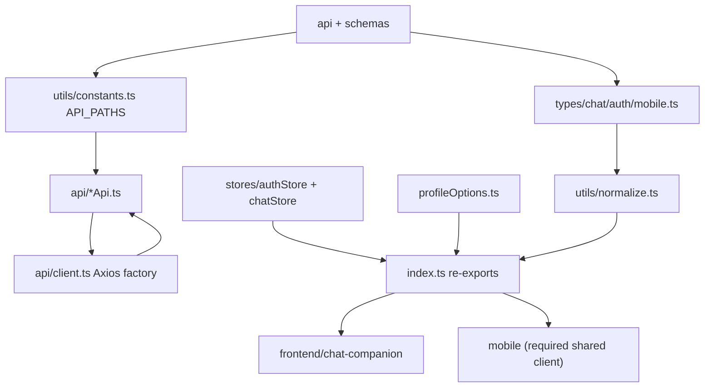

# Module: `packages`

Source-verified: 2026-06-05 from `packages/shared/src/**` (index.ts, api/*, types/*, stores/*, utils/*, profileOptions.ts), `packages/shared/package.json`, and root `package.json`.

## Purpose

`packages` contains workspace packages shared by the web (`frontend/chat-companion`) and mobile clients. The only package is `@rag/shared`, a platform-agnostic layer of TypeScript types, Axios API helpers, Zustand store factories, normalizers, and option lists. It contains no UI; apps own base URLs, token storage, and SSE streaming.

## Workspace Contract

Root `package.json` workspaces:

```json
[
  "packages/*",
  "frontend/chat-companion",
  "mobile"
]
```

`@rag/shared` (`name: "@rag/shared"`, `main`/`types` point at `src/index.ts`, no build step) is consumed by `mobile` and available to the web app. Dependencies: `axios`, `zustand`, `zod`.

## `packages/shared` File Map

```text
packages/shared/src/
  index.ts             Public package barrel — re-exports types, API fns, utils, stores, profile options.
  profileOptions.ts    MAJOR_OPTIONS (68 HUST majors), COHORT_OPTIONS (K62–K70), findMajorOptionByCode(), MajorOption type.
  api/
    index.ts           API barrel re-exporting all *Api helpers + createApiClient.
    client.ts          createApiClient(): Axios factory w/ Bearer injection + single 401 refresh retry. Exports ApiClientConfig.
    chatApi.ts         sendMessage/sendMessageV3 (POST /chat/v3), checkHealth (GET /health), resolveChatIdentity(). No SSE (per-platform).
    authApi.ts         registerUser, loginUser, getMe (/auth/register, /auth/login, /auth/me); applies normalizeUser.
    sessionApi.ts      getSessions, getMySessions, getSession, createSession (/sessions, /sessions/me, /session/:id, POST /session).
    bookmarkApi.ts     Bookmark + folder CRUD (/bookmarks, /bookmark-folders) incl. getBookmarkByTurn.
    feedbackApi.ts     submitFeedback, getFeedback, getFeedbackStats, listAllFeedback (/feedback, /feedback/stats, /feedback/list).
    lookupApi.ts       lookupCTDT, lookupRegulations, lookupCalendar, lookupCompare, getSuggestedQuestions.
    notificationApi.ts list/unread-count/read/read-all/delete + subscribe/unsubscribe (Expo push topics).
  types/
    index.ts           Type barrel re-exporting chat/auth/mobile types + normalizeUser.
    chat.ts            Message, UserContext, ChatRequest/Response, ChatV3Response, retrieved-doc/trace types, Session, Turn.
    auth.ts            RegisterRequest, UserPublic, LoginRequest, TokenResponse + normalizeUser() (canonical id from _id/id).
    mobile.ts          Bookmark, FeedbackResponse/Stats, LookupDocument, SuggestedQuestion, Notification* request/response types.
  stores/
    index.ts           Store barrel re-exporting both factories + their state types.
    authStore.ts       createAuthStore(): vanilla Zustand auth store (token, refreshToken, user, setAuth/clearAuth/setUser).
    chatStore.ts       createChatStore(): vanilla Zustand chat store (messages, activeSessionId, chatPhase + mutators).
  utils/
    index.ts           Utils barrel re-exporting sanitize, normalize, constants.
    constants.ts       API_PATHS map + CLARIFY_SENTINEL ('[CLARIFY]').
    normalize.ts       normalizeV3Response, mapSourceToRetrieved, normalizeRetrievedDocuments.
    sanitize.ts        cleanText, sanitizeUserContext.
```

## API Path Contract

`utils/constants.ts` defines the `API_PATHS` map consumed by the api helpers:

- `/chat` (CHAT)
- `/chat/v3` (CHAT_V3)
- `/chat/stream` (CHAT_STREAM)
- `/health` (HEALTH)
- `/auth/login` (AUTH_LOGIN)
- `/auth/register` (AUTH_REGISTER)
- `/auth/me` (AUTH_ME)
- `/auth/refresh` (AUTH_REFRESH)
- `/sessions` (SESSIONS)
- `/sessions/me` (SESSIONS_ME)
- `/session` (SESSION)
- `/bookmarks` (BOOKMARKS)
- `/bookmark-folders` (BOOKMARK_FOLDERS)
- `/feedback` (FEEDBACK)
- `/lookup/ctdt` (LOOKUP_CTDT)
- `/lookup/regulations` (LOOKUP_REGULATIONS)
- `/lookup/calendar` (LOOKUP_CALENDAR)
- `/lookup/compare` (LOOKUP_COMPARE)
- `/chat/suggest` (CHAT_SUGGEST)
- `/notifications` (NOTIFICATIONS)
- `/notifications/subscribe` (NOTIFICATION_SUBSCRIBE)

Sub-paths such as `/feedback/stats`, `/feedback/list`, `/notifications/unread-count`, `/notifications/{id}/read`, `/notifications/read-all`, and `/notifications/unsubscribe` are built inline from these constants in the api helpers. Keep these aligned with FastAPI routes.

## Normalization Contract

`utils/normalize.ts` converts raw backend `/chat/v3` (or stream metadata) payloads into a typed `ChatV3Response`. It tolerates `retrieved_documents` or `sources`, derives `model_name`/`intent` fallbacks from `mode`/`route`, and back-fills `tool_calls`/`tools_used` from `agent_trace` when absent at top level.

If backend chat metadata changes, update:

- `packages/shared/src/types/chat.ts`
- `packages/shared/src/utils/normalize.ts`
- web local `services/chatApi.ts`
- mobile chat UI

## Module Flow



External module boundaries:

- `packages/shared` is client-side contract glue; it should not contain app-specific UI.
- Backend route/schema changes require synchronized updates here plus web/mobile local services where they still exist.
- Apps own token storage and base URLs; shared clients accept callbacks for token retrieval/refresh. SSE streaming is implemented per platform (web ReadableStream, mobile react-native-sse).

## Maintenance Notes

- Avoid app-specific UI code in shared package.
- `createApiClient` takes an `ApiClientConfig` with app-owned `getToken`, `refreshAuth`, `onUnauthorized`, `withCredentials`, and `timeout` (default 120_000 ms). Refresh is attempted once per 401 response before calling `onUnauthorized`.
- Stores are vanilla Zustand stores (`zustand/vanilla` `createStore`); each platform wraps them with React bindings.
- `UserPublic` normalization (`normalizeUser`) keeps canonical `id` from backend `_id`/`id`.
- `TokenResponse` includes `expires_in`; `refresh_token` is optional because web receives refresh credentials by HttpOnly cookie and mobile receives JSON.
- `profileOptions.ts` is the canonical registration list of HUST majors/cohorts; keep `MAJOR_OPTIONS` codes aligned with backend `major_code` values.

## Useful Checks

```bash
npm run typecheck --workspace=@rag/shared
```
