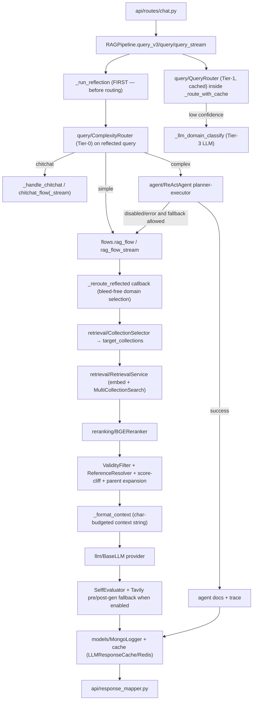

# Module: `pipeline`

Source-verified: 2026-06-24 from `pipeline/__init__.py`, `pipeline/rag_pipeline.py`, `pipeline/flows.py`, `pipeline/document_pipeline.py`.

## Purpose

`pipeline` is the central orchestration layer. It has two major responsibilities:

- Runtime chat/RAG orchestration through `RAGPipeline`.
- Admin document ingestion orchestration through `DocumentPipeline`.

It coordinates the other modules (`query`, `retrieval`, `reranking`, `llm`, `agent`, `models`, `cache`) and returns dict-like runtime results; it does not own low-level storage/search/generation implementations.

## File Map

```text
pipeline/
  __init__.py                   Lazy `__getattr__` export of RAGPipeline and DocumentPipeline.
  rag_pipeline.py               RAGPipeline class: routing, classic RAG, agent, streaming, LLM hot-reload.
  rag_helpers.py                Free helpers: _should_trigger_tier3, timings (_elapsed_ms/_merge_timings/_log_timings/_chunk_for_stream), _build_cache_key, route-cache + Tier-3 constants.
  rag_runtime.py                Runtime construction: _settings_to_cfg, _should_enable_self_evaluator, _build_tavily_tool, _PreparedLLMRuntime dataclass.
  document_pipeline.py          Admin ingestion: convert → clean → chunk → embed+index, delete, rollback (DocumentPipeline class).
  chunker_factory.py            Chunker strategy factory: _create_chunker, _run_chunker, _sanitize_metadata_overrides + strategy/converter/PROTECTED_CHUNK_META_KEYS constants.
  flows/                        Functional flow implementations, split by responsibility (was the single flows.py).
    __init__.py                 Re-exports the full historical `pipeline.flows` API (every top-level name) — import surface unchanged.
    common.py                   Shared low-level utils + cfg readers (_elapsed_ms, _cfg_*, _fold_vietnamese, _dedup_text_values, _is_context_length_error, …).
    url_sanitize.py             Answer/stream URL sanitization (_sanitize_answer_urls, _StreamUrlSanitizer, _strip_raw_urls, …).
    history.py                  Chat-history trimming + budgets (_trim_history).
    title_match.py              Kehoach source-link title-mention matching (_title_mentioned, …).
    profile.py                  Session profile extraction + generation profile notes.
    rerank_scoring.py           Score-cliff pruning, rerank traces, local-evidence scoring.
    retrieval_helpers.py        top_k/candidate-pool/reranker-kwargs, sibling/parent expansion, dedup, ordering, collection scores.
    context.py                  Context formatting + budget resolution + local/web merge (_format_context, …).
    web_fallback.py             Dynamic/freshness detection, kehoach route lock, web-search query build, pre/post web decision + quality gate.
    cache_policy.py             Answer-cache gating + query-cache bypass (_should_cache_final_answer, _should_bypass_query_cache, _build_cache_profile).
    hyde.py                     HyDE post-rerank fallback (_should_trigger_hyde, _hyde_fallback_post_rerank).
    tavily.py                   Tavily search/extract execution + web fallback result assembly.
    coordinators.py             The orchestrators: chitchat_flow(_stream), rag_flow(_stream), _chunk_cached_answer; owns _collection_selector singleton.
```

> Refactor note (2026-07-02): `flows.py` was split into the `flows/` package and free
> functions were extracted from `rag_pipeline.py`/`document_pipeline.py` into
> `rag_helpers.py`/`rag_runtime.py`/`chunker_factory.py`. Code was moved **verbatim**
> (no logic change); the `flows/` submodules form an acyclic DAG
> (common/url_sanitize/history/title_match → profile/rerank_scoring/retrieval_helpers/context
> → web_fallback/hyde/tavily/cache_policy → coordinators). Every previously importable
> name (`from pipeline.flows import X`, `from pipeline.rag_pipeline import Y`,
> `from pipeline.document_pipeline import Z`) is re-exported, so external callers,
> tests, and `agent/react_agent.py`'s lazy `_trim_history` import are unaffected.

## `RAGPipeline` Construction

`RAGPipeline.__init__(settings=None, api_key=None, config=None, env_path=None, mongo_logger=None, llm_cache=None)`
loads `.env`, builds a `Settings`, converts it to a legacy `cfg` dict via
`_settings_to_cfg()` (merged with any `config` override), and constructs the
shared runtime components:

- one `RetrievalService.from_settings(settings)` — the single shared retrieval stack.
- aliases into that service: `_bge`, `_e5`, `_searcher`, `_reranker`, `_tavily`.
- `_reflector` (`QueryReflector`, when `reflection_enabled`; failure is non-fatal).
- `_decomposer` (`QueryDecomposer`; failure is non-fatal → `None`).
- `_router` (`QueryRouter`, zero-cost local classifier, mode from `router_mode`).
- `_chat` (`BaseLLM` via `llm.create_llm(settings)`).
- `_self_eval` (`SelfEvaluator`, only when `_should_enable_self_evaluator(cfg)` —
  i.e. `self_eval_enabled` is explicitly true; it is NOT auto-enabled by Tavily).
- `_validity_filter` (`ValidityFilter`) and `_reference_resolver` (`ReferenceResolver`).
- `complexity_router` (`ComplexityRouter`) — Tier-0 simple/complex/chitchat router.
- `agent` (`ReActAgent`) only when `settings.agent_enabled`, else `None`.
- `_mongo_logger`, `_llm_cache`, an `_llm_runtime_lock` (RLock) and a `_route_cache` (LRU/TTL `OrderedDict`).

`CollectionSelector` is NOT owned by `RAGPipeline`; it is a module-level singleton
(`_collection_selector`) inside `flows.py`.

Public property:

```text
RAGPipeline.retrieval_service  → the shared, already-loaded retrieval stack.
```

This property was added since the last doc revision (was previously noted as absent).
Route handlers (e.g. `/retrieval/search`) use it instead of building a second
`RetrievalService`.

Important contract:

```text
RAGPipeline owns exactly one RetrievalService instance.
Agent tool adapters receive that same instance via inject_from_retrieval_service(),
avoiding a ~17 s cold-start rebuild of embedders/searcher/reranker.
```

## Runtime LLM Reload

Admin LLM-config updates use the prepare/commit pattern around Mongo persistence:

- `prepare_llm_config_reload(settings)` builds replacement LLM clients (chat,
  self-evaluator, reflector, decomposer, agent, Tavily tool) into a frozen
  `_PreparedLLMRuntime` before anything is committed.
- `commit_llm_config_reload(settings, prepared)` hot-swaps those references under
  `_llm_runtime_lock`, points the shared `RetrievalService` at the new settings +
  Tavily tool, clears `_route_cache`, and re-injects the retrieval service into
  agent tool adapters. Returns a summary dict of what was rebuilt.

Every chat entrypoint first calls `_llm_runtime_snapshot()` to capture one
consistent set of hot-swappable clients, so an in-flight request keeps a stable
LLM bundle even if a reload commits mid-flight. The shared retrieval service keeps
its existing embedders/searcher/reranker across a reload.

## Chat Entrypoints

Public methods on `RAGPipeline`:

- `query(question, history=None, top_k=None, session_id=None, user_context=None, *, pre_ref_result=None, pre_reflection_ms=None)` —
  classic non-streaming RAG. Routes (Tier-1, cached), dispatches to `chitchat_flow`
  or `rag_flow`, merges timings into a `RequestTrace`, and logs RAG turns to Mongo
  (chitchat turns are intentionally NOT logged). Accepts `pre_ref_result` /
  `pre_reflection_ms` to reuse reflection already done upstream (e.g. from
  `query_v3`). Returns `question`, `answer`, `sources`, `num_sources`, `intent`,
  `model_name`, `timings_ms`, `request_trace`, `correlation_id`, and `turn_id`
  when logged.
- `query_v3(question, ...)` — smart entrypoint. Runs reflection FIRST on the raw
  question, then routes on the reflected query via `ComplexityRouter`:
  `chitchat → _handle_chitchat()` (no retrieval, no LLM); `simple` (or agent
  disabled) → `query()` tagged `mode="rag_v2"`, passing pre-reflection;
  `complex → query_agent()` with `pre_reflected`/`pre_reflection_prompt`/
  `pre_reflection_ms` forwarded to skip duplicate reflection.
- `query_agent(question, ..., *, route_label="complex", require_agent=False, complexity_subtype=None, pre_reflected=None, pre_reflection_prompt=None, pre_reflection_ms=None)` —
  forces the agent path. When `pre_reflected` is supplied, skips internal
  reflection and uses it directly. Otherwise reflects internally. Infers
  `complexity_subtype` from `complexity_router` when not given, runs
  `agent.run(...)`, persists an agent trace, and returns `mode="agent"` with
  `tools_used`/`tool_calls`/`iterations`/`agent_trace`/`sources`. On agent
  disabled/crash/error it falls back to `query()` (`mode="rag_v2_fallback"`)
  unless `require_agent=True` (then raises when agent is disabled).
- `query_stream(question, ..., metadata_out=None)` — streaming entrypoint.
  Runs reflection FIRST, then `ComplexityRouter` on the reflected query:
  `chitchat → chitchat_flow_stream`; `complex` (agent enabled) → `query_agent`
  answer yielded via `_chunk_for_stream`; else `simple`/RAG →
  `rag_flow_stream`. All per-request metadata (mode, timings, sources, traces,
  tool info, fusion weights) is written into the caller-supplied `metadata_out`
  dict at generator exhaustion — NOT on `self.last_*` attrs (those are mirrored
  afterwards for backward compat only, and are NOT concurrency-safe). Logs to
  Mongo after stream finishes (skipping chitchat). The `complex` branch also
  yields `{"type": "status", "stage": ..., "message": ...}` progress dicts
  before/after the agent call; only `str` chunks form the actual answer.

Private helpers:

- `_run_reflection(question, history, user_context, runtime)` — shared reflection
  call returning `(reflected_question, ref_result, reflection_ms)`. Used by both
  `query_v3` and `query_stream` to run reflection once before routing.
- `_route_with_cache(question, history)` — TTL (45 s) + size-bounded (256) LRU
  cache over `QueryRouter.route()`, keyed by question + last 2 history turns.
  Tier-3 LLM fallback runs inside this method so the result is cached.
- `_reroute_reflected(reflected_query, prior_routing)` — re-routes the
  post-reflection standalone query without history (history-bleed-free) and
  optionally runs Tier-3 on the reflected query. Passed as `reroute_reflected`
  callback into `rag_flow`/`rag_flow_stream`.
- `_llm_domain_classify(question, history, current_routing)` — Tier-3 fallback:
  prompts the chat LLM with `DOMAIN_CLASSIFICATION_PROMPT`, parses JSON
  `{domains, confidence}`, filters to valid `RAG_LABELS`, and overrides
  `domains`/`domain`/`confidence` (setting `tier3_override=True`) only when valid
  domains are returned. Keeps the classifier result on any failure.
- `_query_decomposed(question, domain_subqueries, ...)` — legacy multi-domain RAG
  helper; builds union routing across sub-query collections and calls `rag_flow`
  with `domain_subqueries`. Not on the default `query_v3` path.
- `_handle_chitchat(question)` — keyword-based canned Vietnamese replies (no LLM,
  no retrieval) used by `query_v3`'s chitchat branch.

Module-level routing helpers in `rag_pipeline.py`:

- `_should_trigger_tier3(routing)` — gates the Tier-3 LLM domain fallback. Skips
  when `confidence >= _LLM_FALLBACK_THRESHOLD` (0.55), and also skips when the top
  domain's probability margin over the second domain `>= _TIER3_DOMINANT_DOMAIN_MARGIN`
  (0.25), saving an unnecessary ~12 s LLM call when one domain is clearly dominant.

Typical returned `mode` values: `chitchat`, `rag_v2`, `agent`, `rag_v2_fallback`.

## Smart Query Flow

```text
query_v3(question)
  -> _run_reflection()  [FIRST — so routing sees expanded query]
  -> ComplexityRouter.route(reflected_question)
     -> chitchat: _handle_chitchat(), no retrieval, no LLM
     -> simple (or agent disabled): query(pre_ref_result=...)  [mode="rag_v2"]
     -> complex: query_agent(pre_reflected=..., pre_reflection_ms=...)
        -> agent.run() planner/executor
        -> fallback to query() when agent disabled/errors unless require_agent

query_stream(question)
  -> _run_reflection()  [FIRST]
  -> ComplexityRouter.route(reflected_question)
     -> chitchat: chitchat_flow_stream
     -> complex + agent enabled: query_agent → _chunk_for_stream + status events
     -> simple / complex + agent disabled: rag_flow_stream
```

`query()` itself, after Tier-1 routing, does NOT re-run Tier-3 separately — Tier-3
already ran inside `_route_with_cache` (so the result is cached).

## Module Flow



External module boundaries:

- `api` owns HTTP/session/auth mapping; `pipeline` owns orchestration and returns dict-like runtime results.
- `query` decides route/reflection/entities; `retrieval` owns stores/search; `reranking` owns re-scoring; `llm` owns provider calls.
- `agent` is used only for complex mode and receives the shared retrieval runtime from this module.
- `models` and `cache` persist turns/sessions/cache metadata; they should not alter retrieval/generation decisions.

## Classic RAG Flow

Implemented in `flows.py:rag_flow()` (all-keyword signature: `question`, `history`,
`reflector`, `bge_embedder`, `e5_embedder`, `searcher`, `reranker`, `chat_model`,
`self_evaluator`, `tavily_tool`, `cfg`, optional `routing_result`, `user_context`,
`validity_filter`, `reference_resolver`, `llm_cache`, `domain_subqueries`,
`reroute_reflected`, `pre_ref_result`, `pre_reflection_ms`):

1. Trim history (`_trim_history`, budgeted by message/total char limits).
2. Decide query-cache bypass for freshness/dynamic queries (`_should_bypass_query_cache`).
3. Pre-retrieval query cache lookup when safe (`llm_cache.get_by_query`, profile-scoped).
4. Reflect/rewrite query and resolve major/cohort entities. If `pre_ref_result` is
   supplied (from `query_v3`/`query_stream`), uses it directly without re-calling the LLM.
   Falls back to `query.reflection._extract_entities` when reflection misses major/cohort.
5. Re-route on reflected standalone query via `reroute_reflected` callback (bleed-free).
6. Set `retrieval_major` to `resolved_major`.
   (drops the major filter for topics like scholarships whose answer is universal).
7. Route domain and select collections (`CollectionSelector`); optionally lock kehoach
   for freshness/dynamic queries (`_should_lock_kehoach_route`).
8. Build metadata filters and retrieval query variants (major strip/expand, comparison sub-queries).
9. Embed BGE/E5 and run `MultiCollectionSearch` (candidate pool sized by `_resolve_candidate_pool`).
10. Retry/relax strategies when empty (decomposed fallback → quydinh-filter disabled → all-collections → relaxed comparison).
11. Deduplicate candidates (`_dedup_retrieval_candidates`).
12. Optional pre-rerank sibling expansion (`_expand_with_siblings_pre_rerank`).
13. Expand major in rerank query (`expand_major_in_query_for_reranking`), then rerank (`_reranker_kwargs`, `_reranker_min_top_k`).
14. Rerank fallback: if reranker returns empty or all-negative scores, retry with original question; if still poor, use raw fusion top-k (`rerank_raw_fallback=1.0`).
15. HyDE post-rerank fallback when `_should_trigger_hyde` (`hyde_enabled` + poor recall).
16. Per-collection score-cliff pruning (`_apply_score_cliff_per_collection`).
17. Apply `ValidityFilter` and resolve legal references via `ReferenceResolver`.
18. Optional post-rerank parent-context expansion (`_expand_parent_context_post_rerank`).
19. Pre-generation Tavily web enrichment (`_build_pre_generation_web_decision`) when warranted.
20. LLM response cache check (doc-ID-keyed, profile-scoped).
21. Order originals + siblings (`_order_with_siblings`), format context (`_format_context`),
    merge local + web context (`_merge_local_and_web_context`), prepend profile note.
22. Generate the LLM answer; context-length recovery retries with reduced budget.
23. Optionally run self-eval and decide post-gen Tavily web fallback (`_build_answer_quality_gate`).
24. Local-evidence retry: if `should_web_search` but strong local evidence and no dynamic/freshness signal, regenerate locally before triggering Tavily.
25. Write caches/logging metadata when the answer is stable (`_should_cache_final_answer`).

Important current behaviour:

- `_fold_vietnamese` normalizes via `.replace("đ", "d").replace("Đ", "D").casefold()` (NFD decomposition + non-spacing mark removal + unified casing). Used across no-info detection, dynamic-query building, and policy-evidence matching.
- List/enumeration queries can raise effective `top_k` (`_resolve_top_k`, multiplier=2, capped at 12).
- Raw candidate pool size is configurable (`raw_candidate_multiplier`, `raw_candidate_min`); low-confidence routing can double the resolved pool when `low_conf_pool_expand_enabled` is true.
- Classic and streaming RAG pass configured reranker knobs through every rerank attempt: `reranker_score_threshold`, `reranker_table_score_threshold`, and `reranker_min_top_k` capped to the effective `top_k`.
- Freshness/plan queries routed to `kehoach` can lock collection selection to `kehoach` (`_should_lock_kehoach_route`); policy-type signals in the query suppress this lock.
- Profile notes are injected only when `_should_prepend_profile_note` matches (personal-pronoun pattern). Generic latest/freshness queries do not inherit major/cohort from profile/history.
- `_query_decomposed()` remains a legacy helper; `query_v3()` routes multi-source complex questions to the Planner-Executor agent rather than bypassing it.
- If BGE reranking returns an empty list or only negative scores from raw candidates, both `rag_flow()` and `rag_flow_stream()` retry reranking with the original question. If still empty or only negative explicit scores, they use raw fusion top-k, set `timings_ms["rerank_raw_fallback"] = 1.0`, and update `rerank_trace` (`fallback_reason`, `rerank_fallback`, `rerank_raw_fallback`, final counts).
- RAG answer-cache writes are gated by `_should_cache_final_answer`: only for stable local answers (`answer_status == "answered"`, no no-info text, no `should_web_search`, no `no_sources`/`no_info`, no `self_eval_failed`, no dynamic/stale-risk signal, no pre/post web fallback). Cache hits return minimal trace fields.
- `rag_flow_stream()` runs retrieval first, then streams tokens; it intentionally avoids post-generation self-eval/Tavily to preserve streaming semantics, and writes flow metadata into `metadata_out` / timings into `timings_ms_out`. The streaming path does NOT support `domain_subqueries` (absent from its signature).

## Tavily / Web Fallback

`flows.py` has two web stages for non-streaming RAG:

- **Pre-generation** (`_build_pre_generation_web_decision`): for no-source, dynamic/freshness,
  or low-retrieval-confidence cases. High local confidence suppresses the dynamic trigger.
  When `freshness_tavily_check_enabled`, local kehoach docs without `date_str` or with
  dates > 90 days old are treated as stale, allowing Tavily through.
- **Post-generation** (`_build_answer_quality_gate`): when the answer text says no
  information, no sources were found, or self-eval requests web search with `answer_status`
  in `insufficient`/`stale_risk`. Suppressed when strong local exact-policy evidence exists.
  A local-evidence retry (regenerate from local docs only) is attempted first before Tavily
  when `strong_local_evidence` is true and the query is not dynamic/freshness.

Streaming RAG (`rag_flow_stream`) uses only the **pre-generation** path; there is no
post-gen Tavily in the streaming branch.

`_tavily_search_context` has two paths:
- **Path A**: caller supplies `extract_urls` → Tavily Extract API directly.
- **Path B**: normal keyword search, filtered to the full 16-domain whitelist
  (`HUST_OFFICIAL_DOMAINS + HUST_EXTENDED_DOMAINS + EDU_AUTHORITATIVE_DOMAINS`) so the
  classic path is at parity with the agent path. If search returns empty context, falls
  back to `tavily_tool.extract` on the top URL (Path B2).

Both stages require `tavily_fallback_enabled` and a valid Tavily tool; web context
is merged deterministically with local context (`_merge_local_and_web_context`).

## `DocumentPipeline`

Used by `api/routes/upload.py` for admin document management. Heavy resources
(embedders, vector/ES stores) are lazy-loaded.

Constructor: `DocumentPipeline(settings=None, storage=None)`. Default storage is
`LocalStorage(base_dir=settings.upload_dir)`.

Main methods:

- `convert_pdf(doc_id, db, converter="pymupdf4llm")` — PDF → markdown (`pymupdf4llm` or `docling`).
  Updates status: `converting` → `converted` (or `failed`).
- `clean(doc_id, db)` — clean converted markdown via `document_loader.clean_markdown.clean_markdown`.
  Updates status: `cleaning` → `cleaned` (or `failed`).
- `chunk(doc_id, strategy, db)` — chunk via `_create_chunker`/`_run_chunker`; falls back
  to `recursive` when `hierarchical`/`olmocr` yields 0 chunks. Stores chunks in Mongo and
  resets `chunks_reviewed=false`. Raises `ValueError` and sets `failed` if 0 valid chunks
  are produced. Updates status: `chunking` → `chunked` (or `failed`).
- `embed_and_index(doc_id, db)` — requires `chunks_reviewed=True`; embeds with BGE-M3 + E5,
  remaps `parent_id` from `chunker_original_id` → actual Qdrant point UUID, indexes into
  Qdrant (parent+child) and ES (child/recursive/appendix only via `is_indexable_chunk`);
  triggers `evaluation.post_index.trigger_post_index_eval` after indexing (non-fatal).
  Updates status: `embedding` → `indexed` (or `failed`).
- `run_full_pipeline(doc_id, db, converter="pymupdf4llm")` — runs convert/clean/chunk
  sequentially, stops on first failure. Indexing waits for the admin review gate.
- `delete_indexed_data(doc_id, collection_name)` — remove from Qdrant + ES (each failure is
  non-fatal and logged).
- `rollback(doc_id, db)` — reverts document one logical state back, cleaning artifacts.
  Works for statuses: `indexed`/`embedding` → `chunked`; `chunked`/`chunking` → `cleaned`;
  `cleaned`/`cleaning` → `converted`; `converted`/`converting` → `uploaded`; `failed` →
  rolls back to highest completed state using `chunked_at`/`cleaned_at`/`converted_at`
  timestamps.

Chunker strategy routing (`_create_chunker`):

| strategy | class | notes |
|----------|-------|-------|
| `recursive` | `RecursiveChunker(chunk_size=1024, chunk_overlap=0, protect_tables=True, add_section_context=True)` | default |
| `hierarchical` + `pymupdf4llm` | `ArticleLegalChunkerPyMuPDF` | |
| `hierarchical` + `docling` | `ArticleLevelLegalChunker` | |
| `olmocr` | `OlmOcrLegalChunker` | |
| `kehoach`/`stsv`/unknown | `RecursiveChunker` (fallback) | JSON-schema strategies not suitable for PDF text |

Admin upload status lifecycle:

```text
uploaded → converting → converted → cleaning → cleaned
→ chunking → chunked → [chunks_reviewed=True] → embedding → indexed
```

It writes: local files via `utils.storage.LocalStorage`, the `documents` and
`document_chunks` Mongo collections, Qdrant points, and Elasticsearch docs. It skips
non-indexable/non-storable header chunks via `utils.chunk_indexing`
(`is_indexable_chunk`, `is_qdrant_storable`).

Caution: `DocumentPipeline.chunk()` dumps debug chunk JSON to a project-relative path
(`<RAG_v2>/data/quydinh/admin_upload/<doc_id>_<strategy>_chunks.json`). The dump
failure is caught and non-fatal. The path is no longer hardcoded to a developer's
home directory (was `/Users/nam.nguyen/...` in a previous version).

## Maintenance Notes

- For any change to `RAGPipeline` public output, update `api/response_mapper.py`, `schemas/chat.py`, web/mobile normalizers, and tests.
- For routing/reflection/filter changes, run retrieval and conversation regression tests.
- For document pipeline status/schema changes, update upload routes, document schemas, web admin UI, and tests.
- Keep the shared `RetrievalService` single-load behaviour intact; `retrieval_service` property exposes it read-only.
- `query_v3` and `query_stream` now run reflection BEFORE routing (not after). Any change to that order must account for the `pre_ref_result`/`pre_reflected` handoff to downstream methods.
- `self.last_*` attributes on `RAGPipeline` are NOT concurrency-safe under concurrent streaming. Use the `metadata_out` dict pattern for per-request data in production.

## Useful Checks

```bash
python -m py_compile pipeline/*.py
python -m pytest tests/test_chat_route_mode.py tests/test_document_pipeline.py -q -m "not integration"
```
