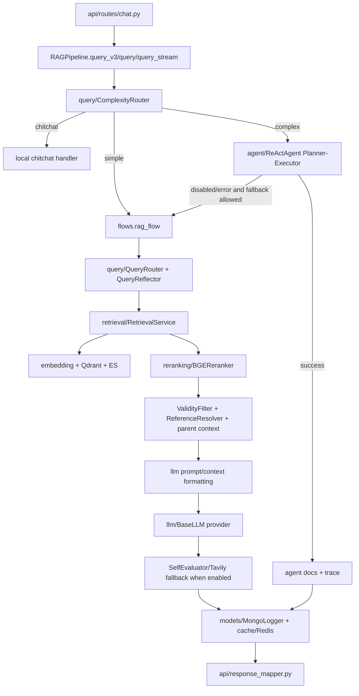

# Module: `pipeline`

Source-verified: 2026-06-02 from `pipeline/*.py`, `api/routes/chat.py`, `api/routes/upload.py`, `api/routes/admin_stats.py`, and GitNexus context for `RAGPipeline` and `DocumentPipeline`.

## Purpose

`pipeline` is the orchestration layer. It has two major responsibilities:

- Runtime chat/RAG orchestration through `RAGPipeline`.
- Admin document ingestion orchestration through `DocumentPipeline`.

It should coordinate modules, not own low-level storage/search implementations.

## File Map

```text
pipeline/
  __init__.py              Lazy export for RAGPipeline and DocumentPipeline.
  rag_pipeline.py          RAGPipeline class: smart routing, classic RAG, agent, streaming.
  flows.py                 Functional flow implementation for chitchat/RAG/stream/Tavily.
  document_pipeline.py     Admin upload conversion, cleaning, chunking, indexing, rollback.
  test_rag_pipeline.py     Module-local tests.
  test_flows_major_fallback.py Module-local flow tests.
```

## `RAGPipeline` Construction

`RAGPipeline.__init__()` builds and stores shared runtime components:

- `Settings`
- chat LLM via `llm.create_llm()`
- `QueryRouter`
- `QueryReflector`
- `ComplexityRouter`
- `CollectionSelector`
- `QueryDecomposer`
- one `RetrievalService.from_settings(settings)`
- aliases to shared BGE, E5, searcher, reranker, Tavily tool
- optional `SelfEvaluator`
- `ReActAgent`
- `ValidityFilter`
- `ReferenceResolver`
- optional Mongo/Redis/session/cache dependencies passed from FastAPI

Important contract:

```text
RAGPipeline owns one RetrievalService instance.
Agent tools receive that same instance through inject_from_retrieval_service().
```

Current caution: the service is stored as `_retrieval_service`; there is no public `service`/`retrieval_service` property in source as of 2026-05-20.

## Runtime LLM Reload

Admin LLM config updates use `RAGPipeline.prepare_llm_config_reload()` before
Mongo persistence and `commit_llm_config_reload()` after persistence succeeds.
The prepared bundle replaces chat LLM, reflector, decomposer, optional
self-evaluator, agent, and Tavily references under one runtime lock while the
shared retrieval service keeps its existing embedders, searcher, and reranker.
Chat/query entrypoints take an LLM runtime snapshot so in-flight calls keep a
consistent set of hot-swappable clients.

After a Tavily replacement the pipeline re-injects its shared retrieval service
into agent tool adapters so agent web-search uses the refreshed tool without
cold-loading retrieval models.

## Chat Entrypoints

`RAGPipeline` public methods:

- `query()`: classic RAG entrypoint.
- `query_v3()`: smart entrypoint used by API/mobile/web.
- `query_agent()`: direct agent path.
- `query_stream()`: streaming entrypoint for `/chat/stream`.

Private orchestration helpers:

- `_route_with_cache()`
- `_query_decomposed()`
- `_llm_domain_classify()`
- `_handle_chitchat()`

## Smart Query Flow

```text
query_v3(question)
  -> ComplexityRouter
     -> chitchat: _handle_chitchat(), no retrieval
     -> simple: query()
     -> complex: query_agent()
        -> comparison/multi_source: agent decompose -> planner -> executor
        -> general/missing subtype: agent planner -> executor
        -> fallback to query() when agent disabled/errors unless require_agent
```

Typical returned modes:

- `chitchat`
- `rag_v2`
- `agent`
- `rag_v2_fallback`

## Module Flow



External module boundaries:

- `api` owns HTTP/session/auth mapping; `pipeline` owns orchestration and returns dict-like runtime results.
- `query` decides route/reflection/entities; `retrieval` owns stores/search; `llm` owns provider calls.
- `agent` is used only for complex mode and receives shared retrieval runtime from this module.
- `models` and `cache` persist turns/sessions/cache metadata; they should not alter retrieval/generation decisions.

## Classic RAG Flow

Implemented primarily in `flows.py:rag_flow()`:

1. Trim history.
2. Check query-only cache when safe.
3. Route domain and select collections.
4. Reflect/rewrite query and extract entities.
5. Build metadata filters and retrieval query variants.
6. Embed BGE/E5.
7. Run `MultiCollectionSearch`.
8. Retry with relaxed strategies when results are empty.
9. Deduplicate candidates.
10. Rerank.
11. Apply `ValidityFilter`.
12. Resolve legal references through `ReferenceResolver`.
13. Format context with metadata headers and profile note when appropriate.
14. Generate LLM answer.
15. Write caches/logging metadata.
16. Optionally run self-eval/Tavily fallback.

Important current behavior:

- List/enumeration queries can raise effective `top_k`.
- Raw candidate pool size is configurable via `raw_candidate_multiplier` and
  `raw_candidate_min`; low-confidence routing can still double the resolved
  pool when `low_conf_pool_expand_enabled` is true.
- Classic and streaming RAG pass configured reranker knobs through every rerank
  attempt: `reranker_score_threshold`, `reranker_table_score_threshold`, and
  `reranker_min_top_k` capped to the effective `top_k`.
- Freshness/plan queries routed to `kehoach` can lock collection selection to `kehoach`.
- Profile notes are injected only for profile-dependent wording like "nganh cua toi"; generic latest/freshness queries should not inherit major/cohort from profile/history.
- `query_v3()` no longer has a `personal_check` or `rag_v2_decomposed` public branch. Personal-reference eligibility wording is routed as complex/multi-source and reaches the Planner-Executor when the agent is enabled.
- `_query_decomposed()` remains a legacy helper, but `query_v3()` does not bypass the agent for multi-source complex questions.
- If BGE reranking receives raw candidates but returns an empty list, both `rag_flow()` and `rag_flow_stream()` retry reranking with the original question. If the retry is still empty or has only negative explicit scores, they use raw fusion top-k, set `timings_ms["rerank_raw_fallback"] = 1.0`, and update `rerank_trace` with `fallback_reason`, `rerank_fallback`, `rerank_raw_fallback`, and final candidate/returned counts.
- RAG answer cache writes are allowed only for stable local answers: `answer_quality_gate.answer_status == "answered"`, no no-info answer text, no `should_web_search`, no `no_sources`, no `self_eval_failed`, no dynamic/stale-risk signal, and no pre/post web fallback. Cache hits return minimal trace fields with `llm_prompt="(cached)"` where applicable.
- Streaming runs retrieval first, then streams tokens; it intentionally avoids post-generation self-eval/Tavily to preserve streaming semantics.

## Tavily/Web Fallback

`flows.py` has two web stages for non-streaming RAG:

- Pre-generation web enrichment for no-source, dynamic/freshness, or low-confidence retrieval cases.
- Post-generation fallback when answer text says no information, no sources were found, or self-eval requests web search with `answer_status` `insufficient`/`stale_risk`.

Both stages are gated by `tavily_fallback_enabled` and require a valid Tavily tool.

## `DocumentPipeline`

Used by `api/routes/upload.py` for admin document management.

Main methods:

- `convert_pdf()`
- `clean()`
- `chunk()`
- `embed_and_index()`
- `run_full_pipeline()`
- `delete_indexed_data()`
- `rollback()`

Admin upload status lifecycle:

```text
uploaded -> converting -> converted -> cleaning -> cleaned
-> chunking -> chunked -> embedding -> indexed
```

It writes:

- local files through `utils.storage.LocalStorage`
- `documents`
- `document_chunks`
- Qdrant points
- Elasticsearch docs

It skips parent/header chunks through `utils.chunk_indexing.is_indexable_chunk()` during indexing.

Current caution: `DocumentPipeline.chunk()` has had debug dump behavior under `data/quydinh/admin_upload`; verify before relying on output path in production.

## Maintenance Notes

- For any change to `RAGPipeline` public output, update `api/response_mapper.py`, `schemas/chat.py`, web/mobile normalizers, and tests.
- For routing/reflection/filter changes, run retrieval and conversation regression tests.
- For document pipeline status/schema changes, update upload routes, document schemas, web admin UI, and tests.
- Keep shared `RetrievalService` single-load behavior intact.

## Useful Checks

```bash
python -m py_compile pipeline/*.py
python -m pytest pipeline/test_rag_pipeline.py pipeline/test_flows_major_fallback.py tests/test_chat_route_mode.py tests/test_document_pipeline.py -q -m "not integration"
```
