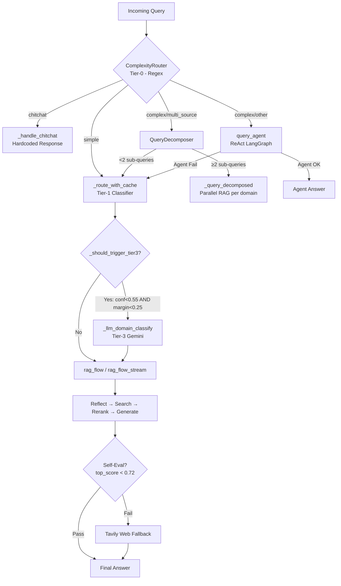

# Module: `pipeline` — Orchestration Layer (Bộ điều phối chính)

## Tổng quan

Module `pipeline` là **trái tim điều phối** của toàn bộ hệ thống RAG v2. Nó đóng vai trò là Orchestrator, kết nối tất cả các thành phần: routing (phân loại độ phức tạp và intent) → reflection (viết lại câu hỏi) → retrieval (tìm kiếm đa nguồn) → reranking (xếp hạng lại) → generation (tạo câu trả lời) → logging & tracing.

Đây là module duy nhất có tầm nhìn end-to-end, đảm bảo yêu cầu của người dùng được chuyển đến đúng luồng xử lý (Chitchat, RAG v2, Decomposed RAG, hoặc ReAct Agent).

---

## Cấu trúc module

```
pipeline/
├── rag_pipeline.py          # RAGPipeline class — Orchestrator chính
├── document_pipeline.py     # DocumentPipeline — Admin upload processing pipeline (Phase 3)
├── flows.py                 # Logic thực thi cụ thể của từng flow
├── test_rag_pipeline.py     # Unit tests cho RAGPipeline
├── test_flows_major_fallback.py  # Tests cho fallback logic trong flows
├── __init__.py              # Export RAGPipeline
└── MODULE.md                # Tài liệu hướng dẫn (file này)
```

---

## Các thành phần chính

### 1. `rag_pipeline.py` — Class `RAGPipeline`

Entrypoint chính của hệ thống. Quản lý khởi tạo, cache, routing, và điều phối toàn bộ pipeline.

#### Khởi tạo (`__init__`)

```python
RAGPipeline(
    settings: Optional[Settings] = None,
    api_key: Optional[str] = None,
    config: Optional[Dict[str, Any]] = None,
    env_path: Optional[str] = None,
    mongo_logger: Optional[MongoLogger] = None,
    llm_cache: Optional[Any] = None,
)
```

Các thành phần được khởi tạo:

| Thành phần | Class | Ghi chú |
|:---|:---|:---|
| **RetrievalService** | `RetrievalService.from_settings(settings)` | Bộ máy tìm kiếm (BGE-M3 + E5, Qdrant + ES, Reranker, Tavily) |
| **QueryReflector** | `QueryReflector(settings)` | LLM-based query rewrite; tùy chọn (disable nếu lỗi) |
| **QueryDecomposer** | `QueryDecomposer(settings)` | Phân rã câu hỏi đa domain; tùy chọn |
| **QueryRouter** | `QueryRouter(mode, embedder=bge)` | Classifier cục bộ (Tier-1) |
| **ComplexityRouter** | `ComplexityRouter()` | Regex-based router (Tier-0) |
| **SelfEvaluator** | `SelfEvaluator(llm=chat)` | Đánh giá chất lượng câu trả lời; tùy chọn |
| **ReActAgent** | `ReActAgent(settings)` | LangGraph agent; chỉ khởi tạo khi `agent_enabled=True` |
| **ValidityFilter** | `ValidityFilter()` | Lọc tài liệu hết hiệu lực |
| **ReferenceResolver** | `ReferenceResolver(retrieval_service)` | Giải quyết tham chiếu chéo |
| **Chat LLM** | `create_llm(settings)` | Gemini (hoặc provider khác qua factory) |

**Caching khi khởi tạo:**
- `_route_cache`: `OrderedDict` (TTL=45s, max=256 entries) — cache kết quả `QueryRouter`
- `_reflect_cache`: `OrderedDict` (TTL=30s, max=256 entries) — cache kết quả `QueryReflector`
- `llm_cache`: Redis-backed `LLMResponseCache` (inject từ ngoài)

**Chia sẻ retrieval stack với Agent:**  
Gọi `inject_from_retrieval_service(retrieval_service)` để inject embedders/searcher/reranker đã khởi tạo vào các agent tool adapters, tránh cold-start ~17s.

---

#### Các phương thức Public API

##### `query(question, history, top_k, session_id, user_context) → Dict`

Luồng xử lý non-streaming chuẩn.

**Các bước:**
1. Auto-load history từ MongoDB nếu có `session_id` và không có `history`.
2. **Tier-1 Routing** (cached): `_route_with_cache()` → gọi `QueryRouter`.
3. **Tier-3 LLM Domain Fallback**: Gọi `_llm_domain_classify()` nếu `_should_trigger_tier3()` trả về `True`.
4. Nếu intent = `chitchat` → gọi `chitchat_flow()`.
5. Nếu intent = `rag` → gọi `rag_flow()` với đầy đủ các thành phần retrieval.
6. Log kết quả vào MongoDB qua `mongo_logger.log_turn()`.

**Return Dict keys:**
- `question`, `answer`, `sources`, `num_sources`, `intent`
- `model_name`, `request_trace`, `correlation_id`
- `reflected_question`, `target_collections`, `collection_scores`
- `timings_ms` (breakdown chi tiết từng stage)

---

##### `query_stream(question, history, top_k, session_id, user_context) → Generator[str]`

Luồng xử lý streaming, yield token-by-token.

**Ba nhánh routing:**

| Tier-0 | Xử lý |
|:---|:---|
| `chitchat` | `chitchat_flow_stream()` — stream trực tiếp từ LLM |
| `complex` + agent enabled | Reflect query → `query_agent()` → yield toàn bộ answer một chunk |
| `simple` / agent disabled | Tier-1 routing → Tier-3 fallback (nếu cần) → `rag_flow_stream()` |

**Metadata sau khi stream kết thúc** (đọc qua `self.last_*` attrs):
- `last_sources`, `last_intent`, `last_mode`, `last_timings`
- `last_reflected_question`, `last_target_collections`, `last_collection_scores`
- `last_routing_probabilities`, `last_applied_filters`, `last_collection_results`
- `last_agent_trace`, `last_tools_used`, `last_iterations`

**Lưu ý:** Chitchat turns **không** log vào MongoDB để tránh noise.

---

##### `query_v3(question, history, top_k, session_id, user_context) → Dict`

Smart entrypoint tổng hợp, điều phối dựa trên `ComplexityRouter` (Tier-0).

**Routing logic:**

```
ComplexityRouter.route(question)
    ├── "chitchat"                   → _handle_chitchat() (hardcoded/regex, không LLM)
    ├── "complex" + "multi_source"   → QueryDecomposer → _query_decomposed() (Decomposed RAG)
    ├── "simple"                     → query() (RAG v2 chuẩn)
    └── "complex" + "other"          → query_agent() (ReAct Agent, fallback về RAG nếu lỗi)
```

**Decomposed RAG** chỉ kích hoạt khi `QueryDecomposer` trả về ≥2 sub-queries. Nếu không, tự động rơi xuống `query()`.

---

##### `query_agent(question, ..., route_label, require_agent, complexity_subtype) → Dict`

Ép buộc chạy qua LangGraph ReAct Agent.

**Graceful Fallback:** Khi `require_agent=False` (mặc định), mọi lỗi từ agent đều tự động fallback về `query()` (RAG v2), đảm bảo luôn có câu trả lời.

**Khi Agent thành công, return:**
- `mode="agent"`, `tools_used`, `tool_calls`, `iterations`, `agent_trace`
- `sources`: tài liệu agent đã truy xuất (qua `get_agent_docs()`)

**Khi Agent thất bại:**
- `mode="rag_v2_fallback"`, `agent_error` (mô tả lỗi)
- Kết quả từ RAG v2 bình thường

---

#### Các phương thức Private

##### `_query_decomposed(question, domain_subqueries, ...) → Dict`

Chạy RAG với per-domain sub-queries rồi merge context.

- `top_k` được mở rộng tỷ lệ với số sub-queries (cap tại 12) để đảm bảo mỗi collection đóng góp đủ candidates.
- Gọi `rag_flow()` với `domain_subqueries` param — flow tự xử lý routing từng sub-query đến đúng collection.

##### `_llm_domain_classify(question, history, current_routing) → Dict`

Tier-3 LLM Domain Fallback — gọi Gemini để phân loại domain khi classifier confidence thấp.

- Parse JSON response từ LLM, lọc ra các domain hợp lệ (`_VALID_DOMAINS`).
- Map string confidence (`"high"/"medium"/"low"`) → numeric (`0.85/0.65/0.45`).
- Gắn `tier3_override=True` vào routing result.

##### `_should_trigger_tier3(routing) → bool` (module-level)

Kiểm tra xem có cần gọi Tier-3 hay không:
- **Không trigger** nếu `confidence >= 0.55`.
- **Không trigger** nếu domain dẫn đầu có margin > 0.25 so với domain thứ 2 (dù confidence thấp).
- **Trigger** chỉ khi thực sự mơ hồ (confidence thấp VÀ không có domain rõ ràng).

> **Ví dụ:** `kehoach=0.531, ctdt=0.180` → margin=0.351 > 0.25 → **skip** Tier-3, tiết kiệm ~1-2s.

##### `_handle_chitchat(question) → str`

Xử lý chitchat đơn giản bằng hardcoded regex (không gọi LLM):
- "cảm ơn/thank" → cảm ơn template
- "tạm biệt/bye" → bye template
- "xin chào/hello/hi/ok" → greeting template
- Fallback → generic support message

##### `_route_with_cache(question, history) → Dict`

LRU-like cache wrapper cho `QueryRouter.route()`:
- Key = `question.lower() + recent 2 history turns`
- TTL=45s, max=256 entries, evict oldest khi đầy

##### `_reflect_with_cache(question, history) → str`

LRU-like cache wrapper cho `QueryReflector.reflect()`:
- TTL=30s, max=256 entries
- Trả về original question nếu reflector `None` hoặc gặp lỗi

---

### 2. `flows.py` — Logic thực thi Flow

Chứa toàn bộ logic chi tiết của các luồng xử lý. Các flow function là **pure functions** (stateless), nhận đầy đủ dependencies qua parameters.

#### Constants & Thresholds

| Constant | Giá trị | Ý nghĩa |
|:---|:---|:---|
| `_DEFAULT_HISTORY_LIMIT` | 8 | Số lượng turns history tối đa |
| `_HISTORY_MESSAGE_CHAR_LIMIT` | 400 | Ký tự tối đa mỗi message history |
| `_HISTORY_TOTAL_CHAR_BUDGET` | 2000 | Tổng ký tự history sau trimming |
| `_DEFAULT_CONTEXT_DOC_CHAR_LIMIT` | 1500 | Ký tự tối đa mỗi chunk trong context |
| `_DEFAULT_CONTEXT_TOTAL_CHAR_BUDGET` | 8000 | Tổng ký tự context gửi cho LLM |
| `_SELF_EVAL_SCORE_THRESHOLD` | 0.72 | Chạy self-eval khi top reranker score < này |
| `_LIST_TOP_K_MULTIPLIER` | 2 | Nhân top_k cho list queries |
| `_LIST_TOP_K_MAX` | 12 | Cap top_k cho list queries |

---

#### `chitchat_flow(question, history, chat_model) → Dict`

Flow đơn giản, không có retrieval:
1. `_trim_history(history)` — cắt tỉa history
2. `chat_model.generate(mode="chitchat")` — gọi LLM
3. Return dict với `answer`, `sources=[]`, `intent="chitchat"`

#### `chitchat_flow_stream(question, history, chat_model) → Generator`

Streaming variant: `_trim_history()` → `chat_model.generate_stream(mode="chitchat")`.

---

#### `rag_flow(question, history, reflector, bge_embedder, e5_embedder, searcher, reranker, chat_model, ...) → Dict`

**Full RAG pipeline (non-streaming).** 13 bước xử lý:

**Bước 0 — Pre-retrieval Query Cache (P0):**
- Kiểm tra `llm_cache.get_by_query(question, model)` trước khi làm bất cứ điều gì.
- Nếu HIT: trả về ngay, bỏ qua toàn bộ pipeline.

**Bước 1 — Reflection:**
- `QueryReflector.reflect()` → `search_query` (rewritten), `entities` (major_code, cohort)
- Deterministic fallback: Gọi `_extract_entities()` trực tiếp nếu reflection lỗi hoặc không trả về entities.

**Bước 2 — Collection Routing:**
- `CollectionSelector.select(domain, confidence, domains)` → `target_collections`
- Nếu `quydinh` trong target: giữ major name trong query (lexical matching).
- Nếu không: strip major name ra khỏi retrieval query (`strip_major_from_query_for_retrieval()`).

**Bước 3 — Comparison Decomposition (tự động):**
- `build_major_comparison_subqueries_for_retrieval()`: Tách query so sánh ngành thành các sub-query riêng.
- `build_cohort_comparison_subqueries_for_retrieval()`: Tách query so sánh khóa học.
- `expand_major_in_query_for_reranking()`: Mở rộng major name để reranker hiểu ngữ cảnh tốt hơn.


**Bước 4 — Embed + Hybrid Search:**
- BGE-M3 embed + E5 embed (song song trong từng `_search_once()` call).
- `searcher.search()` với metadata pre-filtering (major_code, cohort).
- Fallback chain khi không có kết quả:
  1. Retry với reflected query (khi dùng decomposed sub-queries)
  2. Retry disable filter cho `quydinh` collection
  3. Retry tất cả collections (bỏ `target_collections`)
  4. Retry với relaxed comparison query

**Bước 5 — Deduplication:**
- `_dedup_retrieval_candidates()`: Giữ candidate có score cao nhất cho mỗi `id`.

**Bước 6 — Reranking:**
- `reranker.rerank(query=rerank_query, documents, top_k)`.
- `rerank_query` có thể khác `retrieval_query` (stripped comparison scaffold hoặc expanded major).

**Bước 7 — Validity Filter:**
- `ValidityFilter.filter(reranked)` — loại bỏ tài liệu hết hiệu lực.

**Bước 8 — Reference Resolver:**
- `ReferenceResolver.resolve(reranked, query)` — giải quyết tham chiếu chéo.

**Bước 9 — LLM Response Cache (Phase 2):**
- Key = `(question, doc_ids, model)` — cache sau khi biết context cụ thể.
- Nếu HIT: trả về cached answer ngay.

**Bước 10 — Format Context:**
- `_format_context()`: Budget per-doc (1500 chars) + total (8000 chars).
- List queries (detect bằng `_LIST_QUERY_RE`): char budget × 2 để không truncate.
- Inject profile note (user_context → history regex scan) nếu question không có major code rõ ràng.

**Bước 11 — Generation:**
- `chat_model.generate(mode="rag")`.
- **Context Recovery:** Nếu context quá dài (detect qua `_CTX_ERROR_MARKERS`), tự động giảm budget (top 2 docs, 600 chars/doc, 1500 total) và retry. Nếu vẫn lỗi: raise RuntimeError thân thiện.

**Bước 12 — Cache Write:**
- Ghi vào `llm_cache.put()` (key = question + doc_ids + model).
- Ghi vào `llm_cache.put_by_query()` (key = question + model, cho P0 hit lần sau).

**Bước 13 — Self-Eval & Tavily Fallback:**
- Chỉ chạy khi `top_score < 0.72` (threshold từ config).
- `SelfEvaluator.evaluate()` → nếu `pass=False` → `_tavily_fallback()`.
- Tavily: tìm kiếm web → regenerate với web context.

---

#### `rag_flow_stream(question, ..., timings_ms_out, metadata_out) → tuple[Generator, List]`

**Streaming RAG pipeline.**

Tương tự `rag_flow` nhưng:
- Retrieval chạy đồng bộ (blocking) → yield tokens sau khi đã có context.
- Return `(generator, reranked_docs)` — caller đọc docs ngay để chuẩn bị metadata.
- `timings_ms_out` và `metadata_out` là mutable dicts được cập nhật trong quá trình stream.
- **Không có** Self-eval / Tavily fallback (để duy trì streaming semantics).
- Cache write xảy ra **sau** khi generator được exhausted (bên trong `_timed_stream()`).

---

#### Helper Functions trong `flows.py`

| Function | Mô tả |
|:---|:---|
| `_trim_history(history, limit=8)` | Cắt tỉa history: giữ 8 turns gần nhất, truncate message > 400 chars, tổng < 2000 chars |
| `_format_context(documents, ...)` | Format chunks thành context string với per-doc + total char budget |
| `_dedup_retrieval_candidates(candidates, top_k)` | Dedup theo `id`, giữ highest score, return top_k |
| `_resolve_top_k(base_top_k, query)` | Scale top_k x2 (max 12) cho list queries |
| `_retrieval_candidate_k(top_k)` | Pool size trước reranking = max(top_k × 4, 40) |
| `_should_strip_major_for_retrieval(...)` | True khi cần strip major name từ query (khi không target quydinh) |
| `_extract_session_profile(history)` | Scan history tìm ngành/năm/khóa/GPA người dùng đã khai |
| `_build_profile_note_from_user_context(user_context)` | Format profile note từ authenticated user context |
| `_should_prepend_profile_note(question)` | False nếu question đã có explicit major code |
| `_build_collection_scores(...)` | Build scored list của tất cả collections (dùng classifier probabilities) |
| `_merge_search_trace(...)` | Merge trace từ nhiều `_search_once()` calls |
| `_is_context_length_error(exc)` | Detect lỗi context overflow từ LLM providers |
| `_try_direct_answer(question)` | Trả lời trực tiếp câu hỏi đơn giản (giờ hiện tại, ngày hôm nay) không cần LLM |
| `_tavily_fallback(...)` | Fallback: Tavily web search → regenerate answer |

---

## Luồng Routing Tổng thể



---

## Caching Strategy

| Cache | Backend | TTL | Key | Mục đích |
|:---|:---|:---|:---|:---|
| **Route cache** | In-memory OrderedDict | 45s | question + history[-2:] | Tránh gọi lại classifier |
| **Reflect cache** | In-memory OrderedDict | 30s | question + history[-2:] | Tránh gọi lại LLM reflect |
| **P0 Query cache** | Redis (LLMResponseCache) | Config | question + model | Bypass toàn bộ pipeline |
| **LLM Response cache** | Redis (LLMResponseCache) | Config | question + doc_ids + model | Cache sau khi biết context |

**Thứ tự kiểm tra cache trong `rag_flow`:**
1. P0 (query-only) → bypass tất cả
2. Retrieval → Reranking → P2 (question + doc_ids) → bypass generation
3. Generation → write cả P2 và P0

---

## LLM Involvement & Latency

| Bước | Model | Điều kiện | Latency (Typ.) |
|:---|:---|:---|:---|
| **Tier-0 (ComplexityRouter)** | Local Regex | Luôn luôn | < 1ms |
| **Tier-1 (QueryRouter)** | Classifier (Local) | Luôn luôn | 10–50ms |
| **Tier-3 Domain Fallback** | Gemini | conf < 0.55 AND margin < 0.25 | 1–2s |
| **Reflection** | Gemini (QueryReflector) | Luôn (nếu enabled) | 1–3s |
| **Embed BGE-M3** | Local Model | Luôn luôn | 50–200ms |
| **Embed E5** | Local Model | Luôn luôn | 50–200ms |
| **Hybrid Search** | Qdrant + ES | Luôn luôn | 100–400ms |
| **Reranking** | BGE-Reranker (Cross-Encoder) | Luôn luôn | 200–800ms |
| **Generation** | Gemini | Luôn luôn (nếu no cache) | 3–10s |
| **Self-Eval** | Gemini | top_score < 0.72 | 1–2s |
| **Tavily Fallback** | Gemini | Self-eval FAIL | 2–5s |
| **Agent** | Qwen (local) + Gemini | complex queries | 15–60s |

> [!TIP]
> **Performance:** P0 cache (Redis, key = question + model) bypass toàn bộ 13-25s pipeline. In-memory route/reflect cache tiết kiệm 1-5s cho repeated queries.

---

## MongoDB Logging Schema

Hệ thống ghi lại chi tiết qua `mongo_logger.log_turn()` và `log_agent_trace()`:

**`log_turn()` payload:**
- `question` — câu hỏi gốc
- `answer` — câu trả lời
- `reflected_question` — câu hỏi sau khi rewrite
- `intent`, `mode` — routing decision
- `sources` — list tài liệu đã dùng (metadata + text snippet)
- `num_sources` — số tài liệu
- `timings_ms` — breakdown latency từng stage
- `latency_ms` — tổng thời gian

**`log_agent_trace()` payload:**
- `query`, `session_id`, `route`
- `iterations`, `tool_calls`, `tool_names_sequence`
- `final_answer_length`, `error` (nếu có)
- `latency_ms`

> [!NOTE]
> Chitchat turns **không** được log để tránh noise và tiết kiệm storage.

---

## Return Dict Schema

### RAG flow result

```python
{
    "question": str,
    "answer": str,
    "sources": List[Dict],         # reranked docs với metadata
    "num_sources": int,
    "intent": "rag" | "chitchat",
    "model_name": str,
    "target_collections": List[str],
    "collection_scores": List[Dict[str, float]],
    "reflected_question": str,
    "routing_probabilities": Dict[str, float],
    "applied_filters": Dict,       # metadata filter đã áp dụng
    "collection_results": Dict,    # {collection: {vector: n, keyword: n}}
    "timings_ms": Dict[str, float],
    "request_trace": Dict,         # RequestTrace.summary()
    "correlation_id": str,
    # Optional
    "cache_hit": bool,
    "query_cache_hit": bool,
}
```

### Agent result

```python
{
    "question": str,
    "answer": str,
    "mode": "agent" | "rag_v2_fallback",
    "route": str,
    "intent": str,
    "tools_used": List[str],
    "tool_calls": List[Dict],
    "iterations": int,
    "agent_trace": Dict,
    "sources": List[Dict],
    "timings_ms": Dict,
    # On fallback only:
    "agent_error": str,
}
```

---

## Settings → Config Mapping (`_settings_to_cfg`)

Hàm `_settings_to_cfg()` convert `Settings` Pydantic object thành legacy dict `cfg` cho flows:

| Settings field | cfg key |
|:---|:---|
| `collections` | `collections` |
| `qdrant_host/port` | `qdrant_host/port` |
| `elasticsearch_host/port` | `es_host/port` |
| `top_k` | `top_k` |
| `vector_top_k`, `keyword_top_k` | `vector_top_k`, `keyword_top_k` |
| `vector_pool_k`, `keyword_pool_k` | `vector_pool_k`, `keyword_pool_k` |
| `vector_weight`, `keyword_weight` | `vector_weight`, `keyword_weight` |
| `reranker_top_k` | `reranker_top_k` |
| `reranker_score_threshold` | `reranker_score_threshold` |
| `chat_model`, `chat_temperature`, `chat_max_tokens` | `model`, `temperature`, `max_tokens` |
| `router_mode` | `router_mode` |
| `reflection_enabled` | `reflection_enabled` |
| `self_eval_enabled` | `self_eval_enabled` |
| `self_eval_min_top_score` | `self_eval_min_top_score` |
| `tavily_fallback_enabled` | `tavily_fallback_enabled` |

---

### 3. `document_pipeline.py` — Class `DocumentPipeline` (Phase 3)

Orchestrator cho admin document upload pipeline. Quản lý toàn bộ vòng đời xử lý document: convert → clean → chunk → embed → index.

#### Khởi tạo

```python
DocumentPipeline(
    settings: Optional[Settings] = None,
    storage: Optional[LocalStorage] = None,
)
```

Heavy resources (embeddder BGE-M3, E5, Qdrant/ES stores) được **lazy-load** để tránh startup cost.

#### Các bước pipeline

| Bước | Method | Reused Module | Status Flow |
|:---|:---|:---|:---|
| Convert PDF → Markdown | `convert_pdf(doc_id, db, converter)` | `pymupdf4llm` hoặc `DoclingConverter` | converting → converted |
| Clean markdown | `clean(doc_id, db)` | `document_loader/clean_markdown.py` | cleaning → cleaned |
| Chunk | `chunk(doc_id, strategy, db)` | `chunking/chunker/*` | chunking → chunked |
| Embed + Index | `embed_and_index(doc_id, db)` | `embedding/bge_m3.py`, `embedding/e5_multilingual.py`, `retrieval/qdrant_store.py`, `retrieval/elasticsearch_store.py` | embedding → indexed |
| Full pipeline | `run_full_pipeline(doc_id, db, converter)` | Tất cả trên | uploaded → indexed |

#### Converter selection

| Converter | Module | Mô tả |
|:---|:---|:---|
| `pymupdf4llm` (default) | `pymupdf4llm` package | Chuyển đổi nhanh, tốt cho tài liệu đơn giản |
| `docling` | `document_loader.pdf_to_markdown.converters.docling_converter` | IBM Docling — xử lý tốt bảng và cấu trúc phức tạp |

Admin chọn converter từ UI trước khi chạy bước "Chuyển đổi PDF". Converter đã sử dụng được lưu vào field `converter` trong `DocumentRecord`.

#### Chunking strategies

| Strategy | Chunker Class | Input | Collection |
|:---|:---|:---|:---|
| `recursive` | `RecursiveChunker` | Markdown text | Tất cả |
| `hierarchical` | `ArticleLevelLegalChunker` | Markdown text | ctdt, quydinh |
| `olmocr` | `OlmOcrLegalChunker` | Markdown text (OLM OCR output) | quydinh |
| `kehoach`, `stsv`, other | Fallback → `RecursiveChunker` | Markdown text (JSON chunkers không phù hợp cho PDF upload) | — |

#### Side-by-side chunk comparison

Admin có thể chạy chunking với nhiều strategy khác nhau — chunks được lưu song song trong `document_chunks` collection, phân biệt bằng `metadata.strategy`. API endpoints hỗ trợ:

- `GET /admin/documents/{id}/chunk-strategies` — liệt kê các strategy đã chunk
- `GET /admin/documents/{id}/chunks?strategy=X` — xem chunks theo strategy
- `POST /admin/documents/{id}/chunks/select?strategy=X` — chọn strategy cuối cùng, xóa chunks của các strategy khác

> [!IMPORTANT]
> **Bug fix:** Method `chunk()` giờ validate rằng ít nhất 1 chunk hợp lệ được tạo ra trước khi set status "chunked". Nếu không có chunks (do empty content), status sẽ chuyển sang "failed" thay vì "chunked" với 0 chunks.

#### Cleanup

`delete_indexed_data(doc_id, collection)` — Xóa data từ Qdrant + ES theo `document_id` metadata. Safe khi document chưa được index.


