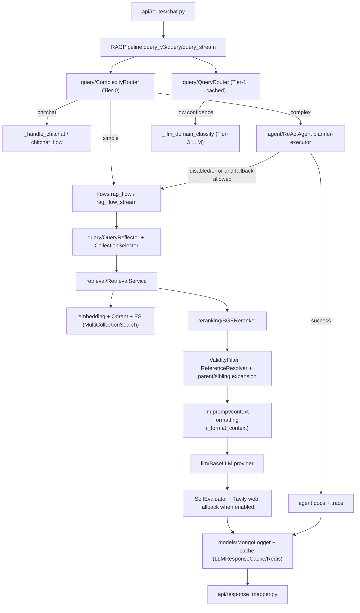

# Module: `pipeline`

Source-verified: 2026-06-05 from `pipeline/__init__.py`, `pipeline/rag_pipeline.py`, `pipeline/flows.py`, `pipeline/document_pipeline.py` (and the module-local test files `test_rag_pipeline.py`, `test_flows_major_fallback.py`).

## Purpose

`pipeline` is the central orchestration layer. It has two major responsibilities:

- Runtime chat/RAG orchestration through `RAGPipeline`.
- Admin document ingestion orchestration through `DocumentPipeline`.

It coordinates the other modules (`query`, `retrieval`, `reranking`, `llm`, `agent`, `models`, `cache`) and returns dict-like runtime results; it does not own low-level storage/search/generation implementations.

## File Map

```text
pipeline/
  __init__.py                   Lazy `__getattr__` export of RAGPipeline and DocumentPipeline.
  rag_pipeline.py               RAGPipeline class: routing, classic RAG, agent, streaming, LLM hot-reload.
  flows.py                      Functional flow implementations: chitchat_flow(_stream), rag_flow(_stream), Tavily web fallback, context/rerank helpers.
  document_pipeline.py          Admin ingestion: convert → clean → chunk → embed+index, delete, rollback.
  test_rag_pipeline.py          Module-local RAGPipeline tests.
  test_flows_major_fallback.py  Module-local flow tests (major-strip / fallback behaviour).
```

## `RAGPipeline` Construction

`RAGPipeline.__init__(settings=None, api_key=None, config=None, env_path=None, mongo_logger=None, llm_cache=None)`
loads `.env`, builds a `Settings`, converts it to a legacy `cfg` dict via
`_settings_to_cfg()` (merged with any `config` override), and constructs the
shared runtime components:

- one `RetrievalService.from_settings(settings)` — the single shared retrieval stack.
- aliases into that service: `_bge`, `_e5`, `_searcher`, `_reranker`, `_tavily`.
- `_reflector` (`QueryReflector`, when `reflection_enabled`; failure is non-fatal).
- `_decomposer` (`QueryDecomposer`; failure is non-fatal → `None`).
- `_router` (`QueryRouter`, zero-cost local classifier, mode from `router_mode`).
- `_chat` (`BaseLLM` via `llm.create_llm(settings)`).
- `_self_eval` (`SelfEvaluator`, only when `_should_enable_self_evaluator(cfg)` —
  i.e. `self_eval_enabled` is explicitly true; it is NOT auto-enabled by Tavily).
- `_validity_filter` (`ValidityFilter`) and `_reference_resolver` (`ReferenceResolver`).
- `complexity_router` (`ComplexityRouter`) — Tier-0 simple/complex/chitchat router.
- `agent` (`ReActAgent`) only when `settings.agent_enabled`, else `None`.
- `_mongo_logger`, `_llm_cache`, an `_llm_runtime_lock` (RLock) and a `_route_cache` (LRU/TTL `OrderedDict`).

`CollectionSelector` is NOT owned by `RAGPipeline`; it is a module-level singleton
(`_collection_selector`) inside `flows.py`.

Important contract:

```text
RAGPipeline owns exactly one RetrievalService instance.
Agent tool adapters receive that same instance via inject_from_retrieval_service(),
avoiding a ~17 s cold-start rebuild of embedders/searcher/reranker.
```

Caution: the service is stored as `_retrieval_service`; there is no public
`service`/`retrieval_service` property in source as of 2026-06-05.

## Runtime LLM Reload

Admin LLM-config updates use the prepare/commit pattern around Mongo persistence:

- `prepare_llm_config_reload(settings)` builds replacement LLM clients (chat,
  self-evaluator, reflector, decomposer, agent, Tavily tool) into a frozen
  `_PreparedLLMRuntime` before anything is committed.
- `commit_llm_config_reload(settings, prepared)` hot-swaps those references under
  `_llm_runtime_lock`, points the shared `RetrievalService` at the new settings +
  Tavily tool, clears `_route_cache`, and re-injects the retrieval service into
  agent tool adapters. Returns a summary dict of what was rebuilt.

Every chat entrypoint first calls `_llm_runtime_snapshot()` to capture one
consistent set of hot-swappable clients, so an in-flight request keeps a stable
LLM bundle even if a reload commits mid-flight. The shared retrieval service keeps
its existing embedders/searcher/reranker across a reload.

## Chat Entrypoints

Public methods on `RAGPipeline`:

- `query(question, history=None, top_k=None, session_id=None, user_context=None)` —
  classic non-streaming RAG. Routes (Tier-1, cached), runs the Tier-3 LLM domain
  fallback when warranted, dispatches to `chitchat_flow` or `rag_flow`, merges
  timings into a `RequestTrace`, and logs RAG turns to Mongo (chitchat turns are
  intentionally NOT logged). Returns `question`, `answer`, `sources`,
  `num_sources`, `intent`, `model_name`, `timings_ms`, `request_trace`,
  `correlation_id`, and `turn_id` when logged.
- `query_v3(question, ...)` — smart entrypoint. Uses `ComplexityRouter`:
  `chitchat → _handle_chitchat()` (no retrieval); `simple` (or agent disabled) →
  `query()` tagged `mode="rag_v2"`; `complex → query_agent()`.
- `query_agent(question, ..., *, route_label="complex", require_agent=False, complexity_subtype=None)` —
  forces the agent path. Optionally reflects the question first, infers
  `complexity_subtype` from `complexity_router` when not given, runs
  `agent.run(...)`, persists an agent trace, and returns `mode="agent"` with
  `tools_used`/`tool_calls`/`iterations`/`agent_trace`/`sources`. On agent
  disabled/crash/error it falls back to `query()` (`mode="rag_v2_fallback"`)
  unless `require_agent=True` (then it raises when the agent is disabled).
- `query_stream(question, ...)` — streaming entrypoint for `/chat/stream`. Runs
  Tier-0 complexity routing, then: chitchat → `chitchat_flow_stream`; complex (agent
  enabled) → `query_agent` answer yielded as a single chunk; else simple/RAG →
  `rag_flow_stream` (retrieval first, then token stream). All metadata (mode,
  timings, reflected_question, sources, traces, tool info, fusion weights) is
  stored on `self.last_*` attributes after the generator is exhausted so the route
  handler can emit a `metadata` SSE event. Logs to Mongo after the stream finishes
  (skipping chitchat).

Private orchestration helpers:

- `_route_with_cache(question, history)` — TTL (45 s) + size-bounded (256) LRU
  cache over `QueryRouter.route()`, keyed by question + last 2 history turns.
- `_llm_domain_classify(question, history, current_routing)` — Tier-3 fallback:
  prompts the chat LLM with `DOMAIN_CLASSIFICATION_PROMPT`, parses JSON
  `{domains, confidence}`, filters to valid `RAG_LABELS`, and overrides
  `domains`/`domain`/`confidence` (setting `tier3_override=True`) only when valid
  domains are returned. Keeps the classifier result on any failure.
- `_query_decomposed(question, domain_subqueries, ...)` — legacy multi-domain RAG
  helper; builds union routing across sub-query collections and calls `rag_flow`
  with `domain_subqueries`. Not on the default `query_v3` path.
- `_handle_chitchat(question)` — keyword-based canned Vietnamese replies (no LLM,
  no retrieval) used by `query_v3`'s chitchat branch.

Module-level routing helpers in `rag_pipeline.py`:

- `_should_trigger_tier3(routing)` — gates the Tier-3 LLM domain fallback. Skips
  when `confidence >= _LLM_FALLBACK_THRESHOLD` (0.55), and also skips when the top
  domain's probability margin over the second domain `>= _TIER3_DOMINANT_DOMAIN_MARGIN`
  (0.25), saving an unnecessary ~12 s LLM call when one domain is clearly dominant.

Typical returned `mode` values: `chitchat`, `rag_v2`, `agent`, `rag_v2_fallback`.

## Smart Query Flow

```text
query_v3(question)
  -> ComplexityRouter.route()
     -> chitchat: _handle_chitchat(), no retrieval
     -> simple (or agent disabled): query()  [mode="rag_v2"]
     -> complex: query_agent(complexity_subtype=...)
        -> reflect (optional) -> agent.run() planner/executor
        -> fallback to query() when agent disabled/errors unless require_agent
```

`query()` itself, after Tier-1 routing, applies the Tier-3 LLM domain fallback
(`_should_trigger_tier3` → `_llm_domain_classify`) for low-confidence RAG routing
before dispatching the flow.

## Module Flow



External module boundaries:

- `api` owns HTTP/session/auth mapping; `pipeline` owns orchestration and returns dict-like runtime results.
- `query` decides route/reflection/entities; `retrieval` owns stores/search; `reranking` owns re-scoring; `llm` owns provider calls.
- `agent` is used only for complex mode and receives the shared retrieval runtime from this module.
- `models` and `cache` persist turns/sessions/cache metadata; they should not alter retrieval/generation decisions.

## Classic RAG Flow

Implemented primarily in `flows.py:rag_flow()` (signature: keyword-only
`question`, `history`, `reflector`, `bge_embedder`, `e5_embedder`, `searcher`,
`reranker`, `chat_model`, `self_evaluator`, `tavily_tool`, `cfg`, optional
`routing_result`, `user_context`, `validity_filter`, `reference_resolver`,
`llm_cache`, `domain_subqueries`):

1. Trim history (`_trim_history`, budgeted by message/total char limits).
2. Decide query-cache bypass for freshness/dynamic queries (`_should_bypass_query_cache`).
3. Pre-retrieval query cache lookup when safe (`llm_cache.get_by_query`).
4. Reflect/rewrite query and resolve major/cohort entities.
5. Route domain and select collections (`CollectionSelector`); optionally lock kehoach for freshness/dynamic queries.
6. Build metadata filters and retrieval query variants (major strip/expand, comparison sub-queries).
7. Embed BGE/E5 and run `MultiCollectionSearch` (candidate pool sized by `_resolve_candidate_pool`).
8. Retry/relax strategies when empty; deduplicate candidates (`_dedup_retrieval_candidates`).
9. Optional pre-rerank sibling expansion; rerank (`_reranker_kwargs`, `_reranker_min_top_k`).
10. Per-collection score-cliff pruning; HyDE post-rerank fallback when scores are negative/empty.
11. Apply `ValidityFilter` and resolve legal references via `ReferenceResolver`.
12. Optional post-rerank parent-context expansion; order originals + siblings.
13. Format context with metadata headers + optional profile note (`_format_context`).
14. Generate the LLM answer.
15. Build the answer-quality gate; optionally run self-eval and pre/post Tavily web fallback.
16. Write caches/logging metadata when the answer is stable.

Important current behaviour:

- `_fold_vietnamese` (Vietnamese accent/`đ` folding used across no-info detection,
  dynamic-query/web-query building, and policy-evidence matching) now normalizes
  via `.replace("Đ", "D").casefold()` (previously `.replace("Đ", "d").lower()`).
  This is a correctness fix for case-insensitive folding; flow logic is unchanged.
- List/enumeration queries can raise effective `top_k` (`_resolve_top_k`, capped at 12).
- Raw candidate pool size is configurable (`raw_candidate_multiplier`,
  `raw_candidate_min`); low-confidence routing can double the resolved pool when
  `low_conf_pool_expand_enabled` is true.
- Classic and streaming RAG pass configured reranker knobs through every rerank
  attempt: `reranker_score_threshold`, `reranker_table_score_threshold`, and
  `reranker_min_top_k` capped to the effective `top_k`.
- Freshness/plan queries routed to `kehoach` can lock collection selection to `kehoach`.
- Profile notes are injected only for profile-dependent wording (e.g. "nganh cua toi");
  generic latest/freshness queries do not inherit major/cohort from profile/history.
- `_query_decomposed()` remains a legacy helper; `query_v3()` routes multi-source
  complex questions to the Planner-Executor agent rather than bypassing it.
- If BGE reranking returns an empty list from raw candidates, both `rag_flow()` and
  `rag_flow_stream()` retry reranking with the original question. If still empty or
  only negative explicit scores, they use raw fusion top-k, set
  `timings_ms["rerank_raw_fallback"] = 1.0`, and update `rerank_trace`
  (`fallback_reason`, `rerank_fallback`, `rerank_raw_fallback`, final counts).
- RAG answer-cache writes are gated by `_should_cache_final_answer`: only for stable
  local answers (`answer_status == "answered"`, no no-info text, no `should_web_search`,
  no `no_sources`/`no_info`, no `self_eval_failed`, no dynamic/stale-risk signal, no
  pre/post web fallback). Cache hits return minimal trace fields.
- `rag_flow_stream()` runs retrieval first, then streams tokens; it intentionally
  avoids post-generation self-eval/Tavily to preserve streaming semantics, and
  writes flow metadata into `metadata_out` / timings into `timings_ms_out`.

## Tavily / Web Fallback

`flows.py` has two web stages for non-streaming RAG:

- Pre-generation web enrichment (`_build_pre_generation_web_decision`) for
  no-source, dynamic/freshness, or low-confidence retrieval cases — high local
  confidence suppresses the dynamic trigger.
- Post-generation fallback (`_build_answer_quality_gate`) when the answer text says
  no information, no sources were found, or self-eval requests web search with
  `answer_status` in `insufficient`/`stale_risk` (suppressed when strong local
  exact-policy evidence exists).

Both stages require `tavily_fallback_enabled` and a valid Tavily tool; web context
is merged deterministically with local context (`_merge_local_and_web_context`).

## `DocumentPipeline`

Used by `api/routes/upload.py` for admin document management. Heavy resources
(embedders, vector/ES stores) are lazy-loaded.

Main methods:

- `convert_pdf(doc_id, db, converter="pymupdf4llm")` — PDF → markdown (`pymupdf4llm` or `docling`).
- `clean(doc_id, db)` — clean converted markdown.
- `chunk(doc_id, strategy, db)` — chunk via `_create_chunker`/`_run_chunker`; falls back
  to `recursive` when `hierarchical`/`olmocr` yields 0 chunks; stores chunks in Mongo.
- `embed_and_index(doc_id, db)` — embed with BGE-M3 + E5, remap parent IDs, index into
  Qdrant (parent+child) and ES (child/recursive/appendix only); triggers post-index eval.
- `run_full_pipeline(doc_id, db, converter="pymupdf4llm")` — runs all steps sequentially, stopping on first failure.
- `delete_indexed_data(doc_id, collection_name)` — remove from Qdrant + ES.
- `rollback(doc_id, db)` — revert document one logical state back, cleaning artifacts.

Admin upload status lifecycle:

```text
uploaded -> converting -> converted -> cleaning -> cleaned
-> chunking -> chunked -> embedding -> indexed
```

It writes: local files via `utils.storage.LocalStorage`, the `documents` and
`document_chunks` Mongo collections, Qdrant points, and Elasticsearch docs. It skips
non-indexable/non-storable header chunks via `utils.chunk_indexing`
(`is_indexable_chunk`, `is_qdrant_storable`).

Caution: `DocumentPipeline.chunk()` still dumps debug chunk JSON to a hardcoded
absolute path (`/Users/nam.nguyen/.../data/quydinh/admin_upload`); verify before
relying on it in production (the dump failure is caught and non-fatal).

## Maintenance Notes

- For any change to `RAGPipeline` public output, update `api/response_mapper.py`, `schemas/chat.py`, web/mobile normalizers, and tests.
- For routing/reflection/filter changes, run retrieval and conversation regression tests.
- For document pipeline status/schema changes, update upload routes, document schemas, web admin UI, and tests.
- Keep the shared `RetrievalService` single-load behaviour intact.

## Useful Checks

```bash
python -m py_compile pipeline/*.py
python -m pytest pipeline/test_rag_pipeline.py pipeline/test_flows_major_fallback.py tests/test_chat_route_mode.py tests/test_document_pipeline.py -q -m "not integration"
```
