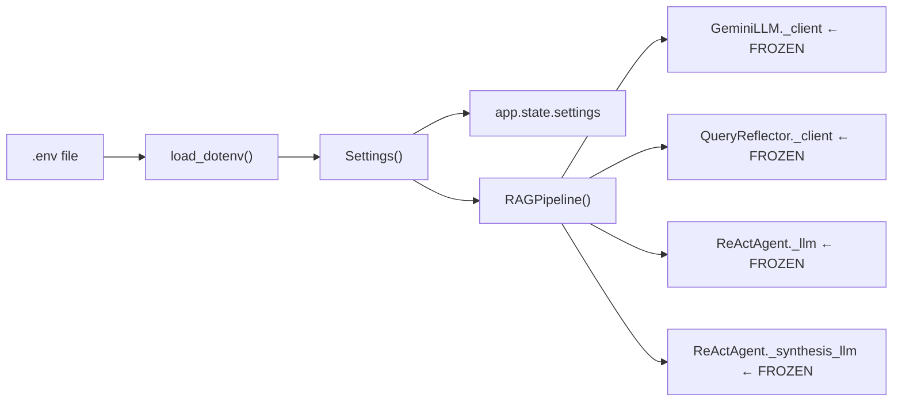
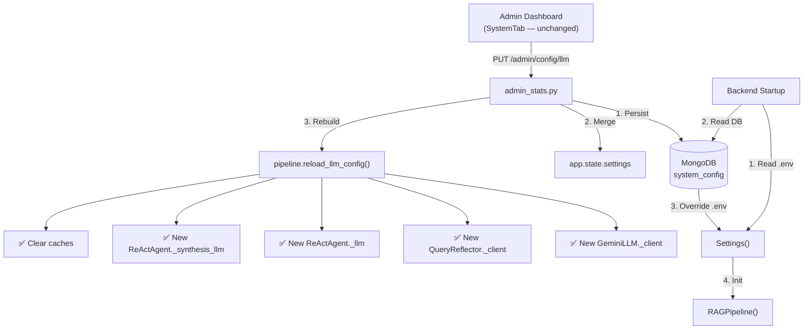

# Persist LLM Config to Database — Hot-Reload Without Backend Restart

## Problem Statement

Hiện tại, API keys và model provider settings được load từ `.env` file thông qua `pydantic_settings.BaseSettings` tại startup. Mỗi khi admin thay đổi API key hoặc model, backend cần restart để áp dụng.

Đã có sẵn admin UI (tab "Hệ thống" trong [SystemTab.tsx](file:///d:/GR/src/RAG_v2/frontend/chat-companion/src/components/admin/SystemTab.tsx)) và backend API ([admin_stats.py](file:///d:/GR/src/RAG_v2/api/routes/admin_stats.py) — EP11 `PATCH /admin/config` + EP12 `GET/PUT /admin/config/llm`) cho phép admin chỉnh sửa config. **Tuy nhiên, config hiện tại chỉ update in-memory** (`app.state.settings`) — restart backend sẽ mất hết thay đổi, VÀ các LLM client instances (GeminiLLM, ReActAgent, QueryReflector) không được rebuild nên API key/model mới không có tác dụng.

## Hiện trạng chi tiết

### Data flow hiện tại (one-shot, frozen at startup)



### Vấn đề cụ thể

1. **Không persist**: `PATCH /admin/config` và `PUT /admin/config/llm` chỉ `setattr(settings, key, value)` → restart backend sẽ đọc lại `.env` ban đầu
2. **Không hot-reload LLM clients**: `OpenAI` client (trong GeminiLLM, QueryReflector) và `ChatOpenAI` (trong ReActAgent) được tạo 1 lần trong constructor và lưu API key nội bộ → thay đổi `settings.google_api_key` không ảnh hưởng client hiện có
3. **Không rebuild pipeline**: Thay đổi `chat_model` chỉ update settings object nhưng `RAGPipeline._chat` vẫn dùng model cũ

## Design Decisions

| Quyết định | Giá trị |
|------------|---------|
| Phạm vi | Chỉ API keys + model selection. Retrieval params, reranker, Redis vẫn từ `.env` |
| Fallback | DB config overrides `.env`. Nếu DB không có value → dùng `.env` |
| Audit trail | Không cần logging lịch sử thay đổi |
| Rebuild behavior | Tạo lại LLM client instances (~1-2s), request đang xử lý có thể gặp transient error |
| Frontend | Không cần sửa — SystemTab.tsx đã đầy đủ |

## Proposed Changes

---

### Component 1: MongoDB System Config Layer

Tạo collection `system_config` trong MongoDB dùng single-document pattern (1 document, fixed `_id = "llm_config"`).

#### [NEW] [system_config.py](file:///d:/GR/src/RAG_v2/models/system_config.py)

Module quản lý system config CRUD. Bao gồm:

**Document schema:**
```python
{
    "_id": "llm_config",                              # fixed key
    "google_api_key": "AIza...",                      # Gemini API key
    "tavily_api_key": "tvly-...",                     # Tavily web search key
    "llm_provider": "gemini",                         # gemini | openai | lm_studio
    "chat_model": "gemini-3.1-flash-lite-preview",    # chat answer generation model
    "chat_temperature": 0.3,
    "chat_max_tokens": 1500,
    "agent_model": "qwen2.5-7b-instruct",             # agent tool-calling model
    "agent_synthesis_provider": "gemini",              # agent final answer provider
    "agent_synthesis_model": "gemini-3.1-flash-lite-preview",
    "reflection_provider": "gemini",                   # query rewrite provider
    "reflection_model": "gemini-3.1-flash-lite-preview",
    "updated_at": datetime,
}
```

**Functions:**
- `get_llm_config_sync(uri, db_name) -> dict | None` — sync PyMongo read, used at startup before Motor is available
- `async get_llm_config(db) -> dict | None` — async Motor read for runtime use
- `async upsert_llm_config(db, updates) -> dict` — upsert changed fields only, set `updated_at`
- `merge_db_config_into_settings(settings, db_config) -> None` — merge DB values into Settings instance (DB overrides `.env`, skip empty/None values)

**Configurable fields whitelist** (chỉ cho phép persist/merge các fields này):
```python
_PERSISTABLE_FIELDS = {
    "google_api_key", "tavily_api_key",
    "llm_provider", "chat_model", "chat_temperature", "chat_max_tokens",
    "agent_model", "agent_synthesis_provider", "agent_synthesis_model",
    "reflection_provider", "reflection_model",
    # Boolean toggles (từ EP11)
    "agent_enabled", "self_eval_enabled", "tavily_fallback_enabled",
    "crawler_enabled", "reflection_enabled", "domain_routing_enabled",
    "rate_limit_enabled",
}
```

#### [MODIFY] [database.py](file:///d:/GR/src/RAG_v2/models/database.py)

- Thêm constant `SYSTEM_CONFIG_COLLECTION = "system_config"` (dòng ~27, cùng khu vực với các collection constants khác)
- Thêm index creation cho `system_config` trong `create_indexes()` (unique index on `_id` đã có sẵn từ MongoDB)

---

### Component 2: Pipeline Hot-Reload Mechanism

Thêm method `reload_llm_config()` vào `RAGPipeline` để rebuild LLM clients khi config thay đổi tại runtime.

#### [MODIFY] [rag_pipeline.py](file:///d:/GR/src/RAG_v2/pipeline/rag_pipeline.py)

Thêm public method sau class `RAGPipeline` (sau constructor, ~line 313):

```python
def reload_llm_config(self, settings: Settings) -> dict[str, str]:
    """Rebuild LLM clients with updated settings. NOT thread-safe — 
    caller should ensure no concurrent calls.
    
    Returns dict describing what was rebuilt, for logging.
    """
    rebuilt = {}
    
    # 1. Rebuild chat LLM (GeminiLLM / LMStudioLLM)
    self._chat = create_llm(settings)
    rebuilt["chat_llm"] = settings.chat_model
    
    # 2. Rebuild self-evaluator (reuses new chat LLM)
    cfg = _settings_to_cfg(settings)
    if _should_enable_self_evaluator(cfg):
        self._self_eval = SelfEvaluator(llm=self._chat)
        rebuilt["self_evaluator"] = "rebuilt"
    
    # 3. Rebuild reflector
    if settings.reflection_enabled:
        try:
            self._reflector = QueryReflector(settings=settings)
            rebuilt["reflector"] = settings.reflection_model
        except Exception:
            logger.warning("Failed to rebuild reflector", exc_info=True)
    
    # 4. Rebuild decomposer
    try:
        self._decomposer = QueryDecomposer(settings=settings)
        rebuilt["decomposer"] = "rebuilt"
    except Exception:
        logger.warning("Failed to rebuild decomposer", exc_info=True)
    
    # 5. Rebuild agent (LLM + synthesis LLM)
    if settings.agent_enabled:
        try:
            self.agent = ReActAgent(settings)
            from agent.tool_adapters import inject_from_retrieval_service
            inject_from_retrieval_service(self._retrieval_service)
            rebuilt["agent"] = settings.agent_model
        except Exception:
            logger.warning("Failed to rebuild agent", exc_info=True)
    
    # 6. Rebuild Tavily tool if tavily_api_key is non-empty
    if settings.tavily_api_key:
        try:
            self._retrieval_service._rebuild_tavily(settings)
            self._tavily = self._retrieval_service.tavily_tool
            rebuilt["tavily"] = "rebuilt"
        except Exception:
            logger.warning("Failed to rebuild Tavily", exc_info=True)
    
    # 7. Clear route/reflection caches (stale after config change)
    self._route_cache.clear()
    self._reflect_cache.clear()
    rebuilt["caches"] = "cleared"
    
    logger.info("LLM config reloaded: %s", rebuilt)
    return rebuilt
```

**Không rebuild**: `RetrievalService` (embedders, reranker, Qdrant/ES clients) — chúng dùng local models và infrastructure connections, không phụ thuộc API key.

#### [MODIFY] [service.py](file:///d:/GR/src/RAG_v2/retrieval/service.py)

Thêm helper `_rebuild_tavily(settings)` vào `RetrievalService` để rebuild Tavily tool khi API key thay đổi:

```python
def _rebuild_tavily(self, settings):
    """Rebuild Tavily tool with new API key."""
    from tools.tavily_search import TavilySearchTool
    if settings.tavily_api_key:
        self.tavily_tool = TavilySearchTool(api_key=settings.tavily_api_key, settings=settings)
    else:
        self.tavily_tool = None
```

---

### Component 3: Backend Admin API — Persist + Reload

Sửa [admin_stats.py](file:///d:/GR/src/RAG_v2/api/routes/admin_stats.py) EP11 và EP12 để persist vào DB và trigger hot-reload.

#### [MODIFY] [admin_stats.py](file:///d:/GR/src/RAG_v2/api/routes/admin_stats.py)

**EP11 `PATCH /admin/config` (toggle booleans) — Lines 722-739:**

Thay đổi:
1. Sau `setattr(settings, body.key, body.value)` → thêm `await upsert_llm_config(db, {body.key: body.value})`
2. Thêm `db: AsyncIOMotorDatabase = Depends(get_database)` vào function signature

```python
@router.patch("/config")
async def toggle_config(
    request: Request,
    body: ConfigToggleBody,
    _user: Annotated[UserDocument, Depends(require_admin)],
    db: AsyncIOMotorDatabase = Depends(get_database),   # ← NEW
):
    if body.key not in _TOGGLEABLE_KEYS:
        raise HTTPException(400, ...)
    
    settings = request.app.state.settings
    setattr(settings, body.key, body.value)
    
    # Persist to DB
    await upsert_llm_config(db, {body.key: body.value})   # ← NEW
    
    logger.info("Admin toggled %s = %s (persisted)", body.key, body.value)
    return {"ok": True, "key": body.key, "value": body.value}
```

**EP12 `GET /admin/config/llm` — Lines 747-774:**

Không thay đổi logic — vẫn đọc từ `app.state.settings` (đã được merge với DB values tại startup và runtime).

**EP12 `PUT /admin/config/llm` — Lines 777-801:**

Thay đổi lớn:
1. Persist config vào MongoDB
2. Merge vào `app.state.settings`
3. Trigger `pipeline.reload_llm_config()` để rebuild LLM clients
4. Return danh sách components đã rebuild

Mở rộng `LLMConfigBody` thêm 3 fields:
```python
class LLMConfigBody(BaseModel):
    # ... existing fields ...
    agent_synthesis_provider: str | None = None   # ← NEW
    agent_synthesis_model: str | None = None      # ← NEW
    reflection_provider: str | None = None        # ← NEW
```

```python
@router.put("/config/llm")
async def update_llm_config(
    request: Request,
    body: LLMConfigBody,
    _user: Annotated[UserDocument, Depends(require_admin)],
    db: AsyncIOMotorDatabase = Depends(get_database),   # ← NEW
):
    settings = request.app.state.settings
    updates = body.model_dump(exclude_none=True)
    
    if not updates:
        raise HTTPException(400, "No fields to update")
    
    # 1. Persist to DB
    await upsert_llm_config(db, updates)
    
    # 2. Merge into in-memory settings
    for field_name, value in updates.items():
        if hasattr(settings, field_name):
            setattr(settings, field_name, value)
    
    # 3. Trigger pipeline hot-reload
    pipeline = request.app.state.pipeline
    rebuilt = {}
    try:
        import asyncio
        loop = asyncio.get_running_loop()
        rebuilt = await loop.run_in_executor(
            None, pipeline.reload_llm_config, settings
        )
    except Exception as exc:
        logger.error("Pipeline reload failed: %s", exc, exc_info=True)
    
    # 4. Build response
    display = {}
    for field_name, value in updates.items():
        if "key" in field_name:
            display[field_name] = value[:4] + "***" if len(str(value)) > 4 else "***"
        else:
            display[field_name] = value
    
    logger.info("Admin updated LLM config: %s — rebuilt: %s", list(updates.keys()), rebuilt)
    return {"ok": True, "updated": display, "rebuilt": rebuilt}
```

---

### Component 4: Startup — Load DB Config Before Pipeline Init

Sửa [main.py](file:///d:/GR/src/RAG_v2/api/main.py) `lifespan()` để đọc DB config và merge vào Settings trước khi tạo RAGPipeline.

#### [MODIFY] [main.py](file:///d:/GR/src/RAG_v2/api/main.py)

Thêm vào `lifespan()` sau `settings = Settings()` (line 45) và trước `RAGPipeline()` (line 136):

```python
settings = Settings()  # ← existing line 45

# ── Load persisted config from DB (overrides .env) ──────────
from models.system_config import get_llm_config_sync, merge_db_config_into_settings
try:
    db_config = get_llm_config_sync(settings.mongodb_uri, settings.mongodb_database)
    if db_config:
        merge_db_config_into_settings(settings, db_config)
        # Override api_key if DB has a non-empty google_api_key
        if db_config.get("google_api_key"):
            api_key = db_config["google_api_key"]
        logger.info("Loaded %d config fields from DB", len(db_config) - 1)  # -1 for _id
except Exception:
    logger.warning("Failed to load DB config, using .env defaults", exc_info=True)
```

Cũng sửa check `GOOGLE_API_KEY` (line 41-43) để không raise ValueError nếu key sẽ được load từ DB:

```python
api_key = os.getenv("GOOGLE_API_KEY", "")
# Don't raise immediately — DB config may provide the key
```

Di chuyển validation sau khi merge DB config:
```python
if not api_key:
    raise ValueError("GOOGLE_API_KEY not found in .env or database")
```

---

## Summary

| File | Action | Thay đổi |
|------|--------|----------|
| [system_config.py](file:///d:/GR/src/RAG_v2/models/system_config.py) | **NEW** | MongoDB CRUD cho system config (get/upsert/merge) |
| [database.py](file:///d:/GR/src/RAG_v2/models/database.py) | MODIFY | Thêm `SYSTEM_CONFIG_COLLECTION` constant |
| [rag_pipeline.py](file:///d:/GR/src/RAG_v2/pipeline/rag_pipeline.py) | MODIFY | Thêm `reload_llm_config()` method |
| [service.py](file:///d:/GR/src/RAG_v2/retrieval/service.py) | MODIFY | Thêm `_rebuild_tavily()` helper |
| [admin_stats.py](file:///d:/GR/src/RAG_v2/api/routes/admin_stats.py) | MODIFY | EP11 + EP12: persist DB + trigger reload |
| [main.py](file:///d:/GR/src/RAG_v2/api/main.py) | MODIFY | Startup: load DB config → merge → init pipeline |

## Architecture After Change



## Verification Plan

### Automated Tests

```bash
# Unit test cho system_config module
python -m pytest tests/test_system_config.py -v

# Integration test cho reload endpoint
python -m pytest tests/test_admin_config_reload.py -v
```

### Manual Verification

1. **Thay đổi model**: Admin dashboard → Hệ thống → đổi `chat_model` → Save → gửi câu hỏi → kiểm tra log xác nhận model mới
2. **Thay đổi API key**: Đổi `google_api_key` → verify request tiếp theo thành công với key mới
3. **Persist test**: Đổi config qua admin → restart backend → verify config vẫn giữ nguyên (không revert `.env`)
4. **Fallback test**: Xóa document từ `system_config` collection → restart → verify dùng `.env` values
5. **Toggle persist**: Toggle `agent_enabled` OFF → restart → verify vẫn OFF
