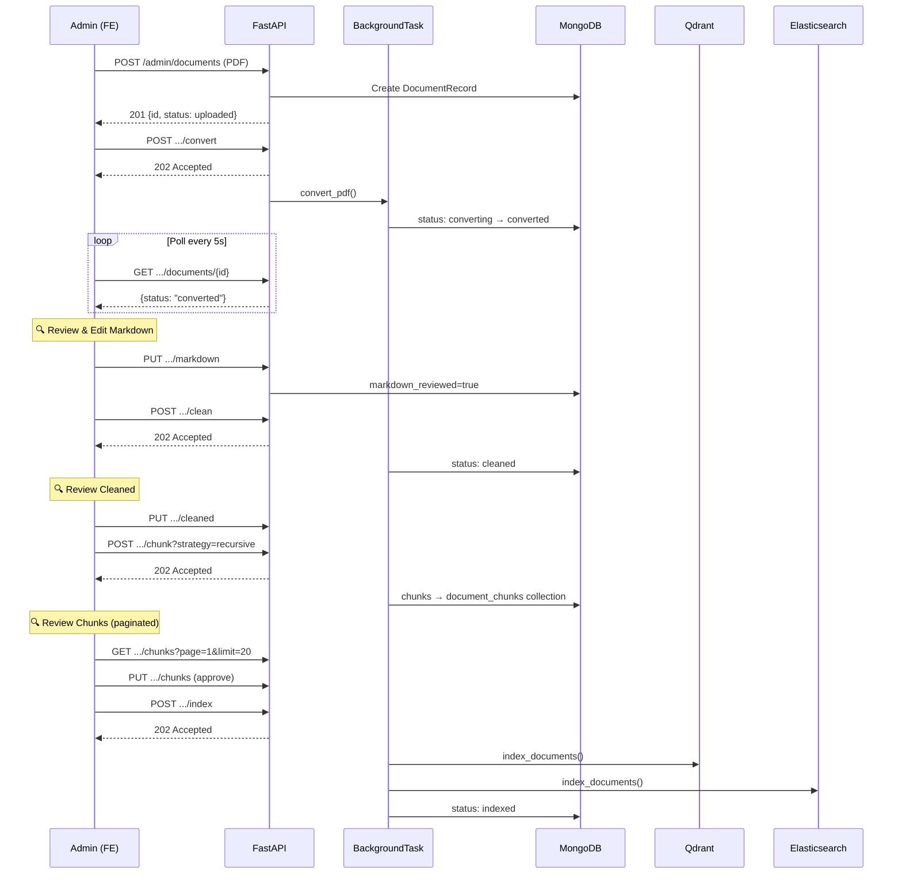

# Admin Document Upload Pipeline — Final Plan (v3)

Xây dựng role **Admin** (giảng viên) với upload PDF, background pipeline, review tại mỗi bước.

## Decisions

| Question | Decision |
|----------|----------|
| Target collection | Admin tự chọn khi upload |
| Chunking strategy | Admin chọn, hệ thống suggest theo collection |
| Admin creation | Super-admin tạo qua API |
| Metadata | Optional, có thể null |
| Upload limit | Max 50MB/file, 5 files/batch |
| Duplicate filename | Thêm mới (không replace) |
| Role migration | Existing users default `"student"` |

### Collection → Chunker Suggestion Map

| Collection | Suggested Chunker | Alternatives |
|------------|-------------------|--------------|
| `quydinh` | `recursive` | `hierarchical`, `olmocr` |
| `ctdt` | `recursive` | `hierarchical` |
| `kehoach` | `kehoach` | `recursive` |
| `stsv` | `stsv` | `recursive` |

---

## Architecture Decisions (Addressing Review Feedback)

### 1. Async Pipeline — Background Tasks + Polling

Pipeline steps (convert, clean, chunk, embed) chạy lâu → **không block request handler**.

**Strategy**: Dùng `FastAPI BackgroundTasks` cho single-instance hiện tại. Nếu scale lên thì migrate sang Celery/ARQ sau.

```
POST /admin/documents/{id}/convert
  → 202 Accepted + {"task_id": "...", "status": "converting"}
  → Client polls GET /admin/documents/{id} để check status
```

- Mỗi endpoint trigger pipeline step trả về **202 Accepted** ngay lập tức
- `DocumentRecord.status` được update realtime trong background task
- Frontend dùng **polling** (5s interval) trên `GET /admin/documents/{id}` để cập nhật UI
- `run_full_pipeline()` cũng chạy background, trả 202

> [!NOTE]
> WebSocket sẽ overkill cho use case này (admin upload vài file/tuần). Polling 5s là đủ. Có thể upgrade sang SSE/WebSocket sau nếu cần.

### 2. File Storage — Local-only, Single Instance

**Quyết định**: Chấp nhận **local disk** cho giai đoạn hiện tại (single instance deployment).

- `uploads/` directory sẽ persist qua Docker volume mount
- Nếu cần multi-instance: migrate sang MinIO/S3 (chỉ cần thay `storage.py`)
- `storage.py` sẽ dùng **abstract interface** để dễ swap implementation sau

```python
class StorageBackend(ABC):
    async def save(self, file, doc_id) -> Path: ...
    async def read(self, doc_id) -> bytes: ...
    async def delete(self, doc_id) -> None: ...

class LocalStorage(StorageBackend): ...  # Phase 1
# class S3Storage(StorageBackend): ...   # Future
```

### 3. Superadmin — ENV VAR Based

**Quyết định**: Superadmin = **env var config**, KHÔNG phải role thứ 3 trong DB.

```env
SUPERADMIN_USER_IDS=6789abc,1234def   # MongoDB ObjectId list
```

- `role` field trong DB chỉ có 2 giá trị: `"student"` | `"admin"`
- `require_superadmin()` dependency check user_id có trong `SUPERADMIN_USER_IDS` env var
- Đơn giản, an toàn, không cần migration phức tạp

### 4. Chunks — Separate Collection

**Quyết định**: Tách chunks ra collection riêng `document_chunks` để tránh MongoDB 16MB limit.

```python
# models/document.py
class DocumentRecord(BaseModel):
    # ... (NO chunks field)
    chunk_count: Optional[int]
    chunk_ids: Optional[List[str]]  # references to document_chunks

# models/document_chunk.py  
class DocumentChunk(BaseModel):
    id: PyObjectId
    document_id: PyObjectId          # FK to DocumentRecord
    chunk_index: int
    content: str
    metadata: dict
    # NO embedding vectors — those live in Qdrant/ES only
```

> [!IMPORTANT]
> Embedding vectors KHÔNG lưu trong MongoDB — chỉ lưu trong Qdrant/ES. MongoDB chỉ lưu text content + metadata cho review UI.

### 5. DELETE — Rollback & Cleanup Strategy

```python
async def delete_document(doc_id: str):
    doc = await get_document(doc_id)
    
    # 1. Remove from vector stores (if indexed)
    if doc.status == "indexed" and doc.chunk_ids:
        qdrant_store.delete_by_metadata("document_id", doc_id)
        es_store.delete_by_metadata("document_id", doc_id)
    
    # 2. Remove chunks from MongoDB
    await db[DOCUMENT_CHUNKS_COLLECTION].delete_many({"document_id": doc_id})
    
    # 3. Remove files from disk
    storage.delete(doc_id)  # PDF + markdown + cleaned files
    
    # 4. Remove document record
    await db[DOCUMENTS_COLLECTION].delete_one({"_id": doc_id})
    
    # 5. Log audit event
    await audit_log("delete", doc_id, admin_id)
```

Cleanup idempotent — safe to call ở bất kỳ status nào. Partial state cũng được xử lý vì mỗi step check existence trước khi xóa.

### 6. Frontend Error Handling

Mỗi pipeline step có 3 states trong UI:

| State | UI |
|-------|-----|
| `idle` | Grey circle, "Chưa bắt đầu" |
| `running` | Spinning loader, "Đang xử lý..." |
| `success` | Green check, clickable để review |
| `failed` | Red X + `error_message` + **[Retry]** button |

`PipelineProgress.tsx` hiển thị:
- Error message từ `DocumentRecord.error_message`
- **Retry button** gọi lại cùng endpoint (POST convert/clean/chunk/index)
- Toast notification khi step hoàn thành hoặc lỗi

Error scenarios cụ thể:

| Error | Handling |
|-------|----------|
| Upload fail (network) | FE retry upload, show error toast |
| Convert fail (corrupted PDF) | Show error, admin có thể delete & re-upload |
| Chunk fail (strategy incompatible) | Show error, admin chọn strategy khác & retry |
| Index fail (Qdrant/ES down) | Show error + retry button, no partial data |
| Pipeline timeout (>5min) | Background task set status="failed" + error_message |

---

## Phase 1: Role System & Auth

#### [MODIFY] [user.py](file:///Users/nam.nguyen/Documents/personal/GR/src/RAG_v2/models/user.py)
- Thêm `role: str = "student"` (values: `"student"` | `"admin"`)

#### [MODIFY] [user.py](file:///Users/nam.nguyen/Documents/personal/GR/src/RAG_v2/schemas/user.py)
- Thêm `role` vào `UserPublic`, `UserManualCreate`, `UserCreate`

#### [NEW] [rbac.py](file:///Users/nam.nguyen/Documents/personal/GR/src/RAG_v2/auth/rbac.py)

```python
def require_admin() -> Callable:
    """Dependency: check user.role == 'admin'"""

def require_superadmin() -> Callable:
    """Dependency: check user_id in SUPERADMIN_USER_IDS env var"""
```

#### [MODIFY] [jwt_handler.py](file:///Users/nam.nguyen/Documents/personal/GR/src/RAG_v2/auth/jwt_handler.py)
- Thêm `role` claim vào JWT payload

#### [MODIFY] [auth.py](file:///Users/nam.nguyen/Documents/personal/GR/src/RAG_v2/routers/auth.py)
- `POST /auth/admin/create` — superadmin tạo admin account

---

## Phase 2: Document Model & API

#### [NEW] [document.py](file:///Users/nam.nguyen/Documents/personal/GR/src/RAG_v2/models/document.py)

```python
class DocumentRecord(BaseModel):
    id: PyObjectId
    filename: str
    file_size: int
    file_path: str                   # relative path in uploads/
    collection: str                  # ctdt | quydinh | kehoach | stsv
    status: str                      # uploaded | converting | converted |
                                     # cleaning | cleaned | chunking | chunked |
                                     # embedding | indexed | failed
    uploaded_by: PyObjectId
    uploaded_at: datetime
    markdown_path: Optional[str]     # path to .md file (not inline content)
    cleaned_path: Optional[str]      # path to cleaned .md file
    chunk_count: Optional[int]
    chunk_ids: Optional[List[str]]   # refs to document_chunks collection
    chunking_strategy: Optional[str]
    markdown_reviewed: bool = False
    cleaned_reviewed: bool = False
    chunks_reviewed: bool = False
    metadata_overrides: dict = {}    # optional: major_code, cohort, date_str
    error_message: Optional[str]
    converted_at: Optional[datetime]
    cleaned_at: Optional[datetime]
    chunked_at: Optional[datetime]
    indexed_at: Optional[datetime]
```

#### [NEW] [document_chunk.py](file:///Users/nam.nguyen/Documents/personal/GR/src/RAG_v2/models/document_chunk.py)

```python
class DocumentChunk(BaseModel):
    id: PyObjectId
    document_id: PyObjectId
    chunk_index: int
    content: str
    metadata: dict                   # chunk-level metadata from chunker
    # NO embedding vectors
```

#### [NEW] [schemas/document.py](file:///Users/nam.nguyen/Documents/personal/GR/src/RAG_v2/schemas/document.py)

```python
class DocumentUploadRequest(BaseModel):
    collection: str                  # required
    chunking_strategy: Optional[str] # optional, system suggests
    metadata_overrides: Optional[dict]

class DocumentDetail(BaseModel):
    id: str
    filename: str
    status: str
    collection: str
    chunking_strategy: Optional[str]
    chunk_count: Optional[int]
    markdown_reviewed: bool
    cleaned_reviewed: bool
    chunks_reviewed: bool
    metadata_overrides: dict
    uploaded_at: datetime
    error_message: Optional[str]

class DocumentListResponse(BaseModel):
    documents: List[DocumentDetail]
    total: int
    page: int
    limit: int

class ChunkPreview(BaseModel):
    chunk_id: str
    chunk_index: int
    content: str
    metadata: dict

class ChunksResponse(BaseModel):
    chunks: List[ChunkPreview]
    total: int
    page: int
    limit: int
    strategy: str
    stats: dict                      # avg_size, min, max, etc.
```

#### [NEW] [api/routes/upload.py](file:///Users/nam.nguyen/Documents/personal/GR/src/RAG_v2/api/routes/upload.py)

| Endpoint | Method | Response | Description |
|----------|--------|----------|-------------|
| `/admin/documents` | `POST` | `201` | Upload PDF(s) + collection + metadata |
| `/admin/documents` | `GET` | `200` | List docs (`?page=1&limit=20&status=`) |
| `/admin/documents/{id}` | `GET` | `200` | Document detail + current status |
| `/admin/documents/{id}` | `DELETE` | `200` | Delete + cleanup (stores, files, chunks) |
| `/admin/documents/{id}/convert` | `POST` | **`202`** | Background: PDF → Markdown |
| `/admin/documents/{id}/markdown` | `GET` | `200` | Get markdown for review |
| `/admin/documents/{id}/markdown` | `PUT` | `200` | Edit/approve markdown |
| `/admin/documents/{id}/clean` | `POST` | **`202`** | Background: clean markdown |
| `/admin/documents/{id}/cleaned` | `GET` | `200` | Get cleaned for review |
| `/admin/documents/{id}/cleaned` | `PUT` | `200` | Edit/approve cleaned |
| `/admin/documents/{id}/chunk` | `POST` | **`202`** | Background: chunk (`?strategy=recursive`) |
| `/admin/documents/{id}/chunks` | `GET` | `200` | Get chunks (`?page=1&limit=20`) |
| `/admin/documents/{id}/chunks` | `PUT` | `200` | Approve chunks |
| `/admin/documents/{id}/index` | `POST` | **`202`** | Background: embed + index |
| `/admin/documents/{id}/pipeline` | `POST` | **`202`** | Background: full auto pipeline |

All endpoints require `role == "admin"`. Background steps return **202 Accepted**.

#### [MODIFY] [database.py](file:///Users/nam.nguyen/Documents/personal/GR/src/RAG_v2/models/database.py)

```python
DOCUMENTS_COLLECTION = "documents"
DOCUMENT_CHUNKS_COLLECTION = "document_chunks"

# Indexes:
# documents: uploaded_by (ASC), status (ASC), collection (ASC)
# document_chunks: document_id (ASC), chunk_index (ASC)
```

#### [MODIFY] [main.py](file:///Users/nam.nguyen/Documents/personal/GR/src/RAG_v2/api/main.py)
- Register upload router with prefix `/admin`

---

## Phase 3: Pipeline Service

#### [NEW] [document_pipeline.py](file:///Users/nam.nguyen/Documents/personal/GR/src/RAG_v2/pipeline/document_pipeline.py)

Reuses existing modules — NO new ML/NLP code:

| Step | Reused Module |
|------|--------------|
| Convert | `document_loader/pdf_to_markdown/converters/pymupdf4llm_converter.py` |
| Clean | `document_loader/clean_markdown.py` → `clean_markdown()` |
| Chunk | `chunking/chunker/*` (all chunker classes) |
| Embed | `embedding/bge_m3.py` + `embedding/e5_multilingual.py` |
| Index Qdrant | `retrieval/qdrant_store.py` → `index_documents()` |
| Index ES | `retrieval/elasticsearch_store.py` → `index_documents()` |

```python
class DocumentPipeline:
    def __init__(self, settings: Settings):
        # Lazy-init embedders (reuse from RAGPipeline if available)
        
    async def convert_pdf(self, doc_id: str) -> None:
        """Background task: PDF → Markdown, updates status in DB"""
        try:
            update_status(doc_id, "converting")
            markdown = converter.convert(pdf_path)
            save_markdown(doc_id, markdown)
            update_status(doc_id, "converted")
        except Exception as e:
            update_status(doc_id, "failed", error=str(e))
        
    async def clean(self, doc_id: str) -> None:
        """Background task: clean markdown"""
        
    async def chunk(self, doc_id: str, strategy: str) -> None:
        """Background task: chunk, save to document_chunks collection"""
        
    async def embed_and_index(self, doc_id: str) -> None:
        """Background task: embed with BGE+E5, upsert Qdrant+ES"""
        # Inject document_id into each chunk's metadata for DELETE cleanup
        
    async def run_full_pipeline(self, doc_id: str) -> None:
        """Background task: all steps sequentially, skip review gates"""
        
    async def delete_indexed_data(self, doc_id: str) -> None:
        """Cleanup: remove from Qdrant + ES by document_id metadata"""
```

> [!IMPORTANT]
> Mỗi chunk khi index sẽ có `metadata.document_id = doc_id` để hỗ trợ DELETE cleanup.

---

## Phase 4: File Storage

#### [NEW] [storage.py](file:///Users/nam.nguyen/Documents/personal/GR/src/RAG_v2/utils/storage.py)

```python
class StorageBackend(ABC):
    """Abstract interface — swap LocalStorage → S3Storage later."""
    async def save_upload(self, file: UploadFile, doc_id: str) -> str: ...
    async def save_text(self, content: str, doc_id: str, suffix: str) -> str: ...
    async def read_text(self, path: str) -> str: ...
    async def delete_all(self, doc_id: str) -> None: ...

class LocalStorage(StorageBackend):
    """
    Structure:
      uploads/
        {doc_id}/
          original.pdf
          markdown.md
          cleaned.md
    """
```

#### [MODIFY] [settings.py](file:///Users/nam.nguyen/Documents/personal/GR/src/RAG_v2/config/settings.py)

```python
# --- Document Upload ---
upload_dir: str = "uploads"
max_upload_size_mb: int = 50
max_upload_batch: int = 5
superadmin_user_ids: str = ""     # comma-separated MongoDB ObjectIds
```

---

## Phase 5: Frontend Admin Dashboard

#### [NEW] [AdminPage.tsx](file:///Users/nam.nguyen/Documents/personal/GR/src/RAG_v2/frontend/chat-companion/src/pages/AdminPage.tsx)

Upload section + Documents table (paginated, filterable by status).

#### [NEW] [DocumentReview.tsx](file:///Users/nam.nguyen/Documents/personal/GR/src/RAG_v2/frontend/chat-companion/src/pages/DocumentReview.tsx)

Pipeline stepper + review panels + error states + retry buttons.

#### [NEW] [adminApi.ts](file:///Users/nam.nguyen/Documents/personal/GR/src/RAG_v2/frontend/chat-companion/src/services/adminApi.ts)

All admin API calls + polling helper:

```typescript
// Polling helper for background tasks
async function pollDocumentStatus(id: string, 
  targetStatus: string[], interval = 5000): Promise<DocumentDetail> {
  // Poll GET /admin/documents/{id} every 5s until status matches
}
```

#### [NEW] Admin Components (`components/admin/`)

| Component | Error Handling |
|-----------|---------------|
| `FileUploader.tsx` | Upload progress bar, network error retry, file validation (PDF only, <50MB) |
| `DocumentList.tsx` | Empty state, loading skeleton, error badge per row |
| `PipelineProgress.tsx` | 4 states per step (idle/running/success/failed), error_message display, **Retry button** per failed step |
| `MarkdownEditor.tsx` | Side-by-side editor+preview, save error toast |
| `ChunkViewer.tsx` | Paginated (`?page=&limit=20`), quality stats card, empty state |
| `MetadataForm.tsx` | All fields optional, validation for known formats (K-prefix cohort, major codes) |

#### [MODIFY] [App.tsx](file:///Users/nam.nguyen/Documents/personal/GR/src/RAG_v2/frontend/chat-companion/src/App.tsx)
- Routes: `/admin`, `/admin/documents/:id`
- Guard: only render if JWT `role === "admin"`

---

## Cross-cutting: Audit Log

#### Embedded in `DocumentRecord` — lightweight, no separate collection for now:

```python
class AuditEntry(BaseModel):
    action: str      # "upload" | "convert" | "edit_markdown" | "approve_markdown" |
                     # "clean" | "edit_cleaned" | "approve_cleaned" |
                     # "chunk" | "approve_chunks" | "index" | "delete"
    user_id: str
    timestamp: datetime
    details: Optional[dict]  # e.g., {"strategy": "recursive"}

class DocumentRecord(BaseModel):
    # ... existing fields ...
    audit_log: List[AuditEntry] = []  # append-only log
```

Mỗi action append vào `audit_log` array. Lightweight, không cần collection riêng vì document count nhỏ.

---

## Architecture Flow



---

## File Summary

| File | Action | Phase |
|------|--------|-------|
| `models/user.py` | MODIFY | 1 |
| `schemas/user.py` | MODIFY | 1 |
| `auth/rbac.py` | NEW | 1 |
| `auth/jwt_handler.py` | MODIFY | 1 |
| `routers/auth.py` | MODIFY | 1 |
| `models/document.py` | NEW | 2 |
| `models/document_chunk.py` | NEW | 2 |
| `schemas/document.py` | NEW | 2 |
| `api/routes/upload.py` | NEW | 2 |
| `models/database.py` | MODIFY | 2 |
| `api/main.py` | MODIFY | 2 |
| `pipeline/document_pipeline.py` | NEW | 3 |
| `utils/storage.py` | NEW | 4 |
| `config/settings.py` | MODIFY | 4 |
| `pages/AdminPage.tsx` | NEW | 5 |
| `pages/DocumentReview.tsx` | NEW | 5 |
| `services/adminApi.ts` | NEW | 5 |
| `components/admin/*.tsx` (6 files) | NEW | 5 |
| `App.tsx` | MODIFY | 5 |

**Total: 15 new files, 8 modified files**

---

## Verification Plan

### Automated Tests

```bash
# Phase 1
pytest tests/test_rbac.py -v                  # RBAC: student→403, admin→200, superadmin

# Phase 2
pytest tests/test_upload_api.py -v            # All 15 endpoints, pagination, error codes
pytest tests/test_document_model.py -v        # DocumentRecord + DocumentChunk CRUD

# Phase 3
pytest tests/test_document_pipeline.py -v     # Each step isolated: convert, clean, chunk, index
pytest tests/test_pipeline_errors.py -v       # Corrupted PDF, timeout, partial failure

# Phase 4
pytest tests/test_storage.py -v               # save, read, delete, file size validation

# Integration
pytest tests/test_full_pipeline_integration.py -v  # Upload → full pipeline → verify in Qdrant/ES
```

### Manual Verification
1. Super-admin creates admin account → admin login → upload PDF → review each step → verify indexed → verify in chat retrieval
2. Student login → 403 on all `/admin` endpoints
3. Edge cases: corrupted PDF, 50MB PDF, empty PDF
4. Delete indexed document → verify removed from Qdrant + ES
5. Retry failed step → verify recovery
6. Frontend: error states, retry buttons, loading states
