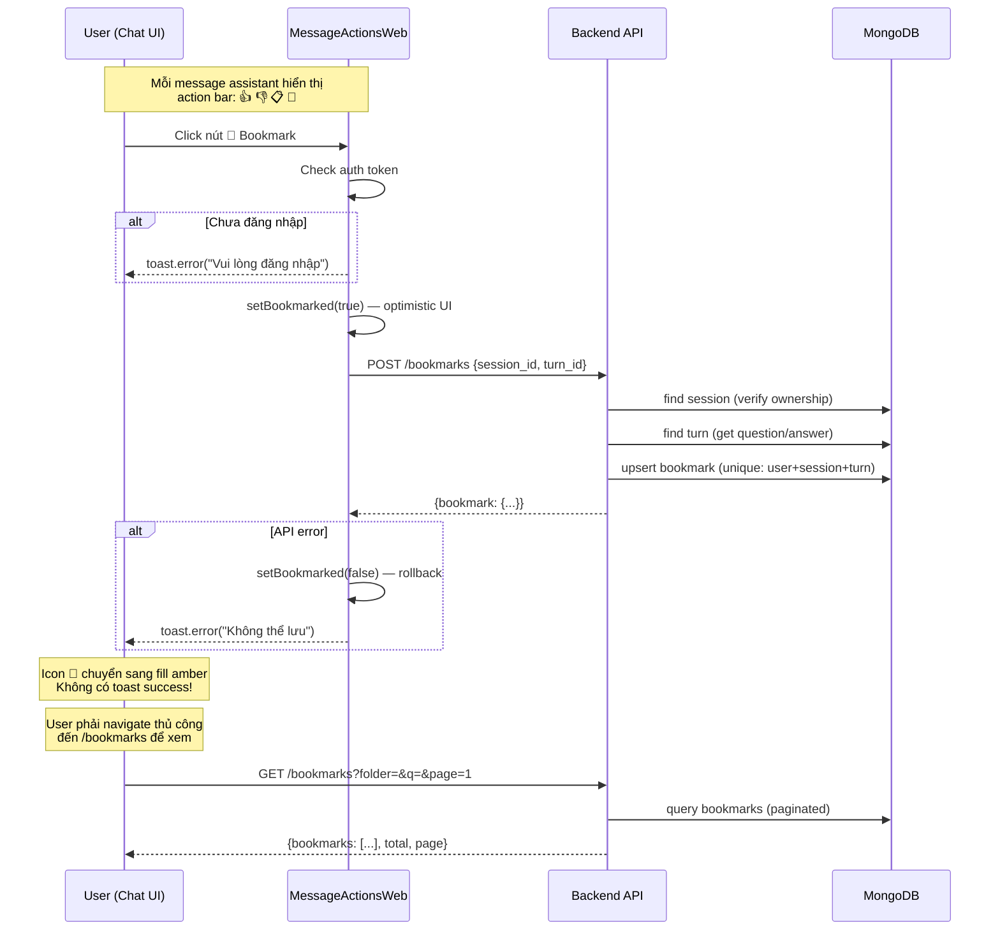
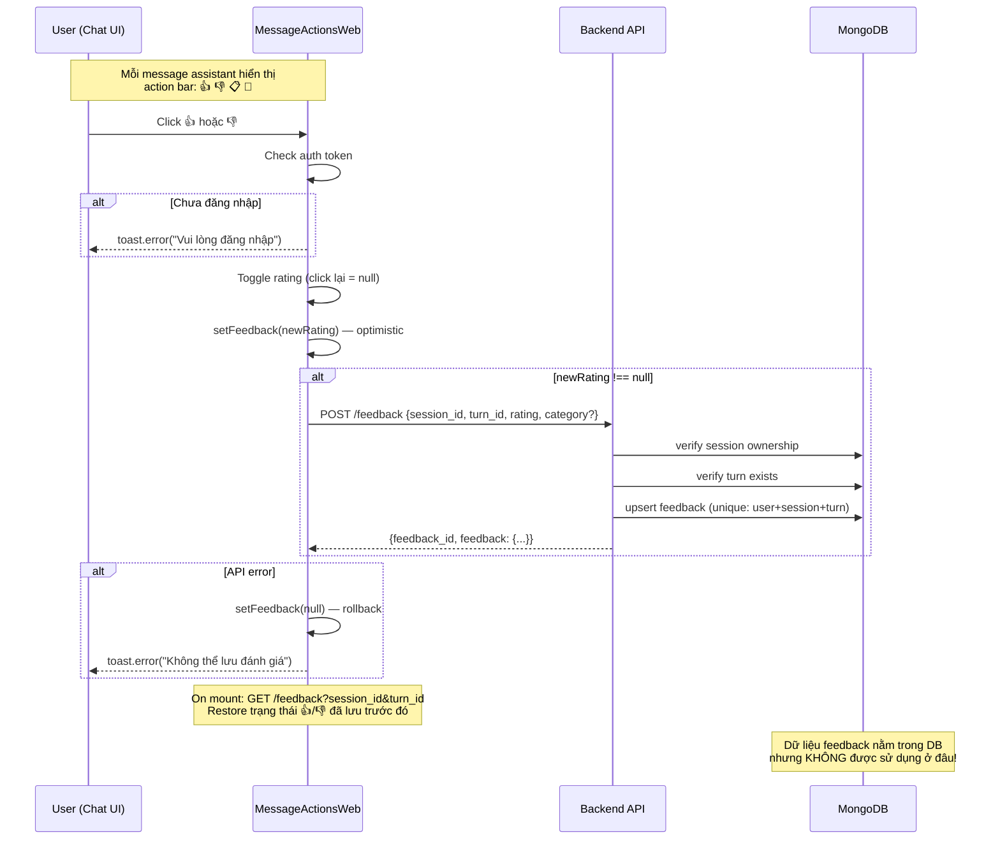
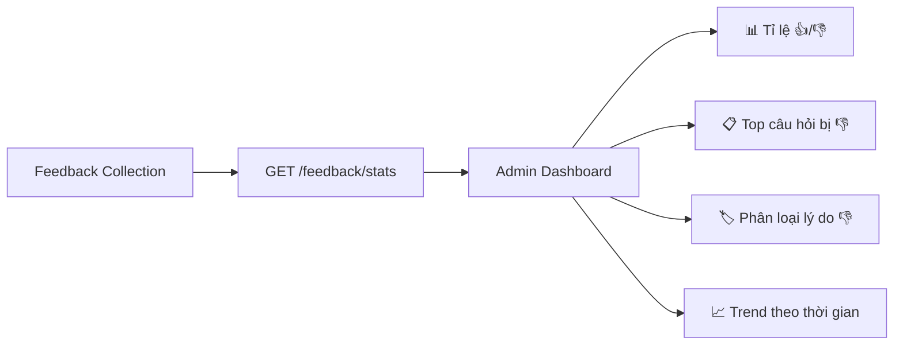
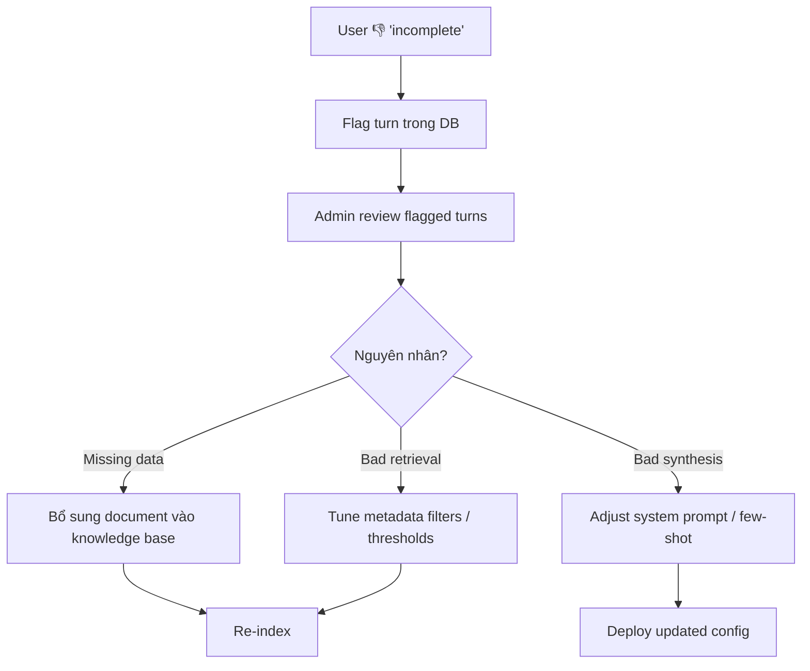

# Phân Tích Flow: Bookmark & Feedback

## 1. Flow Bookmark

### Tổng quan
Bookmark cho phép user lưu lại một lượt trả lời (turn) của chatbot để xem lại sau. Dữ liệu được lưu vào MongoDB collection `bookmarks`.

### Flow chi tiết



### Dữ liệu lưu trữ (MongoDB `bookmarks` collection)

| Field | Mô tả |
|-------|--------|
| `user_id` | Owner |
| `session_id` | Session gốc |
| `turn_id` | Turn gốc |
| `question` | Snapshot câu hỏi |
| `answer_snapshot` | Toàn bộ câu trả lời |
| `answer_preview` | 240 ký tự đầu |
| `sources_snapshot` | Nguồn tham khảo |
| `folder` | Folder name (default: "Chung") |
| `note` | Ghi chú user |
| `created_at` / `updated_at` | Timestamps |

### Các endpoint API

| Method | Path | Mô tả |
|--------|------|--------|
| `POST` | `/bookmarks` | Tạo bookmark (upsert) |
| `GET` | `/bookmarks` | List (paginated, filter by folder/search) |
| `DELETE` | `/bookmarks/{id}` | Xóa bookmark |
| `PATCH` | `/bookmarks/{id}` | Cập nhật folder/note |
| `GET` | `/bookmark-folders` | List folders + count |
| `POST` | `/bookmark-folders` | Tạo folder trống |
| `PATCH` | `/bookmark-folders/{name}` | Rename folder |
| `DELETE` | `/bookmark-folders/{name}` | Xóa folder (move bookmarks) |

### Trang BookmarksPage (`/bookmarks`)

- Route đã đăng ký: `/bookmarks` trong App.tsx
- Có đầy đủ: search, filter by folder, expand/collapse, delete
- **Nhưng không có link/navigation nào từ Chat UI dẫn đến trang này!**

---

## 2. Flow Feedback

### Tổng quan
Feedback cho phép user đánh giá chất lượng câu trả lời (👍/👎). Dữ liệu được lưu vào MongoDB collection `feedback`.

### Flow chi tiết



### Dữ liệu lưu trữ (MongoDB `feedback` collection)

| Field | Mô tả |
|-------|--------|
| `user_id` | Owner |
| `session_id` | Session gốc |
| `turn_id` | Turn gốc |
| `rating` | `"up"` hoặc `"down"` |
| `category` | `"wrong"` / `"incomplete"` / `"outdated"` (optional) |
| `comment` | Nhận xét chi tiết (optional, max 1000 chars) |
| `question` | Snapshot câu hỏi |
| `answer_snapshot` | Snapshot câu trả lời |
| `created_at` / `updated_at` | Timestamps |

### Các endpoint API

| Method | Path | Mô tả |
|--------|------|--------|
| `POST` | `/feedback` | Tạo/cập nhật feedback |
| `GET` | `/feedback` | Lấy feedback theo session+turn |
| `GET` | `/feedback/stats` | Thống kê aggregate (admin) |

---

## 3. Đánh Giá & Vấn Đề

### 🔖 Bookmark — Vấn đề hiện tại

> [!WARNING]
> **Vấn đề chính: Bookmark là "dead-end" — user click xong không thấy gì thay đổi**

| # | Vấn đề | Mức nghiêm trọng |
|---|--------|-------------------|
| B1 | **Không có toast thành công** sau khi bookmark — user không biết đã lưu | 🔴 HIGH |
| B2 | **Không có navigation link** từ sidebar/header đến `/bookmarks` — user không biết trang tồn tại | 🔴 HIGH |
| B3 | **Chỉ có icon đổi màu** (amber fill) — quá subtle, dễ bỏ qua | 🟡 MEDIUM |
| B4 | **Không check trạng thái đã bookmark** khi mount — reload page thì icon reset về trống | 🟡 MEDIUM |
| B5 | **Không có unbookmark** — click lại chỉ tạo thêm upsert, không toggle off | 🟡 MEDIUM |
| B6 | **Không chọn folder** khi bookmark từ chat — luôn vào "Chung" | 🟢 LOW |
| B7 | **BookmarksPage thiếu link quay lại conversation gốc** | 🟢 LOW |

### 👍👎 Feedback — Vấn đề hiện tại

> [!WARNING]
> **Vấn đề chính: Feedback data chỉ thu thập mà không sử dụng — không tạo giá trị**

| # | Vấn đề | Mức nghiêm trọng |
|---|--------|-------------------|
| F1 | **Dữ liệu feedback không được consume** — không có dashboard, report, hay feedback loop nào | 🔴 HIGH |
| F2 | **`GET /feedback/stats` chưa được frontend nào gọi** — API tồn tại nhưng không dùng | 🔴 HIGH |
| F3 | **`category` luôn hardcode "incomplete"** khi 👎 — user không chọn lý do cụ thể | 🟡 MEDIUM |
| F4 | **`comment` field không bao giờ được sử dụng** — UI không có input cho comment | 🟡 MEDIUM |
| F5 | **Không có toast thành công** — chỉ đổi màu icon | 🟢 LOW |
| F6 | **Chưa dùng feedback để cải thiện RAG** (RLHF-lite) — thiếu closed-loop | 🔴 HIGH |

---

## 4. Gợi Ý Phát Triển

### Phase 1: Quick Wins — Sửa UX cơ bản (1-2 ngày)

#### Bookmark UX Fix
```
1. Thêm toast.success("Đã lưu câu trả lời!") sau bookmark thành công
2. Thêm link "🔖 Đã lưu" vào ConversationSidebar (hoặc header)
3. Check trạng thái bookmark on mount (GET /bookmarks filter by session+turn)
4. Hỗ trợ unbookmark (toggle): click lần 2 → DELETE bookmark
```

#### Feedback UX Fix
```
1. Thêm toast.success("Cảm ơn bạn đã đánh giá!") 
2. Khi 👎: hiện dropdown/popover chọn category (wrong/incomplete/outdated)
3. Optional: thêm textarea cho comment khi chọn 👎
```

### Phase 2: Feedback Dashboard — Admin thấy insights (2-3 ngày)



- Thêm tab "Feedback" trong AdminPage
- Gọi `GET /feedback/stats` + list feedback records
- Hiển thị: satisfaction rate, worst-performing questions, category breakdown

### Phase 3: Feedback Loop — Cải thiện hệ thống (5-7 ngày)

> [!IMPORTANT]
> Đây là giá trị thực sự của feedback: tạo closed-loop để cải thiện RAG.



#### Các hướng cụ thể:

| Hướng | Mô tả | Effort |
|-------|--------|--------|
| **Feedback-aware reranking** | Turns bị 👎 nhiều → giảm priority cho similar retrievals | 5d |
| **Auto-flag cho admin** | Khi 1 câu hỏi bị 👎 > 3 lần → tự tạo notification cho admin | 1d |
| **Export training data** | Export (question, answer, rating) pairs để fine-tune hoặc eval | 2d |
| **Answer quality scoring** | Tính satisfaction score per collection/topic → identify weak areas | 2d |

### Phase 4: Bookmark Enhancement — Tính năng nâng cao

| Tính năng | Mô tả | Effort |
|-----------|--------|--------|
| **Bookmark từ BookmarksPage → Jump to conversation** | Link `session_id` quay lại chat gốc | 0.5d |
| **Bookmark với folder picker** | Dropdown chọn folder ngay khi bookmark | 1d |
| **Bookmark search highlight** | Highlight matched text trong search results | 1d |
| **Share bookmark** | Generate shareable link cho 1 bookmark | 2d |
| **Bookmark export** | Export bookmarks ra PDF/Markdown | 1d |

---

## 5. Tóm Tắt Ưu Tiên

| Priority | Việc cần làm | Impact | Effort |
|----------|-------------|--------|--------|
| 🔴 P0 | Toast success + navigation link cho Bookmark | UX fix | 0.5d |
| 🔴 P0 | Toggle bookmark (unbookmark) + check state on mount | UX fix | 0.5d |
| 🟡 P1 | Feedback category picker khi 👎 | Data quality | 1d |
| 🟡 P1 | Admin feedback dashboard (stats + list) | Insights | 2d |
| 🟢 P2 | Feedback → auto-flag + notification | Closed-loop | 1d |
| 🟢 P2 | Bookmark → jump to conversation | Navigation | 0.5d |
| 🔵 P3 | Feedback-aware RAG tuning | System improvement | 5d |
