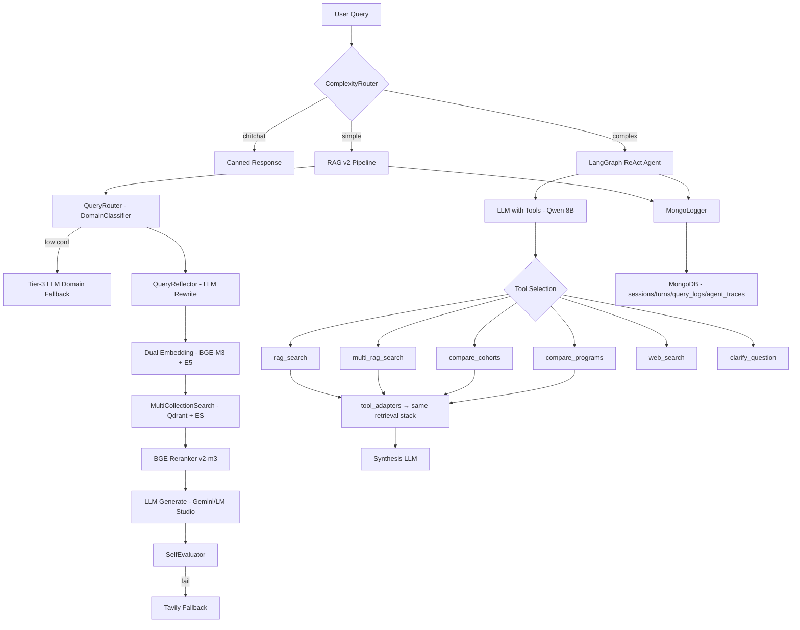

# Phân Tích & Kế Hoạch Phát Triển Hệ Thống Agentic RAG v2

## Tổng Quan Kiến Trúc Hiện Tại



---

## 1. Đánh Giá Hệ Thống — Điểm Mạnh

| Module | Rating | Chi tiết |
|--------|--------|----------|
| **Hybrid Search** | ⭐⭐⭐⭐⭐ | Qdrant + ES + RRF fusion + adaptive weights cho course queries, metadata pre-filtering rất tốt |
| **Metadata Filters** | ⭐⭐⭐⭐⭐ | Fallback chain (exact→fuzzy→null-or-exact→no-filter), per-collection extractors với registry pattern |
| **Agent Tool Design** | ⭐⭐⭐⭐ | 6 tools rõ ràng, guard clauses tốt (cohort/major confusion), clarify workflow |
| **LangGraph Integration** | ⭐⭐⭐⭐ | Loop detection tốt (signature-based + name-based), synthesis fallback, clarify stop-point |
| **Domain Classifier** | ⭐⭐⭐⭐ | Two-stage (Intent→Domain), calibrated, multi-label OvR |
| **Query Reflection** | ⭐⭐⭐⭐ | Profile merging, entity extraction, major reference enforcement |
| **Clean Architecture** | ⭐⭐⭐⭐ | ABC/Protocol cho LLM/Embedding/Reranker, factory pattern, provider registry |
| **MongoDB Logging** | ⭐⭐⭐ | Sessions/turns/query_logs/agent_traces, indexes tốt |

---

## 2. Các Vấn Đề Được Xác Định

### 🔴 Vấn đề #1: Kiến Trúc Song Song — Duplicated Logic

**Mô tả:** Hai pipeline song song (RAG v2 vs Agent) chia sẻ cùng retrieval stack nhưng có logic routing/reflection riêng biệt, dẫn đến:

- `ComplexityRouter` (regex-based, agent/) ≠ `QueryRouter` (classifier-based, query/) — hai cơ chế routing độc lập
- Agent path KHÔNG có `QueryReflector`, `SelfEvaluator`, hay `CollectionSelector` — thiếu quality gates
- `tool_adapters.py` tạo runtime riêng (`_AdapterRuntime`) thay vì reuse pipeline components
- `flows.py` (1371 dòng) quá phức tạp, chứa tất cả logic từ history trimming đến search trace merging

**Impact:** Khi fix bug hoặc cải thiện retrieval, phải sửa ở 2 nơi. Agent path thiếu các quality improvements đã có ở RAG path.

---

### 🔴 Vấn đề #2: Agent Reliability với Qwen 8B

**Mô tả:** ReAct agent dùng Qwen 8B local (qua LM Studio) cho tool calling:

- `max_tokens=800` cho agent LLM — quá thấp cho complex reasoning, dễ bị cắt giữa tool call JSON
- `temperature=0.1` — chưa đủ deterministic cho tool selection
- Không có structured output validation — nếu Qwen trả tool_call JSON sai format, LangChain sẽ crash
- `ToolMessage.content` bị truncate ở 2000 chars — có thể mất thông tin quan trọng từ search results
- Synthesis fallback dùng cùng Qwen 8B — model nhỏ không tốt cho synthesis từ multiple contexts

**Impact:** Agent fails silently, fallback về RAG v2 mà user không biết. Chất lượng câu trả lời complex queries không ổn định.

---

### 🟡 Vấn đề #3: Retrieval Quality Gaps

**Mô tả:**
- **Không có cross-reference resolution**: chunks tham chiếu "theo Điều 48 Khoản 2" nhưng chunk đó không được fetch
- **Không có document validity/override**: QĐ 5445/2025 thay thế QĐ 4600/2023 nhưng cả hai đều được retrieve
- **Reranker score threshold `0.0`**: chấp nhận mọi document dù relevance thấp
- `_format_search_results` truncate content ở 700 chars cho agent path — mất context
- Không có contextual compression — chunks dài 1500 chars nhưng chỉ 1-2 câu relevant

---

### 🟡 Vấn đề #4: Observability & Debugging

**Mô tả:**
- Agent traces trong MongoDB thiếu: latency per-tool, LLM reasoning text, intermediate state
- Không có metrics/dashboard: routing accuracy, retrieval recall, agent success rate
- `build_rag_messages` log toàn bộ user content vào INFO level — potential PII leak + noise
- Không có request tracing (correlation ID) xuyên suốt pipeline
- Không phân biệt được agent fallback vs agent success trong logs

---

### 🟡 Vấn đề #5: Evaluation Framework Thiếu Hệ Thống

**Mô tả:**
- `eval/` directory chỉ có test data, không có automated evaluation pipeline
- Không có golden dataset cho: routing accuracy, retrieval recall@k, agent tool selection
- SelfEvaluator chạy runtime (tốn latency) nhưng kết quả không được aggregate/analyze
- Không có regression testing — thay đổi prompt có thể degrade quality mà không biết
- `tests/` có 13 test files nhưng chủ yếu unit tests, thiếu integration/e2e tests

---

### 🟡 Vấn đề #6: Data Quality & Freshness

**Mô tả:**
- Không có pipeline tự động cập nhật data khi có quy định mới
- Chunking scripts (`pipeline/index_*.py`) chạy manual
- Metadata enrichment (`chunking/enrich_metadata.py`) chỉ cover CTDT, không cover quydinh/kehoach
- `kehoach_recency_bonus` chỉ là heuristic đơn giản, không đủ cho temporal reasoning

---

### 🟢 Vấn đề #7: API & UX

**Mô tả:**
- CORS hardcoded cho localhost:5173 và localhost:8080 — không flexible cho deployment
- `GOOGLE_API_KEY` required at startup (`raise ValueError`) ngay cả khi dùng LM Studio
- Không có rate limiting, request validation, hay error response schema chuẩn
- Agent streaming chưa được implement (`query_v3` chỉ có sync)

---

## 3. Kế Hoạch Phát Triển

### Phase 1: Architecture Consolidation & Agent Hardening (Ưu tiên cao nhất)

> **Mục tiêu**: Hợp nhất pipeline, tăng độ tin cậy agent, giảm code duplication

#### 1.1 Unified Retrieval Service

**Vấn đề giải quyết**: `tool_adapters.py` tạo runtime riêng, duplicate với `RAGPipeline.__init__`

**Giải pháp**: Tạo `RetrievalService` singleton được inject vào cả RAG pipeline và agent tools

```
[NEW] retrieval/service.py
  - class RetrievalService: embedders, searcher, reranker
  - search(query, collection, major, cohort, top_k) → List[Dict]
  - compare(topic, entity_a, entity_b, collection) → str
  
[MODIFY] agent/tool_adapters.py
  - Xóa _AdapterRuntime, dùng RetrievalService
  
[MODIFY] pipeline/rag_pipeline.py
  - Init RetrievalService, pass cho cả flows và agent
```

**Effort**: 2-3 ngày

---

#### 1.2 Agent LLM Configuration Upgrade

**Vấn đề giải quyết**: Qwen 8B với config hiện tại không reliable cho tool calling

**Giải pháp**:
- Tăng `max_tokens` từ 800→1200 cho agent, 1200→2000 cho synthesis
- Giảm `temperature` từ 0.1→0.0 cho agent (deterministic tool selection)
- Thêm JSON schema validation cho tool call responses
- Tăng `ToolMessage.content` limit từ 2000→3000 chars
- Option cho synthesis LLM dùng model khác (Gemini) thay vì cùng Qwen 8B

```
[MODIFY] agent/react_agent.py
  - Config adjustments + fallback synthesis model option
  
[MODIFY] config/settings.py  
  - agent_synthesis_model, agent_max_tokens, agent_tool_result_limit
```

**Effort**: 1 ngày

---

#### 1.3 ComplexityRouter Enhancement

**Vấn đề giải quyết**: Regex-based router thiếu coverage, false positives

**Giải pháp**: Kết hợp regex patterns với DomainClassifier confidence score

```
[MODIFY] agent/complexity_router.py
  - Integrate DomainClassifier confidence as secondary signal
  - Add "ambiguous" route for borderline cases
  - Log routing decisions with confidence for analysis
```

**Effort**: 1-2 ngày

---

### Phase 2: Retrieval Quality & Data Intelligence

> **Mục tiêu**: Nâng cao chất lượng retrieval, xử lý document validity và cross-reference

#### 2.1 Document Validity & Override System

```
[NEW] config/document_registry.json
  - Mapping: {doc_id → replaces → [doc_ids], effective_from, scope}
  
[NEW] retrieval/validity_filter.py
  - Filter out superseded documents post-retrieval
  - Temporal reasoning: chỉ giữ quy định có hiệu lực
  
[MODIFY] pipeline/flows.py
  - Insert validity filter after reranking, before context formatting
```

**Effort**: 3-4 ngày

---

#### 2.2 Cross-Reference Resolution

```
[NEW] retrieval/reference_resolver.py
  - Regex: "Điều\s+\d+", "Khoản\s+\d+\s+Điều\s+\d+"
  - Fetch referenced chunks từ cùng document source
  - Merge vào context trước khi generate
  
[MODIFY] pipeline/flows.py
  - Add reference resolution step after reranking
```

**Effort**: 2-3 ngày

---

#### 2.3 Contextual Compression

**Giải pháp**: Dùng LLM để extract chỉ phần relevant từ mỗi chunk trước khi đưa vào final context

```
[NEW] retrieval/context_compressor.py
  - LLM-based extraction: given query + chunk → extract relevant sentences
  - Chỉ apply khi chunk > 500 chars
  - Cache compressed results
```

**Effort**: 2 ngày

---

### Phase 3: Observability & Evaluation Framework

> **Mục tiêu**: Metrics, automated testing, quality monitoring

#### 3.1 Structured Tracing

```
[NEW] utils/tracing.py
  - RequestContext: correlation_id, timestamps, stage durations
  - Decorator @trace_stage("retrieval") tự động log timing
  
[MODIFY] pipeline/flows.py, agent/react_agent.py
  - Inject RequestContext xuyên suốt pipeline
  
[MODIFY] pipeline/mongo_logger.py
  - Log full trace with correlation_id
```

**Effort**: 2-3 ngày

---

#### 3.2 Automated Evaluation Pipeline

```
[NEW] eval/golden_dataset.json
  - 100+ test cases covering: routing, retrieval, agent tool selection, generation
  - Categories: simple_rag, complex_agent, chitchat, ambiguous, cross_reference
  
[NEW] eval/evaluator.py
  - Batch evaluation: routing_accuracy, retrieval_recall@5, answer_quality
  - Compare before/after changes
  - Generate evaluation report
  
[NEW] eval/run_evaluation.py
  - CLI: python -m eval.run_evaluation --dataset golden --report
```

**Effort**: 4-5 ngày

---

#### 3.3 Quality Dashboard Data

```
[MODIFY] pipeline/mongo_logger.py
  - Aggregate metrics: avg_latency, routing_distribution, agent_success_rate
  - Daily quality scores từ SelfEvaluator results
  
[NEW] api/routes/metrics.py
  - GET /metrics/summary — routing, latency, quality stats
  - GET /metrics/agent — agent trace analysis
```

**Effort**: 2 ngày

---

### Phase 4: Production Readiness & UX

> **Mục tiêu**: API hardening, streaming agent, deployment

#### 4.1 API Improvements

```
[MODIFY] api/main.py
  - Không require GOOGLE_API_KEY khi dùng LM Studio
  - Dynamic CORS từ settings
  - Rate limiting middleware
  - Structured error responses

[MODIFY] api/routes/chat.py
  - Agent streaming endpoint
  - Request validation with Pydantic models
```

**Effort**: 2 ngày

---

#### 4.2 Agent Streaming

```
[MODIFY] agent/react_agent.py
  - Add run_stream() method yielding intermediate steps
  - Stream: "thinking..." → tool calls → tool results → final answer

[MODIFY] api/routes/chat.py
  - SSE endpoint for agent streaming
```

**Effort**: 2-3 ngày

---

#### 4.3 Data Pipeline Automation

```
[NEW] scripts/update_data.py
  - Watch directory for new documents
  - Auto-chunk → enrich metadata → index to Qdrant + ES
  - Notify admin on completion

[MODIFY] chunking/enrich_metadata.py
  - Extend to cover quydinh and kehoach collections
```

**Effort**: 3 ngày

---

## 4. Timeline Tổng Quan

```
Phase 1: Architecture & Agent     ████████████  ~5-6 ngày
Phase 2: Retrieval Quality        ██████████████  ~7-9 ngày  
Phase 3: Observability & Eval     ████████████  ~8-10 ngày
Phase 4: Production & UX          ██████████  ~7-8 ngày
                                  ──────────────────────
                                  Tổng: ~27-33 ngày
```

## Open Questions

> [!IMPORTANT]
> 1. **Agent LLM**: Bạn có plan upgrade từ Qwen 8B sang model lớn hơn (Qwen 14B/32B) hoặc dùng Gemini cho agent path không? Điều này ảnh hưởng lớn đến strategy Phase 1.2.
> 2. **Deployment target**: Hệ thống sẽ deploy ở đâu (local server, cloud, Docker)? Ảnh hưởng đến Phase 4.
> 3. **Evaluation priority**: Bạn muốn ưu tiên golden dataset cho domain nào trước (routing? retrieval? agent tool selection)?
> 4. **Phase priority**: Bạn muốn bắt đầu với Phase nào? Tôi recommend Phase 1 trước vì nó giảm technical debt và tạo nền tảng cho các phase sau.

## Verification Plan

### Automated Tests
- Unit tests cho mỗi module mới
- Integration tests: full pipeline query → response
- `pytest --cov` để track test coverage (target: >70%)

### Manual Verification  
- Chạy 20 câu hỏi benchmark qua cả RAG path và Agent path
- So sánh quality trước/sau mỗi phase
- Review MongoDB traces cho edge cases
