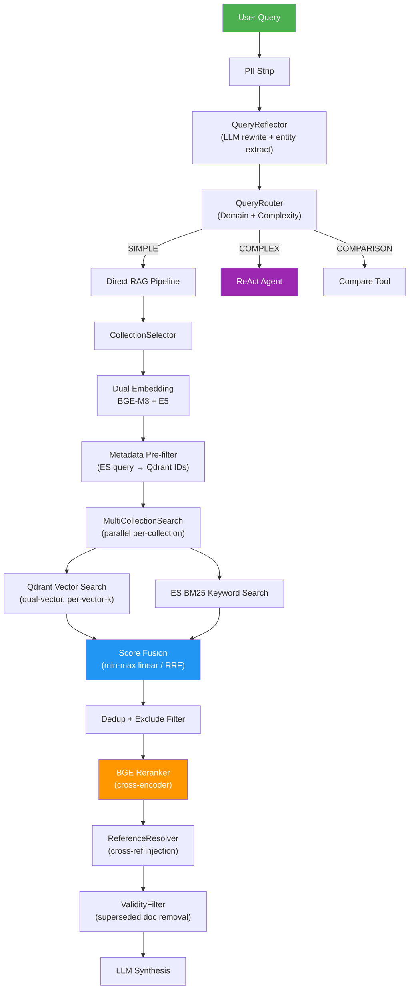

# Đánh Giá Hệ Thống RAG — 7 Strategy Layers

## Tổng Quan Kiến Trúc Hiện Tại



---

## Scorecard Tổng Hợp

| # | Strategy | Trạng thái | Maturity | Điểm | Hành động tiếp theo |
|---|----------|------------|----------|------|---------------------|
| 1 | Hybrid Search (Dense + BM25) + RRF | ✅ Đã triển khai | 🟢 Production | **8/10** | Fix scoring bugs |
| 2 | Cross-encoder Reranker | ✅ Đã triển khai | 🟢 Production | **7/10** | Metadata-aware reranking |
| 3 | Parent-Child Chunking | ✅ Đã triển khai | 🟢 Production | **9/10** | Tốt nhất trong hệ thống |
| 4 | Metadata Filtering | ✅ Đã triển khai | 🟡 Có lỗi | **6/10** | Fix critical field mismatch |
| 5 | Query Expansion / HyDE | ⚠️ Một phần | 🟡 Rewriting only | **5/10** | Thêm HyDE + Multi-query |
| 6 | Contextual Retrieval | ⚠️ Sơ khai | 🔴 Rule-based | **3/10** | Cần LLM contextualization |
| 7 | Agentic/Iterative Retrieval | ✅ Đã triển khai | 🟢 Advanced | **8/10** | Thêm quality-driven loop |

---

## 1. 🟢 Hybrid Search (Dense + BM25) + RRF — 8/10

### Đã Đạt Được ✅

| Capability | Implementation | File |
|------------|---------------|------|
| Dual-vector search | BGE-M3 + E5 Multilingual, weighted fusion | [qdrant_store.py](file:///d:/GR/src/RAG_v2/retrieval/qdrant_store.py#L155-L236) |
| BM25 keyword search | ES multi_match với ICU tokenizer cho Vietnamese | [elasticsearch_store.py](file:///d:/GR/src/RAG_v2/retrieval/elasticsearch_store.py#L557-L616) |
| RRF fusion | Cả global RRF lẫn per-collection RRF | [multi_collection_search.py](file:///d:/GR/src/RAG_v2/retrieval/multi_collection_search.py#L786-L825) |
| Min-max linear fusion | Adaptive weights cho vector vs keyword | [multi_collection_search.py](file:///d:/GR/src/RAG_v2/retrieval/multi_collection_search.py#L670-L780) |
| Multi-collection parallel | ThreadPoolExecutor cho parallel search | [multi_collection_search.py](file:///d:/GR/src/RAG_v2/retrieval/multi_collection_search.py#L355-L425) |
| Adaptive fusion weights | Course queries → keyword bias (0.4/0.6) | [multi_collection_search.py](file:///d:/GR/src/RAG_v2/retrieval/multi_collection_search.py#L480-L502) |
| Exclude-term filtering | `parse_structured_query` → post-filter | [structured_query.py](file:///d:/GR/src/RAG_v2/query/structured_query.py) |
| Deduplication | ID-based + text-based (200 char) dedup | [multi_collection_search.py](file:///d:/GR/src/RAG_v2/retrieval/multi_collection_search.py#L616-L665) |

### Lỗi & Cải Thiện

> [!CAUTION]
> **CRITICAL: Score fusion single-item pool trả về 0.0** — Khi vector pool chỉ có 1 result, min-max normalize thành 0.0. Fix: dùng `v_range = v_max or 1.0`. [Line 680-686](file:///d:/GR/src/RAG_v2/retrieval/multi_collection_search.py#L680-L686)

> [!WARNING]
> **HIGH: Qdrant dual-vector fusion không normalize** — BGE-M3 và E5 score ranges khác nhau nhưng `_fuse_results` cộng trực tiếp. Model nào score cao hơn tuyệt đối sẽ dominate. [Line 190-231](file:///d:/GR/src/RAG_v2/retrieval/qdrant_store.py#L190-L231)

> [!WARNING]
> **HIGH: 2 sequential round-trips cho Qdrant** — Nên dùng `query_batch_points` để batch BGE + E5 trong 1 request. [Line 158-180](file:///d:/GR/src/RAG_v2/retrieval/qdrant_store.py#L158-L180)

**Cải thiện nên làm:**
- Batch dual-vector queries → giảm ~30% latency
- Persistent thread pool thay vì tạo mới mỗi search
- `HybridSearch.search()` là dead code → clarify role hoặc remove

---

## 2. 🟢 Cross-encoder Reranker — 7/10

### Đã Đạt Được ✅

| Capability | Implementation | File |
|------------|---------------|------|
| BGE-v2-M3 cross-encoder | `BAAI/bge-reranker-v2-m3` via FlagEmbedding | [bge_reranker.py](file:///d:/GR/src/RAG_v2/reranking/bge_reranker.py#L33-L77) |
| Score threshold filtering | Default threshold + relaxed table threshold | [bge_reranker.py](file:///d:/GR/src/RAG_v2/reranking/bge_reranker.py#L134-L149) |
| GPU/MPS auto-detection | CUDA → MPS → CPU fallback | [bge_reranker.py](file:///d:/GR/src/RAG_v2/reranking/bge_reranker.py#L16-L25) |
| Rerank stats tracking | `last_stats` dict với min/max/mean scores | [bge_reranker.py](file:///d:/GR/src/RAG_v2/reranking/bge_reranker.py#L151-L162) |
| Over-fetch strategy | Retrieval 4×top_k → rerank → truncate | [service.py](file:///d:/GR/src/RAG_v2/retrieval/service.py#L148) |
| Major code expansion | Query "IT-E6" → "IT-E6 (CNTT Việt-Nhật)" cho reranker | [metadata_filters.py](file:///d:/GR/src/RAG_v2/retrieval/metadata_filters.py#L835-L880) |

### Lỗi & Cải Thiện

> [!NOTE]
> **Reranker chỉ dùng text, bỏ qua metadata.** Điều này có nghĩa `section_h2`, `major_code`, `hierarchy_path` — tất cả metadata rich context — đều invisible cho cross-encoder. `expand_major_in_query_for_reranking()` chỉ giải quyết phần query, không giải quyết phần document.

**Cải thiện ROI cao:**

```python
# TRƯỚC: reranker chỉ thấy chunk text
pairs = [(query, doc["text"]) for doc in documents]

# SAU: prepend metadata vào document text
def _enrich_text_for_reranking(doc: dict) -> str:
    meta = doc.get("metadata", {})
    prefix_parts = []
    if meta.get("hierarchy_path"):
        prefix_parts.append(meta["hierarchy_path"])
    if meta.get("major_code"):
        prefix_parts.append(f"Ngành: {meta['major_code']}")
    prefix = " | ".join(prefix_parts)
    return f"{prefix}\n{doc['text']}" if prefix else doc["text"]

pairs = [(query, _enrich_text_for_reranking(doc)) for doc in documents]
```

**ROI cao nhất:** Chỉ thay đổi ~5 dòng code nhưng cải thiện đáng kể precision cho domain-specific queries.

---

## 3. 🟢 Parent-Child Chunking — 9/10 ⭐ Best Component

### Đã Đạt Được ✅

| Capability | Implementation | File |
|------------|---------------|------|
| H2 section → parent chunks | Max 10,000 chars, truncated naturally | [recursive_chunker.py](file:///d:/GR/src/RAG_v2/chunking/chunker/recursive_chunker.py#L508-L537) |
| Content → child chunks | 1024 chars, no overlap | [recursive_chunker.py](file:///d:/GR/src/RAG_v2/chunking/chunker/recursive_chunker.py#L52-L74) |
| Parent-child linking | `parent_id` UUID + `level` metadata | [recursive_chunker.py](file:///d:/GR/src/RAG_v2/chunking/chunker/recursive_chunker.py#L827-L855) |
| Table protection | Prevents mid-table splitting, header re-injection | [recursive_chunker.py](file:///d:/GR/src/RAG_v2/chunking/chunker/recursive_chunker.py#L122-L174) |
| Table row splitting | Oversized tables split by rows with header | [recursive_chunker.py](file:///d:/GR/src/RAG_v2/chunking/chunker/recursive_chunker.py#L176-L227) |
| Heading context injection | Adds section heading to headless chunks | [recursive_chunker.py](file:///d:/GR/src/RAG_v2/chunking/chunker/recursive_chunker.py#L340-L377) |
| Khoản context injection | Numbered-item context for sub-items | [recursive_chunker.py](file:///d:/GR/src/RAG_v2/chunking/chunker/recursive_chunker.py#L615-L740) |
| Legal hierarchy chunking | Chương → Điều → Khoản with metadata | [hierarchical_legal_chunker.py](file:///d:/GR/src/RAG_v2/chunking/chunker/hierarchical_legal_chunker.py) |
| Domain-specific chunkers | `kehoach_chunker.py`, `stsv_chunker.py` | [chunking/chunker/](file:///d:/GR/src/RAG_v2/chunking/chunker) |
| Rich metadata preservation | section_h1/h2/h3/h4, hierarchy_path, chunk_type, has_table | Tất cả chunkers |
| Small chunk merging | Merge tiny chunks < 200 chars | [recursive_chunker.py](file:///d:/GR/src/RAG_v2/chunking/chunker/recursive_chunker.py#L925-L977) |
| Oversized chunk splitting | Split chunks > 1.3× chunk_size | [recursive_chunker.py](file:///d:/GR/src/RAG_v2/chunking/chunker/recursive_chunker.py#L229-L274) |

### Đánh giá

Đây là **component mạnh nhất** trong hệ thống. Thiết kế rất thoughtful:
- 4 domain-specific chunkers (curriculum, legal, schedule, student support)
- Bảo vệ bảng markdown, không tách giữa bảng
- Context injection cho cả heading lẫn numbered-item (khoản)
- Metadata hierarchy path cho tracing

**Cải thiện nhỏ:**
- Hiện tại retrieval filter `_is_parent_chunk()` ở [reference_resolver.py](file:///d:/GR/src/RAG_v2/retrieval/reference_resolver.py#L207-L212) loại parent chunks khi resolve reference. Nhưng **search không explicitly filter parent vs child** — cả hai đều được embed và search. Có thể thêm option `exclude_parent_chunks=True` cho dense search để giảm noise.

---

## 4. 🟡 Metadata Filtering — 6/10

### Đã Đạt Được ✅

| Capability | Implementation | File |
|------------|---------------|------|
| Per-collection filter extractors | `CtdtFilterExtractor`, `QuyDinhFilterExtractor`, `KeHoachFilterExtractor` | [metadata_filters.py](file:///d:/GR/src/RAG_v2/retrieval/metadata_filters.py#L930-L1170) |
| Major code extraction | 30+ regex patterns, alias resolution | [metadata_filters.py](file:///d:/GR/src/RAG_v2/retrieval/metadata_filters.py#L395-L475) |
| Cohort extraction | Kxx codes from query | [metadata_filters.py](file:///d:/GR/src/RAG_v2/retrieval/metadata_filters.py#L696-L730) |
| Freshness intent detection | "mới nhất", "gần đây" → sort_by_date_desc | [metadata_filters.py](file:///d:/GR/src/RAG_v2/retrieval/metadata_filters.py#L79-L93) |
| Date-based filtering | Month/year extraction → ES wildcard query | [metadata_filters.py](file:///d:/GR/src/RAG_v2/retrieval/metadata_filters.py#L1088-L1150) |
| Fallback chain | Strict filter → relaxed → no filter | [multi_collection_search.py](file:///d:/GR/src/RAG_v2/retrieval/multi_collection_search.py#L504-L615) |
| Major stripping for retrieval | Remove major codes from dense query | [metadata_filters.py](file:///d:/GR/src/RAG_v2/retrieval/metadata_filters.py#L756-L828) |
| Comparison query decomposition | Per-cohort and per-major sub-queries | [metadata_filters.py](file:///d:/GR/src/RAG_v2/retrieval/metadata_filters.py#L880-L930) |
| Recency bonus for kehoach | Time-decay scoring for schedule docs | [metadata_filters.py](file:///d:/GR/src/RAG_v2/retrieval/metadata_filters.py#L1155-L1200) |
| Validity filtering | Superseded document removal | [validity_filter.py](file:///d:/GR/src/RAG_v2/retrieval/validity_filter.py) |

### Lỗi Nghiêm Trọng

> [!CAUTION]
> **CRITICAL: `applicable_cohort` vs `applicable_major` Field Mismatch**
> 
> Code query field `"applicable_cohort"` ở [line 1046](file:///d:/GR/src/RAG_v2/retrieval/metadata_filters.py#L1046), nhưng ES mapping chỉ có `"applicable_major"` ở [line 175](file:///d:/GR/src/RAG_v2/retrieval/elasticsearch_store.py#L175). **QuyDinh cohort filtering hoàn toàn không hoạt động** → fallback "no filter" → search toàn bộ collection.
> 
> Fix: Đổi `"applicable_cohort"` → `"applicable_major"` hoặc thêm field vào ES mapping.

> [!WARNING]
> **Major code collision:** `BF2: "Kỹ thuật Thực phẩm"` vs `BF-E12: "Kỹ thuật thực phẩm"` — case-sensitive key collision trong `_MAJOR_NAME_TO_CODE`. [Line 133-170](file:///d:/GR/src/RAG_v2/retrieval/metadata_filters.py#L133-L170)

> [!WARNING]
> **`strip_major_from_query_for_retrieval` over-strips comparison queries.** Query "IT1 và IT2" → stripped thành empty query. [Line 765-828](file:///d:/GR/src/RAG_v2/retrieval/metadata_filters.py#L765-L828)

**Cải thiện:**
- Fix field name mismatch (ngay lập tức)
- Case-insensitive key cho `_MAJOR_NAME_TO_CODE`
- Externalize hardcoded major data ra JSON file
- Add `_superseded_ids` matching cho ValidityFilter (hiện tại chỉ dùng pattern matching)

---

## 5. 🟡 Query Expansion / HyDE — 5/10

### Đã Đạt Được ✅

| Capability | Implementation | File |
|------------|---------------|------|
| LLM query rewriting | Gemini flash-lite, standalone rewrite | [reflection.py](file:///d:/GR/src/RAG_v2/query/reflection.py#L1-L120) |
| Profile-aware rewriting | Major/cohort/year injection from user context | [reflection.py](file:///d:/GR/src/RAG_v2/query/reflection.py#L151-L203) |
| Chat history resolution | Anaphora: "đó", "này", "ấy" → resolved | [reflection.py](file:///d:/GR/src/RAG_v2/query/reflection.py#L79-L84) |
| PII stripping | Student ID, names, thanks removal | [reflection.py](file:///d:/GR/src/RAG_v2/query/reflection.py#L96-L147) |
| Multi-domain decomposition | LLM splits question → per-collection sub-queries | [decomposer.py](file:///d:/GR/src/RAG_v2/query/decomposer.py) |
| Comparison follow-up detection | Deterministic rewriting for "so sánh" follow-ups | [reflection.py](file:///d:/GR/src/RAG_v2/query/reflection.py#L395-L417) |
| Major code expansion | Deterministic "IT-E6" → "IT-E6 (CNTT Việt-Nhật)" | [reflection.py](file:///d:/GR/src/RAG_v2/query/reflection.py#L423-L481) |
| Entity extraction | Major, cohort, course_code, semester, academic_year | [reflection.py](file:///d:/GR/src/RAG_v2/query/reflection.py#L661-L800) |
| Scope injection detection | Prevents LLM from hallucinating academic context | [reflection.py](file:///d:/GR/src/RAG_v2/query/reflection.py#L254-L280) |

### Chưa Có ❌

| Capability | Mô tả | Độ khó | ROI |
|------------|--------|--------|-----|
| **HyDE** | Generate hypothetical answer → embed → search | Medium | 🟢 HIGH khi recall thấp |
| **Multi-query generation** | Tạo 3-5 variants của cùng query → merge results | Easy | 🟢 HIGH |
| **Synonym expansion** | Vietnamese synonym dict cho academic terms | Easy | 🟡 MEDIUM |
| **Step-back prompting** | Abstract query trước khi search | Easy | 🟡 MEDIUM |

### Cải Thiện Recommended

**Multi-query (dễ nhất, ROI cao):**
```python
class MultiQueryExpander:
    """Generate 3 query variants for improved recall."""
    
    def expand(self, query: str) -> List[str]:
        # Variant 1: Original
        # Variant 2: LLM rephrase (đã có QueryReflector)
        # Variant 3: Entity-focused (extract key terms, search separately)
        return [query, rewritten_query, entity_query]
```

**HyDE (medium effort, high ROI when recall is low):**
```python
class HyDEExpander:
    """Generate hypothetical answer → embed → search."""
    
    def expand(self, query: str) -> List[float]:
        hypothetical_answer = self.llm.generate(
            f"Viết một đoạn trả lời giả định cho câu hỏi: {query}"
        )
        return self.embedder.embed(hypothetical_answer)
```

---

## 6. 🔴 Contextual Retrieval — 3/10

### Đã Đạt Được ✅ (Rule-based only)

| Capability | Implementation | File |
|------------|---------------|------|
| Heading context injection | H2/H3/H4 headings prepended to headless chunks | [recursive_chunker.py](file:///d:/GR/src/RAG_v2/chunking/chunker/recursive_chunker.py#L340-L377) |
| Hierarchy path metadata | "CTDT IT-E6 > Khối KT > KT chuyên ngành" | [recursive_chunker.py](file:///d:/GR/src/RAG_v2/chunking/chunker/recursive_chunker.py#L500-L506) |
| Khoản context injection | Numbered-item parent context for sub-items | [recursive_chunker.py](file:///d:/GR/src/RAG_v2/chunking/chunker/recursive_chunker.py#L669-L740) |

### Chưa Có ❌ — Anthropic-style Contextual Retrieval

> [!IMPORTANT]
> Hệ thống hiện tại chỉ inject **structural context** (headings, hierarchy path). Anthropic-style contextual retrieval inject **semantic context** = LLM tóm tắt vị trí chunk trong toàn bộ document.

**Ví dụ cụ thể cho domain của bạn:**

````carousel
```
Chunk GỐC (không có context):
"Ngoại ngữ: Tiếng Anh IELTS 5.5 hoặc tương đương"
```
<!-- slide -->
```
Chunk SAU contextual retrieval:
"[Quy định tốt nghiệp cho sinh viên K70 ngành CNTT Việt-Nhật (IT-E6), 
ban hành 2023, điều kiện ngoại ngữ:]
Ngoại ngữ: Tiếng Anh IELTS 5.5 hoặc tương đương"
```
<!-- slide -->
```python
# Implementation: chạy 1 lần khi indexing, KHÔNG phải mỗi query
for chunk in chunks:
    context = llm.generate(
        f"Tóm tắt ngắn gọn vị trí của đoạn text sau trong tài liệu "
        f"'{doc.title}': {chunk.text}"
    )
    chunk.text = f"[{context}]\n{chunk.text}"
    chunk.embedding = embed(chunk.text)  # Re-embed with context
```
````

**Impact theo Anthropic research:**
- Contextual Retrieval alone: **+35% retrieval accuracy**
- Contextual Retrieval + BM25 hybrid: **+49%**
- Contextual Retrieval + BM25 + Reranker: **+67%**

**Vì bạn đã có BM25 hybrid + Reranker, thêm contextual retrieval sẽ unlock full +67% potential.**

### Cải Thiện — Phương án thực tế

Không cần refactor chunker. Chỉ cần thêm 1 step trong indexing pipeline:

```python
# Thêm vào document_pipeline.py
def contextualize_chunks(chunks: List[Dict], doc_metadata: Dict) -> List[Dict]:
    """Add semantic context prefix to each chunk before embedding."""
    doc_title = doc_metadata.get("title", "")
    doc_type = doc_metadata.get("doc_type", "")
    
    for chunk in chunks:
        if chunk["metadata"]["level"] == "parent":
            continue  # Skip parent chunks
        
        hierarchy = chunk["metadata"].get("hierarchy_path", "")
        context_prompt = (
            f"Tài liệu: {doc_title}\n"
            f"Loại: {doc_type}\n"
            f"Vị trí: {hierarchy}\n"
            f"Tóm tắt ngữ cảnh của đoạn text sau trong 1-2 câu."
        )
        context = llm.generate(context_prompt + "\n" + chunk["content"][:500])
        chunk["content"] = f"[{context}]\n{chunk['content']}"
    return chunks
```

---

## 7. 🟢 Agentic/Iterative Retrieval — 8/10

### Đã Đạt Được ✅

| Capability | Implementation | File |
|------------|---------------|------|
| ReAct agent | LangGraph state machine, 4 nodes | [react_agent.py](file:///d:/GR/src/RAG_v2/agent/react_agent.py) |
| Multi-tool support | rag_search, multi_rag_search, compare_cohorts, compare_programs, web_search, clarify | [tool_adapters.py](file:///d:/GR/src/RAG_v2/agent/tool_adapters.py#L261-L283) |
| Parallel retrieval execution | ThreadPoolExecutor cho multi-step plans | [tool_adapters.py](file:///d:/GR/src/RAG_v2/agent/tool_adapters.py#L636-L673) |
| Web fallback | Tavily search khi internal search không đủ | [tool_adapters.py](file:///d:/GR/src/RAG_v2/agent/tool_adapters.py#L565-L589) |
| Comparison tools | Parallel search 2 cohorts/majors + side-by-side | [tool_adapters.py](file:///d:/GR/src/RAG_v2/agent/tool_adapters.py#L458-L562) |
| Clarification flow | Interactive clarification khi query ambiguous | [tool_adapters.py](file:///d:/GR/src/RAG_v2/agent/tool_adapters.py#L601-L630) |
| In-memory search cache | FIFO cache (256 entries) cho repeated queries | [tool_adapters.py](file:///d:/GR/src/RAG_v2/agent/tool_adapters.py#L47-L117) |
| Thread-safe reranker lock | Serializes rerank() calls | [tool_adapters.py](file:///d:/GR/src/RAG_v2/agent/tool_adapters.py#L56-L58) |
| Query decomposition | LLM splits multi-domain questions | [decomposer.py](file:///d:/GR/src/RAG_v2/query/decomposer.py) |
| Domain routing | SVM classifier + complexity router | [domain_classifier.py](file:///d:/GR/src/RAG_v2/query/domain_classifier.py), [complexity_router.py](file:///d:/GR/src/RAG_v2/query/complexity_router.py) |
| Shared runtime injection | Avoids duplicate model loading (~17s saved) | [tool_adapters.py](file:///d:/GR/src/RAG_v2/agent/tool_adapters.py#L219-L244) |

### Chưa Có ❌

| Capability | Mô tả | Khi nào cần |
|------------|--------|-------------|
| **Quality-driven refinement** | Check retrieval quality → refine query if poor | Khi recall thấp trên queries cụ thể |
| **Multi-hop reasoning** | Answer from retrieval 1 → forms query 2 | Khi cần chain reasoning (ít cần cho academic domain) |
| **Adaptive top_k** | Tăng top_k nếu confidence scores thấp | Khi search returns sparse results |
| **Self-reflection on answer** | LLM verify answer vs retrieved docs | Khi hallucination là vấn đề |

---

## Roadmap Ưu Tiên

### 🔴 P0: Fix Ngay (1-2 ngày) — Ảnh hưởng trực tiếp đến chất lượng

```diff
# 1. Fix applicable_cohort → applicable_major
# File: metadata_filters.py line 1046
-_null_or_terms("applicable_cohort", cohort_codes),
+_null_or_terms("applicable_major", cohort_codes),

# 2. Fix score fusion single-item pool
# File: multi_collection_search.py line 684
-v_range = v_max - v_min if v_max != v_min else 1.0
+v_range = v_max - v_min if v_max != v_min else (v_max or 1.0)

# 3. Fix Qdrant dual-vector normalize
# File: qdrant_store.py _fuse_results()
# Add min-max normalization before weighted sum
```

---

### 🟠 P1: Quick Wins (3-5 ngày) — ROI cao, effort thấp

| Task | Strategy | Impact | Effort |
|------|----------|--------|--------|
| **Metadata-aware reranking** | #2 Reranker | +10-15% precision | 1 ngày |
| **Batch Qdrant dual-vector** | #1 Hybrid | -30% latency | 1 ngày |
| **Multi-query expansion** | #5 Query Expansion | +10-20% recall | 2 ngày |
| **Case-insensitive major lookup** | #4 Metadata | Fix edge case bugs | 0.5 ngày |

---

### 🟡 P2: Medium Effort (1-2 tuần) — Cải thiện đáng kể

| Task | Strategy | Impact | Effort |
|------|----------|--------|--------|
| **Contextual Retrieval** | #6 | +35-67% retrieval accuracy | 1 tuần |
| **HyDE implementation** | #5 | +15-25% recall khi low | 3 ngày |
| **Automated evaluation pipeline** | All | Foundation cho improvement | 1 tuần |
| **Test coverage** cho untested files | All | Prevent regressions | 1 tuần |

---

### 🟢 P3: Long-term (2-4 tuần) — Advanced capabilities

| Task | Strategy | Impact | Effort |
|------|----------|--------|--------|
| **Quality-driven refinement loop** | #7 Agent | Adaptive retrieval quality | 1 tuần |
| **Semantic caching** | Performance | Reduce redundant queries | 1 tuần |
| **Externalize major data** | #4 Metadata | Maintainability | 3 ngày |
| **Architecture documentation** | All | Developer onboarding | 3 ngày |

---

## Open Questions

> [!IMPORTANT]
> Câu hỏi cần feedback trước khi thực hiện:

1. **P0 Fix `applicable_cohort`**: Bạn muốn đổi code (`applicable_cohort` → `applicable_major`) hay thêm field mới vào ES mapping? Recommendation: đổi code vì mapping nói `applicable_major` lưu cohort data.

2. **P1 Metadata-aware reranking**: Bạn muốn prepend metadata nào vào document text cho reranker? Options: (a) `hierarchy_path` only, (b) `hierarchy_path` + `major_code`, (c) full metadata prefix.

3. **P2 Contextual Retrieval**: Bạn muốn dùng LLM nào cho contextualization step? (a) Gemini flash-lite (rẻ, nhanh), (b) Gemini Pro (chất lượng cao hơn). Chỉ chạy 1 lần khi indexing nên cost không quá quan trọng.

4. **Priorities**: Bạn đồng ý thứ tự ưu tiên P0 → P1 → P2 → P3 không? Hay muốn ưu tiên strategy nào cụ thể?

---

## Verification Plan

### Automated Tests
```bash
# Chạy existing tests trước khi sửa
python -m pytest src/RAG_v2/retrieval/ -v

# Sau P0 fixes: verify field name fix
python -c "from retrieval.metadata_filters import QuyDinhFilterExtractor; e=QuyDinhFilterExtractor(); cf=e.extract('quy định K70'); print('applicable_major' in str(cf.metadata_es_queries))"

# Test score fusion fix
python -c "
from retrieval.multi_collection_search import MultiCollectionSearch
s = object.__new__(MultiCollectionSearch)
s.vector_weight = 0.5; s.keyword_weight = 0.5
# Verify single-item pool doesn't normalize to 0.0
"
```

### Manual Verification
- Query "quy định ngoại ngữ cho K70" → verify results filtered by K70 cohort
- Query CTĐT with 1 metadata match → verify score > 0 after fusion
- Compare ranking before/after metadata-aware reranking
