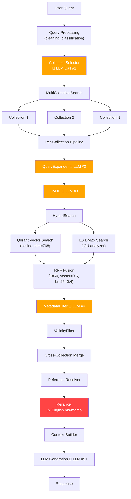

# 🔍 Đánh Giá Chi Tiết & Kế Hoạch Cải Thiện Retrieval Strategy — RAG v2

## Tổng Quan

Hệ thống RAG v2 là chatbot đại học Quy Nhơn xử lý 4 collection dữ liệu: **CTDT** (chương trình đào tạo), **Quy định**, **Kế hoạch**, **STSV** (sổ tay sinh viên). Hệ thống sử dụng kiến trúc hybrid search (Qdrant + Elasticsearch) với nhiều module LLM-powered.

---

## 1. Strategy Đang Implement

### 1.1 Kiến Trúc Pipeline Hiện Tại



### 1.2 Các Module Chính

| Module | File | Chức năng | LLM? |
|--------|------|-----------|------|
| **RetrievalService** | [service.py](file:///d:/GR/src/RAG_v2/retrieval/service.py) | Orchestrator chính | ❌ |
| **CollectionSelector** | [collection_selector.py](file:///d:/GR/src/RAG_v2/retrieval/collection_selector.py) | Chọn collection phù hợp | ✅ |
| **MultiCollectionSearch** | [multi_collection_search.py](file:///d:/GR/src/RAG_v2/retrieval/multi_collection_search.py) | Search song song nhiều collection | ❌ |
| **HybridSearch** | [hybrid_search.py](file:///d:/GR/src/RAG_v2/retrieval/hybrid_search.py) | Kết hợp Vector + BM25 với RRF | ❌ |
| **HyDE** | [hyde.py](file:///d:/GR/src/RAG_v2/retrieval/hyde.py) | Tạo document giả để embedding | ✅ |
| **QueryExpander** | [query_expander.py](file:///d:/GR/src/RAG_v2/retrieval/query_expander.py) | Mở rộng query tiếng Việt | ✅ |
| **MetadataFilter** | [metadata_filters.py](file:///d:/GR/src/RAG_v2/retrieval/metadata_filters.py) | Lọc theo metadata (LLM + regex) | ✅ |
| **ValidityFilter** | [validity_filter.py](file:///d:/GR/src/RAG_v2/retrieval/validity_filter.py) | Lọc document hết hạn | ❌ |
| **ReferenceResolver** | [reference_resolver.py](file:///d:/GR/src/RAG_v2/retrieval/reference_resolver.py) | Giải quyết tham chiếu chéo | ❌ |
| **ElasticsearchStore** | [elasticsearch_store.py](file:///d:/GR/src/RAG_v2/retrieval/elasticsearch_store.py) | BM25 search backend | ❌ |
| **QdrantStore** | [qdrant_store.py](file:///d:/GR/src/RAG_v2/retrieval/qdrant_store.py) | Vector search backend | ❌ |
| **Reranker** | [reranker.py](file:///d:/GR/src/RAG_v2/reranking/reranker.py) | Rerank kết quả | ❌ |

### 1.3 Công Nghệ Sử Dụng

| Component | Technology | Config |
|-----------|-----------|--------|
| Vector DB | Qdrant | cosine similarity, dim=768 |
| Full-text Search | Elasticsearch | ICU analyzer |
| Embedding | `bkai-foundation-models/vietnamese-bi-encoder` | 768 dims |
| Reranker | `cross-encoder/ms-marco-MiniLM-L-6-v2` | ⚠️ English model |
| Fusion | Reciprocal Rank Fusion (RRF) | k=60 |
| Chunking | RecursiveCharacterTextSplitter + SmartChunker | chunk_size=1000, overlap=200 |

---

## 2. Các Vấn Đề & Bug Phát Hiện

### 🔴 CRITICAL — Phải sửa ngay

#### Bug #1: Reranker Tiếng Anh Cho Nội Dung Tiếng Việt

> [!CAUTION]
> **File**: [reranker.py](file:///d:/GR/src/RAG_v2/reranking/reranker.py)
> 
> Hệ thống đang sử dụng `cross-encoder/ms-marco-MiniLM-L-6-v2` — một model được train hoàn toàn trên dữ liệu tiếng Anh (MS MARCO) — để rerank kết quả tiếng Việt. Điều này có nghĩa là **bước reranking đang phá hỏng thứ tự kết quả** thay vì cải thiện nó. Reranker không hiểu tiếng Việt nên sẽ cho điểm gần như ngẫu nhiên.

**Impact**: Kết quả retrieval tốt từ hybrid search bị xáo trộn bởi reranker vô nghĩa → giảm chất lượng response đáng kể.

**Fix**: Thay bằng Vietnamese/multilingual reranker:
- `itdainb/PhoRanker` (Vietnamese-specific)
- `BAAI/bge-reranker-v2-m3` (multilingual, hỗ trợ Vietnamese)

---

#### Bug #2: 4-5 LLM Calls Trong Retrieval Path — Latency Explosion

> [!CAUTION]
> Mỗi query đi qua tối thiểu **4 LLM calls** chỉ trong retrieval:
> 1. CollectionSelector → LLM chọn collection
> 2. QueryExpander → LLM mở rộng query
> 3. HyDE → LLM tạo hypothetical document
> 4. MetadataFilter → LLM extract metadata
> 
> Tổng latency ước tính: **3-8 giây** chỉ cho retrieval, chưa tính generation.

**Impact**: UX kém, thời gian chờ dài, chi phí API cao.

---

#### Bug #3: Không Có Fallback/Circuit Breaker

> [!WARNING]
> Khi bất kỳ component nào fail (ES down, Qdrant timeout, LLM error), **toàn bộ pipeline crash**. Không có graceful degradation.

**Các file ảnh hưởng**:
- [hybrid_search.py](file:///d:/GR/src/RAG_v2/retrieval/hybrid_search.py) — Nếu ES fail, vector-only search không hoạt động
- [hyde.py](file:///d:/GR/src/RAG_v2/retrieval/hyde.py) — LLM fail → search fail
- [collection_selector.py](file:///d:/GR/src/RAG_v2/retrieval/collection_selector.py) — Keyword fallback quá đơn giản

---

### 🟠 HIGH — Ảnh hưởng đáng kể

#### Issue #4: Elasticsearch Vietnamese Analyzer Không Tối Ưu

> [!WARNING]
> **File**: [elasticsearch_store.py](file:///d:/GR/src/RAG_v2/retrieval/elasticsearch_store.py)
> 
> Đang dùng `icu_analyzer` (generic Unicode) thay vì Vietnamese-specific analyzer. Thiếu:
> - Vietnamese word segmentation (tách từ)
> - Synonym mapping cho viết tắt (CTDT, STSV, CNTT...)
> - Custom stopwords tiếng Việt
> - BM25 parameter tuning (`k1`, `b` mặc định)
> - Field boosting (title nên có weight cao hơn content)

#### Issue #5: Dữ Liệu Chunk Thiếu Metadata Nghiêm Trọng

> [!WARNING]
> **Directory**: [data/](file:///d:/GR/src/RAG_v2/data)
> 
> | Vấn đề | Collections |
> |--------|------------|
> | Thiếu `hieu_luc`, `ngay_ban_hanh` → ValidityFilter vô dụng | quydinh, kehoach |
> | Thiếu structural metadata (chapter, section, article_number) | Tất cả |
> | Duplicate content giữa collections | ctdt, quydinh, stsv |
> | Chunk size không nhất quán (200-3000 chars) | Tất cả |
> | Table data bị mất cấu trúc khi chunk | quydinh, kehoach |
> | Thiếu version/date tracking | Tất cả |
> | Thiếu semester/year metadata cho kế hoạch | kehoach |

#### Issue #6: RRF Fusion Áp Dụng Weight Sai Cách

**File**: [hybrid_search.py](file:///d:/GR/src/RAG_v2/retrieval/hybrid_search.py)

RRF đã tự xử lý fusion mà không cần weight. Việc áp dụng `vector_weight` và `bm25_weight` SAU RRF scoring là không đúng về mặt lý thuyết — nó biến RRF thành weighted sum of ranks, không phải RRF chuẩn.

#### Issue #7: Score Không So Sánh Được Giữa Các Collection

**File**: [multi_collection_search.py](file:///d:/GR/src/RAG_v2/retrieval/multi_collection_search.py)

Khi merge kết quả từ nhiều collection, scores từ các collection khác nhau không được calibrate. Collection có ít documents có thể cho score cao hơn collection lớn, dẫn đến bias.

---

### 🟡 MEDIUM — Cần cải thiện

#### Issue #8: Không Có Caching Layer

Không có caching ở bất kỳ level nào:
- Embedding cache cho repeated queries
- LLM response cache cho CollectionSelector/HyDE
- Search result cache cho hot queries

#### Issue #9: `metadata_filters.py` Quá Phức Tạp (44KB)

**File**: [metadata_filters.py](file:///d:/GR/src/RAG_v2/retrieval/metadata_filters.py) — 44KB trong 1 file, chứa hàng chục regex patterns hardcoded cho tiếng Việt. Brittle, khó maintain, dễ false positive.

#### Issue #10: `multi_collection_search.py` Quá Lớn (38KB)

**File**: [multi_collection_search.py](file:///d:/GR/src/RAG_v2/retrieval/multi_collection_search.py) — ~900 lines, trộn lẫn nhiều concerns, chứa dead code và collection-specific logic hardcoded.

#### Issue #11: Qdrant Chưa Tuning HNSW

**File**: [qdrant_store.py](file:///d:/GR/src/RAG_v2/retrieval/qdrant_store.py)
- HNSW params mặc định (`m`, `ef_construct`, `ef`)
- Dùng `cosine` thay vì `dot_product` (nhanh hơn nếu vectors đã normalized)
- Không có quantization để tiết kiệm memory

#### Issue #12: Query Classification Không Được Sử Dụng

**Directory**: [query/](file:///d:/GR/src/RAG_v2/query)
- Query được classify (factual, comparison, procedural...) nhưng kết quả không ảnh hưởng đến retrieval strategy

#### Issue #13: ReferenceResolver Không Có Depth Limit

**File**: [reference_resolver.py](file:///d:/GR/src/RAG_v2/retrieval/reference_resolver.py)
- Tham chiếu chéo A→B→C→... có thể gây explosion
- Mỗi reference trigger thêm search queries

#### Issue #14: Thiếu Test Coverage Nghiêm Trọng

| Module | Test Coverage |
|--------|-------------|
| MetadataFilter | ✅ Tốt |
| HybridSearch | ✅ Cơ bản |
| ElasticsearchStore | ✅ Unit test với mock |
| HyDE | ❌ Không có test |
| QueryExpander | ❌ Không có test |
| CollectionSelector | ❌ Không có test |
| ReferenceResolver | ❌ Không có test |
| End-to-end retrieval | ❌ Không có test |
| Performance/latency | ❌ Không có benchmark |

#### Issue #15: Embedding Model Đơn Lẻ, Không Cache

**Directory**: [embedding/](file:///d:/GR/src/RAG_v2/embedding)
- Chỉ dùng 1 model (`vietnamese-bi-encoder`), không có fallback
- Không cache embeddings
- Chạy trên CPU, không config GPU
- Có thể không xử lý tốt tables/structured data

---

## 3. Đánh Giá Chất Lượng Dữ Liệu Chunk

### 3.1 Thống Kê

| Collection | Số Chunks (ước tính) | Avg Chunk Size | Metadata Quality |
|-----------|---------------------|----------------|-----------------|
| CTDT | 60-80 | 500-3000 chars | 🟡 Trung bình |
| Quy định | 40-50 | 500-2500 chars | 🔴 Kém |
| Kế hoạch | 20-30 | 300-2000 chars | 🔴 Kém |
| STSV | 50-60 | 400-2000 chars | 🟡 Trung bình |

### 3.2 Vấn Đề Chính

1. **Chunk size không nhất quán**: Từ 200 đến 3000 chars. Chunks quá nhỏ thiếu context, chunks quá lớn chứa nhiều topic → giảm precision
2. **Duplicate content**: Nội dung quy định chung xuất hiện trong cả CTDT, Quy định, và STSV
3. **Mất cấu trúc bảng**: Tables về học phí, thang điểm, lịch thi bị flatten thành text → mất thông tin quan trọng
4. **Thiếu metadata để filter**: ValidityFilter và MetadataFilter phụ thuộc vào metadata mà data không có đầy đủ
5. **Không có parent-child relationship**: Không thể lấy context rộng hơn khi cần

---

## 4. Kế Hoạch Cải Thiện

### Phase 1: Critical Fixes (1-2 tuần) — Tăng chất lượng ngay lập tức

#### 1.1 Thay Reranker Tiếng Việt 🔴

> [!IMPORTANT]
> Đây là thay đổi có **ROI cao nhất** — chỉ thay 1 model mà cải thiện toàn bộ retrieval quality.

**Thay đổi trong** [reranker.py](file:///d:/GR/src/RAG_v2/reranking/reranker.py):
```python
# BEFORE (sai)
model_name = "cross-encoder/ms-marco-MiniLM-L-6-v2"

# AFTER (đúng) - Chọn 1 trong 2:
model_name = "BAAI/bge-reranker-v2-m3"       # Multilingual, mạnh
# hoặc
model_name = "itdainb/PhoRanker"              # Vietnamese-specific
```

**Verification**: So sánh nDCG@10 trước/sau trên ground truth queries.

---

#### 1.2 Thêm Fallback Cho Hybrid Search

**File**: [hybrid_search.py](file:///d:/GR/src/RAG_v2/retrieval/hybrid_search.py)

```python
# Nếu ES fail → fallback sang vector-only search
# Nếu Qdrant fail → fallback sang BM25-only search
# Nếu cả hai fail → raise error rõ ràng
```

---

#### 1.3 Fix RRF Implementation

**File**: [hybrid_search.py](file:///d:/GR/src/RAG_v2/retrieval/hybrid_search.py)

Chọn 1 trong 2 approach:
- **Pure RRF**: Bỏ weights, dùng chuẩn `1/(k + rank)`
- **Weighted fusion**: Bỏ RRF, dùng weighted normalized scores

---

#### 1.4 Giảm LLM Calls — Loại Bỏ HyDE và QueryExpander Mặc Định

**Chiến lược**: Chỉ kích hoạt HyDE/QueryExpander khi cần:
- Default: chỉ dùng CollectionSelector + MetadataFilter (2 LLM calls)
- Kích hoạt HyDE khi query ngắn/ambiguous (< 5 từ)
- Kích hoạt QueryExpander khi kết quả ban đầu score thấp (reflection loop)

---

### Phase 2: Data Quality (2-3 tuần) — Cải thiện nền tảng

#### 2.1 Chuẩn Hóa Metadata Schema

Tạo schema thống nhất cho tất cả collections:

```json
{
  "chunk_id": "string (UUID)",
  "content": "string",
  "collection": "ctdt | quydinh | kehoach | stsv",
  "metadata": {
    "source_doc": "string (tên file gốc)",
    "doc_type": "string (quy_che | quy_dinh | ke_hoach | so_tay | ctdt)",
    "chapter": "string | null",
    "section": "string | null",
    "article_number": "int | null",
    "article_title": "string | null",
    "ngay_ban_hanh": "date | null",
    "ngay_het_han": "date | null",
    "hieu_luc": "boolean",
    "nam_hoc": "string | null (e.g. 2024-2025)",
    "hoc_ky": "int | null",
    "faculty": "string | null",
    "program": "string | null",
    "version": "string | null",
    "parent_chunk_id": "string | null"
  }
}
```

#### 2.2 Re-chunk Với Parent-Child Strategy

```
Parent chunk (2000-3000 chars) — dùng cho context
  ├── Child chunk 1 (500-800 chars) — dùng cho retrieval
  ├── Child chunk 2 (500-800 chars)
  └── Child chunk 3 (500-800 chars)
```

- Search trên child chunks (precise matching)
- Return parent chunks cho LLM (full context)

#### 2.3 Xử Lý Table Data

- Giữ tables dưới dạng markdown/structured trong metadata
- Tạo text summary cho mỗi table để support retrieval
- Index cả structured form và text summary

#### 2.4 Deduplicate Cross-Collection Content

- Identify duplicate chunks bằng embedding similarity
- Giữ 1 canonical chunk, thêm references từ các collection khác

---

### Phase 3: Search Quality (2-3 tuần) — Tối ưu hóa search

#### 3.1 Cải Thiện Elasticsearch Cho Tiếng Việt

**File**: [elasticsearch_store.py](file:///d:/GR/src/RAG_v2/retrieval/elasticsearch_store.py)

```python
# Custom Vietnamese analyzer config
analyzer_settings = {
    "analysis": {
        "analyzer": {
            "vietnamese_analyzer": {
                "type": "custom",
                "tokenizer": "icu_tokenizer",
                "filter": [
                    "icu_folding",
                    "lowercase",
                    "vietnamese_stop",
                    "vietnamese_synonym"
                ]
            }
        },
        "filter": {
            "vietnamese_stop": {
                "type": "stop",
                "stopwords": ["và", "hoặc", "của", "trong", "là", ...]
            },
            "vietnamese_synonym": {
                "type": "synonym",
                "synonyms": [
                    "CTDT, chương trình đào tạo",
                    "STSV, sổ tay sinh viên",
                    "CNTT, công nghệ thông tin",
                    "SV, sinh viên",
                    ...
                ]
            }
        }
    }
}

# BM25 tuning
index_settings = {
    "similarity": {
        "custom_bm25": {
            "type": "BM25",
            "k1": 1.5,   # term frequency saturation
            "b": 0.5     # giảm length normalization cho docs ngắn
        }
    }
}

# Field boosting
multi_match = {
    "query": query,
    "fields": ["metadata.article_title^3", "content^1", "metadata.source_doc^2"]
}
```

#### 3.2 Tối Ưu Qdrant

**File**: [qdrant_store.py](file:///d:/GR/src/RAG_v2/retrieval/qdrant_store.py)

```python
# HNSW tuning
hnsw_config = HnswConfigDiff(
    m=32,                  # connections per node (default 16)
    ef_construct=200,      # construction accuracy (default 100)
)

# Search optimization
search_params = SearchParams(
    hnsw_ef=128,           # search accuracy (default 64)
    exact=False
)

# Sử dụng dot_product nếu embeddings đã normalized
vectors_config = VectorParams(
    size=768,
    distance=Distance.DOT,  # thay vì COSINE
)
```

#### 3.3 Thêm Caching Layer

```python
# 3 levels of cache:
# 1. Embedding cache (lru_cache hoặc Redis)
# 2. LLM response cache (collection selection, metadata extraction)
# 3. Search result cache (hot queries, TTL=5min)
```

#### 3.4 Adaptive Retrieval Strategy Dựa Trên Query Classification

```python
# Query type → Retrieval strategy mapping
STRATEGY_MAP = {
    "factual": {"top_k": 5, "use_hyde": False, "collections": "auto"},
    "comparison": {"top_k": 10, "use_hyde": False, "collections": "all"},
    "procedural": {"top_k": 7, "use_hyde": True, "collections": "auto"},
    "reference": {"top_k": 5, "use_hyde": False, "resolve_refs": True},
}
```

---

### Phase 4: Observability & Evaluation (1-2 tuần) — Đo lường và cải thiện liên tục

#### 4.1 Mở Rộng Ground Truth Dataset

- Tăng từ 20-30 lên **100+ query-answer pairs**
- Cover đủ 4 collections
- Include edge cases: abbreviations, diacritics, multi-collection queries

#### 4.2 Automated Evaluation Pipeline

```python
# Metrics to track:
# - Precision@K, Recall@K, MRR, nDCG@10
# - Latency (p50, p95, p99)
# - LLM cost per query
# - Component-level timing breakdown
```

#### 4.3 Thêm Tracing/Observability

- Log mỗi step trong pipeline với timing
- Track: collection selection accuracy, metadata filter precision, reranker impact
- Dashboard cho retrieval quality metrics

#### 4.4 A/B Testing Framework

- So sánh strategies (có/không HyDE, có/không QueryExpander)
- Compare embedding models
- Compare reranker models

---

## 5. Ưu Tiên & ROI

| Action | Effort | Impact | Priority |
|--------|--------|--------|----------|
| Thay reranker tiếng Việt | 🟢 Thấp (1-2h) | 🔴 Rất cao | **#1** |
| Giảm LLM calls (conditional HyDE/QE) | 🟡 Trung bình | 🔴 Rất cao (latency) | **#2** |
| Fix RRF implementation | 🟢 Thấp (1-2h) | 🟠 Cao | **#3** |
| Thêm fallback cho hybrid search | 🟢 Thấp (2-3h) | 🟠 Cao | **#4** |
| Chuẩn hóa metadata schema + re-index | 🔴 Cao (1 tuần) | 🔴 Rất cao | **#5** |
| Thêm Vietnamese synonym + BM25 tuning | 🟡 Trung bình | 🟠 Cao | **#6** |
| Parent-child chunking | 🔴 Cao (1 tuần) | 🟠 Cao | **#7** |
| Thêm caching layer | 🟡 Trung bình | 🟡 Trung bình | **#8** |
| Qdrant HNSW tuning | 🟢 Thấp (1h) | 🟡 Trung bình | **#9** |
| Mở rộng ground truth + eval pipeline | 🟡 Trung bình | 🟠 Cao (long-term) | **#10** |
| Refactor metadata_filters.py (44KB) | 🟡 Trung bình | 🟡 Maintainability | **#11** |
| Refactor multi_collection_search.py (38KB) | 🟡 Trung bình | 🟡 Maintainability | **#12** |
| Adaptive strategy từ query classification | 🟡 Trung bình | 🟡 Trung bình | **#13** |
| Thêm observability/tracing | 🟡 Trung bình | 🟠 Cao (long-term) | **#14** |

---

## 6. Open Questions — Cần User Feedback

> [!IMPORTANT]
> 1. **Reranker model**: Bạn muốn dùng `BAAI/bge-reranker-v2-m3` (multilingual, lớn hơn) hay `itdainb/PhoRanker` (Vietnamese-specific, nhẹ hơn)? Hay cả hai để A/B test?
> 2. **Có muốn giữ HyDE không?** HyDE thêm latency đáng kể nhưng có thể cải thiện recall cho abstract queries. Có thể chuyển sang conditional activation.
> 3. **Parent-child chunking**: Bạn muốn re-chunk toàn bộ dữ liệu không? Điều này cần re-index cả Qdrant và ES.
> 4. **Bạn có Vietnamese word segmentation tool** (pyvi, underthesea) trong environment không? Điều này sẽ cải thiện BM25 search đáng kể.
> 5. **Budget cho LLM calls**: Bạn đang dùng model nào cho các LLM calls trong retrieval? (GPT-4, Gemini, local model?) Điều này ảnh hưởng đến chiến lược giảm LLM calls.
> 6. **Có cần backward compatibility không?** Một số thay đổi (re-chunking, metadata schema) sẽ cần re-index toàn bộ. Bạn có thể chấp nhận downtime không?

---

## 7. Verification Plan

### Automated Tests
```bash
# Chạy existing tests
pytest src/RAG_v2/retrieval/ -v

# Chạy retrieval evaluation
python src/RAG_v2/eval/eval_retrieval.py

# So sánh metrics trước/sau mỗi thay đổi
python src/RAG_v2/evaluation/evaluation_framework.py --compare baseline improved
```

### Benchmark Pipeline
- So sánh nDCG@10, MRR, P@5 trước/sau mỗi Phase
- Đo latency p50/p95 cho mỗi thay đổi
- A/B test reranker models trên ground truth dataset

### Manual Verification
- Test 20 queries mẫu đa dạng (factual, procedural, reference, multi-collection)
- Kiểm tra cross-reference resolution với Quy định docs
- Verify validity filtering với documents có `ngay_het_han`
