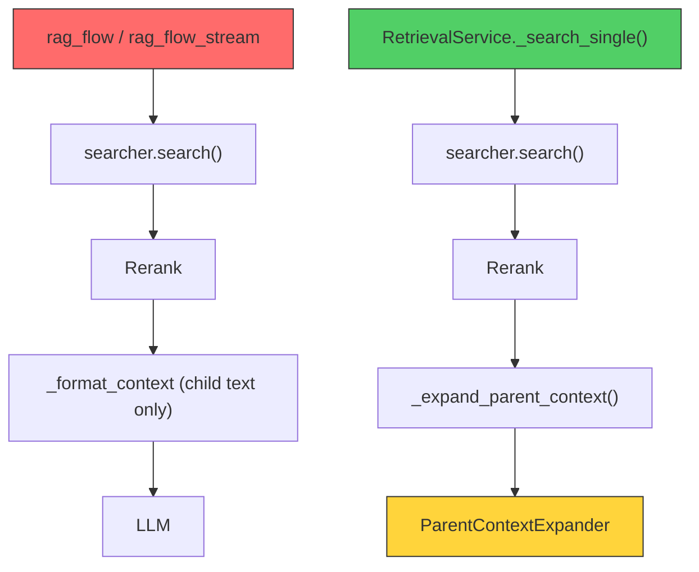
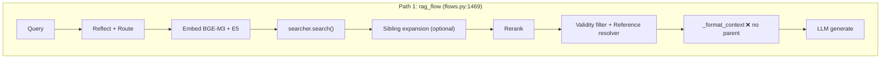
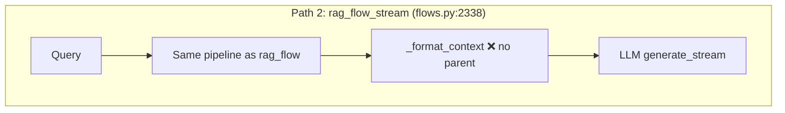
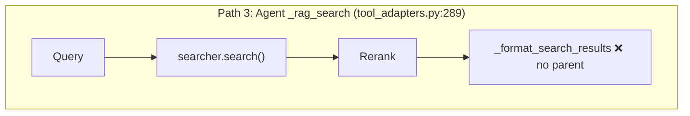
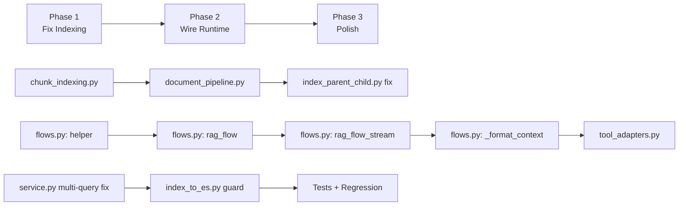

# Parent Chunk Context — Implementation Plan

## Tổng quan

Hệ thống hiện tại đã có đầy đủ cơ sở hạ tầng cho parent context expansion, nhưng **chưa hoạt động end-to-end** do 3 vấn đề chính:

1. **Indexing**: Parent chunks bị skip khỏi Qdrant → `ParentContextExpander` không thể fetch parent
2. **Wiring**: `rag_flow` / `rag_flow_stream` / `_rag_search` gọi `searcher.search()` trực tiếp, bypass hoàn toàn `RetrievalService` (nơi duy nhất có parent expansion)
3. **Formatting**: `_format_context` chỉ dùng `doc["text"]`, hoàn toàn bỏ qua `parent_context` / `parent_title`

> [!IMPORTANT]
> **Kiến trúc best-practice đã đúng**: Search children → Rerank children → Expand parent AFTER rerank → Format context with parent. `RetrievalService` đã implement đúng thứ tự này, chỉ cần wire nó vào runtime flows.

---

## Phân tích hiện trạng chi tiết

### Kiến trúc hiện tại



**Đỏ**: Flow đang dùng (không có parent). **Xanh**: Flow có parent nhưng không được gọi.

### Bugs phát hiện

| Bug | File | Mức độ |
|-----|------|--------|
| Parent chunks không tồn tại trong Qdrant | [document_pipeline.py:550](file:///D:/GR/src/RAG_v2/pipeline/document_pipeline.py#L550) | 🔴 CRITICAL |
| `parent_id` = UUID4 string, nhưng Qdrant point ID = UUID5 từ MongoDB ObjectId | [document_pipeline.py:416](file:///D:/GR/src/RAG_v2/pipeline/document_pipeline.py#L416) vs [recursive_chunker.py:1146](file:///D:/GR/src/RAG_v2/chunking/chunker/recursive_chunker.py#L1146) | 🔴 CRITICAL |
| `index_parent_child.py` dùng `settings.es_host` (không tồn tại) thay vì `settings.elasticsearch_host` | [index_parent_child.py:236-242](file:///D:/GR/src/RAG_v2/scripts/index_parent_child.py#L236) | 🟡 BUG |
| `_search_multi_query` không gọi `_expand_parent_context` | [service.py:382-439](file:///D:/GR/src/RAG_v2/retrieval/service.py#L382) | 🟡 GAP |
| `_format_context` không xử lý `parent_context` | [flows.py:1043-1104](file:///D:/GR/src/RAG_v2/pipeline/flows.py#L1043) | 🟡 GAP |

### Flow hiện tại (3 paths — tất cả thiếu parent)

````carousel

<!-- slide -->

<!-- slide -->

````

---

## User Review Required

> [!IMPORTANT]
> ### Quyết định 1: parent_id remapping strategy
> 
> **Vấn đề**: `RecursiveChunker` tạo parent ID là `uuid4()` → khi index vào Qdrant, pipeline dùng `uuid5(ObjectId)` làm point ID → **mismatch**. `ParentContextExpander` dùng `parent_id` để `qdrant.retrieve(ids=[parent_id])`, sẽ FAIL.
>
> **2 options**:
> 1. **Index-time remapping** (recommended): Trong `embed_and_index()`, index parent chunks trước, map `chunker_parent_id → qdrant_point_id`, rồi update children's `metadata.parent_id` trước khi index. Đơn giản, chỉ sửa 1 file.
> 2. **Chunker-time: dùng deterministic ID**: Sửa tất cả chunkers để dùng `uuid5(content_hash)` hoặc `readable_id` làm cả chunker ID và Qdrant point ID. Phức tạp hơn, sửa nhiều chunkers.

> [!IMPORTANT]
> ### Quyết định 2: Có nên migrate `rag_flow` sang dùng `RetrievalService` không?
> 
> **Option A**: Wire parent expansion trực tiếp vào `rag_flow` / `rag_flow_stream` / `_rag_search` bằng cách thêm 1 bước gọi `ParentContextExpander` sau rerank. Không thay đổi kiến trúc hiện tại.
> 
> **Option B**: Migrate `rag_flow` sang dùng `RetrievalService.search()` (đã có parent expansion). Sạch hơn nhưng refactor lớn, ảnh hưởng nhiều flow.
> 
> → **Recommend Option A** để minimize blast radius.

> [!WARNING]  
> ### Quyết định 3: Parent context format trong LLM prompt
> 
> Cần xác định cách inject parent text vào context. 3 options:
> 1. **Prepend parent trước child text**: `[Section context]\n{parent_text}\n\n[Chi tiết]\n{child_text}` — LLM thấy toàn cảnh rồi đến chi tiết
> 2. **Append parent sau child text**: `{child_text}\n\n[Ngữ cảnh mở rộng]\n{parent_text}` — LLM thấy evidence trước, context sau
> 3. **Chỉ thêm parent_title/hierarchy_path vào header** (không thêm full parent text): Tiết kiệm token, nhưng mất broader context
>
> → **Recommend Option 1** — best practice cho RAG: broader context → specific evidence.

---

## Open Questions

> [!NOTE]
> **Q1**: Với data đã tồn tại trong Qdrant (indexed bằng `index_parent_child.py`), parent chunks có đang tồn tại trong Qdrant không? Hay chỉ có children? Cần verify để biết có cần re-index hay không.

> [!NOTE]
> **Q2**: `HierarchicalLegalChunker` và `OlmOcrLegalChunker` dùng `readable_id` (e.g., `"parent_cI_a5"`) làm `parent_id`, khác với `RecursiveChunker` dùng UUID. Cần verify data hiện tại dùng chunker nào cho từng collection để biết cần fix gì.

> [!NOTE]
> **Q3**: `parent_max_chars = 3000` hiện tại. Với `context_total_char_budget = 12000` và `top_k = 5`, mỗi doc trung bình 2400 chars. Nếu prepend parent (3000 chars), budget sẽ bị hết rất nhanh. Có muốn giảm `parent_max_chars` xuống ~1000-1500 không?

---

## Proposed Changes

### Phase 1: Fix Indexing — Parent chunks phải có trong Qdrant

---

#### [MODIFY] [chunk_indexing.py](file:///D:/GR/src/RAG_v2/utils/chunk_indexing.py)

Split policy thành 2 functions: `is_search_indexable()` (for ES/BM25 — skip parent) vs `is_qdrant_storable()` (for Qdrant — keep parent for lookup):

```python
_NON_INDEXABLE_LEVELS = {"parent", "header"}
_NON_SEARCHABLE_LEVELS = {"parent", "header"}  # ES: skip both
_NON_QDRANT_STORABLE_LEVELS = {"header"}        # Qdrant: skip header only, keep parent

def is_indexable_chunk(chunk):  # backward compat — means "ES-indexable"
    ...  # unchanged

def is_qdrant_storable(chunk):  # NEW — parent is stored in Qdrant but excluded by search filter
    metadata = chunk.get("metadata") or {}
    level = str(metadata.get("level", "")).strip().lower()
    return level not in _NON_QDRANT_STORABLE_LEVELS
```

---

#### [MODIFY] [document_pipeline.py](file:///D:/GR/src/RAG_v2/pipeline/document_pipeline.py)

**`embed_and_index()`** (~line 518-600): Major changes:

1. Split chunks into `es_chunks` (indexable for BM25) and `qdrant_chunks` (parent + child)
2. **Index parent chunks to Qdrant** with proper ID mapping
3. **Remap `parent_id`** in child chunks to Qdrant point IDs
4. Parent chunks in Qdrant get dummy vectors (zero vectors or actual embeddings — TBD)

```diff
- indexable_chunks = [c for c in chunks if is_indexable_chunk(c)]
- chunks = indexable_chunks
+ from utils.chunk_indexing import is_indexable_chunk, is_qdrant_storable
+
+ # ES: only child/recursive/appendix
+ es_chunks = [c for c in chunks if is_indexable_chunk(c)]
+ # Qdrant: parent + child (exclude header only)
+ qdrant_chunks = [c for c in chunks if is_qdrant_storable(c)]
+
+ # Build parent_id remapping: chunker_uuid → qdrant_uuid
+ parent_id_map = {}
+ for c in qdrant_chunks:
+     meta = c.get("metadata", {})
+     if meta.get("level") == "parent":
+         chunker_id = ... # original uuid4 from chunker
+         qdrant_id = c.get("qdrant_id", ...)
+         parent_id_map[chunker_id] = qdrant_id
+
+ # Remap children's parent_id
+ for c in qdrant_chunks:
+     meta = c.get("metadata", {})
+     old_pid = meta.get("parent_id")
+     if old_pid and old_pid in parent_id_map:
+         meta["parent_id"] = parent_id_map[old_pid]
```

> [!WARNING]
> Parent chunks **phải có vectors** để Qdrant accept chúng vào collection (dual-vector `bge_m3` + `e5` config). Ta sẽ embed parent content bình thường — cost vài giây thêm nhưng đảm bảo tương thích. Search filter `must_not level=parent` đã ngăn parent xuất hiện trong kết quả search.

---

#### [MODIFY] [index_parent_child.py](file:///D:/GR/src/RAG_v2/scripts/index_parent_child.py)

Fix ES settings bug:

```diff
- es_store = ElasticsearchStore(
-     host=settings.es_host,
-     port=settings.es_port,
+ es_store = ElasticsearchStore(
+     host=settings.elasticsearch_host,
+     port=settings.elasticsearch_port,
```

Add parent_id remapping logic (same as document_pipeline).

Skip parent chunks when indexing to ES.

---

### Phase 2: Wire Parent Expansion vào Runtime Flows

---

#### [MODIFY] [flows.py](file:///D:/GR/src/RAG_v2/pipeline/flows.py)

**Thêm parent expansion function** (new helper, ~30 lines):

```python
def _expand_parent_context_if_enabled(
    reranked: List[Dict[str, Any]],
    cfg: Dict[str, Any],
) -> List[Dict[str, Any]]:
    """Expand child results with parent chunk context (after rerank)."""
    if not _cfg_bool(cfg, "parent_context_enabled", True):
        return reranked
    if not reranked:
        return reranked
    
    # Check if any result has parent_id
    has_parent = any(
        r.get("metadata", {}).get("parent_id")
        and r.get("metadata", {}).get("level") == "child"
        for r in reranked
    )
    if not has_parent:
        return reranked
    
    try:
        from retrieval.parent_context import ParentContextExpander
        settings = Settings()
        expander = ParentContextExpander(
            qdrant_host=settings.qdrant_host,
            qdrant_port=settings.qdrant_port,
            max_parent_chars=_cfg_int(cfg, "parent_max_chars", 3000),
        )
        
        # Group by collection for batch fetch
        collection_groups: Dict[str, List[int]] = {}
        for idx, r in enumerate(reranked):
            coll = r.get("collection", "") or r.get("metadata", {}).get("collection", "")
            if coll:
                collection_groups.setdefault(coll, []).append(idx)
        
        for coll, indices in collection_groups.items():
            group = [reranked[i] for i in indices]
            expanded = expander.expand_with_parents(group, coll)
            for i, exp in zip(indices, expanded):
                reranked[i] = exp
    except Exception:
        logger.warning("Parent context expansion failed", exc_info=True)
    
    return reranked
```

**Insert vào `rag_flow()` sau rerank** (~line 1983, after validity filter & score cliff):

```diff
  # 5.3 Per-collection Score Cliff (B1)
  if _cfg_bool(cfg, "score_cliff_enabled", False):
      ...

+ # 5.4 Parent context expansion (C5) — after rerank, before context formatting
+ parent_t0 = time.perf_counter()
+ reranked = _expand_parent_context_if_enabled(reranked, cfg)
+ timings_ms["parent_expansion"] = _elapsed_ms(parent_t0)

  # ── LLM Response Cache Check (Phase 2) ────────────────
```

**Same insert vào `rag_flow_stream()`** (mirrored position).

---

#### [MODIFY] [_format_context()](file:///D:/GR/src/RAG_v2/pipeline/flows.py#L1043)

Thêm parent context vào formatted output:

```diff
  text = str(doc.get("text", "") or "").strip()
+ # C5: Prepend parent context for broader section context
+ parent_ctx = (meta.get("parent_context") or "").strip()
+ parent_title = (meta.get("parent_title") or "").strip()
+ if parent_ctx:
+     parent_header = f"[Ngữ cảnh section: {parent_title}]" if parent_title else "[Ngữ cảnh section]"
+     text = f"{parent_header}\n{parent_ctx}\n\n[Chi tiết]\n{text}"

  effective_limit = (
      sibling_per_doc_limit if doc.get("_expansion_source") else per_doc_char_limit
  )
```

> [!IMPORTANT]
> `parent_ctx` đã được truncate bởi `ParentContextExpander` (`max_parent_chars=3000`). Nhưng combined `parent_ctx + child_text` sẽ bị cắt bởi `per_doc_char_limit` (2000 chars). Cần tăng `per_doc_char_limit` hoặc giảm `parent_max_chars` để cả hai vừa budget.
> 
> **Proposal**: Khi có parent context, effective per-doc limit = `per_doc_char_limit + parent_max_chars` (bounded bởi total budget). Hoặc giảm `parent_max_chars` xuống 1000.

---

#### [MODIFY] [tool_adapters.py](file:///D:/GR/src/RAG_v2/agent/tool_adapters.py)

**`_rag_search()`** (~line 369-377): Thêm parent expansion sau rerank:

```diff
  if runtime.reranker is not None and not skip_rerank:
      with _RERANKER_LOCK:
          results = runtime.reranker.rerank(...)
  else:
      results = results[:effective_top_k]

+ # Parent context expansion
+ if getattr(runtime.settings, "parent_context_enabled", True):
+     results = _expand_parent_for_agent(results, qdrant_collection, runtime)
```

**`_format_search_results()`** (~line 679): Thêm parent context vào agent output:

```diff
  content = str(item.get("text") or item.get("content") or "")
+ # Include parent context for agent
+ parent_ctx = (metadata.get("parent_context") or "").strip()
+ if parent_ctx:
+     parent_ctx_short = parent_ctx[:500] + "..." if len(parent_ctx) > 500 else parent_ctx
+     content = f"[Section context] {parent_ctx_short}\n\n[Detail] {content}"
```

---

### Phase 3: Polish — Config, monitoring, backward compat

---

#### [MODIFY] [settings.py](file:///D:/GR/src/RAG_v2/config/settings.py)

Không cần thêm setting mới — `parent_context_enabled` và `parent_max_chars` đã có.

Có thể thêm:
```python
parent_context_agent_max_chars: int = 500  # Reduced for agent (tight budget)
```

---

#### [MODIFY] [service.py](file:///D:/GR/src/RAG_v2/retrieval/service.py)

Fix `_search_multi_query` để cũng gọi parent expansion:

```diff
  if rerank and self.reranker is not None:
      all_results = self.reranker.rerank(...)
  else:
      all_results.sort(...)

+ # Parent expansion (same as _search_single)
+ if self.settings.parent_context_enabled:
+     all_results = self._expand_parent_context(all_results, active_collections)

  return all_results
```

---

#### [MODIFY] [index_to_es.py](file:///D:/GR/src/RAG_v2/scripts/index_to_es.py)

Thêm parent/header skip khi reindex Qdrant → ES:

```diff
  for point in scroll_all_points(...):
+     level = (point.payload or {}).get("level", "")
+     if level in ("parent", "header"):
+         skipped += 1
+         continue
      ...
```

---

## File Impact Summary

| File | Risk | Reason |
|------|------|--------|
| [flows.py](file:///D:/GR/src/RAG_v2/pipeline/flows.py) | 🔴 CRITICAL | `rag_flow` + `rag_flow_stream` + `_format_context` → affects chat, streaming, eval |
| [document_pipeline.py](file:///D:/GR/src/RAG_v2/pipeline/document_pipeline.py) | 🟡 MEDIUM | `embed_and_index` → affects admin upload only |
| [chunk_indexing.py](file:///D:/GR/src/RAG_v2/utils/chunk_indexing.py) | 🟢 LOW | Shared policy, additive change |
| [tool_adapters.py](file:///D:/GR/src/RAG_v2/agent/tool_adapters.py) | 🟡 MEDIUM | `_rag_search` + `_format_search_results` → affects agent |
| [service.py](file:///D:/GR/src/RAG_v2/retrieval/service.py) | 🟢 LOW | Fix multi-query gap, not on critical path |
| [index_parent_child.py](file:///D:/GR/src/RAG_v2/scripts/index_parent_child.py) | 🟢 LOW | Bug fix, offline script |
| [index_to_es.py](file:///D:/GR/src/RAG_v2/scripts/index_to_es.py) | 🟢 LOW | Safety guard, offline script |

---

## Verification Plan

### Automated Tests

```bash
# 1. Unit: chunk_indexing policy split
pytest tests/test_chunk_indexing_policy.py -v

# 2. Unit: parent_id remapping in document_pipeline
pytest tests/test_document_pipeline.py -v -k parent

# 3. Unit: ParentContextExpander with mock Qdrant
pytest tests/test_parent_context.py -v

# 4. Integration: rag_flow includes parent context after rerank
pytest tests/test_flows.py -v -k parent
```

### Manual Verification

1. **Index a test document** via admin upload → verify parent chunks exist in Qdrant (`qdrant-client` scroll + filter `level=parent`)
2. **Verify parent_id remapping**: Child's `metadata.parent_id` matches actual Qdrant point ID of its parent
3. **Verify search exclusion**: `searcher.search()` returns only children (parent filter still active)
4. **End-to-end**: Ask a question that requires broader context → verify LLM response cites section-level information
5. **Agent path**: Verify `_rag_search` tool response includes parent context snippet

### Regression

- Run existing conversation regression queries before/after
- Compare answer quality for CTDT/quydinh parent-child cases
- Verify `context_chars` in timings doesn't exceed budget
- Verify streaming responses still work correctly

---

## Execution Order


