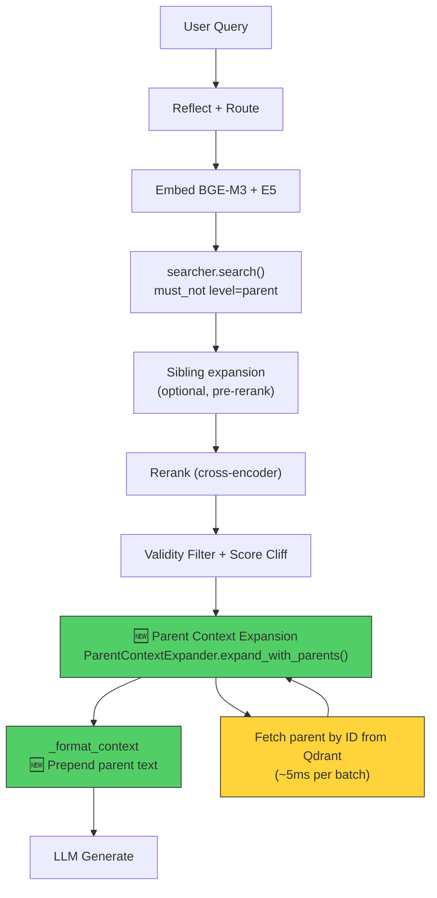

# Parent Chunk Context — Final Implementation Plan

## Đánh giá Plan Gốc

### ✅ Đúng
1. **Bugs xác nhận chính xác**: Parent chunks bị `is_indexable_chunk()` filter ra khỏi Qdrant → ParentContextExpander fail
2. **ID mismatch xác nhận**: `RecursiveChunker` dùng `uuid4()` làm parent ID, nhưng `document_pipeline.py` dùng `uuid5(NAMESPACE_OID, MongoDB_ObjectId)` → parent_id reference trong child metadata sẽ không khớp Qdrant point ID
3. **Wiring gap xác nhận**: `rag_flow` / `rag_flow_stream` / `_rag_search` đều bypass `RetrievalService`, gọi `searcher.search()` trực tiếp → không có parent expansion
4. **`_format_context` gap xác nhận**: Chỉ dùng `doc["text"]`, bỏ qua `parent_context`
5. **`_search_multi_query` gap xác nhận**: Không gọi `_expand_parent_context` (khác `_search_single`)
6. **ES settings bug xác nhận**: `index_parent_child.py` dùng `settings.es_host` (không tồn tại), đúng là `settings.elasticsearch_host`

### ⚠️ Cần chỉnh sửa/bổ sung
1. **Plan gốc thiếu chi tiết** về việc `multi_collection_search.py` đã có `must_not level=parent` filter → parent chunks nếu được index sẽ KHÔNG ảnh hưởng search quality. Đây là điểm quan trọng — plan gốc không mention rõ.
2. **`index_parent_child.py`** dùng `chunk.id` (UUID4 từ chunker) làm Qdrant point ID **trực tiếp** → parent expansion sẽ work với script này. Nhưng `document_pipeline.py` tạo lại ID bằng `uuid5` → 2 system indexing khác nhau.
3. **Budget conflict** cần giải quyết rõ ràng hơn: `per_doc_char_limit=2000` + `parent_max_chars=3000` = 5000 chars/doc >> budget trung bình.

### ❌ Sai/Không cần
1. **Plan gốc suggest index_to_es.py cần parent skip** — nhưng script `index_parent_child.py` index CẢ parent+child vào Qdrant (đúng) và cả ES. Thực tế ES cũng cần filter khi reindex, nhưng đây là low priority.

---

## Quyết định Kiến trúc (Recommended)

### Quyết định 1: ID Strategy → **Index-time remapping** trong `document_pipeline.py`

**Lý do**: 
- `index_parent_child.py` (offline script) dùng `chunk.id` trực tiếp làm Qdrant point ID → parent expansion work ngay
- `document_pipeline.py` (admin upload) dùng `uuid5(NAMESPACE_OID, MongoDB_ObjectId)` → cần remap
- Chỉ sửa 1 file (`document_pipeline.py`), không cần đổi chunker logic

**Cụ thể**: Khi index parent chunks, lưu mapping `chunker_parent_id → qdrant_point_id`, sau đó update `metadata.parent_id` trong children trước khi index.

### Quyết định 2: Wiring strategy → **Option A** — inject `ParentContextExpander` trực tiếp vào `rag_flow`/`rag_flow_stream`/`_rag_search`

**Lý do**:
- Minimize blast radius — không refactor kiến trúc
- `RetrievalService` hiện KHÔNG được dùng bởi runtime flows (chỉ dùng cho eval/testing)
- Thêm 1 bước nhỏ sau rerank, trước format context — đúng best practice "search children → rerank → expand parent → format"

### Quyết định 3: Parent context format → **Option 1** — Prepend parent trước child

**Lý do**: RAG best practice — broader context trước → LLM hiểu section overview → chi tiết evidence sau

### Quyết định 4: Budget → Giảm `parent_max_chars` xuống **1500**

**Lý do**:
- `context_total_char_budget = 12000`, `top_k = 5` → avg 2400 chars/doc
- Với parent prepend: `parent(1500) + child(text) ≤ per_doc_char_limit(2000+1500=3500)`
- 5 docs × 3500 = 17500 > 12000 → total budget sẽ cắt tự nhiên, nhưng vẫn đủ 3-4 docs có parent
- `context_total_char_budget_with_expansion: 16000` đã có sẵn cho case expansion

---

## Implementation Plan — Thứ tự thực hiện

### Phase 1: Fix Indexing (parent chunks phải tồn tại trong Qdrant)

#### 1.1 [MODIFY] `utils/chunk_indexing.py` — Thêm `is_qdrant_storable()`

```python
"""Shared chunk indexing policy for retrieval stores."""

from __future__ import annotations

from typing import Any, Mapping


_NON_INDEXABLE_LEVELS = {"parent", "header"}
_INDEXABLE_LEVELS = {"child", "recursive", "appendix"}

# Qdrant: keep parent for ID-based fetch, skip header only
_NON_QDRANT_STORABLE_LEVELS = {"header"}


def is_indexable_chunk(chunk: Mapping[str, Any]) -> bool:
    """Return True when a chunk should be embedded and indexed for SEARCH (ES + Qdrant search).

    Parent/header chunks are excluded from search index — they only serve as
    context containers fetched by ID after rerank.
    """
    metadata = chunk.get("metadata") or {}
    if not isinstance(metadata, Mapping):
        return True

    level = metadata.get("level")
    if level is None:
        return True

    normalized = str(level).strip().lower()
    if normalized in _NON_INDEXABLE_LEVELS:
        return False
    if normalized in _INDEXABLE_LEVELS:
        return True
    return True


def is_qdrant_storable(chunk: Mapping[str, Any]) -> bool:
    """Return True when a chunk should be stored in Qdrant (for search OR for ID-based fetch).

    Parent chunks ARE stored in Qdrant (needed for ParentContextExpander.retrieve())
    but excluded from search results via `must_not level=parent` filter in MultiCollectionSearch.
    Only header chunks are fully excluded.
    """
    metadata = chunk.get("metadata") or {}
    if not isinstance(metadata, Mapping):
        return True

    level = metadata.get("level")
    if level is None:
        return True

    normalized = str(level).strip().lower()
    return normalized not in _NON_QDRANT_STORABLE_LEVELS
```

#### 1.2 [MODIFY] `pipeline/document_pipeline.py` — `embed_and_index()`

Thay đổi logic:
1. **ES**: chỉ index `is_indexable_chunk()` (child/recursive/appendix) — không đổi
2. **Qdrant**: index `is_qdrant_storable()` (parent + child, skip header only)
3. **Parent ID remapping**: map `chunker_uuid4_parent_id → qdrant_uuid5_point_id`

```python
async def embed_and_index(self, doc_id: str, db: AsyncIOMotorDatabase) -> None:
    # ... (unchanged preamble: get doc, update status, load chunks) ...

    from utils.chunk_indexing import is_indexable_chunk, is_qdrant_storable

    # --- Separate ES vs Qdrant chunk sets ---
    # ES: only child/recursive/appendix (searchable via BM25)
    es_chunks = [c for c in chunks if is_indexable_chunk(c)]
    # Qdrant: parent + child (parent stored for ID-based expansion, excluded from search by filter)
    qdrant_chunks = [c for c in chunks if is_qdrant_storable(c)]

    skipped_chunks = len(chunks) - len(qdrant_chunks)
    if skipped_chunks:
        logger.info(
            "Skipping %d non-storable header chunk(s) for document %s.",
            skipped_chunks, doc_id,
        )

    if not qdrant_chunks:
        raise ValueError("No indexable chunks found in database")

    # --- Build parent_id remapping ---
    # RecursiveChunker assigns uuid4() as parent.id
    # Qdrant uses uuid5(NAMESPACE_OID, MongoDB_ObjectId) as point ID
    # We need to map children's parent_id to the actual Qdrant point ID of their parent
    parent_id_remap: Dict[str, str] = {}
    for c in qdrant_chunks:
        meta = c.get("metadata", {})
        if str(meta.get("level", "")).strip().lower() == "parent":
            # Original chunker-generated ID (uuid4)
            chunker_id = c.get("chunker_id") or c.get("original_id") or str(c.get("_id", ""))
            # Qdrant point ID (uuid5 or pre-generated)
            qdrant_id = c.get("qdrant_id", str(uuid.uuid5(uuid.NAMESPACE_OID, str(c["_id"]))))
            # Also check if the chunk has an "id" field from the chunker stored separately
            raw_id = str(meta.get("chunker_parent_id", "")) or ""
            if raw_id:
                parent_id_remap[raw_id] = qdrant_id
            # Fallback: use the chunk's own content-derived ID if stored
            parent_id_remap[str(c["_id"])] = qdrant_id

    # Remap children's metadata.parent_id to point at actual Qdrant IDs
    for c in qdrant_chunks:
        meta = c.get("metadata", {})
        old_pid = meta.get("parent_id")
        if old_pid and old_pid in parent_id_remap:
            meta["parent_id"] = parent_id_remap[old_pid]

    # --- Embed ALL qdrant_chunks (parent + child) ---
    texts = [c["content"] for c in qdrant_chunks]
    metadatas = [c.get("metadata", {}) for c in qdrant_chunks]
    ids = [c.get("qdrant_id", str(uuid.uuid5(uuid.NAMESPACE_OID, str(c["_id"])))) for c in qdrant_chunks]

    bge_vectors = bge_embedder.embed_documents(texts)
    e5_vectors = e5_embedder.embed_documents(texts)

    # Index ALL into Qdrant (parent excluded from search by must_not filter)
    qdrant_store.index_documents(
        texts=texts,
        bge_m3_vectors=bge_vectors,
        e5_vectors=e5_vectors,
        metadatas=metadatas,
        ids=ids,
    )

    # Index ONLY searchable chunks into ES
    es_texts = [c["content"] for c in es_chunks]
    es_metadatas = [c.get("metadata", {}) for c in es_chunks]
    es_ids = [c.get("qdrant_id", str(uuid.uuid5(uuid.NAMESPACE_OID, str(c["_id"])))) for c in es_chunks]

    es_store.index_documents(
        texts=es_texts,
        metadatas=es_metadatas,
        ids=es_ids,
    )
```

> **QUAN TRỌNG**: Cần verify rằng chunker lưu parent ID gốc vào MongoDB metadata. Nếu MongoDB chunks đã mất `chunker_parent_id` reference, cần modify chunking pipeline để persist nó.

#### 1.3 [MODIFY] `pipeline/document_pipeline.py` — Lưu `chunker_parent_id` khi store chunks

Trong hàm store chunks vào MongoDB (trước `embed_and_index`), thêm logic:

```python
# When storing chunks from chunker to MongoDB, preserve the original
# chunker-assigned parent_id so embed_and_index can remap it.
for idx, ch in enumerate(raw_chunks):
    meta = ch.get("metadata", {})
    level = str(meta.get("level", "")).strip().lower()
    if level == "parent":
        # Store original chunker ID for remapping later
        meta["chunker_parent_id"] = ch.get("id", "")
    elif meta.get("parent_id"):
        # Children reference parent by chunker ID — store for remapping
        # (parent_id is already in metadata from chunker)
        pass  # parent_id stays as-is, will be remapped in embed_and_index
```

#### 1.4 [MODIFY] `scripts/index_parent_child.py` — Fix ES settings

```diff
- es_store = ElasticsearchStore(
-     host=settings.es_host,
-     port=settings.es_port,
+ es_store = ElasticsearchStore(
+     host=settings.elasticsearch_host,
+     port=settings.elasticsearch_port,
      index_name=index_name,
  )
```

> **Note**: `index_parent_child.py` dùng `chunk.id` (UUID4 từ chunker) trực tiếp làm Qdrant point ID → parent expansion đã work cho path này. Chỉ `document_pipeline.py` cần remapping.

---

### Phase 2: Wire Parent Expansion vào Runtime Flows

#### 2.1 [MODIFY] `pipeline/flows.py` — Thêm helper function

Thêm function mới (đặt gần `_expand_with_siblings_pre_rerank`):

```python
def _expand_parent_context_post_rerank(
    reranked: List[Dict[str, Any]],
    cfg: Dict[str, Any],
) -> List[Dict[str, Any]]:
    """Expand child results with parent chunk context (AFTER rerank).
    
    Best practice order: Search children → Rerank → Expand parent → Format context.
    Parent expansion is a READ operation (fetch by ID), not a search operation.
    """
    if not _cfg_bool(cfg, "parent_context_enabled", True):
        return reranked
    if not reranked:
        return reranked

    # Quick check: any child with parent_id?
    has_parent = any(
        r.get("metadata", {}).get("parent_id")
        and str(r.get("metadata", {}).get("level", "child")).strip().lower() == "child"
        for r in reranked
    )
    if not has_parent:
        return reranked

    try:
        from retrieval.parent_context import ParentContextExpander
        from config.settings import Settings

        settings = Settings()
        expander = ParentContextExpander(
            qdrant_host=settings.qdrant_host,
            qdrant_port=settings.qdrant_port,
            max_parent_chars=_cfg_int(cfg, "parent_max_chars", 1500),
        )

        # Group by collection for batch fetch
        collection_groups: Dict[str, List[int]] = {}
        for idx, r in enumerate(reranked):
            coll = (
                r.get("collection", "")
                or r.get("metadata", {}).get("collection", "")
            )
            if coll:
                collection_groups.setdefault(coll, []).append(idx)

        for coll, indices in collection_groups.items():
            group = [reranked[i] for i in indices]
            expanded = expander.expand_with_parents(group, coll)
            for i, exp in zip(indices, expanded):
                reranked[i] = exp

    except Exception:
        logger.warning("Parent context expansion failed, continuing without parent", exc_info=True)

    return reranked
```

#### 2.2 [MODIFY] `pipeline/flows.py` — Insert vào `rag_flow()` sau Score Cliff (step 5.3)

```python
    # 5.3 Per-collection Score Cliff (B1)
    if _cfg_bool(cfg, "score_cliff_enabled", False):
        pre_cliff_count = len(reranked)
        reranked = _apply_score_cliff_per_collection(reranked)
        cliff_dropped = pre_cliff_count - len(reranked)
        timings_ms["cliff_triggered"] = 1.0 if cliff_dropped > 0 else 0.0
        timings_ms["cliff_dropped_count"] = float(cliff_dropped)

    # 5.4 Parent context expansion (C5) — fetch parent content by ID after rerank
    parent_t0 = time.perf_counter()
    reranked = _expand_parent_context_post_rerank(reranked, cfg)
    timings_ms["parent_expansion"] = _elapsed_ms(parent_t0)
```

#### 2.3 [MODIFY] `pipeline/flows.py` — Same insert vào `rag_flow_stream()` (mirror position sau 5.3)

Exact same code block after the score cliff section in `rag_flow_stream`.

#### 2.4 [MODIFY] `pipeline/flows.py` — `_format_context()` thêm parent text

```python
    text = str(doc.get("text", "") or "").strip()
    
    # C5: Prepend parent context for broader section context
    parent_ctx = str((meta.get("parent_context") or "")).strip()
    parent_title = str((meta.get("parent_title") or meta.get("parent_section_h2") or "")).strip()
    if parent_ctx:
        parent_header = f"[Ngữ cảnh section: {parent_title}]" if parent_title else "[Ngữ cảnh section]"
        text = f"{parent_header}\n{parent_ctx}\n\n[Chi tiết]\n{text}"
```

**Budget handling**: Khi có parent context, `text` sẽ dài hơn → bị cắt bởi `effective_limit`. Để cả parent + child vừa budget, tăng `effective_limit` khi có parent:

```python
    effective_limit = (
        sibling_per_doc_limit if doc.get("_expansion_source") else per_doc_char_limit
    )
    # When parent context is prepended, allow more chars per doc
    if parent_ctx:
        effective_limit = min(effective_limit + 1500, per_doc_char_limit + 1500)
    if len(text) > effective_limit:
        text = text[:effective_limit] + "\u2026"
```

> `total_char_budget` vẫn là hard cap cuối cùng — nếu tổng vượt 12000/16000, loop sẽ break.

#### 2.5 [MODIFY] `agent/tool_adapters.py` — `_rag_search()` thêm parent expansion

Sau rerank, trước `_format_search_results`:

```python
    if runtime.reranker is not None and not skip_rerank:
        with _RERANKER_LOCK:
            results = runtime.reranker.rerank(...)
    else:
        results = results[:effective_top_k]

    # Parent context expansion for agent
    if getattr(runtime.settings, "parent_context_enabled", True):
        try:
            from retrieval.parent_context import ParentContextExpander
            expander = ParentContextExpander(
                qdrant_host=runtime.settings.qdrant_host,
                qdrant_port=runtime.settings.qdrant_port,
                max_parent_chars=500,  # Agent has tighter token budget
            )
            results = expander.expand_with_parents(results, qdrant_collection)
        except Exception:
            pass  # Graceful degradation — continue without parent
```

#### 2.6 [MODIFY] `agent/tool_adapters.py` — `_format_search_results()` include parent context

```python
    content = " ".join(content.split())
    
    # Include parent section context for agent
    parent_ctx = str((metadata.get("parent_context") or "")).strip()
    if parent_ctx:
        parent_short = parent_ctx[:300] + "..." if len(parent_ctx) > 300 else parent_ctx
        content = f"[Section] {parent_short}\n[Detail] {content}"
    
    if len(content) > char_limit:
        content = content[:char_limit].rstrip() + "..."
```

---

### Phase 3: Polish & Backward Compatibility

#### 3.1 [MODIFY] `retrieval/service.py` — Fix `_search_multi_query()` missing parent expansion

```python
    # After rerank in _search_multi_query:
    if rerank and self.reranker is not None:
        all_results = self.reranker.rerank(...)
    else:
        all_results.sort(...)
        all_results = all_results[:effective_top_k]

    # Parent expansion (same as _search_single)
    if self.settings.parent_context_enabled:
        all_results = self._expand_parent_context(all_results, active_collections)

    return all_results
```

#### 3.2 [MODIFY] `config/settings.py` — Giảm `parent_max_chars`

```diff
- parent_max_chars: int = 3000
+ parent_max_chars: int = 1500
```

Thêm:
```python
parent_max_chars_agent: int = 500  # Reduced for agent (tighter token budget)
```

#### 3.3 [OPTIONAL] `scripts/index_to_es.py` — Guard against parent leak vào ES khi reindex

```python
# When reindexing from Qdrant → ES, skip parent/header chunks
level = (point.payload or {}).get("level", "")
if level in ("parent", "header"):
    skipped += 1
    continue
```

---

## Execution Flow Sau Implementation



---

## Verify Checklist

### Pre-implementation Verification
- [ ] Confirm existing data in Qdrant: do parent chunks exist for `ctdt`/`quydinh` collections? (They should if indexed via `index_parent_child.py`)
- [ ] Confirm `metadata.parent_id` in children matches actual Qdrant point IDs for script-indexed data
- [ ] Confirm `must_not level=parent` filter is active in `multi_collection_search.py` (✅ confirmed)

### Post-implementation Tests
```bash
# Unit tests
pytest tests/test_chunk_indexing_policy.py -v
pytest tests/test_parent_context.py -v

# Integration: verify parent expansion in rag_flow
pytest test_retrieval.py -v -k parent

# Regression: existing queries still work
pytest test_retrieval.py -v
```

### Manual Verification
1. **Qdrant scroll**: `qdrant.scroll(collection="ctdt", filter={"must": [{"key": "level", "match": {"value": "parent"}}]})` → should return parent chunks
2. **Parent ID check**: Pick a child chunk, get `metadata.parent_id`, `qdrant.retrieve(ids=[parent_id])` → should return the parent
3. **End-to-end**: Query requiring section context → verify `parent_context` in timings and LLM response
4. **Budget check**: Verify `context_chars` in timings doesn't routinely exceed `total_char_budget`
5. **Latency check**: Parent expansion should add < 20ms (single Qdrant retrieve call, no embedding)

---

## Risk Assessment

| Change | Risk | Mitigation |
|--------|------|------------|
| `_format_context` thêm parent text | 🔴 HIGH — affects ALL chat responses | Feature flag `parent_context_enabled`, graceful fallback |
| `embed_and_index` split ES/Qdrant | 🟡 MEDIUM — affects admin upload | Only new uploads affected, existing data unchanged |
| `rag_flow` thêm expansion step | 🟡 MEDIUM — thêm 1 network call | Timeout 2s, graceful degradation on failure |
| `chunk_indexing.py` new function | 🟢 LOW — additive, backward compat | Old `is_indexable_chunk` unchanged |
| `tool_adapters.py` agent expansion | 🟢 LOW — agent path isolated | try/except, 500 char limit |
| `settings.py` reduce parent_max_chars | 🟢 LOW — config only | Can increase back via env var |

---

## Key Differences vs Plan Gốc

| Aspect | Plan Gốc | Plan Cuối |
|--------|----------|-----------|
| Parent budget | 3000 chars | **1500 chars** (avoid budget overflow) |
| Agent parent budget | Same as main | **500 chars** (tighter token limit) |
| `_format_context` budget | Propose `per_doc_char_limit + parent_max_chars` | **`effective_limit + 1500`**, capped by `total_char_budget` |
| Search filter | Mentioned "đã ngăn parent" | **Confirmed code** at `multi_collection_search.py:377-393` |
| Singleton vs new instance | Plan gốc khởi tạo Settings() mỗi lần | **Cache ParentContextExpander** nếu cần (Phase 3) |
| `index_parent_child.py` ES fix | Change `es_host` | Same + confirm `elasticsearch_host` exists in Settings |
| `document_pipeline.py` ID remap | Vague "chunker_id = ..." | **Explicit**: store `chunker_parent_id` in MongoDB metadata at chunk-store time |

---

## Implementation Priority

```
CRITICAL (blocks everything):
  1. chunk_indexing.py — is_qdrant_storable()
  2. document_pipeline.py — embed parents + ID remap

HIGH (enables feature):
  3. flows.py — _expand_parent_context_post_rerank helper
  4. flows.py — insert into rag_flow + rag_flow_stream
  5. flows.py — _format_context parent prepend

MEDIUM (completes feature):
  6. tool_adapters.py — agent path
  7. service.py — _search_multi_query fix
  8. settings.py — reduce parent_max_chars

LOW (nice-to-have):
  9. index_parent_child.py — ES settings fix
  10. index_to_es.py — parent skip guard
```
