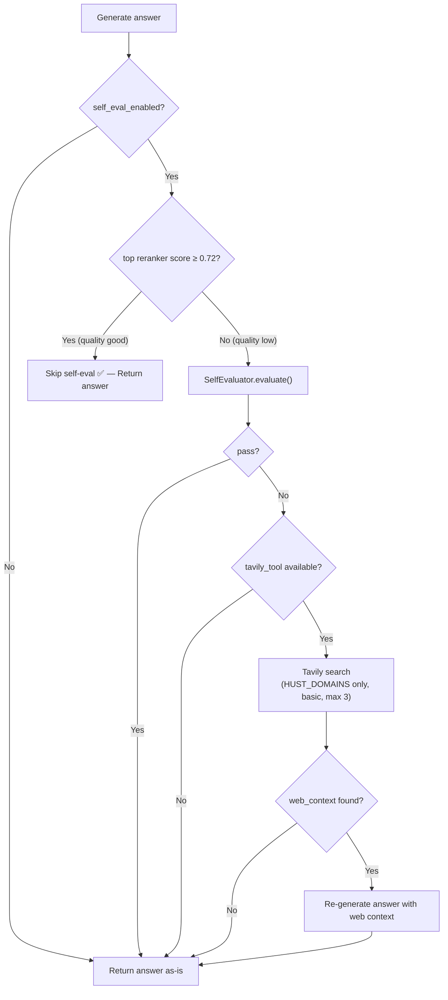
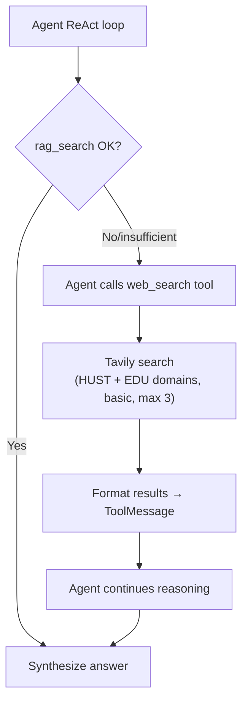

# Kích hoạt Tavily Web Search Fallback — Final Plan

## Bối cảnh

Hệ thống RAG v2 đã có code Tavily hoàn chỉnh nhưng **chưa bật**:

| Thành phần | File | Trạng thái |
|:---|:---|:---|
| `TavilySearchTool` wrapper | [tavily_search.py](file:///d:/GR/src/RAG_v2/tools/tavily_search.py) | ✅ Đã code (retry, rate-limit, format) |
| `RetrievalService` khởi tạo Tavily | [service.py](file:///d:/GR/src/RAG_v2/retrieval/service.py#L93-L97) | ✅ Tự tạo nếu key hợp lệ |
| `rag_flow` → self-eval → `_tavily_fallback` | [flows.py](file:///d:/GR/src/RAG_v2/pipeline/flows.py#L1209-L1257) | ✅ Code sẵn, gated bởi `self_evaluator is not None` + `tavily_tool is not None` |
| Agent `web_search` tool | [lc_tools.py](file:///d:/GR/src/RAG_v2/agent/lc_tools.py#L151-L159) | ✅ Đã bind vào LangGraph |
| Frontend trace hiển thị Tavily | [PipelineTrace.tsx](file:///d:/GR/src/RAG_v2/frontend/chat-companion/src/components/trace/PipelineTrace.tsx#L155) | ✅ Đã có UI |

### Decisions (User confirmed)
- **Self-eval**: Chỉ chạy khi **top reranker score < 0.72** (mặc định) — skip phần lớn queries đã tốt
- **Streaming path**: Không bật Tavily cho `/chat/stream` — giữ nguyên UX streaming
- **Include domains**: Dùng danh sách HUST cơ bản, sẽ bổ sung sau
- **Budget**: Free tier 1,000 credits/tháng chấp nhận được

---

## Proposed Changes

### TavilySearchTool — Domain filtering support

#### [MODIFY] [tavily_search.py](file:///d:/GR/src/RAG_v2/tools/tavily_search.py)

Thêm domain filtering constants + `include_domains`/`exclude_domains` params.

**Thêm constants domain sau `DEFAULT_MIN_INTERVAL` (line 19):**

```diff
 DEFAULT_MIN_INTERVAL = 1.0  # seconds between API calls
+
+# ─── Default Domain Whitelists ────────────────────────────────────────────────
+# Tier 1: nguồn chính thức HUST — dùng cho self-eval fallback (scope hẹp)
+HUST_DOMAINS: list[str] = [
+    "hust.edu.vn",
+    "sis.hust.edu.vn",
+    "ctt.hust.edu.vn",
+    "ctsv.hust.edu.vn",
+    "soict.hust.edu.vn",
+]
+
+# Tier 2: nguồn giáo dục VN mở rộng — dùng thêm cho agent web_search
+EDU_DOMAINS: list[str] = [
+    "moet.gov.vn",
+    "vnexpress.net",
+    "tuoitre.vn",
+    "thanhnien.vn",
+    "dantri.com.vn",
+]
```

**Cập nhật `__init__` — thêm `default_include_domains` (line 33–45):**

```diff
     def __init__(
         self,
         api_key: Optional[str] = None,
         max_results: int = DEFAULT_MAX_RESULTS,
         max_retries: int = DEFAULT_MAX_RETRIES,
         min_retry_delay: float = DEFAULT_MIN_RETRY_DELAY,
+        default_include_domains: Optional[List[str]] = None,
     ) -> None:
         resolved_key = api_key or os.environ.get("TAVILY_API_KEY", "")
         self._client = TavilyClient(api_key=resolved_key)
         self.max_results = max_results
         self.max_retries = max_retries
         self.min_retry_delay = min_retry_delay
         self._last_call_time: float = 0.0
+        self.default_include_domains = default_include_domains
```

**Cập nhật `search()` — thêm domain params (line 51–94):**

```diff
     def search(
         self,
         query: str,
         max_results: Optional[int] = None,
         search_depth: Literal["advanced", "basic", "fast", "ultra-fast"] = "basic",
         include_answer: bool = True,
+        include_domains: Optional[List[str]] = None,
+        exclude_domains: Optional[List[str]] = None,
     ) -> Dict[str, Any]:
         """Execute a web search and return structured results.

         Args:
             query: Search query string.
             max_results: Override the default result count.
             search_depth: ``"basic"`` (fast) or ``"advanced"`` (deeper).
             include_answer: Ask Tavily to generate a short answer.
+            include_domains: Restrict results to these domains.
+                Falls back to ``default_include_domains`` when *None*.
+            exclude_domains: Exclude results from these domains.

         Returns:
             Dict with keys:
             - ``query`` — the original query
             - ``answer`` — Tavily-generated short answer (if requested)
             - ``results`` — list of result dicts (``title``, ``url``, ``content``)
             - ``context`` — pre-formatted string suitable for LLM prompts
         """
         effective_max = max_results or self.max_results
+        effective_include = include_domains if include_domains is not None else self.default_include_domains
         logger.info(
-            "Tavily search: query=%r (max=%d)", query[:80], effective_max
+            "Tavily search: query=%r (max=%d, domains=%s)",
+            query[:80],
+            effective_max,
+            len(effective_include) if effective_include else "all",
         )

         # ... (rate-limiting unchanged) ...

                 self._last_call_time = time.monotonic()
+                # Build kwargs — only pass domains when non-empty to avoid
+                # Tavily API rejecting empty lists.
+                search_kwargs: Dict[str, Any] = {
+                    "query": query,
+                    "max_results": effective_max,
+                    "search_depth": search_depth,
+                    "include_answer": include_answer,
+                }
+                if effective_include:
+                    search_kwargs["include_domains"] = effective_include
+                if exclude_domains:
+                    search_kwargs["exclude_domains"] = exclude_domains
-                response = self._client.search(
-                    query=query,
-                    max_results=effective_max,
-                    search_depth=search_depth,
-                    include_answer=include_answer,
-                )
+                response = self._client.search(**search_kwargs)
```

---

### Self-eval Tavily fallback — pass HUST domains

#### [MODIFY] [flows.py](file:///d:/GR/src/RAG_v2/pipeline/flows.py)

**Cập nhật `_tavily_fallback()` (line 1783–1785):**

```diff
+    from tools.tavily_search import HUST_DOMAINS
+
     try:
         search_t0 = time.perf_counter()
-        search_result = tavily_tool.search(question)
+        search_result = tavily_tool.search(
+            question,
+            max_results=3,
+            include_domains=HUST_DOMAINS,
+        )
         timings_ms["tavily_search"] = _elapsed_ms(search_t0)
```

> [!NOTE]
> Dùng `HUST_DOMAINS` (Tier 1 only) cho self-eval fallback — scope hẹp để đảm bảo answer luôn liên quan HUST. Nếu không tìm thấy gì → giữ answer gốc (đã handle bởi `if not web_context`).

---

### Agent web_search — pass HUST + EDU domains

#### [MODIFY] [tool_adapters.py](file:///d:/GR/src/RAG_v2/agent/tool_adapters.py)

**Cập nhật `_web_search()` (line 563–572):**

```diff
 def _web_search(query: str) -> str:
     if not query or not query.strip():
         return "[Loi: Query web rong]"

     runtime = _get_runtime()
     if runtime.tavily_tool is None:
         return "[Loi: Tavily chua duoc cau hinh API key]"

-    results = runtime.tavily_tool.search(query=query, max_results=3)
+    from tools.tavily_search import HUST_DOMAINS, EDU_DOMAINS
+
+    results = runtime.tavily_tool.search(
+        query=query,
+        max_results=3,
+        include_domains=HUST_DOMAINS + EDU_DOMAINS,
+    )
     return _format_web_results(results)
```

> [!NOTE]
> Agent path dùng scope rộng hơn (`HUST_DOMAINS + EDU_DOMAINS`) vì câu hỏi phức tạp có thể cần thông tin từ Bộ GD-ĐT hoặc tin tức giáo dục.

---

### Settings — thêm Tavily config fields

#### [MODIFY] [settings.py](file:///d:/GR/src/RAG_v2/config/settings.py)

**Sau `tavily_fallback_enabled` (line 157), thêm:**

```diff
     tavily_fallback_enabled: bool = False
+    tavily_search_depth: str = "basic"    # basic (1 credit) | advanced (2 credits)
+    tavily_max_results: int = 3           # results per search
```

**Cập nhật docstring (line 55):**

```diff
         tavily_fallback_enabled: Whether to use Tavily when self-eval fails.
+        tavily_search_depth: Tavily search depth (basic=1 credit, advanced=2).
+        tavily_max_results: Number of Tavily results per search.
```

---

### .env.example — document Tavily config

#### [MODIFY] [.env.example](file:///d:/GR/src/RAG_v2/.env.example)

**Cập nhật section Evaluation & Fallback (line 99–103):**

```diff
 # ─── Evaluation & Fallback ─────────────────────────────────────────────────────
 # Keep self_eval OFF by default — adds ~2-5s per query (enable only for debugging)
 SELF_EVAL_ENABLED=false
 SELF_EVAL_MIN_TOP_SCORE=0.72
 TAVILY_FALLBACK_ENABLED=false
+TAVILY_SEARCH_DEPTH=basic                  # basic (1 credit) | advanced (2 credits)
+TAVILY_MAX_RESULTS=3                       # results per Tavily search
```

---

## Luồng hoạt động sau khi bật

### Classic RAG flow (chỉ trigger khi retrieval quality thấp)



### Agent path (independent — chỉ cần key)



### Streaming path → Không thay đổi

Streaming (`/chat/stream`) tiếp tục skip self-eval/Tavily — giữ UX streaming real-time.

---

## Setup Guide (cho production)

### Bước 1: Đăng ký Tavily API key

1. Truy cập [app.tavily.com](https://app.tavily.com) → Sign up (miễn phí, không cần credit card)
2. Free tier: **1,000 credits/tháng** (basic search = 1 credit)
3. Copy API key (dạng `tvly-xxxxxxxxxx`)

### Bước 2: Cập nhật `.env`

```env
# ─── Tavily API Key ───────────────────────────────────────────────────────────
TAVILY_API_KEY=tvly-your-actual-key-here

# ─── Bật Self-eval + Tavily fallback ──────────────────────────────────────────
SELF_EVAL_ENABLED=true
SELF_EVAL_MIN_TOP_SCORE=0.72
TAVILY_FALLBACK_ENABLED=true
TAVILY_SEARCH_DEPTH=basic
TAVILY_MAX_RESULTS=3
```

> [!IMPORTANT]
> `SELF_EVAL_ENABLED=true` là **bắt buộc** để Tavily fallback hoạt động trong classic RAG flow. Nếu chỉ set key mà không bật self-eval → Tavily chỉ hoạt động qua agent `web_search` tool.

### Bước 3: Restart backend

```bash
# Ctrl+C stop → restart
python -m uvicorn api.main:app --reload
```

Logs expected:
```
RetrievalService: Tavily web search tool loaded.
Self evaluator loaded.
```

---

## Chi phí estimate

| Scenario | Credits/call | Frequency/tháng | Credits/tháng |
|:---|:---|:---|:---|
| Self-eval fallback (basic) | 1 | ~75–150 (5-10% of ~50/ngày × 30) | 75–150 |
| Agent web_search (basic) | 1 | ~20–50 (complex queries only) | 20–50 |
| **Total** | | | **~100–200** |

Free tier 1,000 credits → dư sức.

---

## Verification Plan

### Automated Tests

```bash
# Chạy tests hiện có — phải PASS không regression
pytest tests/test_phase7.py::TestTavilyFallback -v

# Chạy toàn bộ test suite
pytest tests/ -x --timeout=60
```

### Manual Verification

1. **Verify key loaded**: Check startup logs cho `Tavily web search tool loaded.` + `Self evaluator loaded.`

2. **Test self-eval fallback**: Hỏi câu mà DB thiếu thông tin:
   ```
   POST /chat/v3
   {"question": "lịch thi cuối kỳ 20261 khi nào?"}
   ```
   → Xem `timings_ms` có `tavily_search` + `tavily_generate` (nếu self-eval fail)
   → Hoặc có `self_eval_skipped` = 1.0 (nếu retrieval đã tốt)

3. **Test agent web_search**: Force agent mode:
   ```
   POST /chat/v3
   {"question": "so sánh quy chế thi giữa ĐHBK và ĐH Quốc gia", "mode": "agent"}
   ```
   → Xem agent trace có `web_search` trong `tools_used`

4. **Verify frontend trace**: Kiểm tra Pipeline Trace panel hiển thị Tavily timing khi fallback triggered

5. **Domain filtering**: Kiểm tra logs:
   ```
   Tavily search: query='...' (max=3, domains=5)
   ```
   → `domains=5` xác nhận HUST_DOMAINS được truyền

---

## File Changes Summary

| File | Action | Mô tả |
|:---|:---|:---|
| [tavily_search.py](file:///d:/GR/src/RAG_v2/tools/tavily_search.py) | MODIFY | Thêm `HUST_DOMAINS`, `EDU_DOMAINS` constants; thêm `default_include_domains`, `include_domains`, `exclude_domains` params |
| [flows.py](file:///d:/GR/src/RAG_v2/pipeline/flows.py) | MODIFY | `_tavily_fallback()`: truyền `include_domains=HUST_DOMAINS`, `max_results=3` |
| [tool_adapters.py](file:///d:/GR/src/RAG_v2/agent/tool_adapters.py) | MODIFY | `_web_search()`: truyền `include_domains=HUST_DOMAINS + EDU_DOMAINS` |
| [settings.py](file:///d:/GR/src/RAG_v2/config/settings.py) | MODIFY | Thêm `tavily_search_depth`, `tavily_max_results` fields |
| [.env.example](file:///d:/GR/src/RAG_v2/.env.example) | MODIFY | Document Tavily config options |
| `.env` (local) | MODIFY | Set `TAVILY_API_KEY`, bật `SELF_EVAL_ENABLED` + `TAVILY_FALLBACK_ENABLED` |

> [!NOTE]
> **Quan trọng**: `tavily_fallback_enabled` hiện **không được check** trong `flows.py` — Tavily fallback chỉ gated bởi `self_evaluator is not None` + `tavily_tool is not None`. Flag `tavily_fallback_enabled` chỉ nằm trong cfg dict cho logging/metrics. Không cần sửa logic gating vì mặc định `self_eval_enabled=False` đã đủ ngăn Tavily trigger khi không muốn.
