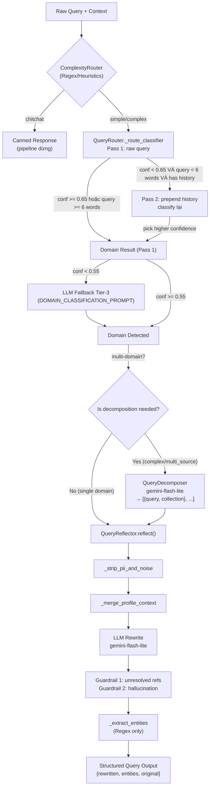

# Module: `query` — Query Understanding Layer

## Tổng quan

Module `query` là lớp xử lý ngôn ngữ đầu vào trong hệ thống RAG v2. Nhiệm vụ cốt lõi là chuyển đổi câu hỏi tự nhiên (mơ hồ, đa chủ đề, chứa đại từ nhân xưng, PII) thành các truy vấn có cấu trúc, độc lập và tối ưu để tìm kiếm thông tin.

Module thực hiện 4 chức năng theo chuỗi:

1. **Complexity Routing** (`ComplexityRouter`): Lọc Tier-0 bằng Regex + Heuristics, phân loại `chitchat / simple / complex`.
2. **Domain Classification** (`QueryRouter` + `DomainClassifier`): Phân loại intent và domain bằng mô hình Two-Stage ML (BGE-M3 + Logistic Regression), với Two-Pass routing và LLM Fallback Tier-3.
3. **Query Decomposition** (`QueryDecomposer`): Chia nhỏ câu hỏi đa-domain thành các sub-query độc lập, mỗi câu chỉ nhắm vào một collection cụ thể.
4. **Query Reflection & Enrichment** (`QueryReflector`): Loại bỏ PII, rewrite standalone, giải tham chiếu đại từ, trích xuất entity cấu trúc cho Metadata Filter.

---

## Cấu trúc thư mục

```text
query/
├── complexity_router.py   # Tier-0: chitchat / simple / complex (Regex + Heuristics)
├── router.py              # QueryRouter — Two-Pass classifier với LLM Fallback
├── domain_classifier.py   # DomainClassifier — Two-Stage ML (v3: BGE-M3 + LR)
├── decomposer.py          # QueryDecomposer — LLM (gemini-flash-lite) split
├── reflection.py          # QueryReflector — PII strip, rewrite, entity extraction
├── prompts.py             # System prompts & few-shot examples cho Router + Reflector
├── training_data.py       # ~500+ mẫu huấn luyện (multi-label format)
├── train_classifier.py    # Script train + sanity check
└── models/
    └── domain_classifier.joblib   # Model đã train (163 KB, format two_stage_v3)
```

---

## Các thành phần chi tiết

### 1. `ComplexityRouter` (`complexity_router.py`)

Lớp lọc **Tier-0** dùng **Regex + Heuristics** thuần (không gọi LLM, không embedding), quyết định con đường xử lý ngay từ đầu.

#### Output format

```python
{
    "tier": "chitchat" | "simple" | "complex",
    "reason": str,           # Giải thích quyết định (cho debug/logging)
    "confidence": "high" | "medium",
    "complex_subtype": str   # Chỉ có khi tier == "complex"
}
```

#### Logic phân loại (thứ tự ưu tiên)

| Bước | Kiểm tra | Kết quả |
|------|----------|---------|
| 1 | Match `CHITCHAT_PATTERNS` (xin chào, cảm ơn, bye...) | `chitchat`, confidence=`high` |
| 2 | Match `_COMPLEX_PATTERN_SPECS` (ordered list) | `complex/<subtype>`, confidence=`high` |
| 3 | `word_count > 30` **VÀ** có connector đa-chủ đề (`cũng`, `ngoài ra`, `đồng thời`...) | `complex/general`, confidence=`medium` |
| 4 | `q.count("?") > 1` | `complex/general`, confidence=`medium` |
| 5 | ` và `.count >= 3 | `complex/general`, confidence=`medium` |
| 6 | Mặc định | `simple`, confidence=`high` |

> **Lưu ý**: Nếu `word_count > 30` nhưng KHÔNG có connector đa-chủ đề → vẫn route `simple` (câu dài nhưng đơn chủ đề).

#### Complex Subtypes & thứ tự pattern

Các pattern trong `_COMPLEX_PATTERN_SPECS` được match theo **first-match-wins**. Thứ tự quan trọng:

| Subtype | Pattern (tóm tắt) | Ví dụ |
|---------|-------------------|-------|
| `comparison` | `so sánh`, hai mã K6x...K7x, hai mã ngành IT-E6...IT-E7, `khác nhau/giống nhau` + context | "IT-E6 khác IT-E7 thế nào?" |
| `multi_source` (override) | `tương đương/chuyển đổi/thay thế` + `đồ án/tốt nghiệp` | "Môn tương đương và điều kiện làm đồ án?" |
| `personal_check` | `(tôi|mình|em)` + `có thể/đủ điều kiện/đạt/được không` | "Em có đủ điều kiện nhận học bổng không?" |
| `multi_source` | `đủ điều kiện`, `có thể/có được` + hành động học thuật, đăng ký môn, `tất cả điều kiện` | "Tôi có thể tốt nghiệp không?" |
| `general` | Câu hỏi gốc ngắn về topic rộng, `và ... cho biết/liệt kê/so sánh` | "Học bổng?" |

> **Critical**: `personal_check` phải đứng SAU `multi_source override` và TRƯỚC `multi_source` thông thường. Query dạng "tôi có tương đương..." phải vào `multi_source`, không vào `personal_check`.

#### API

```python
router = ComplexityRouter()
result = router.route("Em có đủ điều kiện nhận học bổng không?")
# → {"tier": "complex", "reason": "complex_pattern: ...", "confidence": "high", "complex_subtype": "personal_check"}

tier = router.route_tier(query)  # Backward-compatible: trả về chỉ string tier
```

---

### 2. `QueryRouter` & `DomainClassifier` (`router.py`, `domain_classifier.py`)

Phân loại **intent** (chitchat / rag / tool_search) và **domain** (ctdt / quydinh / kehoach / stsv).

#### Architecture: Two-Stage Classifier (v3)

```
Embedding BGE-M3 (dim=1024)
        │
        ▼
Stage 1 — Intent Classifier
  CalibratedClassifierCV(
    Pipeline([StandardScaler, LogisticRegression(C=0.5, cv=5)]),
    method="sigmoid"
  )
  → chitchat | rag | tool_search

  Nếu intent != "rag" → dừng tại đây
        │
        ▼ (chỉ khi intent == "rag")
Stage 2 — Domain Multi-Label Classifier
  OneVsRestClassifier(
    Pipeline([StandardScaler, LogisticRegression(C=0.5)])
  )
  Classes: {ctdt, quydinh, kehoach, stsv}
  Threshold: prob >= 0.35 → domain "active"
  Đảm bảo ít nhất 1 domain luôn được trả về (argmax fallback)
```

**Tại sao Two-Stage?** (Giải thích trong docstring v3): Phiên bản cũ (v2) dùng OvR đơn, đặt `chitchat`/`tool_search` cùng không gian với RAG domains. `tool_search` có base-rate 12% nên calibrated probability hiếm khi vượt ngưỡng 0.6 → F1 = 0%. Tách stage 1 (intent) khỏi stage 2 (domain) giải quyết triệt để vấn đề này.

#### Output `DomainClassifier.predict()`

```python
{
    "label": "ctdt",          # Primary domain (hoặc intent nếu non-rag)
    "intent": "rag",          # rag | chitchat | tool_search
    "domain": "ctdt",         # Primary RAG domain (None nếu non-rag)
    "domains": ["ctdt", "quydinh"],  # Tất cả active domains
    "confidence": 0.82,       # Stage-2 primary prob (rag) hoặc Stage-1 max prob (non-rag)
    "probabilities": {"ctdt": 0.82, "quydinh": 0.45, ...}
}
```

#### Two-Pass Routing trong `QueryRouter._route_classifier()`

`QueryRouter` bọc `DomainClassifier` và thêm logic **Two-Pass**:

```
Pass 1: Classify raw query (không có history)
        → Tránh context-bleed cho câu hỏi tự thân đủ nghĩa

        Nếu conf >= 0.65 hoặc query >= 6 từ:
            → Dùng kết quả Pass 1 trực tiếp

        Nếu conf < 0.65 VÀ query < 6 từ VÀ có chat_history:
            → Pass 2: Prepend history context (build_routing_input)
               Classify lại → giữ kết quả có confidence cao hơn
```

Ngưỡng:
- `_TWO_PASS_CONFIDENCE_THRESHOLD = 0.65` — dưới ngưỡng này mới xét Pass 2
- `_TWO_PASS_SHORT_QUERY_WORDS = 6` — chỉ apply khi query ngắn (follow-up)

Monitoring: log `WARNING` khi `confidence < 0.55`, gắn tag `[LOW_CONF]` và `[history-boosted]`.

#### LLM Fallback Tier-3 (`DOMAIN_CLASSIFICATION_PROMPT` trong `prompts.py`)

Khi classifier confidence vẫn thấp sau Two-Pass, pipeline (`rag_pipeline.py`) trigger LLM fallback:
- Prompt: `DOMAIN_CLASSIFICATION_PROMPT` — classify domain + trả về `{"domains": [...], "confidence": "high|medium|low"}`
- Model: Gemini Flash

#### Output `QueryRouter.route()`

```python
{
    "intent": "rag",
    "domain": "ctdt",                          # Primary domain
    "domains": ["ctdt", "quydinh"],            # All active domains
    "confidence": 0.82,
    "label": "ctdt",
    "probabilities": {"ctdt": 0.82, "quydinh": 0.45, ...}
}
```

#### Hằng số quan trọng

| Constant | Giá trị | Ý nghĩa |
|----------|---------|---------|
| `MULTI_LABEL_THRESHOLD` | `0.35` | Ngưỡng prob để domain được coi là "active" |
| `LOW_CONFIDENCE_CEILING` | `0.55` | Dưới ngưỡng này → trigger LLM fallback ở pipeline |
| `_TWO_PASS_CONFIDENCE_THRESHOLD` | `0.65` | Ngưỡng để Pass 2 được kích hoạt |
| `_CONTEXT_WINDOW` | `5` | Số turn history gần nhất dùng cho context routing |

#### Huấn luyện

```bash
cd RAG_v2/
python -m query.train_classifier
# → Lưu model vào query/models/domain_classifier.joblib (two_stage_v3 format)
```

Model file dùng `joblib.dump` với format dict: `{intent_clf, domain_clf, mlb, _format: "two_stage_v3"}`. Load format cũ (single-stage) sẽ raise `ValueError` yêu cầu retrain.

---

### 3. `QueryDecomposer` (`decomposer.py`)

Chia nhỏ câu hỏi đa-domain thành **per-collection sub-queries** độc lập bằng một LLM call.

#### Model & Provider

- **Default model**: `gemini-3.1-flash-lite-preview`
- **Default provider**: `gemini` (OpenAI-compatible API endpoint)
- Hỗ trợ: `gemini`, `lm_studio`, `ollama`, `openai`

#### Input / Output

```python
decomposer = QueryDecomposer()
result = decomposer.decompose(
    "JP2111 tương đương với học phần nào và điều kiện xét nhận đồ án là gì?"
)
# → [
#     {"query": "Học phần JP2111 có thể chuyển đổi tương đương với học phần nào?", "collection": "ctdt"},
#     {"query": "Điều kiện và thời hạn để được xét nhận đồ án tốt nghiệp là gì?", "collection": "quydinh"}
#   ]
```

**Fallback**: Nếu LLM fail hoặc không parse được → trả `[{"query": original_query, "collection": ""}]` để upstream xử lý như single-domain.

#### Prompt Design (`_DECOMPOSE_SYSTEM_PROMPT`)

Quy tắc chính:
1. Bỏ qua tên người, MSSV, lời chào/cảm ơn
2. Chỉ tách khi **rõ ràng** ≥ 2 phần cần tra nguồn khác nhau; câu đơn-domain → list 1 phần tử
3. Tối đa 3 sub-queries
4. Giữ nguyên mã học phần (JP2111, IT4062E...) và mã ngành (IT-E6...)

Output JSON: `{"subqueries": [{"query": "...", "collection": "ctdt|quydinh|kehoach|stsv"}]}`

#### Retry logic

- `_MAX_RETRIES = 2`, delay exponential: `1.0s × 2^attempt`
- Retry khi: `RateLimitError`, `InternalServerError` với status 503

---

### 4. `QueryReflector` (`reflection.py`)

Thành phần phức tạp nhất, thực hiện chuỗi xử lý: **PII Stripping → Profile Merging → LLM Rewrite → Guardrails → Entity Extraction**.

#### Model & Provider

- **Default model**: `gemini-3.1-flash-lite-preview`
- **Default provider**: `gemini`
- Cấu hình qua `Settings` (`reflection_model`, `reflection_provider`, `reflection_temperature`, `reflection_max_tokens`)
- Hỗ trợ: `gemini`, `lm_studio`, `ollama`, `openai`

#### Chuỗi xử lý trong `reflect()`

```
[1] _strip_pii_and_noise(query)
      ├── Xóa MSSV: "mssv 20214987", "student id: ..."
      ├── Xóa self-intro: "Em là Phạm Nhật Anh"
      ├── Xóa lời cảm ơn: "em xin cảm ơn..."
      ├── Xóa addressee noise: "Ban cố vấn a.", "Kính gửi thầy cô"
      └── Guard: nếu kết quả < 3 từ → giữ nguyên query gốc

[2] _merge_profile_context(user_context, user_profile)
      Priority: user_profile (dict) > user_context > user_profile (str as note)
      → (merged_profile: Dict, profile_note_override: Optional[str])

[3] _build_user_prompt(query, chat_history, user_context, profile_note_override)
      ├── Profile note: profile_note_override > context > history regex
      └── Dùng REWRITE_WITH_HISTORY_TEMPLATE hoặc REWRITE_NO_HISTORY_TEMPLATE

[4] LLM call (với exponential backoff: 3 retries, base_delay=2s)
      → rewritten query string

[5] Guardrail 1 — Unresolved reference check
      Nếu rewritten vẫn còn "ngành của tôi/ngành này/chương trình này"
      → _enforce_major_reference_rewrite() dùng regex force-replace

[6] Guardrail 2 — Anti-hallucination
      Nếu query gốc KHÔNG có personal reference VÀ KHÔNG có profile
      nhưng LLM tự inject major code vào rewritten
      → Revert về query đã stripped (trước LLM)

[7] _extract_entities(query, user_context, history)
      → Structured entity dict (không có LLM call)
```

#### Output `reflect()`

```python
{
    "original": "MSSV 20214987 em Phạm Nhật Anh hỏi về ngành của tôi...",
    "stripped": "ngành của tôi...",         # Sau PII strip, trước LLM
    "rewritten": "Chương trình đào tạo ngành Công nghệ thông tin Việt-Nhật (IT-E6) có...",
    "prompt": "### INPUT\n...",             # Prompt đã gửi lên LLM (debug)
    "entities": {
        "major_code": "IT-E6",
        "major_name": "Công nghệ thông tin Việt - Nhật",
        "cohort": "65",
        "year_of_study": None,
        "course_code": "IT4062E",
        "semester": "1",
        "academic_year": "20241"
    }
}
```

#### Entity Extraction (`_extract_entities()`)

Không dùng LLM — chỉ dùng Regex + profile lookup. Priority per entity:

```
Priority 1: Explicit signal trong current query (override profile)
Priority 2: user_context (authenticated profile)
Priority 3: chat history (user-stated session facts)
```

Entities được extract:

| Entity | Pattern / Source |
|--------|-----------------|
| `major_code` | `_extract_major_code()` từ `retrieval.metadata_filters`; hỗ trợ toàn bộ major code đã index trong `ctdt`, gồm các nhóm `IT/MI/ME/EE/EV/CH/BF/MS/HE/TE/TX/TROY` |
| `major_name` | Lookup từ `MAJOR_CODE_TO_NAME` map |
| `cohort` | Regex: `\bk(\d{2,3})\b` hoặc `khóa\s*\d{2,3}` |
| `year_of_study` | Regex: `năm thứ N`, `năm N` |
| `course_code` | Regex: `\b(IT\|MI\|EE\|...)\d{4}[A-Z]?\b` — ưu tiên query hiện tại, rồi history |
| `semester` | Code `20241/20242/20243`, phrase `học kỳ 1/2/hè`, `HK1/HK2` |
| `academic_year` | Code semester (ưu tiên) hoặc range `2024-2025` |

#### Profile Merging & Normalization

`_normalise_profile_context()` chuẩn hóa các key aliases:
- `major` / `major_name` / `user_major` → `major`
- `major_code` / `user_major_code` → `major_code`
- `cohort` / `khoa` → `cohort`
- `student_id` / `user_id` → `student_id`

`_clean_profile_value()` loại bỏ placeholder: `""`, `"none"`, `"null"`, `"unknown"`, `"n/a"`, `"na"`, `"khong ro"`.

#### Rewrite System Prompt (`REWRITE_SYSTEM_PROMPT`)

14 quy tắc bắt buộc, nổi bật:
- **Rule 1**: Resolve reference theo priority `USER_PROFILE > CHAT_HISTORY > query`
- **Rule 4**: Giữ nguyên mã ngành trong CURRENT_QUERY, KHÔNG dịch `ITE6 → Công nghệ thông tin`
- **Rule 11**: Chỉ inject profile khi có personal reference — KHÔNG inject khi query tổng quát
- **Rule 12**: KHÔNG carry "intent" từ history sang query mới (tránh context pollution)
- **Rule 13**: KHÔNG đưa MSSV/tên vào standalone query
- **Rule 14**: Với chương trình quốc tế/song ngữ như `ME-GU`, `ME-LUH`, `ME-NUT`,
  `EE-EP`, `IT-EP`, `MS-E3`, `CH-E11`, `TROY-IT`, có thể bổ sung keyword tiếng Anh
  tương đương để retrieval match tài liệu tiếng Anh.

Few-shot: 10 ví dụ minh họa các edge case (đại từ nhân xưng, mã ngành mâu thuẫn, follow-up so sánh, context drift, query song ngữ cho CTĐT quốc tế...).

---

## Luồng xử lý dữ liệu (Data Flow)



---

## Thông số hiệu năng (Latency Contribution)

| Thành phần | Công nghệ | Thời gian | Kích hoạt khi |
|:-----------|:----------|:----------|:--------------|
| **ComplexityRouter** | Regex / Heuristics | < 1ms | Mọi query |
| **DomainClassifier (Pass 1)** | BGE-M3 embed + LR predict | 10–50ms | Mọi non-chitchat query |
| **DomainClassifier (Pass 2)** | BGE-M3 embed + LR predict | +10–50ms | Query ngắn < 6 từ, conf < 0.65 |
| **LLM Fallback Tier-3** | Gemini Flash | 300–800ms | `confidence < 0.55` sau cả 2 pass |
| **QueryDecomposer** | Gemini Flash Lite | 400–1000ms | `complex_subtype` = `multi_source`/`comparison` |
| **QueryReflector** | Gemini Flash Lite | 500–2000ms | Mọi RAG query (simple + complex) |
| **Entity Extraction** | Regex | < 1ms | Luôn chạy sau Reflector |

---

## Lưu ý quan trọng (Pitfalls)

1. **Thứ tự Pattern trong `_COMPLEX_PATTERN_SPECS`**: First-match-wins. Pattern `multi_source override` (tương đương + đồ án) **PHẢI** đứng trước `personal_check` vì một query dạng "tôi muốn tương đương và làm đồ án" cần route `multi_source`, không phải `personal_check`. Đây là comment rõ ràng trong code.

2. **Two-Stage Classifier Format**: Model `.joblib` chỉ tương thích với format `two_stage_v3`. Load model cũ (single-stage OvR) sẽ raise `ValueError`. Phải retrain nếu format không khớp: `python -m query.train_classifier`.

3. **Guardrail 2 — Hallucination Detection**: Phụ thuộc vào `retrieval.metadata_filters._extract_major_code`. Nếu module này không available, Exception được catch im lặng — guardrail bị bỏ qua nhưng pipeline không crash.

4. **NFC Normalization**: `_normalize_query_for_classification()` apply `unicodedata.normalize("NFC", ...)` trước khi embed. Đảm bảo "ịch thi" (bị mất ký tự đầu) vẫn được classify đúng nhờ embedding space sạch hơn.

5. **Course Code Regex**: Pattern `\b(IT|MI|EE|ET|ME|CH|PH|MA|TL|FL|PE|ED)\d{4}[A-Z]?\b` trong `reflection.py` — cần bổ sung khi thêm prefix mới từ các khoa viện mới (ví dụ: môn tiếng Nhật JP...).

6. **LLM Retry Logic**:
   - `QueryDecomposer`: 2 retries, base 1.0s
   - `QueryReflector`: 3 retries, base 2.0s
   - Chỉ retry `RateLimitError` và `InternalServerError(503)`. Các lỗi khác raise immediately.

7. **Context Bleeding trong Routing**: `build_routing_input()` chỉ prepend history khi query < 6 từ. Query đủ dài (>= 6 từ) không prepend history để tránh bias từ domain cũ (ví dụ: sau nhiều lượt hỏi về `ctdt`, câu hỏi về `quydinh` vẫn được route đúng).

8. **`profile_note_override`**: Khi `user_profile` là `str` (thay vì `dict`), string này được inject trực tiếp vào prompt thay vì merge vào profile dict. Dùng khi caller đã format sẵn profile note.
