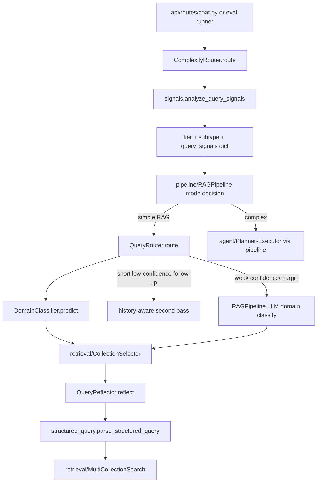

# Module: `query`

Source-verified: 2026-06-24 from `query/complexity_router.py`, `query/router.py`, `query/domain_classifier.py`, `query/reflection.py`, `query/course_catalog.py`, `query/signals.py`, `query/structured_query.py`, `query/prompts.py`, `query/training_data.py`, `query/train_classifier.py`, and `query/__init__.py`.

## Purpose

`query` converts raw user text plus session/profile context into routing and retrieval-ready structured information. It handles complexity routing, domain classification, query rewriting/reflection, deterministic entity extraction, reusable query signals, and structured exclusion parsing.

## File Map

```text
query/
  complexity_router.py  Tier-0 chitchat/simple/complex heuristic router with subtypes.
  router.py             QueryRouter (intent/domain) wrapping DomainClassifier or LLM mode.
  domain_classifier.py  Two-stage BGE-M3 + sklearn intent + multi-label domain classifier.
  reflection.py         PII strip, profile merge, LLM rewrite, guardrails, entity extraction.
  course_catalog.py     Major-scoped course-name/alias -> course-code lookup (lazy JSON load).
  signals.py            QuerySignals dataclass + accent-insensitive analysis and phrase extraction.
  structured_query.py   Text normalization, code/cohort extraction, exclude-term parsing.
  prompts.py            Router, rewrite/reflection, and Tier-3 domain-classification prompts.
  training_data.py      In-repo classifier training data (TRAINING_DATA, HARD_NEGATIVE_DATA,
                        MULTI_LABEL_DATA) and label constants.
  train_classifier.py   Training CLI for the domain classifier.
  models/
    domain_classifier.joblib   Trained two-stage classifier artifact (format: two_stage_v3).
    course_catalog.json        Major-keyed course catalog for name→code lookup.
```

## Runtime Flow

```text
Raw question + history + user_context
  -> ComplexityRouter
     -> analyze_query_signals()  (attached as query_signals on result)
     -> chitchat | simple | complex (+ complex_subtype)
  -> QueryRouter
     -> DomainClassifier (Stage 1 intent, Stage 2 multi-label domain)
     -> optional history second pass for short low-confidence follow-ups
     -> optional Tier-3 LLM classifier in RAGPipeline
  -> QueryReflector
     -> strip PII/noise
     -> merge profile/user context/history
     -> optional LLM rewrite to standalone query (passthrough when nothing to resolve)
     -> deterministic guardrails (major-ref + placement-verb + major-code expansion +
        course-code injection)
     -> regex entity extraction
  -> retrieval filters/search query
```

## Module Flow



External module boundaries:

- Called by `pipeline/rag_pipeline.py` and `pipeline/flows.py`; it returns routing, reflection, entity, and structured-query artifacts, not retrieved documents.
- Feeds `retrieval/collection_selector.py`, `retrieval/metadata_filters.py`, and `retrieval/elasticsearch_store.py` through domains, signals, entities, and exclude terms.
- `reflection.py` imports `retrieval.metadata_filters` lazily (`extract_major_codes`, `_extract_major_code`, `MAJOR_CODE_TO_NAME`, `enrich_major_references_for_query`) and `utils.terminology.expand_academic_abbreviations`.
- Uses LLM prompts through injected pipeline LLMs (Gemini/OpenAI/LM Studio/Ollama via OpenAI-compatible client); provider/key resolution lives in `config.settings`.
- `evaluation/` and legacy `eval/` reuse router/signals behavior for routing and retrieval-quality checks.

## ComplexityRouter

`route(query)` returns a dict with:

- `tier`: `chitchat`, `simple`, or `complex`
- `reason`
- `confidence`: `high` (pattern/signal match) or `medium` (structural heuristic)
- `complex_subtype` (only when `tier == "complex"`)
- `query_signals`: the `QuerySignals.to_dict()` payload, attached to **every** result

`route_tier(query)` is a backwards-compatible convenience returning just the tier string.

Complex subtypes:

- `comparison`
- `multi_source`
- `general`

Decision order (first match wins):

1. Chitchat regex fast path (5 patterns, `re.IGNORECASE` on lowercased query) → `chitchat`.
2. Signal/structural overrides evaluated before the complex regex list:
   - `>= 2` occurrences of `cho` (lowercase) plus a `và`/`va` connector (original or folded) → `complex/general` (repeated_request_connector).
   - `_is_single_fact_policy_lookup` → forced `simple`: exact_policy_lookup OR table_lookup OR `_FOLDED_SINGLE_FACT_RE` match, AND no comparison, AND no multi-topic connector, AND at most one `?`, AND fewer than 3 ` va ` tokens.
   - `personal_reference` AND `eligibility_check` (from `QuerySignals`) → `complex/multi_source`.
   - `_FOLDED_PERSONAL_ABILITY_RE` match (accent-insensitive pronoun + ability/eligibility) → `complex/multi_source`. Covers no-diacritic mobile input ("toi co du dieu kien").
   - `multi_domain` AND `eligibility_check` AND folded graduation+program regex match → `complex/multi_source`.
   - `_FOLDED_COMPARISON_RE` near cohort/program tokens (folded) → `complex/comparison`.
   - ` va ` (folded) plus a folded request verb (`cho biet|liet ke|so sanh|giai thich`) → `complex/general`.
3. `_COMPLEX_PATTERN_SPECS` regex list (matched against the **original** query with `re.IGNORECASE`): comparison, multi_source (curriculum+regulation compound, personal-eligibility wording), and general patterns, each tagged with its subtype.
4. Structural heuristics (`confidence: "medium"`, subtype `general`):
   - `word_count > 30` only when a multi-topic connector (`cũng|ngoài ra|đồng thời|bên cạnh đó|kết hợp`, checked on lowercased original) is present; long single-topic queries remain `simple`.
   - More than one `?` (checked on original `q`).
   - `>= 3` ` và ` (with spaces, lowercased) connectors.
5. Default → `simple` (`confidence: "high"`).

Routing-guard intent:

- Single-fact policy/table/exact lookups stay `simple` unless explicit comparison, multiple domains, or multiple tasks appear.
- The old `personal_check` subtype is removed; personal-reference + eligibility wording routes as `multi_source`.
- Broad scholarship/fee-waiver wording is not enough on its own; eligibility signals require explicit eligible/qualified/considered phrasing (see `signals._ELIGIBILITY_PATTERNS`).

## QuerySignals (signals.py)

`analyze_query_signals(query)` returns a frozen `QuerySignals` dataclass (`.to_dict()` for traces). All fields are booleans. **`QuerySignals` now has 11 fields** — the old doc listed only 7:

| Field | Source |
|---|---|
| `personal_reference` | `_PERSONAL_PATTERNS` |
| `eligibility_check` | `_ELIGIBILITY_PATTERNS` |
| `exact_policy_lookup` | `_EXACT_LOOKUP_PATTERNS` |
| `table_lookup` | `_TABLE_LOOKUP_PATTERNS` |
| `procedural_support` | `_PROCEDURAL_PATTERNS` |
| `multi_domain` | derived: `(eligibility_check AND has_program_context) OR (procedural_support AND (exact_policy_lookup OR table_lookup)) OR graduation_rule` |
| `freshness` | `_FRESHNESS_PATTERNS` |
| `schedule_intent` | `_SCHEDULE_PATTERNS` (**new**) |
| `deadline_intent` | `_DEADLINE_PATTERNS` (**new**) |
| `announcement_intent` | `_ANNOUNCEMENT_PATTERNS` (**new**) |
| `curriculum_semester_intent` | course reference + which-semester question, suppressed by schedule/deadline/when-opening markers (**new**) |

`curriculum_semester_intent` detects "môn X học/đăng ký vào kỳ mấy?" (WHICH-semester-in-curriculum, ctdt) as distinct from WHEN-registration-opens (kehoach). It requires a course-reference match AND a semester-placement question, AND no when-opening/schedule/deadline marker.

Matching runs on accent-folded text via `fold_vietnamese_text`. Helpers also exported: `coerce_query_signals` (dict→`QuerySignals`) and `extract_key_phrases` (stopword-split content spans for BM25 phrase boosting, max 4-gram, up to `max_phrases=8`).

## DomainClassifier And QueryRouter

`DomainClassifier` (saved format `two_stage_v3`) uses two stages:

1. **Stage 1 — Intent**: `CalibratedClassifierCV(Pipeline[StandardScaler, LogisticRegression(C=0.5, max_iter=1000, solver=lbfgs)], cv=5, method="sigmoid")` → one of `chitchat`, `rag`, `tool_search`.
2. **Stage 2 — Domain** (only when Stage 1 → `rag`): `OneVsRestClassifier(Pipeline[StandardScaler, LogisticRegression(C=0.5)])` over `MultiLabelBinarizer(sorted(RAG_LABELS))` → any subset of `ctdt`, `quydinh`, `kehoach`, `stsv`.

Thresholds: `MULTI_LABEL_THRESHOLD = 0.35` (a domain is active above this; argmax is always kept if none clear); `LOW_CONFIDENCE_CEILING = 0.55` (below this the Tier-3 LLM fallback fires). Domains in the returned list are sorted by probability descending.

`predict()` output dict:

- `label` (primary predicted label)
- `intent`
- `domain` (primary RAG domain or `None`)
- `domains` (sorted by probability descending, may be >1)
- `confidence` (Stage-2 primary prob for rag, else Stage-1 max prob)
- `probabilities` (raw prob dict for the active stage)

`QueryRouter` (`mode="classifier"` default, or `mode="llm"` using OpenAI + `ROUTER_FEW_SHOT`).

`route(query, chat_history)` returns:
- classifier mode: `intent`, `domain`, `domains`, `confidence`, `label`, `probabilities`
- llm mode: `intent`, `domain`, `domains`, `confidence=None`, `raw_response`

Two-pass behavior (classifier mode):

- Pass 1 classifies the NFC-normalized raw query (no history).
- Pass 2 fires only when there is history, `raw_confidence < 0.65` (`_TWO_PASS_CONFIDENCE_THRESHOLD`), and `len(query.split()) < 6` (`_TWO_PASS_SHORT_QUERY_WORDS`); it prepends history via `build_routing_input` and keeps whichever pass has higher confidence.
- `build_routing_input` skips history when the query has `>= 6` words (self-contained), using the last `_CONTEXT_WINDOW = 5` turns otherwise.
- Confidence below 0.55 logs at `WARNING` level with `[LOW_CONF]` tag (production drift monitoring).

`VALID_INTENTS = {chitchat, rag, tool_search}`, `VALID_DOMAINS = {ctdt, quydinh, kehoach, stsv}`, `DEFAULT_INTENT = "rag"`, `DEFAULT_MODEL = "gpt-4o-mini"`. The Tier-3 LLM fallback in `RAGPipeline` uses `DOMAIN_CLASSIFICATION_PROMPT` when classifier confidence/margin are weak.

## QueryReflector

`QueryReflector.reflect()` signature:

```python
def reflect(
    self,
    query: str,
    chat_history: Optional[List[Dict[str, str]]] = None,
    user_context: Optional[Dict[str, Any]] = None,
    user_profile: Optional[Dict[str, Any] | str] = None,
    user_major: Optional[str] = None,
) -> Dict[str, Any]:
```

Returns:

- `original` (raw, pre-strip)
- `stripped` (after PII/noise removal, before LLM rewrite)
- `rewritten`
- `prompt` (user prompt sent to the LLM; empty string in passthrough mode)
- `entities`
- Trace-only fields: `reflection_candidate`, `reflection_guardrail_reverted` (bool), `reflection_rejected_scope` (always `None` in current code), `terminology_expanded` (bool)

Also has a public `extract_entities(query, chat_history, user_context, user_profile, user_major)` wrapper for external callers.

Constructor resolves provider from `settings.reflection_provider` (`gemini` | `lm_studio` | `ollama` | `openai`), using `settings.reflection_model`, `settings.reflection_temperature`, `settings.reflection_max_tokens`. Default model constant: `DEFAULT_MODEL = "gemini-3.1-flash-lite"`.

Major steps in `reflect()`:

1. `_strip_pii_and_noise()` — strips MSSV, personal name introductions (`_PERSONAL_INTRO_RE`: pronoun/`là` lead-in + 1–5 capitalized tokens; preserves academic self-identifications like "tôi là sinh viên ngành IT1"), thanks/closing phrases, addressee noise. Reverts if result drops below 3 words.
2. `_merge_user_major_into_context()` + `_merge_profile_context()` — normalize profile (`major`, `major_code`, `cohort`, `student_id`). `user_profile` dict overrides `user_context` per-key; string `user_profile` becomes `profile_note_override`.
3. History attachment — `effective_history = chat_history or None`. History is attached whenever it exists; there is **no** regex follow-up detection. The rewrite LLM (system prompt Rules 12/17 + few-shots) decides whether to inherit the prior topic ("với IT1 thì sao") or treat the query as standalone.
4. Passthrough check `_needs_llm_rewrite = bool(effective_history) or _has_profile_dependent_signal(query)` — call the LLM only when there is context to resolve against (history exists, or the query references the user's profile). With neither, passthrough. Gates on context *existence*, not open-ended intent guessing.
5. LLM rewrite (retry with exponential backoff: `_MAX_RETRIES=3`, `_BASE_RETRY_DELAY=2.0s` on 429/503).
6. Anti-bleeding guardrail — when the original query is a generic-freshness query (`_is_generic_freshness`) that has no profile reference and names no academic scope of its own, but the LLM candidate injected scope (`_contains_academic_scope`: major/cohort/semester/year), revert to the original and set `reflection_guardrail_reverted=True`, `reflection_rejected_scope="academic_term"`. Does not affect topic-inheriting follow-ups (not freshness, name an explicit major) or profile-referencing queries.
7. Deterministic comparison follow-up rewrite (`_rewrite_comparison_followup`) — runs regardless of LLM mode; produces `"So sánh {topic} giữa {code1} và {code2}"`. Checks history + profile for major codes and topic.
8. `_extract_entities()` — resolves entities once after LLM rewrite.
9. Guardrail 1: `_enforce_major_reference_rewrite()` — replaces residual personal major references using trusted profile data.
10. Guardrail 2: `_preserve_curriculum_placement_verb()` — reverts reflection-introduced `đăng ký` back to `học` when original had `curriculum_semester_intent` and user did not write `đăng ký`.
11. Guardrail 3: `_expand_major_codes_in_query()` — skipped when a deterministic comparison rewrite was applied.
12. `expand_academic_abbreviations()` terminology expansion.
13. `_preserve_explicit_course_code()` — if user typed a course code, ensure LLM did not swap it.
14. Guardrail 4: `_inject_course_code()` — injects major-scoped catalog course code after course name in text (e.g. "Mạng máy tính" → "Mạng máy tính (IT3080)"). Only fires when `course_name_folded` is in entities and code is not already present. Handles alias matches; can replace an adjacent conflicting code unless `preserve_existing_codes=True`.

Entities (`_extract_entities`, all values may be `None`):

- `major_code` — resolved (query > profile > history)
- `major_name`
- `user_major_code` — immutable authenticated profile value; never overridden by query/history
- `user_major_name`
- `target_major_code` — explicit major named in the current query
- `target_major_name`
- `cohort`
- `year_of_study`
- `course_code`
- `course_name` — catalog-matched display name
- `course_name_folded` — accent-folded name for text search
- `course_alias_folded` — matched shorthand alias when different from full name
- `semester` (`"1"`, `"2"`, or `"he"`)
- `academic_year` (semester code like `20241` or `YYYY-YYYY`)

Entity priority: explicit current-query signal → `user_context` → conversation history.

**Note:** The old doc listed only 7 entity fields. The actual dict has 14 keys.

Current guardrail behavior:

- Profile notes injected only when the current query has a profile-dependent signal (`_has_profile_dependent_signal`).
- `profile_dependency.required_attributes` treats tuition (`học phí`/`mức học phí`) as `{"major"}` because amounts differ by program; scholarship/fee-waiver (`miễn giảm học phí`) stays universal (`set()`).
- History is always attached when present; generic freshness/latest queries do not inherit `major_code`, `cohort`, or semester terms because the post-LLM anti-bleeding guardrail (step 6) reverts injected scope.
- Standalone course queries with a profile use deterministic catalog lookup without calling the reflection LLM.
- The reflection LLM provider/model/temperature/max_tokens come from `Settings`.

## QueryDecomposer

`QueryDecomposer.decompose(query)` makes one fast LLM call (`gemini-3.1-flash-lite` default, via `settings.reflection_model`) to split clearly multi-source questions into at most 3 subqueries. Output shape:

```python
[{"query": "...", "collection": "ctdt|quydinh|kehoach|stsv"}, ...]
```

- Only collections in `VALID_COLLECTIONS = {ctdt, quydinh, kehoach, stsv}` are kept.
- On non-JSON / no-valid-subqueries / LLM failure it falls back to `[{"query": query, "collection": ""}]`.
- When exactly one valid subquery results, `query` is reset to the verbatim original to prevent paraphrase drift (collection hint preserved).
- Retry: `_MAX_RETRIES=2`, `_BASE_RETRY_DELAY=1.0s` on 429/503.
- Shares provider resolution logic with `QueryReflector` (gemini / lm_studio / ollama / openai).
- Few-shot examples cover: equivalent-course + graduation-condition splits, graduation conditions (3-way split), scholarship condition + procedure, registration slot check (single-source), course credit (single-source).

## ProfileDependency (profile_dependency.py)

Four public functions replacing the old pronoun-regex approach:

```python
required_attributes(question, search_query, routing_result) -> Set[str]
resolve_sources(required, *, user_major, target_major, cohort) -> Dict[str, str]
should_inject_profile_note(question, search_query, routing_result, *, user_major, target_major, cohort) -> bool
effective_major_for_retrieval(question, search_query, routing_result, resolved_major) -> Optional[str]
```

`required_attributes` decision order (most-specific sub-topic first, then router-domain defaults):

| Pattern | Required attributes |
|---|---|
| học bổng / trợ cấp / miễn giảm học phí | `set()` (universal) |
| ngoại ngữ / TOEIC / JLPT / IELTS | `{"major"}` |
| tốt nghiệp / ra trường | `{"major", "cohort"}` |
| thủ tục + đăng ký (course registration procedure) | `set()` |
| môn / học phần / chương trình đào tạo | `{"major"}` |
| quy chế đào tạo | `{"cohort"}` |
| domain `ctdt` | `{"major"}` |
| domain `kehoach` / `stsv` / generic quydinh | `set()` |

`resolve_sources` maps each required attribute to `target` / `user_profile` / `ask`.

## Structured Query Helpers

`structured_query.parse_structured_query(query)` returns a frozen `StructuredQuery` with `original_query`, `normalized_query`, `course_codes`, `major_codes`, `cohorts`, `exclude_terms`. It:

- `normalize_query_text` — NFKC + dash/whitespace canonicalization (accents preserved).
- Extracts and canonicalizes course codes (`_canonical_course_code`, prefixes: `IT|MI|EE|ET|ME|CH|PH|MA|TL|FL|PE|ED|JP|EM|BF|TEX`), major codes (`_canonical_major_code`, suffix `1`/`2` → `IT1`/`IT2`, otherwise `PREFIX-SUFFIX`), and cohorts (`K65`).
- Parses negation/exclusion phrases (`không bao gồm/gồm/tính/lấy/xét`, `ngoài trừ`, `loại trừ`, `trừ`, matched on accentless form) into `exclude_terms` via `_clean_exclude_term` (accent-stripped, stop-word trimmed at `nhưng|thì|khi|...`, max 8 words, length ≥ 2, leading `các/những/một` stripped).

Companion helpers: `text_contains_excluded_term` (accent-insensitive post-vector filter) and `build_es_must_not_clauses` (Elasticsearch `multi_match phrase` on `text^1.0`, `title^1.5`, `course_name^2.0`, plus `course_code` term clause when the term is a full course code). Keep these aligned with `retrieval/metadata_filters.py`.

## CourseCatalog (course_catalog.py)

`lookup_course_code(query_text, major_code)` returns `{code, name, name_folded, semester, credits, matched_alias_folded}` or `None`.

- Lazy-loads `models/course_catalog.json` (produced by `scripts/build_course_catalog.py`). File missing → silently degrades to `{}`.
- Lookup is always keyed by `major_code`; same course name may map to different codes across majors.
- Entries are stored longest-name-first; first boundary match wins (most specific).
- Alias handling: `_COURSE_ALIAS_PREFIXES = ("lap trinh ",)` — alias matches are only accepted when they resolve to a unique code across all alias candidates (`_unique_code_match`).
- Returns `None` when major is unknown/uncovered or no course name matches.

## Maintenance Notes

- Retrain the classifier with `python -m query.train_classifier` after changing training data or labels. Loads `query.training_data.get_training_data()` (merges `TRAINING_DATA`, `HARD_NEGATIVE_DATA`, `MULTI_LABEL_DATA`), embeds with BGE-M3, saves `two_stage_v3`. Loading a legacy format raises `ValueError`.
- Keep course/major-code regexes aligned across `query/structured_query.py` (`_COURSE_CODE_RE` includes `JP|EM|BF|TEX`), `query/reflection.py` (`_COURSE_CODE_RE` does NOT include `JP|EM|BF|TEX` — **inconsistency**), and `retrieval/metadata_filters.py`.
- `models/course_catalog.json` is not checked in as source but is a runtime dependency. Rebuild with `python -m scripts.build_course_catalog`.
- When changing rewrite behavior, update pipeline tests, conversation regressions, and docs.
- Do not let profile/history context bleed into generic latest/freshness questions.
- `profile_dependency.py` is not exported from `query/__init__.py`; callers import it directly.
- `course_catalog.py` is not exported from `query/__init__.py`; it is imported inside `reflection.py` at call time.

## Useful Checks

```bash
python -m py_compile query/*.py
python -m pytest tests/test_router.py tests/test_structured_query.py tests/test_reflection.py tests/test_phase1_improvements.py -q -m "not integration"
# Retrain classifier
python -m query.train_classifier
# Rebuild course catalog (if scripts/ has the builder)
python -m scripts.build_course_catalog
```
