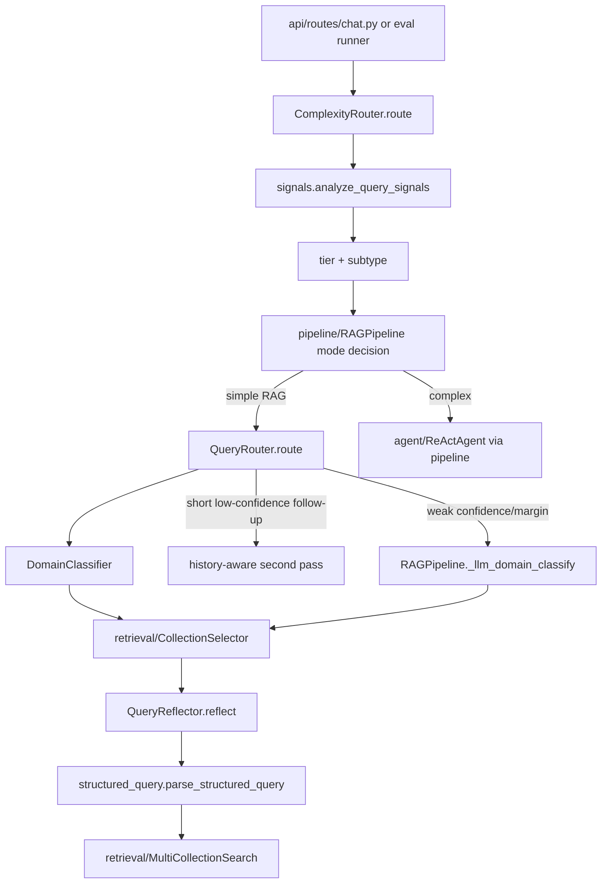

# Module: `query`

Source-verified: 2026-06-02 from `query/*.py`, `pipeline/rag_pipeline.py`, `pipeline/flows.py`, `config/settings.py`, and GitNexus context for `QueryReflector`.

## Purpose

`query` converts raw user text plus session/profile context into routing and retrieval-ready structured information. It handles complexity routing, domain classification, query decomposition, query rewriting/reflection, deterministic entity extraction, and structured exclusion parsing.

## File Map

```text
query/
  complexity_router.py  Tier-0 chitchat/simple/complex heuristic router.
  router.py             QueryRouter wrapper around DomainClassifier.
  domain_classifier.py  Two-stage BGE-M3 + sklearn classifier.
  reflection.py         PII strip, profile merge, LLM rewrite, guardrails, entity extraction.
  decomposer.py         LLM subquery decomposition for multi-source/comparison queries.
  signals.py            Accent-insensitive query-signal analysis shared by router/retrieval.
  structured_query.py   Text normalization and exclude-term parsing for retrieval.
  prompts.py            Domain classification and rewrite/decompose prompts.
  training_data.py      In-repo classifier training data.
  train_classifier.py   Training CLI for domain classifier.
  models/domain_classifier.joblib  Trained classifier artifact.
```

## Runtime Flow

```text
Raw question + history + user_context
  -> ComplexityRouter
     -> analyze_query_signals()
     -> chitchat | simple | complex
  -> QueryRouter
     -> DomainClassifier
     -> optional history second pass for short low-confidence follow-ups
     -> optional Tier-3 LLM classifier in RAGPipeline
  -> QueryReflector
     -> strip PII/noise
     -> merge profile/user context/history
     -> LLM rewrite to standalone query
     -> deterministic guardrails
     -> regex entity extraction
  -> retrieval filters/search query
```

## Module Flow



External module boundaries:

- Called by `pipeline/rag_pipeline.py` and `pipeline/flows.py`; it returns routing, reflection, entity, and structured-query artifacts, not retrieved documents.
- Feeds `retrieval/collection_selector.py`, `retrieval/metadata_filters.py`, and `retrieval/elasticsearch_store.py` through domains, signals, entities, and exclude terms.
- Uses LLM prompts through injected pipeline LLMs; provider construction stays in `llm`.
- `evaluation/` and legacy `eval/` reuse router/signals behavior for routing and retrieval-quality checks.

## ComplexityRouter

Returns a dict with:

- `tier`: `chitchat`, `simple`, or `complex`
- `reason`
- `confidence`
- `complex_subtype` when complex

Known complex subtypes:

- `comparison`
- `multi_source`
- `general`

Pattern order matters. First match wins.

P0 routing guards:

- Single-fact policy/table/exact lookup questions should remain `simple` unless the text has explicit comparison, multiple domains, or multiple tasks.
- The old `personal_check` subtype is intentionally removed. Personal-reference plus eligibility/graduation wording routes as `multi_source` so it reaches the Planner-Executor instead of a clarify or classic-RAG special case.
- Broad words such as scholarship/fee-waiver/allowed-question wording are not enough to emit eligibility intent unless the query explicitly asks about being eligible/qualified/considered.

## DomainClassifier And QueryRouter

`DomainClassifier` uses a two-stage design:

1. Intent classifier: `chitchat`, `rag`, `tool_search`.
2. Multi-label RAG domain classifier: `ctdt`, `quydinh`, `kehoach`, `stsv`.

Classifier output includes:

- `intent`
- `domain`
- `domains`
- `label`
- `confidence`
- `probabilities`

`QueryRouter` adds two-pass behavior:

- Pass 1 classifies the raw current query.
- Pass 2 prepends history only when the query is short and confidence is low.
- Long self-contained queries should not inherit previous-topic context.

`RAGPipeline._llm_domain_classify()` is the Tier-3 fallback when classifier confidence/margin are weak.

## QueryReflector

`QueryReflector.reflect()` returns:

- `original`
- `stripped`
- `rewritten`
- `prompt`
- `entities`

Major steps:

1. `_strip_pii_and_noise()`
2. `_merge_profile_context()`
3. `_build_user_prompt()`
4. LLM rewrite
5. unresolved-reference guard
6. anti-hallucination/context-bleed guard
7. deterministic comparison follow-up rewrite
8. major-code expansion where safe
9. `_extract_entities()`

Entities:

- `major_code`
- `major_name`
- `cohort`
- `year_of_study`
- `course_code`
- `semester`
- `academic_year`

Current guardrail behavior:

- Profile notes are injected only when the current query has a profile-dependent signal.
- Generic/latest queries should not inherit `major_code`, `cohort`, or semester terms from profile/history.
- Deterministic comparison follow-up rewrites are intentional and should not be reverted as hallucinations.
- Bare major-code expansion is skipped for compact deterministic comparison rewrites.

## QueryDecomposer

`QueryDecomposer` uses an LLM to split clearly multi-source questions into at most 3 subqueries:

```python
{"subqueries": [{"query": "...", "collection": "ctdt|quydinh|kehoach|stsv"}]}
```

If parsing fails, it returns one fallback subquery with the original question.

## Structured Query Helpers

`structured_query.py` parses exclude terms and canonicalizes course/major tokens for retrieval-side filtering. Keep it aligned with `retrieval/metadata_filters.py`.

## Maintenance Notes

- Retrain classifier with `python -m query.train_classifier` after changing training data or labels.
- Keep major-code regexes aligned with `retrieval/metadata_filters.py`.
- When changing rewrite behavior, update pipeline tests, conversation regressions, and docs.
- Do not let profile/history context bleed into generic latest/freshness questions.

## Useful Checks

```bash
python -m py_compile query/*.py
python -m pytest tests/test_router.py tests/test_structured_query.py test_reflection.py tests/test_phase7.py tests/test_phase8.py -q -m "not integration"
```
