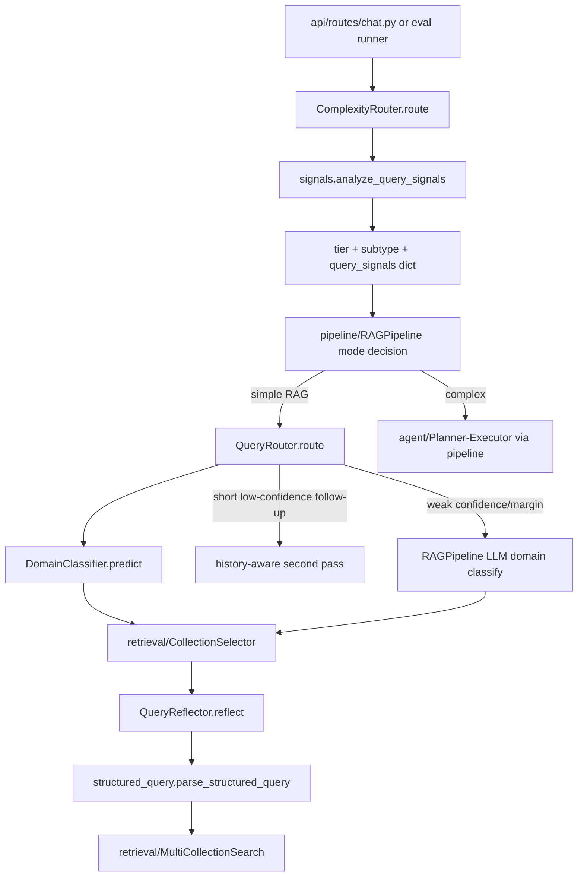

# Module: `query`

Source-verified: 2026-06-07 from `query/complexity_router.py`, `query/router.py`, `query/domain_classifier.py`, `query/reflection.py`, `query/course_catalog.py`, `query/profile_dependency.py`, `query/decomposer.py`, `query/signals.py`, `query/structured_query.py`, `query/prompts.py`, `query/training_data.py`, `query/train_classifier.py`, and `query/__init__.py`.

## Purpose

`query` converts raw user text plus session/profile context into routing and retrieval-ready structured information. It handles complexity routing, domain classification, query decomposition, query rewriting/reflection, deterministic entity extraction, reusable query signals, and structured exclusion parsing.

## File Map

```text
query/
  complexity_router.py  Tier-0 chitchat/simple/complex heuristic router with subtypes.
  router.py             QueryRouter (intent/domain) wrapping DomainClassifier or LLM mode.
  domain_classifier.py  Two-stage BGE-M3 + sklearn intent + multi-label domain classifier.
  reflection.py         PII strip, profile merge, LLM rewrite, guardrails, entity extraction.
  course_catalog.py     Major-scoped course-name/alias -> course-code lookup.
  profile_dependency.py Topic gate for whether major/cohort should affect retrieval/generation.
  decomposer.py         LLM subquery decomposition for multi-source/comparison queries.
  signals.py            QuerySignals + accent-insensitive analysis and phrase extraction.
  structured_query.py   Text normalization, code/cohort extraction, exclude-term parsing.
  prompts.py            Router, rewrite/reflection, and Tier-3 domain-classification prompts.
  training_data.py      In-repo classifier training data and label constants.
  train_classifier.py   Training CLI for the domain classifier.
  models/domain_classifier.joblib  Trained two-stage classifier artifact.
```

## Runtime Flow

```text
Raw question + history + user_context
  -> ComplexityRouter
     -> analyze_query_signals()  (attached as query_signals on result)
     -> chitchat | simple | complex (+ complex_subtype)
  -> QueryRouter
     -> DomainClassifier (Stage 1 intent, Stage 2 multi-label domain)
     -> optional history second pass for short low-confidence follow-ups
     -> optional Tier-3 LLM classifier in RAGPipeline
  -> QueryReflector
     -> strip PII/noise
     -> merge profile/user context/history
     -> optional LLM rewrite to standalone query (passthrough when nothing to resolve)
     -> deterministic guardrails (major-ref + major-code + abbreviation expansion)
     -> regex entity extraction
  -> retrieval filters/search query
```

## Module Flow



External module boundaries:

- Called by `pipeline/rag_pipeline.py` and `pipeline/flows.py`; it returns routing, reflection, entity, and structured-query artifacts, not retrieved documents.
- Feeds `retrieval/collection_selector.py`, `retrieval/metadata_filters.py`, and `retrieval/elasticsearch_store.py` through domains, signals, entities, and exclude terms.
- `reflection.py` imports `retrieval.metadata_filters` lazily (`extract_major_codes`, `_extract_major_code`, `MAJOR_CODE_TO_NAME`, `enrich_major_references_for_query`) and `utils.terminology.expand_academic_abbreviations`.
- Uses LLM prompts through injected pipeline LLMs (Gemini/OpenAI/LM Studio/Ollama via OpenAI-compatible client); provider/key resolution lives in `config.settings`.
- `evaluation/` and legacy `eval/` reuse router/signals behavior for routing and retrieval-quality checks.

## ComplexityRouter

`route(query)` returns a dict with:

- `tier`: `chitchat`, `simple`, or `complex`
- `reason`
- `confidence`: `high` (pattern/signal match) or `medium` (structural heuristic)
- `complex_subtype` (only when `tier == "complex"`)
- `query_signals`: the `QuerySignals.to_dict()` payload, attached to **every** result

`route_tier(query)` is a backwards-compatible convenience returning just the tier string.

Complex subtypes:

- `comparison`
- `multi_source`
- `general`

Decision order (first match wins):

1. Chitchat regex fast path → `chitchat`.
2. Signal/structural overrides, evaluated before the complex regex list:
   - `>= 2` occurrences of `cho` plus an `và`/`va` connector → `complex/general` (repeated_request_connector).
   - `_is_single_fact_policy_lookup` → forced `simple`: a single-fact/policy/table lookup signal with no comparison, no multi-topic connector, at most one `?`, and fewer than 3 ` va ` tokens.
   - `personal_reference` AND `eligibility_check` → `complex/multi_source`.
   - `multi_domain` AND `eligibility_check` AND folded graduation+program match → `complex/multi_source`.
   - folded comparison wording near cohort/program/regulation tokens → `complex/comparison`.
   - ` va ` connector plus a folded request verb (`cho biet|liet ke|so sanh|giai thich`) → `complex/general`.
3. `_COMPLEX_PATTERN_SPECS` regex list (matched against the **original** query): comparison, multi_source (curriculum+regulation compound, personal-eligibility wording), and general patterns, each tagged with its subtype.
4. Structural heuristics (`confidence: "medium"`, subtype `general`): `word_count > 30` only when a multi-topic connector (`cũng|ngoài ra|đồng thời|bên cạnh đó|kết hợp`) is present; more than one `?`; `>= 3` ` và ` connectors.
5. Default → `simple`.

Routing-guard intent (reflected in current code):

- Single-fact policy/table/exact lookups stay `simple` unless explicit comparison, multiple domains, or multiple tasks appear.
- The old `personal_check` subtype is removed; personal-reference + eligibility wording routes as `multi_source` to reach the Planner-Executor.
- Broad scholarship/fee-waiver wording is not enough on its own; eligibility signals require explicit eligible/qualified/considered phrasing (see `signals._ELIGIBILITY_PATTERNS`).

## QuerySignals (signals.py)

`analyze_query_signals(query)` returns a frozen `QuerySignals` dataclass (`.to_dict()` for traces). All fields are booleans:

- `personal_reference`
- `eligibility_check`
- `exact_policy_lookup`
- `table_lookup`
- `procedural_support`
- `multi_domain`
- `freshness`

`multi_domain` is derived: `(eligibility_check AND program context) OR (procedural_support AND (exact_policy_lookup OR table_lookup)) OR graduation_rule`. Matching runs on accent-folded text via `fold_vietnamese_text`. Helpers also exported: `coerce_query_signals` (dict→`QuerySignals`) and `extract_key_phrases` (stopword-split content spans for BM25 phrase boosting).

## DomainClassifier And QueryRouter

`DomainClassifier` (saved format `two_stage_v3`) uses two stages:

1. **Stage 1 — Intent**: `CalibratedClassifierCV(Pipeline[StandardScaler, LogisticRegression], cv=5, method="sigmoid")` → one of `chitchat`, `rag`, `tool_search`.
2. **Stage 2 — Domain** (only when Stage 1 → `rag`): `OneVsRestClassifier(Pipeline[StandardScaler, LogisticRegression])` over `MultiLabelBinarizer(sorted(RAG_LABELS))` → any subset of `ctdt`, `quydinh`, `kehoach`, `stsv`.

Thresholds: `MULTI_LABEL_THRESHOLD = 0.35` (a domain is active above this; argmax is always kept if none clear); `LOW_CONFIDENCE_CEILING = 0.55` (below this the Tier-3 LLM fallback fires).

`predict()` output dict:

- `label` (primary predicted label)
- `intent`
- `domain` (primary RAG domain or `None`)
- `domains` (sorted by probability, may be >1)
- `confidence` (Stage-2 primary prob for rag, else Stage-1 max prob)
- `probabilities` (raw prob dict for the active stage)

`QueryRouter` (`mode="classifier"` default, or `mode="llm"` using OpenAI + `ROUTER_FEW_SHOT`). `route(query, chat_history)` returns `intent`, `domain`, `domains`, `confidence`, `label`, `probabilities` (classifier mode) or `intent`, `domain`, `domains`, `confidence=None`, `raw_response` (llm mode). Two-pass behavior (classifier mode):

- Pass 1 classifies the NFC-normalized raw query (no history).
- Pass 2 fires only when there is history, `raw_confidence < 0.65`, and `len(query.split()) < 6`; it prepends history via `build_routing_input` and keeps whichever pass has higher confidence.
- `build_routing_input` skips history when the query has `>= 6` words (self-contained), using the last `_CONTEXT_WINDOW = 5` turns otherwise.

`VALID_INTENTS = {chitchat, rag, tool_search}`, `VALID_DOMAINS = {ctdt, quydinh, kehoach, stsv}`, `DEFAULT_INTENT = "rag"`. The Tier-3 LLM fallback in `RAGPipeline` uses `DOMAIN_CLASSIFICATION_PROMPT` when classifier confidence/margin are weak.

## QueryReflector

`QueryReflector.reflect()` returns:

- `original` (raw, pre-strip)
- `stripped` (after PII/noise removal, before LLM rewrite)
- `rewritten`
- `prompt` (user prompt sent to the LLM; empty in passthrough mode)
- `entities`
- Trace-only fields: `reflection_candidate`, `reflection_guardrail_reverted`, `reflection_rejected_scope`, `terminology_expanded`

Major steps:

1. `_strip_pii_and_noise()` — strips MSSV, personal intros, thanks, addressee noise (reverts if the result drops below 3 words). `_PERSONAL_INTRO_RE` only strips genuine *name* introductions ("Tôi là Phạm Nhật Anh"): case-insensitivity is scoped to the pronoun/`là` lead-in via `(?i:...)` (so name tokens still require real capitalization), and a negative lookahead after `là` skips academic/identity descriptors (`sinh viên`, `ngành`, `khóa`, …). This preserves self-declared profile facts such as "tôi là sinh viên ngành IT1" so the major survives for entity extraction/retrieval instead of being stripped to garbage.
2. `_merge_user_major_into_context()` + `_merge_profile_context()` — normalize profile (`major`, `major_code`, `cohort`, `student_id`) and resolve any string profile note override.
3. `_should_use_history_for_reflection()` — suppress history for generic freshness queries lacking personal/anaphora/comparison signals.
4. Passthrough check `_needs_llm_rewrite` — skip the LLM call entirely unless there is effective history, a profile-dependent signal, a comparison follow-up, or an anaphora signal. Profile data alone is still used for deterministic entity extraction, but it does not trigger an LLM call.
5. `_build_user_prompt()` + LLM rewrite (retry with backoff on 429/503).
6. Deterministic comparison follow-up rewrite (`_rewrite_comparison_followup`) when applicable.
7. Guardrail 1: `_enforce_major_reference_rewrite()` replaces residual personal major references using trusted profile data.
8. Guardrail 3: `_expand_major_codes_in_query()` (skipped when a deterministic comparison rewrite was applied).
9. `expand_academic_abbreviations()` terminology expansion.
10. `_extract_entities()`.

Entities (`_extract_entities`, all values may be `None`):

- `major_code`
- `major_name`
- `cohort`
- `year_of_study`
- `course_code`
- `semester` (`"1"`, `"2"`, or `"he"`)
- `academic_year` (semester code like `20241`, or `YYYY-YYYY`)

Entity priority: explicit current-query signal → `user_context` → conversation history.

Current guardrail behavior:

- Profile notes are injected only when the current query has a profile-dependent signal (`_has_profile_dependent_signal`).
- `profile_dependency.required_attributes` treats tuition (`học phí`/`mức học phí`) as `{"major"}` because amounts differ by program (IT-E6 vs IT1); the scholarship/fee-waiver rule is checked first so `miễn giảm học phí` stays universal (`set()`).
- Generic freshness/latest queries skip history and do not inherit `major_code`, `cohort`, or semester terms from profile/history.
- Standalone course queries with a profile use deterministic catalog lookup without calling the reflection LLM. Shorthand aliases such as `môn hướng đối tượng` resolve only when unique for the active major.
- If the reflection LLM invents an adjacent conflicting course code for a catalog-matched course, the deterministic guardrail replaces it with the major-scoped catalog code unless the user explicitly typed a course code.
- Deterministic comparison follow-up rewrites are intentional and must not be reverted as hallucinations.
- Bare major-code expansion is skipped for compact deterministic comparison rewrites.
- The reflection LLM provider/model/temperature come from `Settings` (`reflection_provider`, `reflection_model`, `reflection_temperature`, `reflection_max_tokens`).

## QueryDecomposer

`QueryDecomposer.decompose(query)` makes one fast LLM call (`gemini-3.1-flash-lite` default) to split clearly multi-source questions into at most 3 subqueries. Output shape:

```python
[{"query": "...", "collection": "ctdt|quydinh|kehoach|stsv"}, ...]
```

- Only collections in `VALID_COLLECTIONS = {ctdt, quydinh, kehoach, stsv}` are kept.
- On non-JSON / no-valid-subqueries / LLM failure it falls back to `[{"query": query, "collection": ""}]`.
- When exactly one valid subquery results, the `query` is reset to the verbatim original to prevent paraphrase drift (collection hint preserved).
- Few-shot guidance includes broad personal graduation-condition queries, splitting foreign-language requirements, general graduation rules, and program-completion context into focused subqueries.

## Structured Query Helpers

`structured_query.parse_structured_query(query)` returns a frozen `StructuredQuery` with `original_query`, `normalized_query`, `course_codes`, `major_codes`, `cohorts`, `exclude_terms`. It:

- `normalize_query_text` — NFKC + dash/whitespace canonicalization (accents preserved).
- Extracts and canonicalizes course codes (`_canonical_course_code`), major codes (`_canonical_major_code`, e.g. `IT-E7`, suffix `1`/`2` collapses to `IT1`/`IT2`), and cohorts (`K65`).
- Parses negation/exclusion phrases (`không bao gồm/gồm/tính/lấy/xét`, `ngoài trừ`, `loại trừ`, `trừ`) into `exclude_terms` via `_clean_exclude_term` (accent-stripped, stop-word trimmed, max 8 words, length ≥ 2).

Companion helpers: `text_contains_excluded_term` (accent-insensitive post-vector filter) and `build_es_must_not_clauses` (Elasticsearch `must_not` phrase clauses, plus a `course_code` term clause when the term is a full course code). Keep these aligned with `retrieval/metadata_filters.py`.

## Maintenance Notes

- Retrain the classifier with `python -m query.train_classifier` after changing training data or labels (loads `query.training_data.get_training_data`, embeds with BGE-M3, saves `two_stage_v3`). Loading a legacy format raises `ValueError`.
- Keep course/major-code regexes aligned across `query/structured_query.py`, `query/reflection.py`, and `retrieval/metadata_filters.py`.
- When changing rewrite behavior, update pipeline tests, conversation regressions, and docs.
- Do not let profile/history context bleed into generic latest/freshness questions.

## Useful Checks

```bash
python -m py_compile query/*.py
python -m pytest tests/test_router.py tests/test_structured_query.py test_reflection.py tests/test_phase7.py tests/test_phase8.py -q -m "not integration"
```
