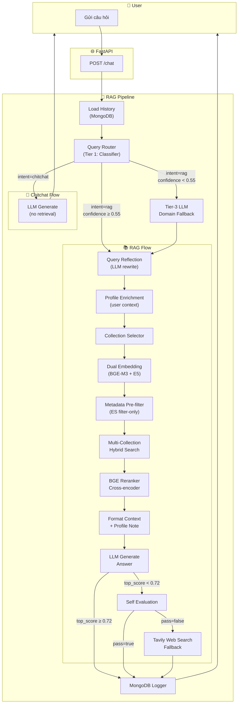
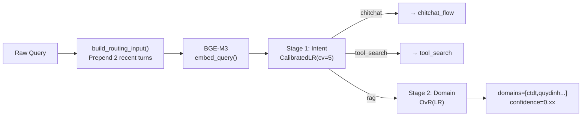
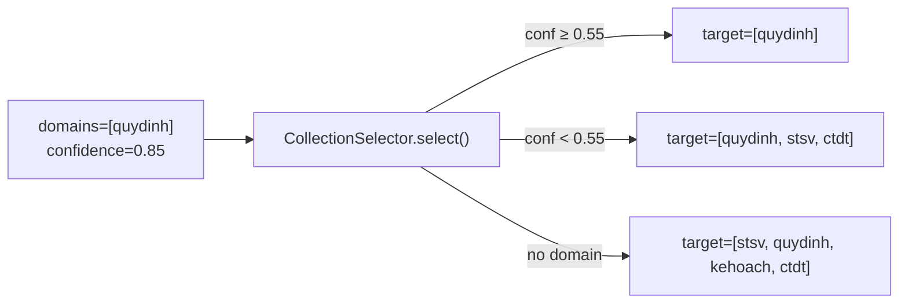
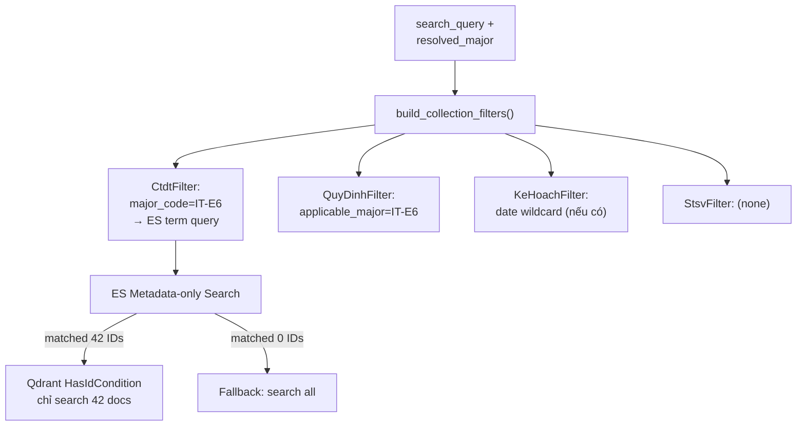
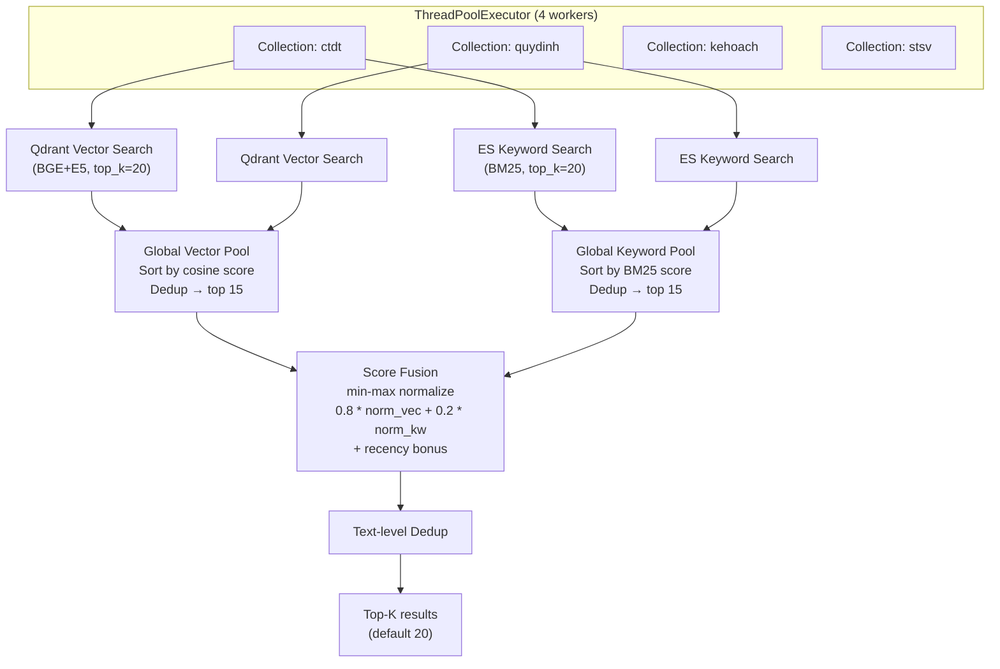
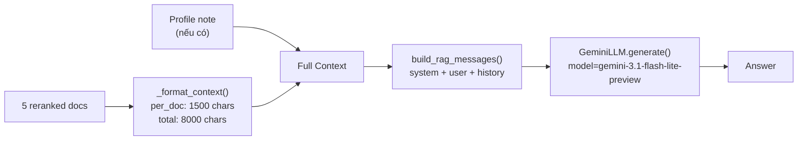
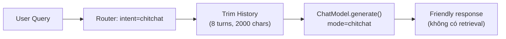

# RAG v2 — Cấu Trúc Dự Án & Flow Chi Tiết

## Mục lục
- [1. Tổng Quan Cấu Trúc Dự Án](#1-tổng-quan-cấu-trúc-dự-án)
- [2. Chi Tiết Từng Module](#2-chi-tiết-từng-module)
  - [2.1. config/ — Cấu hình tập trung](#21-config--cấu-hình-tập-trung)
  - [2.2. embedding/ — Tầng Embedding](#22-embedding--tầng-embedding)
  - [2.3. retrieval/ — Tầng Truy xuất](#23-retrieval--tầng-truy-xuất)
  - [2.4. reranking/ — Tầng Xếp hạng lại](#24-reranking--tầng-xếp-hạng-lại)
  - [2.5. query/ — Tầng Xử lý Truy vấn](#25-query--tầng-xử-lý-truy-vấn)
  - [2.6. llm/ — Tầng Mô hình Ngôn ngữ](#26-llm--tầng-mô-hình-ngôn-ngữ)
  - [2.7. tools/ — Công cụ bổ trợ](#27-tools--công-cụ-bổ-trợ)
  - [2.8. pipeline/ — Tầng Điều phối Pipeline](#28-pipeline--tầng-điều-phối-pipeline)
  - [2.9. backend/ — Server logging](#29-backend--server-logging)
  - [2.10. api/ — FastAPI Backend](#210-api--fastapi-backend)
  - [2.11. frontend/ — Giao diện người dùng](#211-frontend--giao-diện-người-dùng)
  - [2.12. Các thư mục phụ trợ](#212-các-thư-mục-phụ-trợ)
- [3. Flow Chi Tiết: Từ User Query đến Kết Quả](#3-flow-chi-tiết-từ-user-query-đến-kết-quả)

---

## 1. Tổng Quan Cấu Trúc Dự Án

```
RAG_v2/
├── config/                 # ⚙️ Cấu hình tập trung (Pydantic Settings)
├── embedding/              # 🧠 Tầng Embedding (BGE-M3, E5-Multilingual)
├── retrieval/              # 🔍 Tầng Truy xuất (Qdrant + Elasticsearch hybrid)
├── reranking/              # 📊 Tầng Xếp hạng lại (BGE Reranker v2-M3)
├── query/                  # ❓ Tầng Xử lý truy vấn (Router + Reflection + Classifier)
├── llm/                    # 💬 Tầng LLM (Gemini, LM Studio)
├── tools/                  # 🔧 Công cụ bổ trợ (Tavily Web Search)
├── pipeline/               # 🔄 Tầng Điều phối Pipeline (Orchestration)
├── api/                    # 🌐 FastAPI Backend
├── frontend/               # 🖥️ React Frontend (Vite + TypeScript)
├── backend/                # 📝 Server logging (CSV logger + Uvicorn entry)
├── models/                 # 🗄️ MongoDB models (User, Database)
├── schemas/                # 📋 Pydantic schemas (Chat, User)
├── routers/                # 🛣️ FastAPI routers (Auth)
├── auth/                   # 🔐 Authentication (JWT, Microsoft OAuth, Password)
├── document_loader/        # 📄 Đọc và chuyển đổi PDF → Markdown
├── chunking/               # ✂️ Chia nhỏ văn bản + làm giàu metadata
├── data/                   # 📂 Dữ liệu gốc (ctdt, kehoach, quydinh, stsv)
├── evaluation/             # 📈 Đánh giá retrieval & LLM quality
├── eval_dataset_builder/   # 🏗️ Xây dựng tập dữ liệu đánh giá
├── tests/                  # 🧪 Unit tests
├── scripts/                # 📜 Script tiện ích (download models)
├── utils/                  # 🛠️ Tiện ích chung (extract text, parse email)
├── .env / .env.example     # 🔑 Biến môi trường
├── docker-compose.yml      # 🐳 Docker Compose (Qdrant, ES, MongoDB)
└── README.md               # 📖 Tài liệu dự án
```

---

## 2. Chi Tiết Từng Module

### 2.1. `config/` — Cấu hình tập trung

| File | Mô tả |
|------|-------|
| [settings.py](file:///d:/GR/src/RAG_v2/config/settings.py) | **Class `Settings`** (Pydantic `BaseSettings`) — quản lý tập trung tất cả cấu hình: API keys, connection strings (Qdrant/ES/MongoDB), retrieval parameters (top_k, vector_weight), LLM provider, reranker, router mode, CORS. Tự động đọc từ file `.env`. |

> [!IMPORTANT]
> `Settings` là **trung tâm cấu hình** — mọi component đều được khởi tạo từ `Settings`. Thay đổi provider chỉ cần sửa `.env`, không cần sửa code.

---

### 2.2. `embedding/` — Tầng Embedding

Chức năng: Chuyển đổi text (query hoặc document) thành dense vector 1024 chiều.

| File | Mô tả |
|------|-------|
| [base.py](file:///d:/GR/src/RAG_v2/embedding/base.py) | **`BaseEmbedder`** — Abstract base class, định nghĩa interface: `embed()`, `embed_query()`, `embed_documents()`, `dimension`. |
| [bge_m3.py](file:///d:/GR/src/RAG_v2/embedding/bge_m3.py) | **`BGEm3Embedder`** — Wrapper cho model `BAAI/bge-m3` (FlagEmbedding). Hỗ trợ **dense + sparse** embeddings. Output: vector 1024 chiều. Sparse embeddings dùng cho keyword-level matching. |
| [e5_multilingual.py](file:///d:/GR/src/RAG_v2/embedding/e5_multilingual.py) | **`E5MultilingualEmbedder`** — Wrapper cho `intfloat/multilingual-e5-large` (SentenceTransformer). Tự động thêm prefix `"query: "` cho query và `"passage: "` cho document. Output: vector 1024 chiều. |
| [ensemble.py](file:///d:/GR/src/RAG_v2/embedding/ensemble.py) | **`EnsembleEmbedder`** — Kết hợp nhiều embedder, tính trung bình cộng các vector. |
| [\_\_init\_\_.py](file:///d:/GR/src/RAG_v2/embedding/__init__.py) | Factory function `create_embedder(settings)` — tạo embedder dựa vào `settings.embedding_provider`. |
| test_embedding.py | Unit tests cho các embedder. |

> [!TIP]
> Hệ thống sử dụng **dual named-vector** (BGE-M3 + E5) trong Qdrant. Mỗi document được lưu với 2 vector riêng biệt, giúp kết hợp sức mạnh của cả 2 model.

---

### 2.3. `retrieval/` — Tầng Truy xuất

Chức năng: Tìm kiếm hybrid (vector + keyword) trên nhiều collection, kết hợp metadata pre-filtering.

| File | Mô tả |
|------|-------|
| [base.py](file:///d:/GR/src/RAG_v2/retrieval/base.py) | **`BaseRetriever`** — Abstract base class, định nghĩa interface `search()`. |
| [qdrant_store.py](file:///d:/GR/src/RAG_v2/retrieval/qdrant_store.py) | **`QdrantStore`** — Kết nối Qdrant vector database. Hỗ trợ tìm kiếm dual-vector (BGE-M3 + E5) với score fusion. Hỗ trợ `HasIdCondition` filter cho metadata pre-filtering. |
| [elasticsearch_store.py](file:///d:/GR/src/RAG_v2/retrieval/elasticsearch_store.py) | **`ElasticsearchStore`** — Kết nối Elasticsearch. Hỗ trợ BM25 keyword search, metadata filter search (chỉ filter, không scoring), và full-text search. |
| [hybrid_search.py](file:///d:/GR/src/RAG_v2/retrieval/hybrid_search.py) | **`HybridSearch`** — Kết hợp kết quả Qdrant (vector) + Elasticsearch (BM25) bằng **Reciprocal Rank Fusion (RRF)**. Formula: `fused_score = vector_weight * rrf(vector_rank) + keyword_weight * rrf(keyword_rank)`. |
| [multi_collection_search.py](file:///d:/GR/src/RAG_v2/retrieval/multi_collection_search.py) | **`MultiCollectionSearch`** — Tìm kiếm song song trên nhiều collection (stsv, quydinh, kehoach, ctdt) bằng ThreadPool. Quy trình: ① Metadata pre-search → ② Vector search + Keyword search song song → ③ Global pooling + dedup → ④ Min-max score fusion → ⑤ Text dedup → Top-K. |
| [collection_selector.py](file:///d:/GR/src/RAG_v2/retrieval/collection_selector.py) | **`CollectionSelector`** — Chọn collection nào cần search dựa vào domain classification. Mapping: `ctdt→[ctdt]`, `quydinh→[quydinh]`, `kehoach→[kehoach]`, `stsv→[stsv]`. Khi confidence thấp → fallback tìm trên nhiều collection. |
| [metadata_filters.py](file:///d:/GR/src/RAG_v2/retrieval/metadata_filters.py) | **Per-collection metadata filter extraction** — Xây dựng chuỗi fallback filter cho mỗi collection trước khi search: `CtdtFilterExtractor` (filter theo major_code/major_name), `QuyDinhFilterExtractor` (filter theo applicable_major), `KeHoachFilterExtractor` (filter theo date). Hỗ trợ recency bonus cho kehoach (document mới hơn được ưu tiên). |
| [\_\_init\_\_.py](file:///d:/GR/src/RAG_v2/retrieval/__init__.py) | Factory function `create_retriever(settings)` — tạo `MultiCollectionSearch` từ settings. |
| config.py | File cấu hình (minimal). |
| index_to_es.py | Script index dữ liệu vào Elasticsearch. |
| index_stsv_to_es.py | Script index dữ liệu STSV vào Elasticsearch. |
| search_multi.py | Script search thử trên nhiều collection. |
| search_stsv.py | Script search thử trên collection stsv. |

> [!NOTE]
> **Metadata Pre-filtering** là cơ chế quan trọng: trước khi vector search, hệ thống sử dụng Elasticsearch để chỉ lọc theo metadata (major_code, date...) → lấy danh sách doc IDs → truyền vào Qdrant dưới dạng `HasIdCondition`. Nếu filter trả về 0 kết quả → tự động fallback tìm toàn bộ collection.

---

### 2.4. `reranking/` — Tầng Xếp hạng lại

Chức năng: Dùng cross-encoder model để tính relevance score chính xác hơn cho từng cặp (query, document).

| File | Mô tả |
|------|-------|
| [base.py](file:///d:/GR/src/RAG_v2/reranking/base.py) | **`BaseReranker`** — Abstract base class, định nghĩa interface `rerank()`. Kèm registry pattern (`@register_reranker`). |
| [bge_reranker.py](file:///d:/GR/src/RAG_v2/reranking/bge_reranker.py) | **`BGEReranker`** — Cross-encoder dùng model `BAAI/bge-reranker-v2-m3`. Nhận danh sách documents từ retrieval, score từng cặp (query, doc.text), sort descending, filter theo `score_threshold`, trả về top-K. |
| [\_\_init\_\_.py](file:///d:/GR/src/RAG_v2/reranking/__init__.py) | Factory function `create_reranker(settings)` — tạo reranker từ settings bằng lazy-import. |

---

### 2.5. `query/` — Tầng Xử lý Truy vấn (Router + Reflection + Domain Classifier)

Chức năng: Phân loại intent, xác định domain, viết lại query cho retrieval tốt hơn.

| File | Mô tả |
|------|-------|
| [router.py](file:///d:/GR/src/RAG_v2/query/router.py) | **`QueryRouter`** — Phân loại intent: `rag` / `chitchat` / `tool_search`. Hỗ trợ 2 mode: `"classifier"` (zero-cost local, ~10-50ms) và `"llm"` (OpenAI). Context-aware routing: prepend last 2 chat turns cho follow-up queries. |
| [domain_classifier.py](file:///d:/GR/src/RAG_v2/query/domain_classifier.py) | **`DomainClassifier`** — Two-stage classifier: **Stage 1**: `CalibratedClassifierCV(LogisticRegression, cv=5)` → 3-class intent (chitchat/rag/tool_search). **Stage 2** (chỉ khi rag): `OneVsRestClassifier(LogisticRegression)` → multi-label domain {ctdt, quydinh, kehoach, stsv}. Dùng BGE-M3 embeddings làm features. |
| [reflection.py](file:///d:/GR/src/RAG_v2/query/reflection.py) | **`QueryReflector`** — Viết lại query qua LLM (Gemini/LM Studio). 4 chức năng: **Rewrite** (rõ ràng hơn), **Clarify** (giải quyết đại từ "của tôi" → tên ngành), **Format** (normalize), **Add context** (từ chat history). Hỗ trợ profile extraction từ history/user_context. |
| [prompts.py](file:///d:/GR/src/RAG_v2/query/prompts.py) | Prompt templates cho Router (few-shot), Reflection (rewrite system + user), Domain Classification (Tier-3 LLM fallback). |
| [training_data.py](file:///d:/GR/src/RAG_v2/query/training_data.py) | Dữ liệu training cho DomainClassifier: ~400+ mẫu query được gán label (chitchat, rag/ctdt, rag/quydinh, ...). |
| [train_classifier.py](file:///d:/GR/src/RAG_v2/query/train_classifier.py) | Script train và lưu model DomainClassifier. |
| `models/domain_classifier.joblib` | Model đã train (serialized sklearn pipeline). |

> [!IMPORTANT]
> **Kiến trúc 3-Tier Routing:**
> - **Tier 1**: `DomainClassifier` (local, zero-cost, ~10-50ms)
> - **Tier 2**: Multi-label domain routing (nếu Tier 1 → "rag", Stage 2 xác định domains)
> - **Tier 3**: LLM Domain Fallback — khi confidence < 0.55, gọi LLM để phân loại domain (chỉ ~5% queries)

---

### 2.6. `llm/` — Tầng Mô hình Ngôn ngữ

Chức năng: Sinh câu trả lời từ context + query, tự đánh giá chất lượng.

| File | Mô tả |
|------|-------|
| [base.py](file:///d:/GR/src/RAG_v2/llm/base.py) | **`BaseLLM`** — Abstract base class: `generate()` (blocking), `generate_stream()` (streaming). Provider-agnostic. |
| [gemini.py](file:///d:/GR/src/RAG_v2/llm/gemini.py) | **`GeminiLLM`** — Provider Gemini qua OpenAI-compatible endpoint. Hỗ trợ 3 mode: `"rag"`, `"chitchat"`, `"self_eval"`. Retry với exponential backoff khi bị rate-limited. Default model: `gemini-3.1-flash-lite-preview`. |
| [lm_studio.py](file:///d:/GR/src/RAG_v2/llm/lm_studio.py) | **`LMStudioLLM`** — Provider LM Studio (local LLM server). Dùng cho reflection và generation khi chạy offline. |
| [prompts.py](file:///d:/GR/src/RAG_v2/llm/prompts.py) | **System prompts** cho 3 mode: `RAG_SYSTEM_PROMPT` (trả lời theo tài liệu), `CHITCHAT_SYSTEM_PROMPT` (trò chuyện thân thiện), `SELF_EVAL_SYSTEM_PROMPT` (đánh giá chất lượng). Kèm message builders: `build_rag_messages()`, `build_chitchat_messages()`, `build_self_eval_messages()`. |
| [self_eval.py](file:///d:/GR/src/RAG_v2/llm/self_eval.py) | **`SelfEvaluator`** — Đánh giá câu trả lời theo 3 tiêu chí: **Relevance** (liên quan?), **Faithfulness** (đúng context?), **Completeness** (đầy đủ?). Trả về pass/fail + lý do. |
| chat_model.py | Legacy wrapper (backward compatibility). |
| [\_\_init\_\_.py](file:///d:/GR/src/RAG_v2/llm/__init__.py) | Factory `create_llm(settings)` — tạo LLM provider từ settings. Registry pattern. |

---

### 2.7. `tools/` — Công cụ bổ trợ

| File | Mô tả |
|------|-------|
| [tavily_search.py](file:///d:/GR/src/RAG_v2/tools/tavily_search.py) | **`TavilySearchTool`** — Web search qua Tavily API. Dùng khi Self-Eval fail (câu trả lời từ RAG không đủ tốt) → tìm web → regenerate answer. Rate limiting + retry. Trả về kết quả structured + pre-formatted context cho LLM. |

---

### 2.8. `pipeline/` — Tầng Điều phối Pipeline

Chức năng: Orchestrator chính — kết nối tất cả tầng lại với nhau.

| File | Mô tả |
|------|-------|
| [rag_pipeline.py](file:///d:/GR/src/RAG_v2/pipeline/rag_pipeline.py) | **`RAGPipeline`** — Entry point chính. Khởi tạo tất cả components (Router, Reflector, BGE, E5, Searcher, Reranker, ChatModel, SelfEval, Tavily). 2 API: `query()` (non-streaming) và `query_stream()` (streaming). Caching cho routing + reflection. Tier-3 LLM domain fallback. MongoDB logging. |
| [flows.py](file:///d:/GR/src/RAG_v2/pipeline/flows.py) | **Flow definitions** — Chứa logic chi tiết cho: `chitchat_flow()`, `rag_flow()`, `chitchat_flow_stream()`, `rag_flow_stream()`, `_tavily_fallback()`. Xử lý: history trimming, profile extraction, search query enrichment, context formatting, context-length error recovery. |
| [mongo_logger.py](file:///d:/GR/src/RAG_v2/pipeline/mongo_logger.py) | **`MongoLogger`** — Lưu session/turn/query_log vào MongoDB. Schema 3 collection: `sessions` (metadata phiên), `turns` (từng lượt hỏi-đáp), `query_logs` (analytics). Auto-set title từ câu hỏi đầu tiên. |
| index_quydinh.py | Script index dữ liệu quy định vào Qdrant + ES. |
| index_kehoach.py | Script index dữ liệu kế hoạch vào Qdrant + ES. |
| index_stsv.py | Script index dữ liệu sổ tay sinh viên vào Qdrant + ES. |
| update_metadata.py | Script cập nhật metadata cho documents đã index. |
| test_rag_pipeline.py | Integration tests cho toàn bộ pipeline. |

---

### 2.9. `backend/` — Server Logging

| File | Mô tả |
|------|-------|
| main.py | Entry point chạy Uvicorn server (`uvicorn api.main:app`). |
| logger.py | CSV logger — ghi log mỗi query vào file CSV (latency, intent, model). |

---

### 2.10. `api/` — FastAPI Backend

| File | Mô tả |
|------|-------|
| main.py | **FastAPI app factory** — lifespan handler (load pipeline 1 lần), CORS middleware, mount routers. |
| schemas.py | Pydantic request/response schemas cho API. |
| `routes/chat.py` | **POST `/chat`** — endpoint chính xử lý query (streaming SSE). |
| `routes/session.py` | CRUD endpoints cho chat sessions (list, create, get history). |
| `routes/health.py` | Health check endpoint. |

Các module phụ trợ cho API:

| Folder | Mô tả |
|--------|-------|
| `routers/auth.py` | Authentication router (login, register, Microsoft OAuth). |
| `auth/jwt_handler.py` | JWT token creation & verification. |
| `auth/microsoft.py` | Microsoft OAuth2 integration. |
| `auth/password.py` | Password hashing (bcrypt). |
| `models/database.py` | MongoDB connection & index creation (users, sessions). |
| `models/user.py` | User model (student_id, email, major, cohort...). |
| `schemas/chat.py` | Chat request/response Pydantic models. |
| `schemas/user.py` | User request/response Pydantic models. |

---

### 2.11. `frontend/` — Giao diện người dùng

**Tech stack**: React + TypeScript + Vite + TailwindCSS + shadcn/ui

| Thành phần | Mô tả |
|------------|-------|
| `chat-companion/` | Ứng dụng chat React SPA. Giao diện chatbot với SSE streaming, session management, Microsoft login. |

---

### 2.12. Các thư mục phụ trợ

| Folder | Mô tả |
|--------|-------|
| `document_loader/` | Chuyển đổi PDF → Markdown (PyMuPDF). Clean markdown. |
| `chunking/` | Chia nhỏ markdown thành chunks + làm giàu metadata (major_code, date, article_number...). |
| `data/` | Thư mục chứa file dữ liệu gốc theo domain: `ctdt/`, `quydinh/`, `kehoach/`, `stsv/`. |
| `evaluation/` | Scripts đánh giá: retrieval quality (precision, recall, MRR), LLM answer quality. |
| `eval_dataset_builder/` | Xây dựng tập dữ liệu Q&A cho evaluation (annotation tool + pipeline). |
| `tests/` | Unit tests cho Phase 5, 7, 8 + MongoDB integration. |
| `scripts/` | `download_models.py` — script download pre-trained models. |
| `utils/` | `extract_text.py` (OCR), `parse_hust_email.py` (parse email HUST). |

---

## 3. Flow Chi Tiết: Từ User Query đến Kết Quả

### 3.1. Tổng quan luồng xử lý



### 3.2. Chi tiết từng bước

---

#### **Bước 0: Nhận Request & Load History**

```
User → POST /chat {question, session_id} → FastAPI
```

1. API endpoint nhận `question`, `session_id`, `user_context` (nếu đã login).
2. Nếu có `session_id` và chưa có `history` → **MongoLogger** truy vấn MongoDB lấy lịch sử hội thoại gần nhất (tối đa 10 turns).

---

#### **Bước 1: Query Routing (Tier 1 — Classifier)**



**Chi tiết:**
- `QueryRouter.route()` gọi `DomainClassifier.predict()`.
- **Context-aware**: prepend 2 chat turns gần nhất vào query → giúp phân loại đúng follow-up queries.
- **Stage 1**: Dùng `CalibratedClassifierCV(LogisticRegression)` phân loại 3 intent.
- **Stage 2** (chỉ khi rag): Dùng `OneVsRestClassifier` xác định multi-label domain.
- **Kết quả**: `{intent, domain, domains, confidence, probabilities}`.
- Cache TTL = 45s, tránh repeat classifier calls.

---

#### **Bước 1b: Tier-3 LLM Domain Fallback (nếu confidence < 0.55)**

Khi classifier không tự tin → gọi LLM (Gemini) để phân loại domain:
- Gửi prompt `DOMAIN_CLASSIFICATION_PROMPT` + query + recent context.
- LLM trả về JSON: `{domains: [...], confidence: "high|medium|low"}`.
- Override routing result nếu domains hợp lệ.
- Chỉ trigger cho ~5% queries.

---

#### **Bước 2: Query Reflection (viết lại query)**

```
Original: "Chương trình của tôi có bao nhiêu tín chỉ?"
                            ↓ QueryReflector.reflect()
Rewritten: "Chương trình đào tạo ngành Công nghệ thông tin Việt-Nhật (IT-E6) có tổng cộng bao nhiêu tín chỉ?"
```

**Chi tiết:**
- `QueryReflector` gọi LLM (Gemini/LM Studio) với `REWRITE_SYSTEM_PROMPT`.
- **Profile injection**: Nếu có `user_context` (từ login) → inject thông tin sinh viên vào prompt.
- **History extraction**: Nếu không có user_context → regex scan history để tìm major/year/GPA.
- **Mục đích**: Thay thế đại từ ("của tôi", "ngành tôi") bằng tên cụ thể, mở rộng viết tắt, thêm context.
- Cache TTL = 30s.

---

#### **Bước 2b: Post-Reflection Enrichment**

Nếu sau reflection vẫn còn đại từ chưa giải quyết (regex detect "của tôi", "ngành tôi"...):
- **Priority 1**: Dùng authenticated `user_context` → append profile note vào query.
- **Priority 2**: Regex scan history → extract profile → append.

---

#### **Bước 3: Collection Selection**



- Chuyển domain classification thành danh sách Qdrant collections cần search.
- Confidence threshold = 0.55.

---

#### **Bước 4: Dual Embedding**

```
search_query → BGE-M3.embed_query() → bge_vec (1024d)
search_query → E5.embed_query()     → e5_vec  (1024d)
```

- 2 embedding models chạy tuần tự (không song song vì dùng GPU).
- BGE-M3: mạnh về multilingual semantic matching.
- E5: mạnh về cross-lingual retrieval.

---

#### **Bước 5: Metadata Pre-filtering**



**Chi tiết per-collection:**
- **ctdt**: Filter theo `major_code` (exact) → fallback `major_name` (fuzzy) → no filter.
- **quydinh**: Filter theo `applicable_major` array → no filter.
- **kehoach**: Filter theo date khi query chứa năm/tháng → no filter.
- **stsv**: Không filter metadata.

Cơ chế fallback chain: thử lần lượt từ strict → loose → no filter.

---

#### **Bước 6: Multi-Collection Hybrid Search**



**Quy trình:**
1. **Search song song** trên tất cả target collections (4 threads).
2. Mỗi collection: Qdrant vector search (20 results) + ES BM25 search (20 results).
3. **Global pooling**: gộp tất cả vector results → sort by cosine → dedup by ID → top 15.
4. Tương tự cho keyword results → top 15.
5. **Score fusion**: min-max normalize mỗi pool → weighted sum (default: 0.8 vector + 0.2 keyword).
6. **Recency bonus** cho kehoach collection (max +0.05, linear decay 365 ngày).
7. **Text dedup**: loại bỏ chunks có text giống nhau.
8. Return top-K (default 20 → sẽ được rerank xuống 5).

---

#### **Bước 7: Reranking**

```
20 candidates + search_query → BGEReranker.rerank()
    → Score mỗi (query, doc.text) pair
    → Sort descending
    → Filter score_threshold ≥ 0.0
    → Top-5 documents
```

- **Cross-encoder** `BAAI/bge-reranker-v2-m3` tính relevance score chính xác.
- So sánh với bi-encoder (embedding): chậm hơn nhưng chính xác hơn nhiều.
- Output: 5 reranked documents với `rerank_score`.

---

#### **Bước 8: Format Context & Generate Answer**



**Chi tiết:**
1. **Format context**: Cắt mỗi document max 1500 chars, tổng max 8000 chars.
2. **Profile note**: Prepend thông tin sinh viên (nếu biết) vào context.
3. **Build messages**: System prompt (RAG) + User prompt (history + context + query).
4. **Generate**: Gọi Gemini với temperature=0.3, max_tokens=5120.
5. **Context-length recovery**: Nếu prompt quá dài → tự động reduce context (2 docs, 1500 chars) + trim history (3 turns) → retry.

---

#### **Bước 9: Self-Evaluation (điều kiện)**

> Chỉ chạy khi `top_rerank_score < 0.72` (retrieval không tự tin)

```
SelfEvaluator.evaluate(query, context, answer)
    → LLM judge đánh giá:
        - Relevance: good/partial/bad
        - Faithfulness: grounded/partially_grounded/hallucinated
        - Completeness: complete/partial/incomplete
    → pass = true/false + reason
```

- Nếu `pass=true` → giữ nguyên answer.
- Nếu `pass=false` → trigger Tavily fallback.
- Skip khi `top_score ≥ 0.72` → tiết kiệm 11-20s.

---

#### **Bước 10: Tavily Web Search Fallback (nếu self-eval fail)**

```
question → TavilySearchTool.search() → web_context
web_context + question → LLM.generate() → new_answer
```

- Tìm kiếm web qua Tavily API (5 kết quả).
- Format web results thành context.
- Gọi LLM regenerate answer dựa trên web context.

---

#### **Bước 11: MongoDB Logging & Response**

```
MongoLogger.log_turn():
    sessions → update turn_count, updated_at
    turns    → insert {session_id, question, answer, intent, sources, timings_ms}
    query_logs → insert flat analytics entry
```

**Response trả về:**
```json
{
  "question": "...",
  "answer": "...",
  "sources": [...],
  "num_sources": 5,
  "intent": "rag",
  "model_name": "gemini-3.1-flash-lite-preview",
  "target_collections": ["ctdt"],
  "collection_scores": [...],
  "reflected_question": "...",
  "timings_ms": {
    "routing": 12.5,
    "reflection": 450.0,
    "embed_bge": 35.2,
    "embed_e5": 28.1,
    "search": 120.3,
    "rerank": 85.7,
    "generate": 2100.0,
    "pipeline_total": 2890.5
  }
}
```

---

### 3.3. Flow cho Chitchat Intent



- **Không cần retrieval/rerank** — LLM trả lời trực tiếp.
- **Không log MongoDB** — tránh noise trong history.
- History được trim: max 8 turns, 400 chars/message, 2000 chars total.

---

### 3.4. Streaming Flow

Cả RAG và Chitchat đều hỗ trợ **streaming** qua `query_stream()`:
- Retrieval + reranking chạy **synchronous** trước.
- Generation chạy **streaming** (SSE chunks qua FastAPI).
- Sau khi stream xong → log to MongoDB.
- Frontend nhận SSE events và render real-time.

---

### 3.5. Tóm tắt Pipeline Timing (typical values)

| Bước | Thời gian (ms) |
|------|----------------|
| Routing (Classifier) | 10—50 |
| Reflection (LLM) | 200—500 |
| Embedding (BGE + E5) | 50—100 |
| Metadata Pre-filter | 10—30 |
| Hybrid Search (4 collections) | 80—200 |
| Reranking (Cross-encoder) | 50—150 |
| LLM Generation | 1500—3000 |
| Self-Eval (khi cần) | 1000—2000 |
| **Total (no self-eval)** | **~2000—4000** |
