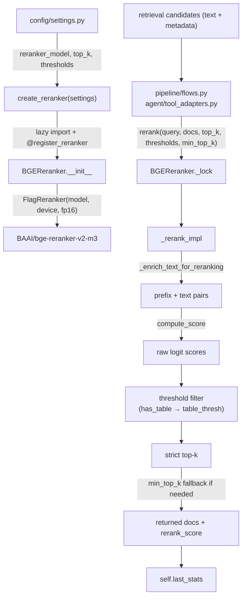

# Module: `reranking`

Source-verified: 2026-06-24 from `reranking/__init__.py`, `reranking/base.py`, `reranking/bge_reranker.py`, `config/settings.py`.

## Purpose

`reranking` reorders retrieved candidate documents with a cross-encoder. It is the second-stage relevance layer after vector/BM25 retrieval.

The only production implementation is the BGE reranker (`BAAI/bge-reranker-v2-m3`). When `reranker_provider == "none"`, the factory returns `None` and callers skip reranking entirely.

**Boundaries:**
- Consumes candidate dicts (each with a `"text"` key) from retrieval; returns reordered candidate dicts.
- Does not retrieve, embed, or generate — pure scoring/filtering.
- Threshold and top-k settings are owned by `config` and injected by `create_reranker()` / call-site kwargs.
- `rerank_score` field and `last_stats` keys must stay aligned with API response mapping, trace UI, and eval scripts.

## File Map

```text
reranking/
  __init__.py       Factory create_reranker(), provider registry import,
                    lazy BGEReranker export via __getattr__, OS-memory guard.
  base.py           BaseReranker abstract interface, register_reranker()
                    decorator, and _REGISTRY dict.
  bge_reranker.py   BGEReranker cross-encoder implementation (registered as "bge").
```

## Public API

### `register_reranker(name: str)`

Decorator that registers a concrete class in `base._REGISTRY` under `name`. Called at module import time via `@register_reranker("bge")` in `bge_reranker.py`.

### `BaseReranker` (abstract)

```python
class BaseReranker(ABC):
    @abstractmethod
    def rerank(
        self,
        query: str,
        documents: List[Dict[str, Any]],
        top_k: int = 5,
        score_threshold: Optional[float] = None,
        table_score_threshold: Optional[float] = None,
    ) -> List[Dict[str, Any]]: ...
```

Note: the abstract signature does **not** include `min_top_k`; that parameter is added only by `BGEReranker`.

### `create_reranker(settings) -> Optional[BaseReranker]`

```python
def create_reranker(settings: Settings) -> Optional[BaseReranker]
```

- `settings.reranker_provider == "none"` → returns `None`.
- Known provider (currently only `"bge"`, mapped via `_PROVIDER_MODULES`) → lazy-imports the module to trigger `@register_reranker`, then instantiates with four settings keys:
  - `settings.reranker_model`
  - `settings.reranker_top_k`
  - `settings.reranker_score_threshold`
  - `settings.reranker_table_score_threshold`
- Unknown provider → raises `ValueError`.
- `OSError` on model load: if `_is_model_memory_error()` matches (WinError 1455, `"paging file is too small"`, `"cannot allocate memory"`, `"not enough memory"`), logs a warning and returns `None` so the pipeline continues without reranking. Other `OSError`s re-raise.

`reranking.__init__` lazily resolves `BGEReranker` via module `__getattr__` so importing the factory does not pull in `torch` / `FlagEmbedding` at startup.

## BGEReranker

### Constructor

```python
class BGEReranker(BaseReranker):
    def __init__(
        self,
        model_name: str = "BAAI/bge-reranker-v2-m3",
        device: Optional[str] = None,
        use_fp16: Optional[bool] = None,
        batch_size: int = 32,
        top_k: int = 5,
        score_threshold: float = 0.0,
        table_score_threshold: float = -3.0,
    ) -> None
```

**Class-level defaults** (i.e. when constructed directly without `create_reranker`):
- `score_threshold = 0.0`
- `table_score_threshold = -3.0`

**Config-level defaults** (i.e. what `create_reranker` injects from `settings`):
- `reranker_score_threshold = 0.0`
- `reranker_table_score_threshold = -1.0`
- `reranker_top_k = 7`
- `reranker_min_top_k = 3`

The production instance always receives the config-level values; the class defaults only matter in direct unit-test construction.

**Device resolution** (`_resolve_torch_device`): CUDA → Apple MPS → CPU, in that order. When `device=None` (default), auto-detected at construction. `use_fp16` defaults to `True` on CUDA, `False` otherwise (set from `device` after resolution when `use_fp16 is None`).

**Thread safety:** `FlagReranker`'s tokenizer is not thread-safe and raises `"Already borrowed"` under concurrency. `BGEReranker` owns a `threading.Lock` (`self._lock`) and serializes all `rerank()` calls internally. Callers do **not** need their own locks.

### `rerank()` — public entry point

```python
def rerank(
    self,
    query: str,
    documents: List[Dict[str, Any]],
    top_k: Optional[int] = None,
    score_threshold: Optional[float] = None,
    table_score_threshold: Optional[float] = None,
    min_top_k: Optional[int] = None,
) -> List[Dict[str, Any]]
```

Acquires `self._lock`, then delegates to `_rerank_impl`. All kwargs override instance defaults for that call only.

### `_rerank_impl()` — scoring logic

Each document dict **must** contain a `"text"` key.

**Scoring pipeline:**

1. `_enrich_text_for_reranking(doc)` prepends metadata context to the document text fed to the cross-encoder:
   - `metadata.hierarchy_path` (if present)
   - `"Ngành: {metadata.major_code}"` (if present)
   - `"Tài liệu: {metadata.title}"` (if present)
   - Parts joined with ` | `; prepended to `text` with `\n`.
2. `FlagReranker.compute_score(pairs, batch_size=self.batch_size)` returns raw logits (not probabilities). Returns a single `float` when only one pair — normalized to a list.
3. All docs sorted descending by `rerank_score`.
4. **Threshold filtering (before top-k):** each doc uses `table_score_threshold` if `metadata.has_table` is truthy, else `score_threshold`. Docs below their threshold are dropped.
5. `strict_top_docs = filtered[:top_k]`.
6. **`min_top_k` fallback:** if `len(strict_top_docs) < min(top_k, min_top_k, len(scored_docs))`, appends the best below-threshold docs (in score order, de-duplicated by `id()`) until the floor is reached. Flagged in `last_stats` as `rerank_threshold_fallback_used`.

**Return shape:** list of dicts, each augmented with `"rerank_score": float`. Threshold-passing docs come first; fallback docs appended after when `min_top_k` is set.

### `last_stats` keys

Written after every `_rerank_impl` call; used by evaluation scripts and pipeline trace:

| Key | Meaning |
|-----|---------|
| `rerank_candidate_count` | total docs scored |
| `rerank_threshold_dropped_count` | docs below threshold |
| `rerank_dropped_count` | docs not in final return (includes threshold + top-k cuts) |
| `rerank_passing_count` | docs passing threshold |
| `rerank_strict_returned_count` | docs in strict top-k (no fallback) |
| `rerank_strict_returned_ids` | chunk/doc ids of strict results (via `_doc_id_for_stats`) |
| `rerank_threshold_fallback_used` | bool |
| `rerank_threshold_fallback_count` | number of fallback docs appended |
| `rerank_returned_count` | final returned count |
| `rerank_score_min/max/mean` | score distribution (6 decimal places) |

### `_doc_id_for_stats(doc)` — static

Tries in order: `doc.id`, `doc.chunk_id`, `doc.source_id`, `metadata.chunk_id`, `metadata.id`, `metadata.doc_id`, `metadata.document_id`. Strips the leading path component if the value contains `/`.

## Config Keys (all in `config/settings.py`)

| Key | Default | Notes |
|-----|---------|-------|
| `reranker_provider` | `"bge"` | `"bge"` \| `"none"` |
| `reranker_model` | `"BAAI/bge-reranker-v2-m3"` | HuggingFace model id |
| `reranker_top_k` | `7` | Max docs returned |
| `reranker_score_threshold` | `0.0` | Raw logit floor for regular chunks |
| `reranker_table_score_threshold` | `-1.0` | Relaxed floor for `has_table` chunks |
| `reranker_min_top_k` | `3` | Fallback floor; passed as `min_top_k` kwarg |

`reranker_min_top_k` is **not** passed by `create_reranker()` — it is read from `settings` by `pipeline/flows.py` (`_reranker_min_top_k()`) and `agent/tool_adapters.py` at call sites, then forwarded as the `min_top_k` kwarg to `rerank()`.

## Module Flow



## Consumers (external boundaries)

- `pipeline/flows.py`: calls `rerank()` in classic and streaming RAG flows; reads `reranker_min_top_k` from cfg via `_reranker_min_top_k()`.
- `agent/tool_adapters.py`: calls `rerank()` for agent search results; reads `reranker_min_top_k` via `getattr(settings, "reranker_min_top_k", 0)`.
- `pipeline/rag_pipeline.py`: passes reranker config into `_cfg` dict at pipeline init.
- `evaluation/evaluate_e2e_pipeline.py`: mutates `pipeline._reranker.score_threshold` / `table_score_threshold` directly for sweep experiments.
- `evaluation/reranker_threshold_calib.py`: calibration script to choose threshold from labelled data.

## Maintenance Notes

- `reranker_min_top_k` is **not** wired through `create_reranker()`; it is the responsibility of each call site (`pipeline/flows.py`, `agent/tool_adapters.py`) to read it from settings and forward as `min_top_k`.
- Keep threshold filtering **before** top-k truncation. Reversing this would let high-ranked non-table docs failing the strict threshold fill slots and exclude valid table docs that pass the relaxed threshold.
- Preserve `min_top_k` fallback so retrieval never returns zero docs when all scores are below threshold.
- Thread safety is **internal** to `BGEReranker` (`self._lock`). Callers must not add their own locks around `rerank()`.
- Lazy import in `__init__.py` keeps `torch`/`FlagEmbedding` out of the import-time critical path. Do not eagerly import `bge_reranker` from `__init__`.
- Preserve OS-memory guard in `create_reranker()` — loading 560 MB+ model weights on Windows can hit WinError 1455 (paging file too small); the guard degrades gracefully to no-reranker.
- If `rerank_score` field name or any `last_stats` key changes, update: API response mapping, frontend trace UI, and `evaluation/evaluate_e2e_pipeline.py` result serialization.
- `FlagReranker.compute_score` returns a single `float` (not a list) when exactly one pair is passed — the scalar normalization in `_rerank_impl` must be preserved.

## Useful Checks

```bash
# Syntax check
python -m py_compile src/RAG_v2/reranking/__init__.py src/RAG_v2/reranking/base.py src/RAG_v2/reranking/bge_reranker.py

# Unit tests (no GPU needed — model is mocked)
pytest tests/test_reranker_factory.py tests/test_reranker_thresholds.py -q -m "not integration"
```
