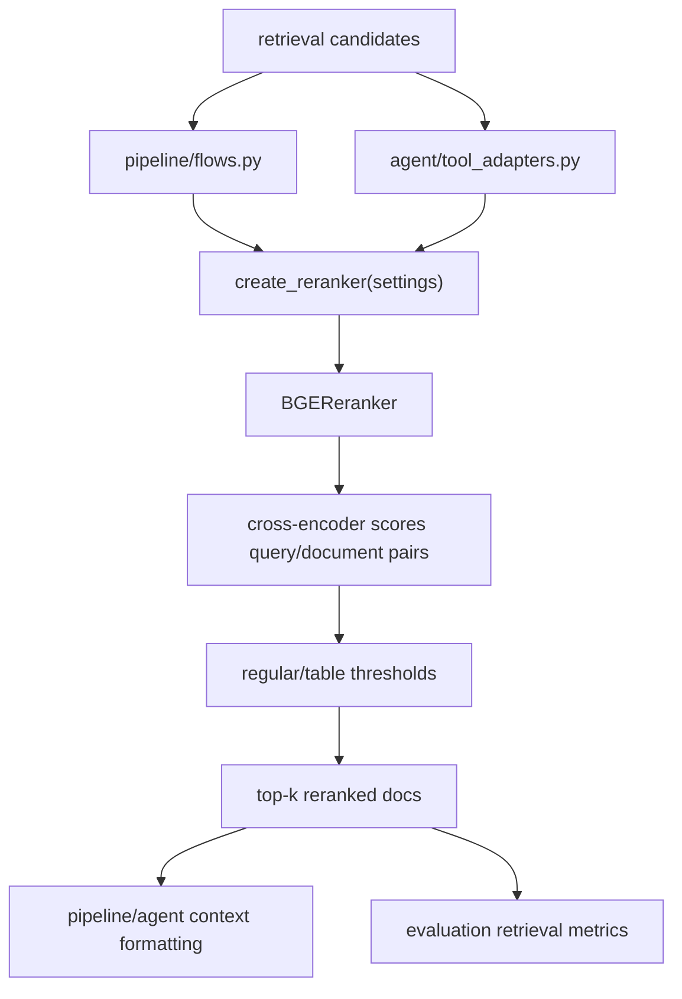

# Module: `reranking`

Source-verified: 2026-06-05 from `reranking/__init__.py`, `reranking/base.py`, `reranking/bge_reranker.py`.

## Purpose

`reranking` reorders retrieved candidate documents with a cross-encoder. It is the second-stage relevance layer after vector/BM25 retrieval.

The only production implementation is the BGE reranker. When `reranker_provider == "none"`, the factory returns `None` (no reranker object) and callers skip reranking.

## File Map

```text
reranking/
  __init__.py       Factory `create_reranker()`, provider registry import, lazy `BGEReranker` export, OS-memory guard.
  base.py           `BaseReranker` abstract interface + `register_reranker` decorator and `_REGISTRY`.
  bge_reranker.py   `BGEReranker` cross-encoder implementation (registered as "bge").
```

## Public API

`BaseReranker` (abstract) defines:

```python
rerank(query, documents, top_k=5, score_threshold=None, table_score_threshold=None) -> list[dict]
```

`register_reranker(name)` is a decorator that registers a concrete class in `base._REGISTRY`.

`create_reranker(settings) -> Optional[BaseReranker]`:

- `settings.reranker_provider == "none"` -> returns `None`.
- known provider (currently only `"bge"`, mapped via `_PROVIDER_MODULES`) -> lazy-imports the module to trigger registration, then instantiates the registered class with `reranker_model`, `reranker_top_k`, `reranker_score_threshold`, `reranker_table_score_threshold`.
- unknown provider -> raises `ValueError`.
- If model weights fail to load due to OS memory pressure (`_is_model_memory_error`: WinError 1455, "paging file is too small", "cannot allocate memory", "not enough memory"), logs a warning and returns `None` so the pipeline continues without reranking. Other `OSError`s re-raise.

`reranking.__init__` lazily resolves `BGEReranker` via module `__getattr__` so importing the factory does not immediately import heavy ML dependencies (`torch`, `FlagEmbedding`).

## BGEReranker Behavior

`BGEReranker` (model `BAAI/bge-reranker-v2-m3`) scores `(query, document_text)` pairs with `FlagReranker.compute_score` and sorts descending. Device is auto-resolved CUDA → Apple MPS → CPU; `use_fp16` defaults to True on CUDA. Default `batch_size=32`.

`rerank(query, documents, top_k=None, score_threshold=None, table_score_threshold=None, min_top_k=None)`:

- Each document dict must contain a `"text"` key; `_enrich_text_for_reranking` prepends `hierarchy_path`, `major_code` ("Ngành: …"), and `title` ("Tài liệu: …") from `metadata` for richer context.
- Writes a `rerank_score` float into each returned dict.
- Applies the per-document score threshold BEFORE `top_k` truncation. Docs whose `metadata.has_table` is truthy use `table_score_threshold`; others use `score_threshold`.
- `min_top_k`: if the strict threshold-passing top-K is smaller than `min(top_k, min_top_k, len(scored))`, appends the best below-threshold docs as fallback so retrieval never returns zero.
- Records detailed counters in `self.last_stats` (candidate/passing/dropped/strict/fallback counts, returned ids, score min/max/mean) for evaluation and trace.

Thresholds:

- `reranker_score_threshold`: regular chunks.
- `reranker_table_score_threshold`: chunks with table metadata.
- Both default to `-1.0` in `config/settings.py` (BGE returns raw logits, not probabilities).

## Consumers (external boundaries)

Reranking exposes only `create_reranker` / `BaseReranker.rerank`. Known consumers that hold a reranker and call `rerank`:

- `retrieval` / `pipeline` flows: rerank retrieved candidates before context assembly.
- `agent` tool adapters: rerank agent search results.
- `evaluation` scripts: measure reranked top-k quality via `last_stats`.

## Module Flow



External module boundaries:

- Reranking consumes candidate dicts (each with a `"text"` key) from `retrieval` and returns reordered candidate dicts; it does not retrieve or generate.
- Threshold and top-k settings are owned by `config` and passed in by `create_reranker`/callers.
- `rerank_score` field and `last_stats` keys must stay aligned with API response mapping, trace UI, and eval scripts.

## Maintenance Notes

- Keep threshold filtering before top-k truncation.
- Preserve the `min_top_k` fallback so retrieval never returns zero docs when all scores are below threshold.
- If changing the `rerank_score` field or `last_stats` keys, update API response mapping, frontend trace, and eval metrics.
- Preserve lazy import behavior in `__init__.py` and the OS-memory guard in `create_reranker`.
- If making reranker concurrent, prove tokenizer/runtime thread safety first (callers currently serialize access).

## Useful Checks

```bash
python -m py_compile reranking/*.py
python -m pytest tests/test_reranker_factory.py tests/test_reranker_thresholds.py -q -m "not integration"
```
