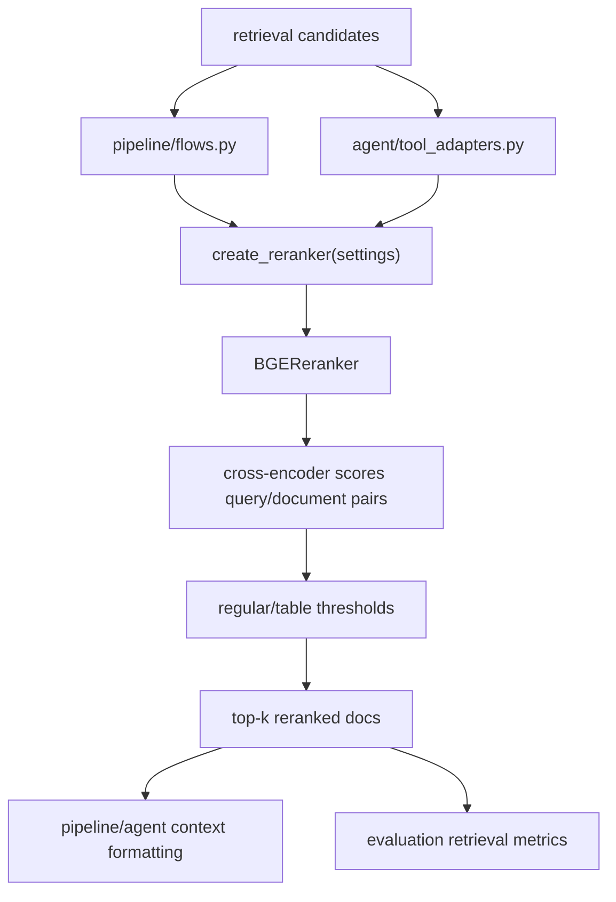

# Module: `reranking`

Source-verified: 2026-06-02 from `reranking/*.py`, `retrieval/service.py`, `pipeline/flows.py`, `agent/tool_adapters.py`, and tests.

## Purpose

`reranking` reorders retrieved candidate documents with a cross-encoder. It is the second-stage relevance layer after vector/BM25 retrieval.

The production implementation is BGE reranker. A no-op fallback is available when reranking is disabled.

## File Map

```text
reranking/
  __init__.py       Factory `create_reranker()` and lazy `BGEReranker` export.
  base.py           BaseReranker abstract interface.
  bge_reranker.py   BGEReranker cross-encoder implementation.
```

## Public API

`BaseReranker` defines:

```python
rerank(query: str, documents: list[dict], top_k: int) -> list[dict]
```

`create_reranker(settings)`:

- `settings.reranker_provider == "bge"` -> `BGEReranker`
- falsey/none provider -> no-op reranker

`reranking.__init__` lazily resolves `BGEReranker` so importing the factory does not immediately import heavy ML dependencies.

## BGEReranker Behavior

`BGEReranker` scores `(query, document_text)` pairs and sorts descending.

Important behavior:

- Uses `settings.reranker_model`, default `BAAI/bge-reranker-v2-m3`.
- Writes `rerank_score` into documents.
- Applies score threshold before top-k truncation.
- Supports separate table threshold through `reranker_table_score_threshold`.

Thresholds:

- `reranker_score_threshold`: regular chunks.
- `reranker_table_score_threshold`: chunks with table metadata, default lower to preserve useful curriculum tables.

## Integration Points

- `retrieval/service.py`: optional reranker in full retrieval service.
- `pipeline/flows.py`: reranks classic RAG candidates.
- `agent/tool_adapters.py`: reranks agent `rag_search` results, guarded by `_RERANKER_LOCK`.
- `evaluation/evaluate_current_pipeline.py`: evaluates reranked top-k quality.

## Module Flow



External module boundaries:

- Reranking consumes candidate dicts from `retrieval` and returns reordered candidate dicts; it does not retrieve or generate.
- Threshold and top-k settings are owned by `config` and passed by `pipeline`/agent adapters.
- Score field changes must stay aligned with `api/response_mapper.py`, trace UI, and eval scripts.

## Maintenance Notes

- Keep threshold filtering before top-k truncation.
- If changing document score fields, update API response mapper, frontend trace, and eval metrics.
- Preserve lazy import behavior in `__init__.py`.
- If making reranker concurrent, prove tokenizer/runtime thread safety first and update agent adapter lock behavior.

## Useful Checks

```bash
python -m py_compile reranking/*.py
python -m pytest tests/test_reranker_factory.py tests/test_reranker_thresholds.py -q -m "not integration"
```
