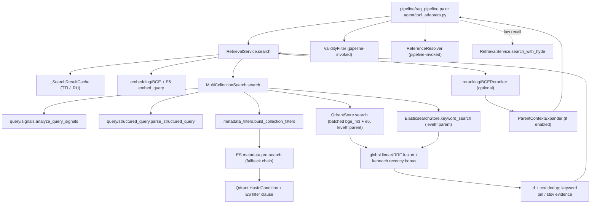

# Module: `retrieval`

Source-verified: 2026-06-05 from every `retrieval/*.py` file (`__init__.py`, `base.py`, `service.py`, `qdrant_store.py`, `elasticsearch_store.py`, `hybrid_search.py`, `multi_collection_search.py`, `metadata_filters.py`, `collection_selector.py`, `query_expander.py`, `hyde.py`, `parent_context.py`, `validity_filter.py`, `reference_resolver.py`, `search_stsv.py`, `index_stsv_to_es.py`, `config.py`), plus `config/settings.py` and `pipeline/rag_pipeline.py` integration points.

## Purpose

`retrieval` owns the entire document search stack:

- **Vector search** — Qdrant with dual named BGE-M3 + E5 vectors, batched in one round-trip and fused via per-model min-max-normalised weighting.
- **Keyword search** — Elasticsearch BM25 with a CocCoc Vietnamese-tokenizer analyzer (synonyms, stopwords, ASCII-folding), custom BM25 similarity, phrase boosting and a fuzzy fallback pass.
- **Metadata pre-filtering** — per-collection ES filter fallback chains that constrain both Qdrant (`HasIdCondition`) and ES keyword search.
- **Multi-collection fusion** — parallel per-collection search → global pooling → score normalisation → weighted fusion (linear or RRF).
- **Adaptive fusion weights** — shift toward keyword-heavy scoring for course-like and exact-policy queries.
- **Recency boost** — `kehoach` documents get an additive score bonus proportional to freshness.
- **Parent/child handling** — parent chunks are excluded from search; child results are optionally enriched with parent content.
- **Structured query processing** — exclusion terms (`-keyword`) are parsed and applied as `must_not` clauses + post-filters.
- **Validity filtering** — removes superseded regulation documents via `data/document_lineage.json` (invoked by the pipeline, not by `RetrievalService.search()`).
- **Cross-reference resolution** — detects Vietnamese legal references (Điều/Khoản) and injects same-document chunks (pipeline-invoked).
- **Collection selection** — maps domain classification + query signals to target collections with confidence-aware fallback.
- **`RetrievalService`** — shared singleton wrapping all infrastructure, with a TTL search cache, multi-query and HyDE paths, injected into both pipeline and agent tools.

---

## File Map

```text
retrieval/
  __init__.py                  Public exports and create_retriever() factory.
  base.py                      BaseRetriever abstract interface (search()).
  service.py                   RetrievalService singleton + _SearchResultCache (TTL/LRU).
  qdrant_store.py              QdrantStore — dual named-vector collection (BGE-M3 + E5), batched search + fusion, CRUD/metadata helpers.
  elasticsearch_store.py       ElasticsearchStore — BM25 keyword + metadata-filter search, CocCoc Vietnamese analyzer, ID resolution, freshness query.
  hybrid_search.py             HybridSearch — per-collection vector/keyword RRF fusion (DEPRECATED in main flow; used by tests/demo).
  multi_collection_search.py   MultiCollectionSearch — parallel global multi-collection search and fusion.
  metadata_filters.py          Per-collection filter extractors, major/cohort/date helpers, comparison subqueries, recency bonus.
  collection_selector.py       Domain + signals → collection selection with confidence fallback and augmentation.
  query_expander.py            MultiQueryExpander — multi-query variants for recall-oriented searches.
  hyde.py                      HyDEExpander + should_use_hyde() — optional hypothesis-embedding fallback.
  parent_context.py            ParentContextExpander — attach parent chunk content to child results.
  validity_filter.py           ValidityFilter — drop superseded documents using data/document_lineage.json.
  reference_resolver.py        ReferenceResolver — resolve legal references such as Điều/Khoản.
  search_stsv.py               Standalone hybrid-search demo (uses HybridSearch directly).
  index_stsv_to_es.py          ES indexing utility (scroll Qdrant → bulk-index to ES); COLLECTION/ES_INDEX default to "quydinh".
  config.py                    HyDE fallback config constants (mirrored in config/settings.py).
```

---

## RetrievalService

`RetrievalService.from_settings(settings)` is the canonical entry-point. It builds and holds:

| Component | Class | Purpose |
|-----------|-------|---------|
| `bge_embedder` | `BGEm3Embedder` | 1024-dim BGE-M3 dense embeddings |
| `e5_embedder` | `E5MultilingualEmbedder` | 1024-dim E5-multilingual dense embeddings |
| `searcher` | `MultiCollectionSearch` | Parallel hybrid search across collections (via `create_retriever`) |
| `reranker` | `create_reranker(settings)` | Optional cross-encoder reranker |
| `tavily_tool` | `TavilySearchTool` | Optional web search tool (created only with a valid API key) |
| `_search_cache` | `_SearchResultCache` | TTL/LRU cache (maxsize=128, ttl=180s) of pre-rerank results |

### Methods

| Method | Signature | Description |
|--------|-----------|-------------|
| `embed_query` | `(query) → (bge_vec, e5_vec)` | Embed with both models |
| `search` | `(query, *, collections=None, top_k=None, resolved_major=None, resolved_cohort=None, rerank=True, entities=None, use_multi_query=False) → List[Dict]` | Hybrid search + optional reranking + optional multi-query/parent expansion |
| `search_with_hyde` | `(query, llm, *, collections=None, top_k=None, resolved_major=None, resolved_cohort=None) → List[Dict]` | HyDE fallback: BGE vector from hypothesis, E5 from original query; returns un-reranked top-k |

Tavily calls are made through the pipeline/agent tool layer; `RetrievalService` only holds the optional `tavily_tool` for wiring.

### `search()` internals

1. `effective_top_k = top_k or settings.top_k`.
2. `raw_candidate_k = max(effective_top_k × 8, 40)` (over-fetch funnel before rerank).
3. `active_collections = collections or settings.collections`.
4. If `use_multi_query and entities`: build up to 3 variants with `MultiQueryExpander`; if >1 variant → `_search_multi_query` (per-variant search, merge+dedup by id, rerank merged pool with variant[0]).
5. Otherwise `_search_single`:
   - Check `_search_cache` keyed by (query, collections, resolved_major, resolved_cohort). On miss, embed both vectors and call `searcher.search()` with `vector_top_k`/`keyword_top_k`/`vector_pool_k`/`keyword_pool_k` from settings, then cache the **pre-rerank** results.
   - If `rerank` and reranker exists → `reranker.rerank(query, documents, top_k=effective_top_k)`. Else truncate to `effective_top_k`.
   - If `settings.parent_context_enabled` → `_expand_parent_context()` enriches child results with parent content (grouped per collection).

`RetrievalService` is created once by `RAGPipeline` (`from_settings`) and injected into agent tools via `tool_adapters.set_retrieval_service()`.

---

## Module Flow



External module boundaries:

- Receives routed collections/entities/resolved major+cohort from `query`/`pipeline`; it does not decide chat mode or final answer wording.
- Owns Qdrant/Elasticsearch access and returns normalised candidate dicts for `pipeline`, `agent`, `api`, and `evaluation`.
- Consumes `embedding` and `reranking` instances built by `RetrievalService.from_settings()`.
- `ValidityFilter` and `ReferenceResolver` are constructed and called by `RAGPipeline`, not inside `RetrievalService.search()`; `ReferenceResolver` itself calls back into `RetrievalService.search()` for its semantic fallback.
- Reads metadata/lineage conventions from `data/` and must stay aligned with `scripts`/`chunking` output fields.

---

## Store Contracts

### Qdrant (`QdrantStore`)

- One collection per domain (e.g. `stsv`, `quydinh`, `kehoach`, `ctdt`); `DEFAULT_COLLECTION = "stsv"`.
- **Named vectors** (`VECTOR_CONFIGS`): `bge_m3` and `e5`, each 1024 dims, cosine distance.
- **Search params**: `hnsw_ef=128, exact=False`.
- **Per-vector over-fetch**: `per_vector_k = min(top_k × 2, 100)`.
- **Batched search**: both named-vector queries run in a single `query_batch_points` round-trip, then `_fuse_results()` combines them.
- **Dual-vector fusion** (within Qdrant): per-model min-max normalisation of bge/e5 scores, then `fused = bge_weight × norm_bge + e5_weight × norm_e5` (default weights `0.5/0.5`). Single/identical-score pools normalise to `0.0` (offset = max−1, range = 1.0).
- Result dicts: `{"id", "text", "metadata", "score", "bge_score", "e5_score"}`.
- Other helpers: `index_documents`, `get_by_ids`, `get_by_metadata` (returns `collection` too), `update_metadata_by_ids` / `_batch` / `_by_filter`, `delete_by_metadata`, `count`, `delete_collection`.

### Elasticsearch (`ElasticsearchStore`)

- Index name matches collection name; `DEFAULT_INDEX = "stsv"`. Connection is verified with `ping()` (raises `ConnectionError` on failure).
- **Analyzer** (`vietnamese_analyzer`): CocCoc `vi_tokenizer` when the plugin is present, else `standard` tokenizer fallback. Filter chain: `lowercase`, `vietnamese_synonym` (Vietnamese academic synonym list), `vietnamese_stop` (Vietnamese stopwords), `vietnamese_ascii_folding` (asciifolding, `preserve_original`). `_index_uses_vi_tokenizer()` detects plugin mode on existing indices; `uses_vietnamese_plugin` flag drives Python-side segmentation fallback in `keyword_search`. `INDEX_SETTINGS` is exported for legacy callers/tests.
- **Similarity**: custom BM25 `custom_bm25` (`k1=1.5, b=0.5`); shards=1, replicas=0.
- **Text fields** (custom analyzer; `+keyword` subfield where noted): `search_text`, `text`, `title`(+kw), `doc_title`(+kw), `hierarchy_path`(+kw), `section_context`(+kw), `section_h1..h4`(+kw), `course_name`(+kw), `semester`(+kw), `major_name`(+kw).
- **Keyword fields**: `type_doc`, `time_create`, `item_label`, `major_code`, `applicable_cohort`, `applicable_major`, `date_str`, `document_type`, `course_code`, `level`, `chunk_id`, `readable_id`, `parent_id`, `collection`, `source_file`.
- **Integer/boolean fields**: `doc_id`, `chunk_index`, `total_chunks`, `chunk_size` (int); `has_links`, `has_table` (bool).
- **`search_text`** is auto-built at index time (`_build_search_text`) from text + selected metadata, with Markdown/table cleanup and accent-folded dedup, unless already provided.
- **`keyword_search`** (the main keyword path used by `MultiCollectionSearch`):
  - `must`: `multi_match` (best_fields, OR) over `_KEYWORD_SEARCH_FIELDS` (boosted: `search_text^3`, `title^2`, `doc_title^1.8`, `text^1.6`, `hierarchy_path^1.5`, `section_h1/h2^1.4`, `section_h3^1.3`, `section_h4^1.1`, `course_name^1.4`, `major_name^1.2`, `semester^1.2`, `section_context^1`, `item_label^1`).
  - `should`: optional segmented-query boost (×1.5, fallback mode only), per-key-phrase `match_phrase` boosts across text/heading fields (generic policy phrases get lower boost), and a `has_table` boost when `table_lookup` signal is set.
  - `must_not`: structured-query exclusion clauses (`build_es_must_not_clauses`) **plus `{"term": {"level": "parent"}}`** so parent chunks are never keyword hits.
  - `filter`: optional caller-supplied filter dict.
  - Scores are bumped ×1.2 for table hits when `table_lookup` is set; results carry `_keyword_search_mode` and `_keyword_table_lookup_hit` in metadata.
  - **Fuzzy fallback**: if exact pass returns nothing (or fewer than `top_k` and not in exact-policy/table mode), a second `multi_match` with `fuzziness=AUTO` runs and results are merged (`_merge_keyword_results`).
  - Returns `{"id", "text", "metadata", "score"}`.
- **Metadata-only search** (`metadata_filter_search`): wraps the supplied query in `{bool:{filter:[...]}}` (no scoring, `source=False`) and returns matching `_id` strings (default cap 1000).
- **Chunk ID resolution** (`resolve_chunk_ids_for_qdrant`): fast path = direct `ids` query; fallback = `terms` over `chunk_id`, `chunk_id.keyword`, `doc_id.keyword`, and integer `doc_id`. Returns deduped ES `_id` list.
- **Freshness query** (`get_latest_chunk_ids_by_date`): fetches up to 1000 docs that have `date_str`, parses `D/M/YYYY` in Python, sorts descending, returns top `max_n` (default 200) `_id` values.
- Other helpers: `index_documents` (bulk, refreshes index), `update_metadata_batch`, `delete_by_metadata`, `count`, `delete_index`, `recreate_index`.

---

## HybridSearch (Per-Collection, deprecated in main flow)

`HybridSearch.search()` fuses single-collection vector + keyword results via RRF. **It is not used by the production flow** — `MultiCollectionSearch._fetch_one()` calls `hybrid.qdrant.search()` and `hybrid.es.keyword_search()` directly. `HybridSearch` is retained for unit tests and `search_stsv.py`.

- `rrf_score(rank, k=60) = 1/(k + rank)`; `fused = vector_weight × rrf(v_rank) + keyword_weight × rrf(k_rank)`; missing component = 0.
- Optional `hybrid_score_threshold` filter; exclusion terms applied to both lists.
- Output dicts: `id`, `text`, `metadata`, `score`, `vector_score`, `keyword_score`, `vector_rank`, `keyword_rank`, plus pass-through `bge_score`/`e5_score`.

---

## MultiCollectionSearch (Global)

`MultiCollectionSearch` is the top-level engine: parallel per-collection search then global fusion.

### Full Search Pipeline

```text
search(query, bge_m3_query, e5_query, ...active_collections, fusion_mode="linear", trace_out=None)
  │
  ├── Resolve target searchers from active_collections (skip unregistered; fall back to all if none match).
  ├── Parse structured query (exclusion terms) + analyze_query_signals.
  ├── exact_policy_mode = exact_policy_lookup OR table_lookup
  │     → effective_keyword_top_k = max(keyword_top_k, 120)
  │     → effective_keyword_pool_k = max(keyword_pool_k, 80)
  ├── Resolve adaptive fusion weights (course-query / exact-policy bias).
  │
  ├── Step 0: build_collection_filters() → per-collection CollectionFilter specs
  │           (disable_metadata_filter_collections forces empty filters per call)
  │           For each collection → _resolve_filter_with_fallback():
  │             → freshness path: get_latest_chunk_ids_by_date → HasIdCondition + ES ids filter
  │             → else try each ES metadata query in order; first non-empty wins
  │             → ES-empty path: translate simple exact term/terms into a Qdrant payload filter
  │             → else no filter
  │
  ├── Step 1: Parallel per-collection fetch (ThreadPoolExecutor, max_workers=4)
  │           Each Qdrant filter is merged with a must_not level=parent condition.
  │           Qdrant vector search (level!=parent) + ES keyword_search (level!=parent).
  │           Prefix every ID as "{collection}/{id}"; attach "collection".
  │           Failed collections are logged and skipped (counts recorded with "error").
  │
  ├── Step 2: Apply exclusion-term filter to both pools (text/title/course_code/course_name).
  ├── Step 3: Sort vector pool by raw score, dedup by ID, keep vector_pool_k.
  ├── Step 4: Sort keyword pool by score, dedup by ID, keep effective_keyword_pool_k.
  │           exact_policy_mode → _pin_keyword_hits() forces table/phrase hits into the pool.
  ├── Step 5: Fusion — fusion_mode "linear" (default) or "rrf"; both add kehoach recency bonus.
  ├── Step 6: procedural_support signal → _ensure_collection_evidence(collection="stsv")
  │           keeps at least one stsv support doc in the final list.
  └── Return top-K (after text-level dedup inside fusion).
```

### Score Fusion

#### Mode `"linear"` (default)

Min-max normalise each pool independently, then:

```
final = vector_weight × norm_vec + keyword_weight × norm_kw + kehoach_recency_bonus(doc)
```

Single/identical-score pools treat range as `1.0` (min = max − 1.0). After fusion, results are text-deduplicated (identical stripped text dropped).

#### Mode `"rrf"`

```
final = vector_weight × 1/(rrf_k + v_rank) + keyword_weight × 1/(rrf_k + k_rank) + kehoach_recency_bonus(doc)
```

`rrf_k` defaults to `60`. Same text-level dedup applies.

### Adaptive Fusion Weights

`_resolve_fusion_weights(query)`:

- **Course-like queries** (course-code regex `\b(IT|MI|EE|ET|ME|CH|PH|MA|TL|FL|PE|ED)\d{4}[A-Z]?\b`, or hints `môn`, `môn học`, `học phần`, `tín chỉ`, `tiên quyết`, `song hành`, `khối lượng`, …, accented/unaccented) → `vector = min(default, 0.4)`, `keyword = max(default, 0.6)`, reason `course_query_keyword_bias`.
- Otherwise configured defaults (reason `default`).
- **Exact-policy mode + default reason** then overrides further: `vector = min(vector, 0.1)`, `keyword = max(keyword, 0.75)`, reason `exact_policy_keyword_bias`.

### Default Parameters

| Parameter | Settings default | Constructor default | Description |
|-----------|-----------------|--------------------|--------------|
| `vector_weight` | **0.8** | 0.7 | Vector weight in global fusion |
| `keyword_weight` | **0.2** | 0.3 | Keyword weight in global fusion |
| `rrf_k` | — | **60** | RRF constant (global + per-collection) |
| `max_workers` | — | **4** | Thread pool size |
| `vector_top_k` | **50** | 20 | Qdrant candidates per collection |
| `keyword_top_k` | **50** | 20 | ES candidates per collection (raised to ≥120 in exact-policy mode) |
| `vector_pool_k` | **40** | 15 | Global vector pool after dedup |
| `keyword_pool_k` | **40** | 15 | Global keyword pool after dedup (≥80 in exact-policy mode) |
| `top_k` | **7** | 10 | Final results (before reranking; `×8` over-fetch min 40 in service) |
| `collections` | `["stsv", "quydinh", "kehoach", "ctdt"]` | — | Active collections |

> The Settings values are what run in production; `create_retriever()` passes `vector_weight`/`keyword_weight` from settings. Per-call `vector_top_k`/pool_k/etc. come from `RetrievalService`.

### Convenience accessors

`collection_names`, `qdrant_stores` (name → `QdrantStore`), `collection_counts()` (per-collection qdrant/es doc counts), and `get_by_metadata(collection, filters, limit)` for sibling lookups.

### Tracing

When `trace_out` is supplied, it is populated with: `filters` (per-collection applied/matched_ids/filter_desc), `collection_counts`, `fusion_weights` (vector/keyword/reason/mode), `structured_query`, `query_signals`, `candidate_pool_sizes` (vector/keyword pool + effective keyword top_k/pool_k), `pinned_keyword_hits`, and `excluded_counts`.

---

## Metadata Filters

`metadata_filters.py` builds the pre-search filter chains and the major/cohort/date helpers.

### `CollectionFilter`

Dataclass with `metadata_es_queries` (ordered ES filter-only fallback chain) and `sort_by_date_desc` (freshness mode). `is_empty` ⇔ no queries. Explicit date/term queries take priority over `sort_by_date_desc`.

### Pre-Search Flow

```text
1. build_collection_filters(query, collections, resolved_major, resolved_cohort)
   → per-collection CollectionFilter via registered extractor (or empty).
   → freshness intent + collection in {"kehoach","quydinh"} + empty filter ⇒ sort_by_date_desc=True.
2. MultiCollectionSearch._resolve_filter_with_fallback() tries each ES query in order;
   first returning ≥1 doc ID (after resolve_chunk_ids_for_qdrant) wins.
3. Winning IDs → Qdrant HasIdCondition + ES filter clause.
4. All zero → no filter, UNLESS ES index is empty → translate a simple exact term/terms
   clause into a Qdrant payload filter (fields: major_code, applicable_cohort,
   applicable_major, date_str, course_code).
```

### Per-Collection Filter Logic

- **`ctdt` — `CtdtFilterExtractor`** (key `major_code`): chain = exact `major_code` → fuzzy `major_name` match (no null) → `major_code` exact OR missing (generic chunks). Empty filter when no major signal.
- **`quydinh` — `QuyDinhFilterExtractor`** (key `applicable_cohort`): chain = `applicable_cohort` term(s) OR missing. Cohort priority: query text → `resolved_cohort` → `resolved_major`. Empty when no cohort signal.
- **`kehoach` — `KeHoachFilterExtractor`** (key `date_str`): explicit month/year → `date_str` wildcard (`*/M/YYYY` or `*/YYYY`); academic terms (`2025.2`, `20252`, `2025-2`) and school years (`2025-2026`, `năm học 2025-2026`) stripped before parsing. Else freshness intent → `sort_by_date_desc=True`. Else empty (recency bonus still applies).
- **`stsv`** — no extractor registered.

### Freshness Intent

`has_freshness_intent()` matches accent-folded `moi nhat`, `gan day`, `hien tai`, `ky/ki nay`, `hoc ky/ki moi`, `hoc ky/ki toi`, `thong bao moi`, `latest`, `recent`, `newest`, `current semester`.

### `kehoach` Recency Bonus

```python
KEHOACH_RECENCY_BONUS_MAX = 0.05
KEHOACH_RECENCY_DECAY_DAYS = 365
ratio = max(0, 1 - age_days / 365); bonus = ratio × 0.05
```

Only `kehoach` docs with a parseable `date_str` get it; added in both `linear` and `rrf` fusion.

### Major Code Handling

- `MAJOR_CODE_TO_NAME`: ~70 HUST programme codes → canonical names. `IT-E6` is canonicalized as `Công nghệ thông tin Việt - Nhật` to match CTĐT metadata.
- `MAJOR_PATTERNS`: ordered `(regex, code)` tuples.
- `MAJOR_NAME_ALIAS_MAPPING`: canonical name → accepted aliases/codes.
- `_normalise_major_text()` handles Unicode dashes and compact forms (`IT E10`, `IT–E10`, `ITE10` → `IT-E10`).
- `_resolve_major_code()` priority: `resolved_major` (code → canonical-name alias → name→code → pattern) then query regex.
- Public helpers: `extract_major_codes`, `extract_cohort_codes`, `canonicalize_major_name`, `enrich_major_references_for_query` (adds code/name pairs while leaving already bracketed references like `[IT-E6]` unchanged).

### Comparison & Query-Shaping Helpers

- `build_cohort_comparison_subqueries_for_retrieval()` and `build_major_comparison_subqueries_for_retrieval()` split compare queries into per-cohort / per-(query,code) subqueries (require ≥2 entities + compare hint).
- `strip_cohort_comparison_scaffold_for_retrieval()` / `strip_major_comparison_scaffold_for_retrieval()` remove compare scaffolding.
- `strip_major_from_query_for_retrieval()` removes major mentions once metadata filtering covers them.
- `expand_major_in_query_for_reranking()` replaces codes with full names to help the cross-encoder.

### Adding a New Collection Filter

1. Subclass `BaseFilterExtractor` and implement `extract(query, resolved_major, resolved_cohort) → CollectionFilter`.
2. Register the instance in `_COLLECTION_FILTER_REGISTRY`. No other files need to change.

---

## Collection Selection

`CollectionSelector.select()` maps routed domains (single `domain`, list `domain`, or `domains`) + confidence + optional query/signals to collection names.

### Mapping & Constants

```python
DOMAIN_TO_COLLECTIONS = {
    "ctdt":    ["ctdt"],
    "quydinh": ["quydinh", "stsv"],
    "kehoach": ["kehoach"],
    "stsv":    ["stsv", "quydinh"],
}
ALL_COLLECTIONS       = ["stsv", "quydinh", "kehoach", "ctdt"]
MULTI_DOMAIN_FALLBACK = ["quydinh", "stsv", "ctdt"]
CONFIDENCE_THRESHOLD  = 0.55
```

### Selection Logic

- No active domains → all collections.
- Active domains, confidence ≥ 0.55 → union of mapped collections (order preserved, deduped).
- Active domains, confidence < 0.55 → mapped collections first, then broadened with `MULTI_DOMAIN_FALLBACK`.
- Unknown domain labels are skipped with a warning; all-unknown → all collections.

### Query-Signal Augmentation

Every return path passes through `augment_collections_for_query(query, collections, query_signals)`:

- Foreign-language/cohort policy lookups (`_is_foreign_language_policy_lookup`: FL-code or `K65–K70` cohort + FL hints) → prepend `quydinh`.
- `eligibility_check` / `table_lookup` / `exact_policy_lookup` signals → prepend `quydinh`, **unless** the query is a focused CTDT course/credit lookup (`_is_ctdt_course_lookup`: course-like and not rule-like).
- `procedural_support` → append `stsv`.
- `multi_domain` + `eligibility_check` → append `ctdt`.

---

## Validity Filter

`ValidityFilter` loads `data/document_lineage.json` (relative to the project root) and builds `_superseded_ids` (status `superseded`) and `_superseded_patterns` (lowercased filename stems). `filter(results, min_results=2)` drops chunks whose `source`/`title` matches a superseded pattern (substring), but returns the original list if filtering would leave fewer than `min_results`. `reload()` hot-reloads. Invoked by `RAGPipeline`, not by `RetrievalService.search()`.

---

## Reference Resolver

`ReferenceResolver(retrieval_service, ...)` detects Vietnamese legal cross-references in retrieved chunks and inserts matching same-document chunks after the referencing chunk.

- **Detection**: two regexes — clause-first (`khoản 1 [và khoản 2] Điều 5`) and article-first (`Điều 5 [khoản 1 [và khoản 2]]`), both with optional prefixes (`theo`, `xem`, `tại`, `căn cứ`, `quy định tại`, `nêu tại`). References to the same article are merged.
- **Resolution per reference**:
  1. Metadata lookup — scroll Qdrant by `document_id` (page_size 128, max_points 500), keep chunks whose `section_h3`/text matches the `Điều {article}` heading; sort prefers non-parent, clause-containing, lower `chunk_index`.
  2. Semantic fallback — `RetrievalService.search()` with `rerank=True` on the source collection, filtered to the same document and article heading.
- **Limits**: `max_refs_per_chunk=2`, `max_total_refs=3`, `scroll_page_size=128`, `scroll_max_points=500`.
- **Dedup**: by `{collection}/{id}` keys, raw `id`, and first-200-char text. Resolved chunks marked `_cross_reference=True`, `_referenced_from`, `_reference`.

---

## Query Expansion & HyDE

- `MultiQueryExpander(max_variants=3, clamped 2–4).expand(query, entities)` → up to 3 variants: original, entity-focused (entity values + topic words), topic-only (entities stripped). Entity keys: `major_code`, `cohort`, `course_code`, `academic_year`, `semester`.
- `HyDEExpander(llm, embedder, prompt_template=None, max_hypothesis_len=800)`: `generate_hypothesis()` (Vietnamese HUST prompt, falls back to raw query on empty/error) and `generate_embedding()`. `should_use_hyde(results, reranker_stats, min_results=3, confidence_threshold=0.3)` triggers when too few results or low reranker mean score. Config constants in `config.py` (`HYDE_ENABLED=False`, `HYDE_MIN_RESULTS=3`, `HYDE_CONFIDENCE_THRESHOLD=0.3`).

---

## Parent Context

`ParentContextExpander(qdrant_host, qdrant_port, max_parent_chars=3000)` (the service passes `settings.parent_max_chars`, default 1500). `expand_with_parents(results, collection)` collects `parent_id` for results with `level=="child"`, fetches parents from Qdrant, and attaches `parent_context` (truncated), `parent_title` (parent `hierarchy_path`), and `parent_section_h2` to each child's metadata. Qdrant client is lazily created.

---

## Structured Query Processing

`MultiCollectionSearch` uses `parse_structured_query()` (from `query.structured_query`) to extract exclusion terms (e.g. `"quy định -tín chỉ"`):

- Qdrant/ES results are post-filtered (`text_contains_excluded_term` over text + title + course_code + course_name).
- ES applies `build_es_must_not_clauses()` in `keyword_search`.

---

## ID Conventions

- **Within a collection**: raw Qdrant point ID = ES `_id`.
- **Across collections** (runtime): `"{collection}/{point_id}"`.
- `resolve_chunk_ids_for_qdrant()` guards against ID mismatches between metadata filtering and vector search.

---

## Maintenance Notes

- Preserve `{collection}/{id}` runtime IDs when merging across collections.
- Parent chunks (`level=="parent"`) are excluded from both vector and keyword search; keep the `must_not level=parent` clauses when editing `keyword_search` / `_fetch_one`.
- Keep ES field names aligned with `data/MODULE.md`, `chunking`, and indexing scripts; `search_text` is generated unless supplied.
- The CocCoc `vi_tokenizer` path is the production analyzer; the standard-tokenizer fallback (and Python `segment_query`) only run when the plugin is missing.
- If a Qdrant collection is populated but its ES index is empty, `_resolve_filter_with_fallback()` still applies exact Qdrant payload filters; do not remove this without fixing the indexing sync.
- `_search_cache` caches **pre-rerank** results for 180s; clear/disable it when debugging fusion or filter changes.
- `date_str` is a keyword `"D/M/YYYY"` (not a native date field) — sorting requires Python-side parsing.
- When changing fusion/scoring, re-run the search/eval benchmarks.

---

## Useful Checks

```bash
python -m py_compile retrieval/*.py
python -m pytest tests/retrieval -q -m "not integration"
python retrieval/search_stsv.py "câu hỏi của bạn"   # standalone hybrid-search demo
```
