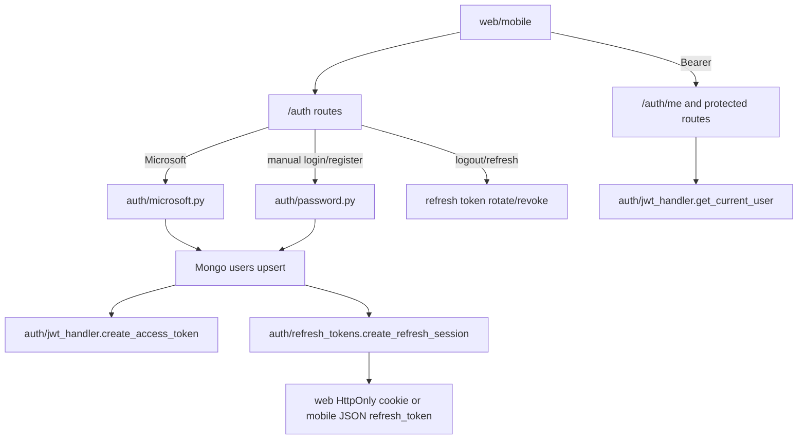

# Module: `routers`

Source-verified: 2026-06-05 from `routers/__init__.py`, `routers/auth.py` (and imported helpers in `auth/`, `models/`, `schemas/user.py`, `utils/parse_hust_email.py`).

## Purpose

`routers` currently contains the standalone auth HTTP router (`router = APIRouter()`). It is mounted by the FastAPI app (`api/main.py`) under the `/auth` prefix. This is distinct from `api/routes/` (chat, admin, document, etc. routers); `routers/` holds only authentication endpoints.

Auth helper logic lives in `auth/`; Pydantic request/response schemas live in `schemas/user.py`; the user DB model lives in `models/user.py`; HUST email parsing in `utils/parse_hust_email.py`.

`routers/__init__.py` is empty (no package-level exports); `auth.router` is imported directly by the app.

## File Map

```text
routers/
  __init__.py  Empty package marker.
  auth.py      Microsoft OAuth, manual register/login, refresh, profile, logout, admin creation.
```

## Routes

Mounted under `/auth`:

| Method/path | Purpose |
| --- | --- |
| `GET /auth/login` | Return Microsoft OAuth authorization URL. |
| `GET /auth/callback` | OAuth callback, upsert user, issue JWT, redirect. |
| `POST /auth/register` | Manual user registration. |
| `POST /auth/login` | Manual username/password login. |
| `POST /auth/refresh` | Rotate refresh token and issue a new access token. |
| `GET /auth/me` | Current user profile. |
| `PATCH /auth/me` | Update profile fields. |
| `POST /auth/logout` | Revoke refresh token when present and clear web cookie. |
| `POST /auth/admin/create` | Superadmin-created admin account. |

## Auth Behavior

- Microsoft OAuth depends on `auth/microsoft.py` (`get_authorization_url`, `exchange_code_for_token`, `get_microsoft_user_info`).
- JWT creation/verification depends on `auth/jwt_handler.py` (`create_access_token`, `get_current_user`, `access_token_expires_in_seconds`).
- Refresh-token session create/rotate/revoke depends on `auth/refresh_tokens.py` (`create_refresh_session`, `rotate_refresh_token`, `revoke_refresh_token`, `refresh_token_max_age_seconds`).
- Passwords depend on `auth/password.py` (`hash_password`, `verify_password`).
- The superadmin check is inline in `create_admin`: it reads the `SUPERADMIN_USER_IDS` env var (comma-separated ObjectIds) directly — no `auth/rbac.py` import in this router.
- User records are read/written in Mongo `USERS_COLLECTION` via `models/database.get_database`.
- OAuth callback restricts access to `@sis.hust.edu.vn` (checking Graph `mail` then `userPrincipalName`; 403 otherwise), parses HUST metadata via `parse_hust_email`, upserts the user, then sets the refresh cookie and redirects to `<FRONTEND_BASE>/complete-profile` (new/incomplete) or `/chat` — no credentials in the URL.
- Manual web login (`POST /auth/login`) sets the HttpOnly refresh cookie; mobile clients send `client_type="mobile"` to receive the JSON `refresh_token` instead.
- `POST /auth/refresh` rotates a web cookie or mobile refresh token and issues a fresh access JWT.

## Module Flow



External module boundaries:

- Mounted by `api/main.py`; all route helpers and credential logic come from `auth`.
- Request/response bodies are defined in `schemas/user.py`.
- Refresh-token storage and user reads/writes go through `models/database.py`.
- Redirect/cookie behavior must match `frontend` auth-session code and `mobile` SecureStore flow.

## Maintenance Notes

- Keep route schemas aligned with `schemas/user.py` and shared/web/mobile auth types.
- Do not put reusable token/password helpers here; keep them in `auth/`.
- Keep cookie settings aligned with frontend deployment via env vars read in `auth.py`:
  `AUTH_REFRESH_COOKIE_NAME`, `AUTH_REFRESH_COOKIE_SECURE`,
  `AUTH_REFRESH_COOKIE_SAMESITE`, and `FRONTEND_BASE_URL`
  (plus `SUPERADMIN_USER_IDS` for `/auth/admin/create`).

## Useful Checks

```bash
python -m py_compile routers/auth.py auth/*.py schemas/user.py
```
