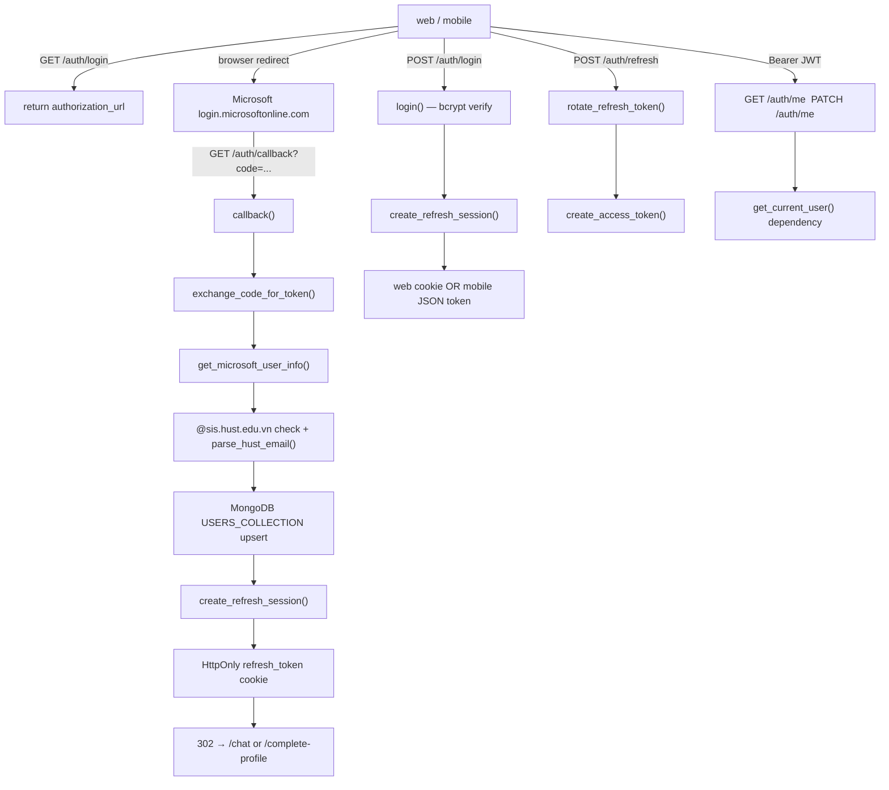

# Module: `routers`

Source-verified: 2026-06-24 from `routers/__init__.py`, `routers/auth.py`, `api/main.py`, `schemas/user.py`.

## Purpose

`routers/` holds the standalone authentication `APIRouter` (`routers/auth.py`).
It is the **only** package-level router; all other feature routers live under `api/routes/`.

`api/main.py::create_app()` mounts it explicitly:

```python
app.include_router(auth_router, prefix="/auth", tags=["auth"])
```

So every route defined in `routers/auth.py` is reachable under the `/auth` prefix with no
additional version segment (e.g. `/auth/login`, not `/api/v1/auth/login`).

Auth helper logic lives in `auth/`; Pydantic request/response schemas in `schemas/user.py`;
the user DB model in `models/user.py`; HUST email parsing in `utils/parse_hust_email.py`.

`routers/__init__.py` is empty — no package-level exports.

## File Map

```text
routers/
  __init__.py   Empty package marker (1 line).
  auth.py       Microsoft OAuth 2.0, manual register/login, token refresh,
                profile read/update, logout, and superadmin-created admin accounts.
```

## Routes

All routes mounted under `/auth` (no `/api/v1` prefix).

### `GET /auth/login`

| | |
|---|---|
| Handler | `login_oauth` |
| Response model | none declared (`-> dict`) |
| Status | 200 |
| Auth | none |

Returns `{"authorization_url": "<Microsoft OAuth URL>"}`. The frontend should redirect the browser there.

---

### `GET /auth/callback`

| | |
|---|---|
| Handler | `callback` |
| Response model | `RedirectResponse` (no `response_model`) |
| Status | 302 on success |
| Auth | none |

Full OAuth 2.0 callback flow:

1. Exchange `code` query parameter for a Microsoft access token.
2. Fetch Graph API user profile.
3. Validate email ends with `@sis.hust.edu.vn` (checks `mail` then `userPrincipalName`; raises 403 if neither matches).
4. Parse HUST metadata via `parse_hust_email()` (raises 422 on parse failure).
5. Upsert user in MongoDB (`USERS_COLLECTION`); new users get `is_profile_complete = False`.
6. Create a refresh session via `create_refresh_session()` with `client_type="web"`.
7. Set the refresh token in an HttpOnly cookie (`_REFRESH_COOKIE_NAME`).
8. Redirect to `<FRONTEND_BASE_URL>/complete-profile` (new/incomplete) or `<FRONTEND_BASE_URL>/chat` (existing complete).

**Gotchas**:
- Token is never placed in the redirect URL — only in the cookie.
- `microsoft_id` (the Graph OID) is stored in MongoDB but never returned to clients.
- New users default to `role = "student"`; existing users keep their DB role.

---

### `POST /auth/register`

| | |
|---|---|
| Handler | `register` |
| Request body | `UserManualCreate` |
| Response model | `UserPublic` |
| Status | 201 Created |
| Auth | none |

Creates a manual (non-OAuth) account. Checks `username` uniqueness (409 on conflict), bcrypt-hashes the password, inserts the document, and returns the public profile. `is_profile_complete` is set to `True` at creation. None-valued optional fields are stripped before insert to avoid duplicate-null issues on sparse unique indexes.

---

### `POST /auth/login`

| | |
|---|---|
| Handler | `login` |
| Request body | `UserLoginRequest` (`username`, `password`, `client_type`) |
| Response model | `TokenResponse` |
| Status | 200 |
| Auth | none |

Authenticates with username + bcrypt password. Updates `last_login_at`.

- `client_type="web"` (default): sets an HttpOnly refresh cookie; `TokenResponse.refresh_token` is `null`.
- `client_type="mobile"`: skips the cookie; `TokenResponse.refresh_token` carries the token in JSON.

Raises 401 on bad credentials; 403 if `is_active` is false.

---

### `POST /auth/refresh`

| | |
|---|---|
| Handler | `refresh` |
| Request body | `RefreshRequest` (optional — `refresh_token`, `client_type`) |
| Response model | `TokenResponse` |
| Status | 200 |
| Auth | refresh token (cookie or body) |

Rotates the refresh token and issues a new short-lived access JWT.

- Web flow: reads the token from the `refresh_token` HttpOnly cookie, writes the rotated token back as a cookie.
- Mobile flow: reads `body.refresh_token`, returns the new token in `TokenResponse.refresh_token`.

Token source priority: `body.refresh_token` > cookie. Raises 401 if neither is present.

---

### `GET /auth/me`

| | |
|---|---|
| Handler | `get_me` |
| Response model | `UserPublic` |
| Status | 200 |
| Auth | `Authorization: Bearer <JWT>` (via `get_current_user` dependency) |

Returns the authenticated user's public profile. No database read — uses the `UserDocument` already loaded by `get_current_user`.

---

### `PATCH /auth/me`

| | |
|---|---|
| Handler | `update_me` |
| Request body | `UserUpdate` (all fields optional) |
| Response model | `UserPublic` |
| Status | 200 |
| Auth | `Authorization: Bearer <JWT>` |

Partially updates the current user's profile. Any PATCH sets `is_profile_complete = True` server-side regardless of which fields were sent. `updated_at` is injected by `UserUpdate.to_update_dict()`. Returns the freshly re-fetched document.

---

### `POST /auth/logout`

| | |
|---|---|
| Handler | `logout` |
| Request body | `RefreshRequest` (optional) |
| Response model | none (`-> dict`) |
| Status | 200 |
| Auth | none (best-effort revocation) |

Revokes the refresh token (from body or cookie) via `revoke_refresh_token()` when present, then clears the browser cookie. Returns `{"message": "Logged out successfully"}`. Stateless — the access JWT continues to be valid until its natural expiry.

---

### `POST /auth/admin/create`

| | |
|---|---|
| Handler | `create_admin` |
| Request body | `AdminCreateRequest` |
| Response model | `UserPublic` |
| Status | 201 Created |
| Auth | `Authorization: Bearer <JWT>` — caller must be a superadmin |

Creates a new account with `role = "admin"`. Superadmin check is inline: reads `SUPERADMIN_USER_IDS` env var (comma-separated MongoDB ObjectId strings); raises 403 if the current user's ObjectId is not listed. Username uniqueness enforced (409 on conflict).

**Note**: `import os` is repeated inside the handler body (not at module level) — minor style inconsistency, but harmless.

---

## Environment Variables

The following env vars are read with `os.environ.get()` **directly in `routers/auth.py`** at module load time (not via `pydantic-settings`):

| Variable | Default | Effect |
|---|---|---|
| `FRONTEND_BASE_URL` | `http://localhost:8080` | OAuth redirect target base and cookie `secure` auto-detection |
| `AUTH_REFRESH_COOKIE_NAME` | `refresh_token` | Name of the HttpOnly refresh cookie |
| `AUTH_REFRESH_COOKIE_SECURE` | derived from `FRONTEND_BASE_URL` (https → True) | Forces `Secure` flag on/off regardless of URL scheme |
| `AUTH_REFRESH_COOKIE_SAMESITE` | `lax` | `SameSite` attribute of the refresh cookie |
| `SUPERADMIN_USER_IDS` | `""` | Comma-separated ObjectIds permitted to call `/auth/admin/create` |

These are not in `config/settings.py`; changes to them require a process restart.

## Schemas Reference

All schemas from `schemas/user.py`:

| Schema | Used as |
|---|---|
| `UserCreate` | Internal only — built from OAuth data before upsert |
| `UserManualCreate` | `POST /auth/register` request body |
| `UserLoginRequest` | `POST /auth/login` request body |
| `RefreshRequest` | `POST /auth/refresh` and `POST /auth/logout` request body (optional) |
| `TokenResponse` | `POST /auth/login` and `POST /auth/refresh` response |
| `UserPublic` | Response for register, login, refresh, GET/PATCH me, admin/create |
| `AdminCreateRequest` | `POST /auth/admin/create` request body |

`UserPublic` excludes `microsoft_id` and `password_hash`. `id` is serialised as a plain string (via `PyObjectId`).

## Module Flow



## Maintenance Notes

- `routers/` is intentionally thin: one router, one concern (auth). Do not add non-auth routes here.
- All reusable token/password/session helpers live in `auth/`; keep it that way.
- The `GET /auth/login`, `GET /auth/callback`, and `POST /auth/logout` handlers have **no `response_model`** declared — they return `dict` or `RedirectResponse` directly. Consider adding `response_model` to `login_oauth` and `logout` for OpenAPI documentation completeness.
- Cookie settings (`SECURE`, `SAMESITE`, `NAME`) must stay aligned with the frontend deployment environment. The `secure` flag is auto-derived from `FRONTEND_BASE_URL` but can be overridden with `AUTH_REFRESH_COOKIE_SECURE`.
- `SUPERADMIN_USER_IDS` is checked inline in `create_admin` via a raw `os.environ.get` — not extracted into a dedicated RBAC helper. If the superadmin check is needed elsewhere, refactor into `auth/rbac.py`.
- `routers/auth.py` reads env vars at module load (not per-request) — `_FRONTEND_BASE`, `_REFRESH_COOKIE_NAME` are module-level constants. Changes require a restart.

## Useful Checks

```bash
# Syntax check the module and its direct dependencies
python -m py_compile routers/auth.py auth/jwt_handler.py auth/microsoft.py auth/password.py auth/refresh_tokens.py schemas/user.py

# Confirm the router is mounted correctly in the app
grep -n "auth_router" api/main.py

# List all routes registered under /auth
python - <<'EOF'
import sys; sys.path.insert(0, ".")
from api.main import app
for r in app.routes:
    if hasattr(r, "path") and r.path.startswith("/auth"):
        print(r.methods, r.path)
EOF
```
