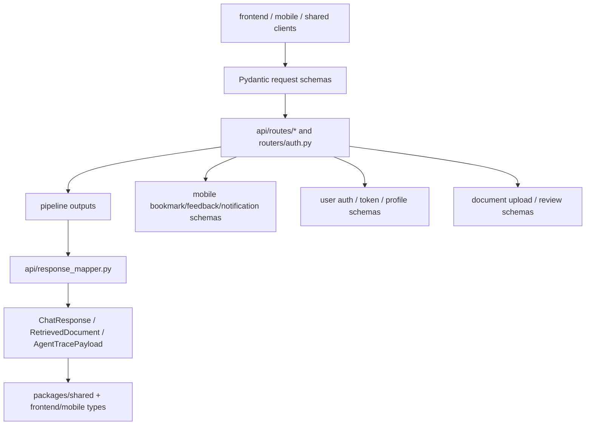

# Module: `schemas`

Source-verified: 2026-06-12 from `schemas/__init__.py`, `schemas/chat.py`, `schemas/constants.py`, `schemas/document.py`, `schemas/mobile.py`, `schemas/user.py`.

## Purpose

`schemas` defines Pydantic API contracts shared by FastAPI routes and response mappers. It is the backend source of truth for request/response shape.

**Boundaries:**
- This package does **not** contain persistence models (`models/` is separate).
- Only `chat.py` and `user.py` symbols are re-exported from `__init__.py`. `document.py` and `mobile.py` symbols must be imported directly from their sub-modules.
- `api/schemas.py` is a **separate** module that is not part of this package.

## File Map

```text
schemas/
  __init__.py       Re-exports chat + user symbols only (see __all__ below).
  chat.py           Chat request/response, score/filter/collection trace models, agent trace, health response.
  constants.py      CLARIFY_SENTINEL + RouteMode / PipelineMode / AgentRoute constant classes.
  document.py       Admin upload, document list/detail, chunk review/edit schemas + collection/converter/chunker metadata constants.
  mobile.py         Bookmark, feedback, notification subscribe/unsubscribe, lookup, internal-notification schemas.
  user.py           OAuth + manual auth, profile update, public user, token + admin-create schemas.
```

### `__init__.py` — re-exported symbols

```python
# chat
ChatRequest, ChatResponse, CollectionScore, HealthResponse, HistoryMessage, RetrievedDocument

# user
RefreshRequest, TokenResponse, UserCreate, UserLoginRequest, UserManualCreate, UserPublic, UserUpdate
```

Note: `UserContext`, `FilterInfo`, `CollectionResult`, `AgentToolCall`, `AgentTracePayload` (all in `chat.py`) and all `document.py`/`mobile.py` models are **not** in `__all__` and must be imported from their sub-modules directly. `AdminCreateRequest` (in `user.py`) is also excluded from `__init__` exports.

---

## Chat Schemas (`chat.py`)

Consumer: `api/routes/chat.py`, `api/routes/health.py`, `api/routes/retrieval.py`, `api/response_mapper.py`.

### Request models

#### `HistoryMessage`
| Field | Type | Constraint |
|-------|------|------------|
| `role` | `str` | `pattern="^(user\|assistant)$"` (required) |
| `content` | `str` | required |

#### `UserContext`
All fields optional. Used to forward the authenticated user's profile with each chat request.

| Field | Type | Default |
|-------|------|---------|
| `student_id` | `Optional[str]` | `None` |
| `cohort` | `Optional[str]` | `None` |
| `major` | `Optional[str]` | `None` |
| `major_code` | `Optional[str]` | `None` |
| `full_name` | `Optional[str]` | `None` |

> Not re-exported from `__init__.py`.

#### `ChatRequest`
Body for `POST /chat` and `POST /chat/stream`. No `ConfigDict` — extra fields are **not** forbidden.

| Field | Type | Constraint / Default |
|-------|------|----------------------|
| `question` | `str` | required, `min_length=1`, `max_length=4096` |
| `mode` | `str` | `pattern="^(auto\|rag\|agent)$"`, default `"auto"` |
| `top_k` | `int` | `ge=1`, `le=50`, default `7` |
| `history` | `Optional[List[HistoryMessage]]` | `None` |
| `session_id` | `Optional[str]` | `None` |
| `user_context` | `Optional[UserContext]` | `None` |
| `user_id` | `Optional[str]` | `None` |

### Response models

#### `RetrievedDocument`
| Field | Type | Notes |
|-------|------|-------|
| `rank` | `int` | required |
| `content` | `str` | required |
| `score` | `float` | required (final fused score) |
| `metadata` | `Dict[str, Any]` | required |
| `hybrid_score` | `Optional[float]` | pre-rerank fusion score |
| `rerank_score` | `Optional[float]` | cross-encoder score |
| `vector_score` | `Optional[float]` | raw Qdrant cosine score |
| `keyword_score` | `Optional[float]` | raw BM25 score |
| `collection` | `Optional[str]` | source collection name |

#### `CollectionScore`
| Field | Type |
|-------|------|
| `collection` | `str` |
| `score` | `float` |

#### `FilterInfo`
| Field | Type | Default |
|-------|------|---------|
| `collection` | `str` | required |
| `applied` | `bool` | required |
| `matched_ids` | `int` | `0` |
| `filter_desc` | `Optional[str]` | `None` |

> Not re-exported from `__init__.py`.

#### `CollectionResult`
| Field | Type | Default |
|-------|------|---------|
| `collection` | `str` | required |
| `vector_count` | `int` | `0` |
| `keyword_count` | `int` | `0` |

> Not re-exported from `__init__.py`.

#### `AgentToolCall`
| Field | Type | Default |
|-------|------|---------|
| `tool` | `str` | required |
| `args` | `Dict[str, Any]` | `default_factory=dict` |
| `result` | `str` | required |
| `iteration` | `int` | `0` |
| `latency_ms` | `Optional[float]` | `None` |
| `timestamp` | `Optional[str]` | `None` |

> Not re-exported from `__init__.py`.

#### `AgentTracePayload`
All fields optional. Compact execution trace produced by the agent loop.

Fields: `query`, `session_id`, `route`, `execution_path`, `complexity_subtype`, `sub_questions` (`List[str]`), `retrieval_plan` (`Dict`), `decompose_trace` (`Dict`), `planner_trace` (`Dict`), `executor_results` (`List[Dict]`), `synthesis_trace` (`Dict`), `iterations` (`int`), `tool_calls` (`List[AgentToolCall]`), `tool_names_sequence` (`List[str]`), `final_answer_length` (`int`), `latency_ms` (`float`), `error` (`str`).

> Not re-exported from `__init__.py`.

#### `ChatResponse`
Body for `POST /chat`. No `ConfigDict`.

Core required fields:
| Field | Type |
|-------|------|
| `question` | `str` |
| `answer` | `str` |
| `retrieved_documents` | `List[RetrievedDocument]` |
| `num_documents` | `int` |
| `model_name` | `str` |
| `intent` | `str` |
| `session_id` | `str` |

All remaining fields are `Optional` (default `None`): `target_collections`, `collection_scores`, `reflected_question`, `timings_ms`, `turn_id`, `routing_probabilities`, `reflection_prompt`, `llm_prompt`, `applied_filters`, `collection_results`, `context_trace`, `rerank_trace`, `answer_quality_gate`, `fusion_weights`, `answer_status`, `mode`, `route`, `tools_used`, `tool_calls`, `iterations`, `error`, `agent_error`, `agent_trace`.

#### `HealthResponse`
Body for `GET /health`.

| Field | Type | Default |
|-------|------|---------|
| `status` | `str` | required |
| `rag_initialized` | `bool` | required |
| `mongo_status` | `str` | `"unknown"` (`ok \| degraded \| failed \| disabled \| unknown`) |
| `redis_status` | `str` | `"disabled"` (`ok \| failed \| disabled \| not_installed`) |

---

## Document Schemas (`document.py`)

Consumer: `api/routes/upload.py`. Not re-exported from `__init__.py`.

### Module-level constants

| Constant | Value |
|----------|-------|
| `VALID_COLLECTIONS` | `{"ctdt", "quydinh", "kehoach", "stsv", "test"}` |
| `VALID_CONVERTERS` | `{"pymupdf4llm", "docling"}` |
| `COLLECTION_CHUNKER_MAP` | `quydinh/ctdt/test → recursive`, `kehoach → kehoach`, `stsv → stsv` |
| `CONVERTER_INFO` | List of `{key, label, description}` dicts for admin UI |
| `CHUNKER_INFO` | List of `{key, label, description, collections}` dicts for admin UI |

### Models

#### `DocumentUploadRequest`
Form data accompanying a file upload. No `ConfigDict`.

| Field | Type | Constraint |
|-------|------|------------|
| `collection` | `str` | required; validated against `VALID_COLLECTIONS` via `field_validator` |
| `chunking_strategy` | `Optional[str]` | `None` |
| `metadata_overrides` | `Optional[Dict[str, Any]]` | `None` |

#### `DocumentDetail`
`model_config = ConfigDict(populate_by_name=True)`. Built via `from_document(doc: dict)` classmethod.

| Field | Type | Default |
|-------|------|---------|
| `id` | `str` | required |
| `filename` | `str` | required |
| `file_size` | `int` | required |
| `status` | `str` | required |
| `collection` | `str` | required |
| `chunking_strategy` | `Optional[str]` | `None` |
| `converter` | `Optional[str]` | `None` |
| `chunk_count` | `Optional[int]` | `None` |
| `markdown_reviewed` | `bool` | `False` |
| `cleaned_reviewed` | `bool` | `False` |
| `chunks_reviewed` | `bool` | `False` |
| `metadata_overrides` | `dict` | `default_factory=dict` |
| `uploaded_by` | `str` | required |
| `uploaded_at` | `datetime` | required |
| `error_message` | `Optional[str]` | `None` |
| `converted_at` | `Optional[datetime]` | `None` |
| `cleaned_at` | `Optional[datetime]` | `None` |
| `chunked_at` | `Optional[datetime]` | `None` |
| `indexed_at` | `Optional[datetime]` | `None` |

#### `DocumentListResponse`
| Field | Type |
|-------|------|
| `documents` | `List[DocumentDetail]` |
| `total` | `int` |
| `page` | `int` |
| `limit` | `int` |

#### `ChunkPreview`
| Field | Type | Default |
|-------|------|---------|
| `chunk_id` | `str` | required |
| `chunk_index` | `int` | required |
| `content` | `str` | required |
| `metadata` | `dict` | `default_factory=dict` |
| `edited` | `bool` | `False` |
| `updated_at` | `Optional[datetime]` | `None` |

#### `ChunksResponse`
| Field | Type | Default |
|-------|------|---------|
| `chunks` | `List[ChunkPreview]` | required |
| `total` | `int` | required |
| `page` | `int` | required |
| `limit` | `int` | required |
| `strategy` | `str` | required |
| `stats` | `dict` | `default_factory=dict` |

#### `ChunkUpdateRequest`
`model_config = ConfigDict(extra="forbid")` — only model in the package with `extra="forbid"`.

| Field | Type | Constraint |
|-------|------|------------|
| `content` | `str` | `min_length=1`; `field_validator` rejects blank-after-strip |

#### `ChunkDeleteResponse`
| Field | Type |
|-------|------|
| `deleted_chunk_id` | `str` |
| `remaining_chunks` | `int` |

#### `MarkdownContent`
Single-field wrapper: `content: str`. Used for markdown review/edit endpoint.

#### `CleanedContent`
Single-field wrapper: `content: str`. Used for cleaned markdown review/edit endpoint.

---

## Mobile Schemas (`mobile.py`)

Consumers: `api/routes/bookmark.py`, `api/routes/feedback.py`, `api/routes/notification.py`. Not re-exported from `__init__.py`.

### Models

#### `BookmarkCreate`
| Field | Type | Constraint / Default |
|-------|------|----------------------|
| `session_id` | `str` | required |
| `turn_id` | `int` | required, `ge=1` |
| `folder` | `str` | `min_length=1`, `max_length=80`, default `"Chung"` |
| `note` | `Optional[str]` | `max_length=1000`, `None` |

#### `BookmarkUpdate`
| Field | Type | Constraint / Default |
|-------|------|----------------------|
| `folder` | `Optional[str]` | `min_length=1`, `max_length=80`, `None` |
| `note` | `Optional[str]` | `max_length=1000`, `None` |

#### `BookmarkFolderCreate`
| Field | Type | Constraint |
|-------|------|------------|
| `name` | `str` | required, `min_length=1`, `max_length=80` |

#### `BookmarkFolderRename`
| Field | Type | Constraint |
|-------|------|------------|
| `new_name` | `str` | required, `min_length=1`, `max_length=80` |

#### `FeedbackCreate`
| Field | Type | Constraint / Default |
|-------|------|----------------------|
| `session_id` | `str` | required |
| `turn_id` | `int` | required, `ge=1` |
| `rating` | `Literal["up", "down"]` | required |
| `category` | `Optional[Literal["wrong", "incomplete", "outdated"]]` | `None` |
| `comment` | `Optional[str]` | `max_length=1000`, `None` |

#### `NotificationSubscribe`
| Field | Type | Constraint / Default |
|-------|------|----------------------|
| `topics` | `list[str]` | `default_factory=list` |
| `expo_push_token` | `str` | required, `min_length=1` |

#### `NotificationUnsubscribe`
| Field | Type | Constraint / Default |
|-------|------|----------------------|
| `expo_push_token` | `str` | required, `min_length=1` |
| `topics` | `list[str]` | `default_factory=list` |

#### `LookupDocument`
| Field | Type | Default |
|-------|------|---------|
| `title` | `str` | required |
| `summary` | `str` | required |
| `collection` | `str \| None` | `None` |
| `score` | `float` | `0.0` |
| `metadata` | `dict[str, Any]` | `default_factory=dict` |

#### `NotificationCreateInternal`
Internal record (not a user-facing request body).

| Field | Type | Default |
|-------|------|---------|
| `user_id` | `str` | required |
| `title` | `str` | required |
| `body` | `str` | required |
| `type` | `str` | `"update"` |
| `related_doc_id` | `Optional[str]` | `None` |
| `read` | `bool` | `False` |
| `created_at` | `datetime` | required |

---

## User Schemas (`user.py`)

Consumer: `routers/auth.py`. `PyObjectId` is imported from `models.user`.

### Models

#### `UserCreate`
`model_config = ConfigDict(populate_by_name=True)`. Post-OAuth account creation.

| Field | Type | Default |
|-------|------|---------|
| `microsoft_id` | `str` | required |
| `email` | `str` | required; `field_validator` enforces `@sis.hust.edu.vn` suffix (lowercased) |
| `full_name` | `str` | required |
| `student_id` | `str` | required |
| `cohort` | `str` | required |
| `major` | `str` | `"CNTT Việt Nhật"` |
| `avatar_url` | `Optional[str]` | `None` |

#### `UserUpdate`
`model_config = ConfigDict(populate_by_name=True)`. All-optional PATCH body.

| Field | Type | Default |
|-------|------|---------|
| `full_name` | `Optional[str]` | `None` |
| `student_id` | `Optional[str]` | `None` |
| `cohort` | `Optional[str]` | `None` |
| `major` | `Optional[str]` | `None` |
| `major_code` | `Optional[str]` | `None` |
| `avatar_url` | `Optional[str]` | `None` |
| `is_profile_complete` | `Optional[bool]` | `None` |
| `is_active` | `Optional[bool]` | `None` |

Method `to_update_dict()` returns only set (non-`None`) fields plus a server-injected `updated_at: datetime`.

#### `UserPublic`
`model_config = ConfigDict(populate_by_name=True)`. Safe API response — excludes `microsoft_id` and `password_hash`.

| Field | Type | Default / Notes |
|-------|------|-----------------|
| `id` | `Optional[PyObjectId]` | `alias="_id"`, `None` |
| `email` | `Optional[str]` | `None` |
| `username` | `Optional[str]` | `None` |
| `full_name` | `str` | required |
| `student_id` | `str` | required |
| `cohort` | `str` | required |
| `major` | `str` | required |
| `major_code` | `str` | `""` |
| `role` | `str` | `"student"` |
| `avatar_url` | `Optional[str]` | `None` |
| `is_profile_complete` | `bool` | required |
| `is_active` | `bool` | required |
| `created_at` | `datetime` | required |
| `updated_at` | `datetime` | required |
| `last_login_at` | `datetime` | required |

Classmethod `from_document(doc: dict)` wraps `model_validate`.

#### `UserManualCreate`
`model_config = ConfigDict(populate_by_name=True)`. Body for `POST /auth/register`.

| Field | Type | Constraint / Default |
|-------|------|----------------------|
| `username` | `str` | required, `min_length=3`, `max_length=50` |
| `password` | `str` | required, `min_length=8` |
| `full_name` | `str` | required, `min_length=1` |
| `student_id` | `str` | default `""` |
| `cohort` | `str` | required, `min_length=1` |
| `major` | `str` | required, `min_length=1` |
| `major_code` | `str` | default `""` |

#### `UserLoginRequest`
Body for `POST /auth/login`. No `ConfigDict`.

| Field | Type | Default |
|-------|------|---------|
| `username` | `str` | required |
| `password` | `str` | required |
| `client_type` | `Literal["web", "mobile"]` | `"web"` |

#### `RefreshRequest`
Body for refresh-token rotation. No `ConfigDict`.

| Field | Type | Default |
|-------|------|---------|
| `refresh_token` | `Optional[str]` | `None` |
| `client_type` | `Literal["web", "mobile"]` | `"web"` |

#### `TokenResponse`
Response for `POST /auth/login`. No `ConfigDict`.

| Field | Type | Default |
|-------|------|---------|
| `access_token` | `str` | required |
| `token_type` | `str` | `"bearer"` |
| `expires_in` | `int` | required |
| `user` | `UserPublic` | required |
| `refresh_token` | `Optional[str]` | `None` (populated for mobile; web uses HttpOnly cookie) |

#### `AdminCreateRequest`
`model_config = ConfigDict(populate_by_name=True)`. Body for `POST /auth/admin/create` (superadmin only). **Not re-exported from `__init__.py`.**

| Field | Type | Constraint / Default |
|-------|------|----------------------|
| `username` | `str` | required, `min_length=3`, `max_length=50` |
| `password` | `str` | required, `min_length=8` |
| `full_name` | `str` | required, `min_length=1` |
| `student_id` | `str` | default `"admin"` |
| `cohort` | `str` | default `"N/A"` |
| `major` | `str` | default `"N/A"` |
| `major_code` | `str` | default `""` |

---

## Constants (`constants.py`)

| Symbol | Type | Value / Purpose |
|--------|------|-----------------|
| `CLARIFY_SENTINEL` | `str` | `"[CLARIFY]"` — legacy backward-compat only; current Planner-Executor emits no clarify output |
| `RouteMode.AUTO` | `str` | `"auto"` |
| `RouteMode.RAG` | `str` | `"rag"` |
| `RouteMode.AGENT` | `str` | `"agent"` |
| `PipelineMode.RAG_V2` | `str` | `"rag_v2"` |
| `PipelineMode.RAG_V2_FALLBACK` | `str` | `"rag_v2_fallback"` |
| `PipelineMode.AGENT` | `str` | `"agent"` |
| `AgentRoute.AGENT_FORCED` | `str` | `"agent_forced"` |
| `AgentRoute.COMPLEX` | `str` | `"complex"` |
| `AgentRoute.SIMPLE` | `str` | `"simple"` |
| `AgentRoute.CHITCHAT` | `str` | `"chitchat"` |

Consumer: `api/routes/chat.py`.

---

## Module Flow



---

## Maintenance Notes

- Schema changes are public API changes. Update `api/response_mapper.py`, web/mobile/shared TypeScript types, and tests in the same changeset.
- `UserPublic` should stay aligned with `packages/shared/src/types/auth.ts`.
- Auth schema changes must stay aligned across `routers/auth.py`, `packages/shared/src/types/auth.ts`, web auth services, and mobile auth hooks.
- `document.py` and `mobile.py` are intentionally excluded from `__init__.py` re-exports; callers must import from the sub-module directly.
- `ChunkUpdateRequest` is the only model with `extra="forbid"`. Most request models do not forbid extra fields — consider adding `ConfigDict(extra="forbid")` to `ChatRequest`, `UserLoginRequest`, `RefreshRequest`, and other inbound-only models.
- `CLARIFY_SENTINEL` is dead code in practice (retained for backward compat). Remove when all legacy consumers have been migrated.
- `AdminCreateRequest` is defined in `user.py` but not in `__init__.py`'s `__all__`; import it directly as `from schemas.user import AdminCreateRequest`.
- Keep trace/debug fields (`FilterInfo`, `CollectionResult`, `AgentTracePayload`, etc.) optional; pipeline outputs vary by route, mode, and fallback.

## Useful Checks

```bash
python -m py_compile schemas/__init__.py schemas/chat.py schemas/constants.py schemas/document.py schemas/mobile.py schemas/user.py
python -m pytest tests/test_adapters.py tests/test_upload_api.py -q -m "not integration"
```
