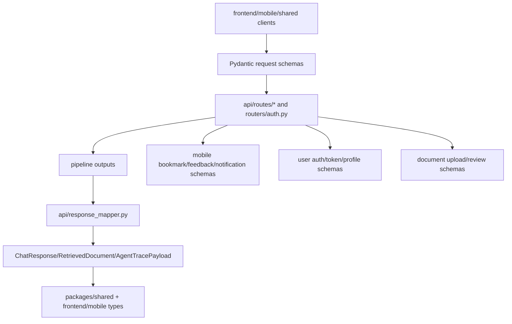

# Module: `schemas`

Source-verified: 2026-06-05 from `schemas/__init__.py`, `schemas/chat.py`, `schemas/constants.py`, `schemas/document.py`, `schemas/mobile.py`, `schemas/user.py`, plus consumers `api/routes/*.py` and `routers/auth.py`.

## Purpose

`schemas` defines Pydantic API contracts shared by FastAPI routes and response mappers. This is the backend source of truth for request/response shape.

## File Map

```text
schemas/
  __init__.py       Re-exports core chat + user schemas (ChatRequest, ChatResponse, CollectionScore, HealthResponse, HistoryMessage, RetrievedDocument, RefreshRequest, TokenResponse, UserCreate, UserLoginRequest, UserManualCreate, UserPublic, UserUpdate).
  chat.py           Chat request/response, retrieved docs, router/filter/result info, agent trace payload, health response.
  constants.py      CLARIFY_SENTINEL plus RouteMode / PipelineMode / AgentRoute constant classes.
  document.py       Admin upload/document/chunk review schemas + collection/converter/chunker metadata constants.
  mobile.py         Bookmark, feedback, notification, lookup, internal-notification schemas.
  user.py           OAuth/manual auth, profile update, public user, token, admin-create schemas.
```

## Chat Schemas

`chat.py` defines:

- `HistoryMessage` — `role` (regex `^(user|assistant)$`), `content`.
- `UserContext` — optional `student_id`, `cohort`, `major`, `major_code`, `full_name`.
- `ChatRequest` — `question` (1–4096 chars), `mode` (`auto|rag|agent`, default `auto`), `top_k` (1–50, default 7), optional `history`, `session_id`, `user_context`, `user_id`.
- `RetrievedDocument` — `rank`, `content`, `score`, `metadata`, optional score breakdown (`hybrid_score`, `rerank_score`, `vector_score`, `keyword_score`, `collection`).
- `CollectionScore` — `collection`, `score` (router confidence).
- `FilterInfo` — `collection`, `applied`, `matched_ids`, optional `filter_desc`.
- `CollectionResult` — `collection`, `vector_count`, `keyword_count`.
- `AgentToolCall` — `tool`, `args`, `result`, `iteration`, optional `latency_ms`, `timestamp`.
- `AgentTracePayload` — all-optional compact trace: `query`, `session_id`, `route`, `execution_path`, `complexity_subtype`, `sub_questions`, `retrieval_plan`, `decompose_trace`, `planner_trace`, `executor_results`, `synthesis_trace`, `iterations`, `tool_calls`, `tool_names_sequence`, `final_answer_length`, `latency_ms`, `error`.
- `ChatResponse` — core fields (`question`, `answer`, `retrieved_documents`, `num_documents`, `model_name`, `intent`, `session_id`) plus optional routing/trace/telemetry fields and `agent_trace`.
- `HealthResponse` — `status`, `rag_initialized`, `mongo_status`, `redis_status`.

`ChatRequest` documents `POST /chat` and `POST /chat/stream`. Authenticated routes should derive identity from JWT instead of trusting body identity. `ChatResponse` and trace fields stay compatible with both normal and streaming responses; agent traces are optional and carry planner/executor records (no legacy ReAct clarify output).

Consumers: `api/routes/chat.py` (ChatRequest/ChatResponse + constants), `api/routes/health.py` (HealthResponse), `api/routes/retrieval.py` (FilterInfo, CollectionResult, RetrievedDocument), `api/response_mapper.py`.

## Document Schemas

`document.py` supports admin upload/review:

- `DocumentUploadRequest` — `collection` (validated against `VALID_COLLECTIONS`), optional `chunking_strategy`, `metadata_overrides`.
- `DocumentDetail` — full document metadata; `from_document()` builds it from a MongoDB dict.
- `DocumentListResponse` — paginated documents (`documents`, `total`, `page`, `limit`).
- `ChunkPreview` / `ChunksResponse` — chunk preview + paginated listing with `strategy`, edit state, and `stats`.
- `ChunkUpdateRequest` / `ChunkDeleteResponse` — staged chunk edit/delete contracts; edit forbids extra fields and rejects blank content.
- `MarkdownContent` / `CleanedContent` — single-`content` wrappers for review/edit.

Module-level constants: `VALID_COLLECTIONS` (`ctdt`, `quydinh`, `kehoach`, `stsv`, `test`), `VALID_CONVERTERS` (`pymupdf4llm`, `docling`), `COLLECTION_CHUNKER_MAP`, and `CONVERTER_INFO` / `CHUNKER_INFO` listing metadata for the admin UI.

Consumer: `api/routes/upload.py`. Keep aligned with `models/document.py`, `models/document_chunk.py`, and admin UI types.

## Mobile Schemas

`mobile.py` supports:

- `BookmarkCreate` / `BookmarkUpdate` — bookmark by `session_id` + `turn_id`, `folder`, optional `note`.
- `BookmarkFolderCreate` / `BookmarkFolderRename` — folder operations.
- `FeedbackCreate` — `rating` (`up|down`), optional `category` (`wrong|incomplete|outdated`), `comment`.
- `NotificationSubscribe` / `NotificationUnsubscribe` — `topics` + `expo_push_token`.
- `LookupDocument` — `title`, `summary`, optional `collection`, `score`, `metadata`.
- `NotificationCreateInternal` — internal notification record.

Consumers: `api/routes/bookmark.py`, `api/routes/feedback.py`, `api/routes/notification.py`.

## User Schemas

`user.py` supports:

- `UserCreate` — post-OAuth account creation; `email` validated to end with `@sis.hust.edu.vn`.
- `UserUpdate` — all-optional PATCH body; `to_update_dict()` returns set fields plus server-side `updated_at`.
- `UserPublic` — safe response (excludes `microsoft_id`/`password_hash`); `from_document()` validates from a Mongo dict.
- `UserManualCreate` — `POST /auth/register` (username/password sign-up).
- `UserLoginRequest` — `POST /auth/login` with `client_type` (`web|mobile`).
- `RefreshRequest` — refresh-token rotation with `client_type`.
- `TokenResponse` — `access_token`, `token_type`, `expires_in`, `user`, optional `refresh_token` for mobile clients (web refresh tokens go in an HttpOnly cookie).
- `AdminCreateRequest` — `POST /auth/admin/create` (superadmin only).

`PyObjectId` is imported from `models.user`. Consumer: `routers/auth.py`. `UserPublic` should stay aligned with `packages/shared/src/types/auth.ts`.

## Constants

`constants.py` holds the legacy `CLARIFY_SENTINEL` (`[CLARIFY]`, kept for backward-compatible consumers; current Planner-Executor code emits no clarify output) and three constant classes:

- `RouteMode` — `mode` values accepted by `ChatRequest` (`auto`, `rag`, `agent`).
- `PipelineMode` — `mode` values on pipeline result dicts (`rag_v2`, `rag_v2_fallback`, `agent`).
- `AgentRoute` — `route`/`intent` values in agent results (`agent_forced`, `complex`, `simple`, `chitchat`).

Consumer: `api/routes/chat.py`.

## Module Flow



External module boundaries:

- This is the backend API contract boundary; route and mapper changes should update schemas first or in the same change.
- Frontend/mobile/shared clients mirror these shapes and depend on optional trace fields staying optional.
- Persistence models in `models` may have extra internal fields that should not leak unless explicitly represented here.

## Maintenance Notes

- Schema changes are public API changes. Update `api/response_mapper.py`, web/mobile/shared TypeScript types, and tests.
- Auth schema changes must stay aligned across `routers/auth.py`,
  `packages/shared/src/types/auth.ts`, web auth services, and mobile auth hooks.
- Prefer additive fields with sensible defaults when possible.
- Keep trace/debug fields optional; pipeline outputs can vary by route/mode/fallback.
- Note: `api/schemas.py` is a separate module from this package and is not part of `schemas/`.

## Useful Checks

```bash
python -m py_compile schemas/*.py
python -m pytest tests/test_response_mapper.py tests/test_mobile_api_contracts.py -q -m "not integration"
```
