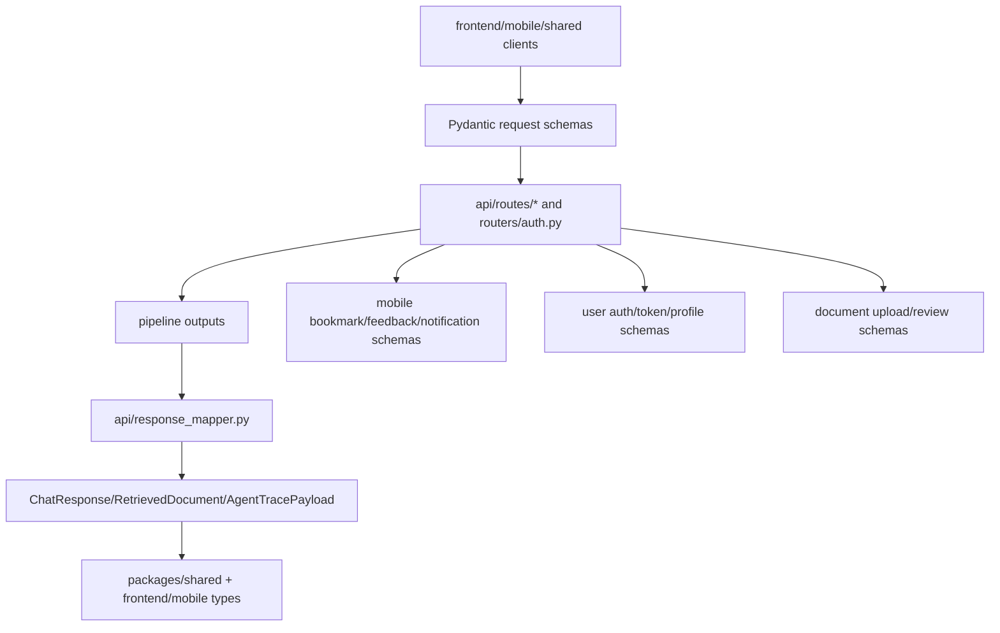

# Module: `schemas`

Source-verified: 2026-06-02 from `schemas/*.py`, `api/routes/*.py`, `packages/shared`, and web/mobile API clients.

## Purpose

`schemas` defines Pydantic API contracts shared by FastAPI routes and response mappers. This is the backend source of truth for request/response shape.

## File Map

```text
schemas/
  __init__.py       Public schema exports.
  chat.py           Chat request/response, retrieved docs, trace payload, health response.
  constants.py      Route/mode constants and legacy CLARIFY_SENTINEL.
  document.py       Admin upload/document/chunk review schemas.
  mobile.py         Bookmark, feedback, notification, lookup schemas.
  user.py           Auth/profile/token/admin schemas.
```

## Chat Schemas

`chat.py` includes:

- `HistoryMessage`
- `UserContext`
- `ChatRequest`
- `RetrievedDocument`
- `CollectionScore`
- `FilterInfo`
- `CollectionResult`
- `AgentToolCall`
- `AgentTracePayload`
- `ChatResponse`
- `HealthResponse`

`ChatRequest` supports:

- `question`
- `mode`: `auto`, `rag`, `agent`
- `top_k`
- `history`
- `session_id`
- `user_context`
- `user_id`

Authenticated routes should derive identity from JWT instead of trusting body identity.

`ChatResponse` and trace fields must remain compatible with both normal
`/chat/v3` responses and streaming metadata events. Agent traces are optional
and may contain planner/executor tool-call records instead of legacy ReAct loop
messages.

## Document Schemas

`document.py` supports admin upload/review:

- upload request
- document detail/list response
- chunk preview/list response
- Markdown/cleaned text content wrappers

Keep this aligned with `models/document.py`, `models/document_chunk.py`, and admin UI types.

## Mobile Schemas

`mobile.py` supports:

- bookmark create/update/folder operations
- feedback create
- notification subscribe/unsubscribe
- lookup document
- internal notification creation

## User Schemas

`user.py` supports:

- manual registration/login
- refresh token request
- user profile update
- public user response
- token response
- admin creation

`TokenResponse` includes `access_token`, `token_type`, `expires_in`, `user`, and
optional `refresh_token` for mobile clients. Web refresh tokens are delivered by
HttpOnly cookie instead of the JSON body.

`UserPublic` should stay aligned with `packages/shared/src/types/auth.ts`.

## Constants

`constants.py` contains route/mode constants and a legacy `CLARIFY_SENTINEL` kept for backward-compatible consumers. Current Planner-Executor code does not emit clarify tool output.

## Module Flow



External module boundaries:

- This is the backend API contract boundary; route and mapper changes should update schemas first or in the same change.
- Frontend/mobile/shared clients mirror these shapes and depend on optional trace fields staying optional.
- Persistence models in `models` may have extra internal fields that should not leak unless explicitly represented here.

## Maintenance Notes

- Schema changes are public API changes. Update `api/response_mapper.py`, web/mobile/shared TypeScript types, and tests.
- Auth schema changes must stay aligned across `routers/auth.py`,
  `packages/shared/src/types/auth.ts`, web auth services, and mobile auth hooks.
- Prefer additive fields with sensible defaults when possible.
- Keep trace/debug fields optional; pipeline outputs can vary by route/mode/fallback.

## Useful Checks

```bash
python -m py_compile schemas/*.py
python -m pytest tests/test_response_mapper.py tests/test_mobile_api_contracts.py -q -m "not integration"
```
