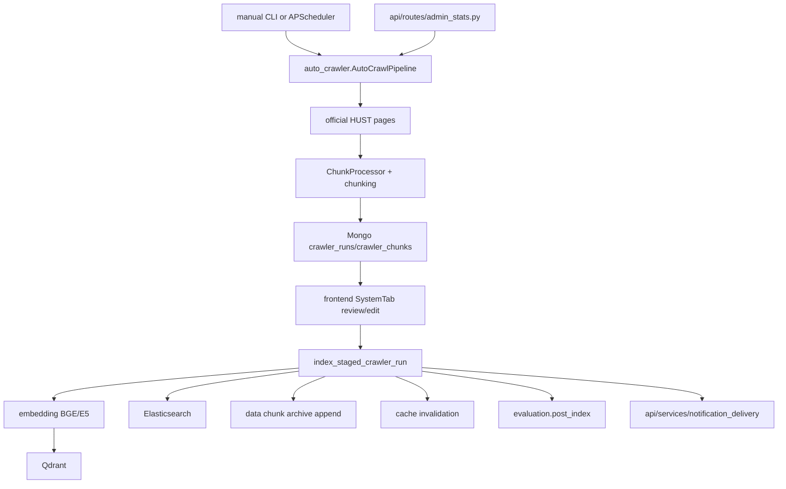

# Module: `scripts`

Source-verified: 2026-06-02 from `scripts/*.py`, `api/routes/admin_stats.py`, `api/services/notification_delivery.py`, and GitNexus ingestion/indexing flow queries.

## Purpose

`scripts` contains operational CLIs for crawling, indexing, metadata updates, model downloads, and utility search/index maintenance. These scripts are not the FastAPI runtime, but they define important ingestion and maintenance workflows.

## File Map

```text
scripts/
  auto_crawler.py         Crawl -> chunk -> embed -> Qdrant/ES index -> retention.
  index_kehoach.py        Standalone indexing for kehoach chunks.
  index_quydinh.py        Standalone indexing for quydinh chunks.
  index_stsv.py           Standalone indexing for stsv chunks.
  index_to_es.py          Reindex Qdrant collection payloads into Elasticsearch.
  update_data.py          Ingest one document, sync metadata, trigger validity reload.
  update_metadata.py      Bulk metadata update across existing Qdrant points.
  setup_mongo_indexes.py  Ensure Mongo indexes for agent traces/logging.
  search_multi.py         Local multi-collection search utility.
  download_models.py      Model download helper.
```

## Auto Crawler

`auto_crawler.py` is the largest script and contains:

- `GenericCrawler`
- `ChunkProcessor`
- `DualIndexer`
- `RetentionManager`
- `AutoCrawlPipeline`
- `index_staged_crawler_run()`

Flow:

```text
crawl official sources
  -> save JSON
  -> chunk content
  -> stage pending crawler_runs/crawler_chunks in Mongo
  -> admin review/index approval
  -> embed with BGE/E5
  -> index Qdrant + Elasticsearch
  -> append reviewed chunks to archive
```

FastAPI lifespan may schedule this script daily when `crawler_enabled=True`.

`AutoCrawlPipeline` no longer indexes chunks during default manual, scheduled,
or CLI `all` runs. Per-pipeline summaries include `review_run_id`,
`review_status`, edit/index booleans, and bounded `saved_chunks` previews for
staged chunks. `index_staged_crawler_run()` is the approval path that reads
edited Mongo chunks, indexes them, appends them to the chunk archive,
invalidates cache by chunk/document ids, triggers post-index eval when enabled,
and sends notifications.

FastAPI admin crawler endpoints are the normal approval surface:

- `POST /admin/crawler/trigger`
- `GET /admin/crawler/status`
- `GET /admin/crawler/runs/{run_id}/chunks`
- `PATCH /admin/crawler/runs/{run_id}/chunks/{chunk_id}`
- `POST /admin/crawler/runs/{run_id}/index`

Supported crawler targets in source include:

- `kehoach` through HUST display-list/detail pages.
- `quydinh` through regulation display pages.

## Index Scripts

Standalone indexers generally:

1. Load chunks from `data/.../chunks`.
2. Filter already indexed chunks where implemented.
3. Embed in batches.
4. Upsert into Qdrant through `QdrantStore`.
5. Index into Elasticsearch where the script supports dual indexing.

GitNexus ingestion flows identify:

- `index_kehoach.py:index_chunks() -> QdrantStore.index_documents()`
- `index_quydinh.py:index_chunks() -> QdrantStore.index_documents()`
- `index_stsv.py:index_chunks() -> QdrantStore.index_documents()`

## Module Flow



External module boundaries:

- Scripts may run outside FastAPI, but admin crawler review is normally driven by `api/routes/admin_stats.py` and frontend `SystemTab`.
- Index scripts write retrieval stores and must preserve `data`/`retrieval` metadata contracts.
- Notification, cache invalidation, and post-index eval are integrations; indexing should remain retryable if these fail-soft integrations fail.

## Metadata Maintenance

`update_metadata.py`:

- loads chunks for a target collection
- builds id/metadata pairs
- normalizes target selection
- updates Qdrant payload metadata by id or batch

`update_data.py`:

- ingests a document path into a target collection
- syncs metadata
- can trigger validity reload through API

## Maintenance Notes

- Scripts may assume local services at configured Qdrant/ES/Mongo hosts; verify `.env` before running destructive index operations.
- Keep script metadata output aligned with `retrieval/metadata_filters.py`.
- After crawling/indexing changes, run current policy eval or post-index eval.
- Treat `delete_collection()` helpers as destructive and do not call them unless explicitly requested.

## Useful Checks

```bash
python -m py_compile scripts/*.py
python -m evaluation.two_layer_eval current --max-cases 20
```
