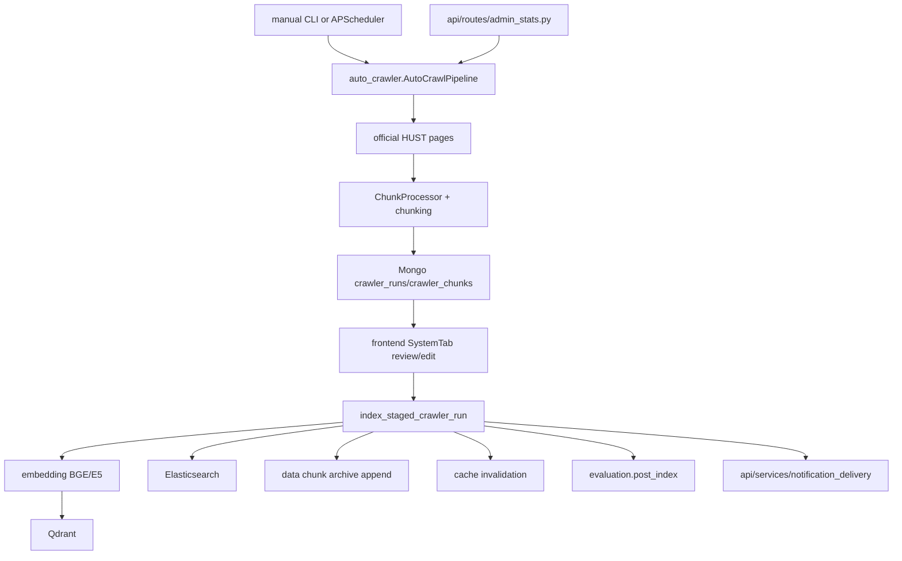

# Module: `scripts`

Source-verified: 2026-06-05 from `scripts/auto_crawler.py`, `scripts/index_kehoach.py`, `scripts/index_quydinh.py`, `scripts/index_stsv.py`, `scripts/index_parent_child.py`, `scripts/index_to_es.py`, `scripts/update_data.py`, `scripts/update_metadata.py`, `scripts/metadata_audit.py`, `scripts/setup_mongo_indexes.py`, `scripts/search_multi.py`, `scripts/download_models.py`, `scripts/__init__.py`.

## Purpose

`scripts` contains operational CLIs for crawling, indexing, metadata updates, model downloads, and utility search/index maintenance. These scripts are not the FastAPI runtime, but they define important ingestion and maintenance workflows.

## File Map

```text
scripts/
  auto_crawler.py         Crawl -> chunk -> stage (Mongo) -> review -> embed -> Qdrant/ES index -> retention.
                          Run: `python -m scripts.auto_crawler [--pipeline kehoach|quydinh|all]
                          [--module crawl|chunk|index|retention|all] [--dry]`. Scheduled by APScheduler
                          when crawler_enabled=true.
  index_kehoach.py        Index data/kehoach/chunks/kehoach_all_chunks.json into Qdrant collection
                          `kehoach` (BGE-M3 + E5, idempotent/incremental). Params hardcoded in CONFIG.
                          Run: `python scripts/index_kehoach.py [--reset]` (--reset drops collection first).
  index_quydinh.py        Generic dir indexer: loads all *_chunks.json from CONFIG["chunks_dir"]
                          (default data/ctdt/vatlieu/chunks_recursive_parent_child, collection `ctdt`),
                          filters via utils.chunk_indexing.is_indexable_chunk, upserts to Qdrant
                          (incremental). Params hardcoded in CONFIG. Run: `python scripts/index_quydinh.py`.
  index_stsv.py           Index data/stsv/chunks/stsv_all_chunks.json into Qdrant (BGE-M3 + E5).
                          CLI: `python scripts/index_stsv.py [--chunks-path ...] [--collection ...]
                          [--qdrant-host ...] [--qdrant-port ...] [--batch-size ...]`.
  index_parent_child.py   Index parent-child chunks (data/ctdt/* subfolders, data/quydinh admin_upload+olmocr)
                          into Qdrant (all levels) and Elasticsearch (children only). CLI:
                          `python scripts/index_parent_child.py --collection {ctdt|quydinh}
                          [--subfolder ...] [--dry-run] [--skip-qdrant] [--skip-es] [--parents-only]`.
  index_to_es.py          Re-index existing Qdrant collection payloads into Elasticsearch for BM25
                          (scrolls Qdrant, skips parent/header levels, enriches course/semester metadata,
                          runs a vi_analyzer smoke test). CLI: `python scripts/index_to_es.py
                          [--collections stsv quydinh kehoach ctdt] [--recreate|--force]
                          [--allow-analyzer-fallback] [--smoke-test-only]`.
  update_data.py          Mock document ingest + metadata sync (delegates to update_metadata) + POST
                          API validity-filter reload. CLI: `python scripts/update_data.py
                          --doc PATH --collection NAME [--sync-metadata]` or `--metadata-only`
                          [--target both|qdrant|elasticsearch] [--metadata-collection ...]
                          [--dry-run] [--skip-reload].
  update_metadata.py      Sync edited chunk-file metadata into Qdrant + Elasticsearch by point ID
                          without re-embedding (collections/targets/overwrite hardcoded in CONFIG).
                          CLI: `python scripts/update_metadata.py [--target ...] [--collection ...]
                          [--dry-run]`.
  metadata_audit.py       Scan data/ collections and report per-field fill rates + enrichment
                          suggestions; writes a JSON report. Run: `python scripts/metadata_audit.py
                          [--output PATH]`.
  setup_mongo_indexes.py  Create MongoDB indexes on the `agent_traces` collection (session_id,
                          created_at, tool_names_sequence). Run: `python scripts/setup_mongo_indexes.py
                          [--uri ...] [--db ...]`.
  search_multi.py         Local hybrid multi-collection search utility (config hardcoded at top of file).
                          Run: `python scripts/search_multi.py`.
  download_models.py      Pre-download E5, BGE-M3, and BGE reranker into the HF cache.
                          Run once: `python scripts/download_models.py`.
  __init__.py             Empty package marker.
```

## Auto Crawler

`auto_crawler.py` is the largest script and contains:

- `GenericCrawler`
- `ChunkProcessor`
- `DualIndexer`
- `RetentionManager`
- `AutoCrawlPipeline`
- `index_staged_crawler_run()`

Flow:

```text
crawl official sources
  -> save JSON
  -> chunk content
  -> stage pending crawler_runs/crawler_chunks in Mongo
  -> admin review/index approval
  -> embed with BGE/E5
  -> index Qdrant + Elasticsearch
  -> append reviewed chunks to archive
```

FastAPI lifespan may schedule this script daily when `crawler_enabled=True`.

`AutoCrawlPipeline` no longer indexes chunks during default manual, scheduled,
or CLI `all` runs. Per-pipeline summaries include `review_run_id`,
`review_status`, edit/index booleans, and bounded `saved_chunks` previews for
staged chunks. `index_staged_crawler_run()` is the approval path that reads
edited Mongo chunks, indexes them, appends them to the chunk archive,
invalidates cache by chunk/document ids, triggers post-index eval when enabled,
and sends notifications.

FastAPI admin crawler endpoints are the normal approval surface:

- `POST /admin/crawler/trigger`
- `GET /admin/crawler/status`
- `GET /admin/crawler/runs/{run_id}/chunks`
- `PATCH /admin/crawler/runs/{run_id}/chunks/{chunk_id}`
- `POST /admin/crawler/runs/{run_id}/index`

Supported crawler targets in source include:

- `kehoach` through HUST display-list/detail pages.
- `quydinh` through regulation display pages.

## Index Scripts

Standalone indexers generally:

1. Load chunks from `data/.../chunks` (single file or a directory glob).
2. Filter already-indexed chunks via Qdrant `retrieve()` where implemented
   (`index_kehoach`, `index_quydinh`). `index_stsv` and `index_parent_child`
   rely on idempotent upsert instead.
3. Embed in batches with BGE-M3 + E5.
4. Upsert into Qdrant through `QdrantStore.index_documents()`.
5. Index into Elasticsearch where the script supports dual indexing
   (`index_parent_child` children only; `index_to_es` re-indexes from Qdrant).

Notes on specific scripts:

- `index_quydinh.py` is a generic directory indexer despite its name — its
  CONFIG defaults to `data/ctdt/vatlieu/chunks_recursive_parent_child` and
  collection `ctdt`. Edit CONFIG to retarget another folder/collection.
- `index_kehoach.py` and `index_quydinh.py` take parameters via the in-file
  `CONFIG` dict, not CLI flags (`index_kehoach` exposes only `--reset`).
- `index_stsv.py` and `index_parent_child.py` are fully CLI-driven.
- `index_quydinh.py` and `index_stsv.py` define a `delete_collection()`
  helper; `index_kehoach.py` runs it only via `--reset`.

## Module Flow



External module boundaries:

- Scripts may run outside FastAPI, but admin crawler review is normally driven by `api/routes/admin_stats.py` and frontend `SystemTab`.
- Index scripts write retrieval stores and must preserve `data`/`retrieval` metadata contracts.
- Notification, cache invalidation, and post-index eval are integrations; indexing should remain retryable if these fail-soft integrations fail.

## Metadata Maintenance

`update_metadata.py`:

- loads chunks for a target collection
- builds id/metadata pairs
- normalizes target selection
- updates Qdrant payload metadata by id or batch

`update_data.py`:

- ingests a document path into a target collection (ingest body is currently a
  mock/placeholder that logs the steps)
- syncs metadata by delegating to `update_metadata.main()`
- can trigger validity reload via `POST {API}/api/admin/reload-validity`

`metadata_audit.py`:

- scans every `data/<collection>/*.json` file (list- or single-doc shaped)
- computes per-field fill rates and flags low-coverage IMPORTANT_FIELDS
- prints a summary and writes a JSON report (default
  `scripts/metadata_audit_report.json`)

## Maintenance Notes

- Scripts may assume local services at configured Qdrant/ES/Mongo hosts; verify `.env` before running destructive index operations.
- Keep script metadata output aligned with `retrieval/metadata_filters.py`.
- After crawling/indexing changes, run current policy eval or post-index eval.
- Treat `delete_collection()` helpers as destructive and do not call them unless explicitly requested.

## Useful Checks

```bash
python -m py_compile scripts/*.py
python -m evaluation.two_layer_eval current --max-cases 20
```
