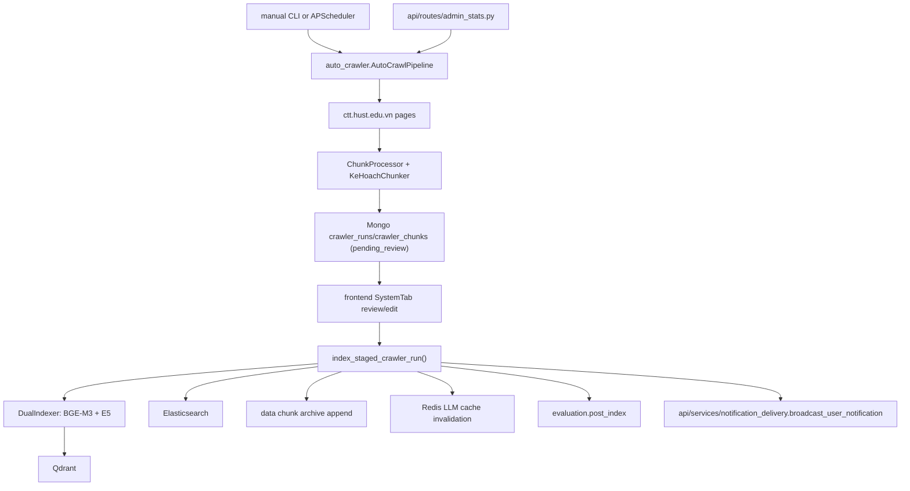

# Module: `scripts`

Source-verified: 2026-06-12 from `scripts/auto_crawler.py`, `scripts/index_kehoach.py`, `scripts/index_quydinh.py`, `scripts/index_stsv.py`, `scripts/index_parent_child.py`, `scripts/index_to_es.py`, `scripts/build_course_catalog.py`, `scripts/update_data.py`, `scripts/update_metadata.py`, `scripts/metadata_audit.py`, `scripts/setup_mongo_indexes.py`, `scripts/search_multi.py`, `scripts/download_models.py`, `scripts/__init__.py`.

## Purpose

`scripts` contains operational CLIs for crawling, indexing, metadata updates, catalog generation, model downloads, and utility search/index maintenance. These scripts are not the FastAPI runtime — they define important ingestion and maintenance workflows that run before or alongside the server.

## File Map

```text
scripts/
  auto_crawler.py         Crawl -> chunk -> stage (Mongo pending_review) -> embed ->
                          Qdrant/ES index -> retention. Three pipelines: baiviet
                          (DisplayListBaiViet -> kehoach), kehoach_list
                          (DisplayListKeHoach -> kehoach), quydinh (DisplayQuyChe ->
                          quydinh, 8-year retention). CLI:
                          `python -m scripts.auto_crawler [--pipeline kehoach|quydinh|all]
                          [--module crawl|chunk|index|retention|all] [--dry]`.
                          Scheduled by APScheduler when crawler_enabled=true.
                          NOTE: --module index is a no-op (prints disabled message);
                          indexing is only done via index_staged_crawler_run() through
                          the admin API approval flow.

  index_kehoach.py        Index data/kehoach/chunks/kehoach_all_chunks.json into Qdrant
                          collection `kehoach` (BGE-M3 + E5, incremental via Qdrant
                          retrieve check). Params hardcoded in CONFIG (no CLI args for
                          host/collection). Run: `python scripts/index_kehoach.py [--reset]`
                          (--reset calls delete_collection() then re-indexes from scratch).
                          Qdrant only — no ES indexing.

  index_quydinh.py        Generic directory indexer: globs all *_chunks.json from
                          CONFIG["chunks_dir"] (default
                          data/ctdt/vatlieu/chunks_recursive_parent_child, collection `ctdt`),
                          filters via utils.chunk_indexing.is_indexable_chunk, upserts to
                          Qdrant (incremental via retrieve check). Params hardcoded in CONFIG;
                          no CLI flags. Run: `python scripts/index_quydinh.py`.
                          Qdrant only — no ES indexing.
                          CAUTION: despite name, defaults to ctdt not quydinh; edit CONFIG
                          to retarget another folder/collection.

  index_stsv.py           Index data/stsv/chunks/stsv_all_chunks.json into Qdrant (BGE-M3
                          + E5). No incremental check — relies on idempotent upsert. Fully
                          CLI-driven. Run:
                          `python scripts/index_stsv.py [--chunks-path ...] [--collection ...]
                          [--qdrant-host ...] [--qdrant-port ...] [--batch-size ...]`.
                          Qdrant only — no ES indexing.

  index_parent_child.py   Index parent-child chunks into Qdrant (all levels) and
                          Elasticsearch (children/recursive/appendix only; parent+header
                          skipped). Sources hardcoded in PARENT_CHILD_SOURCES:
                            ctdt  -> data/ctdt/{soict,cokhi,dien-dientu,hoa,toan,vatlieu}/
                                     chunks_recursive_parent_child/*.json
                            quydinh -> data/quydinh/admin_upload/*_recursive_chunks.json
                                    + data/quydinh/olmocr/chunks_recursive_parent_child_3/*.json
                          Reads Settings() from env/.env for host/port. CLI:
                          `python scripts/index_parent_child.py --collection {ctdt|quydinh}
                          [--subfolder ...] [--dry-run] [--skip-qdrant] [--skip-es]
                          [--parents-only]`.

  index_to_es.py          Re-index existing Qdrant collection payloads into Elasticsearch
                          for BM25 (scrolls Qdrant, skips parent/header levels, enriches
                          course_code/course_name for ctdt and semester for kehoach, runs a
                          vi_analyzer smoke test before indexing). Supports --recreate (drop+
                          recreate index) and --force (delete_by_query then re-index).
                          CLI: `python scripts/index_to_es.py
                          [--collections stsv quydinh kehoach ctdt]
                          [--qdrant-host ...] [--qdrant-port ...]
                          [--es-host ...] [--es-port ...]
                          [--batch-size N]
                          [--recreate | --force]
                          [--allow-analyzer-fallback] [--smoke-test-only]`.
                          With --recreate, aborts if vi_analyzer plugin not found unless
                          --allow-analyzer-fallback is also passed.

  build_course_catalog.py Build query/models/course_catalog.json — maps major_code to a
                          list of (course_code, name, credits, semester) entries. Parses
                          markdown curriculum tables under data/ctdt/*/clean_data/*.md and
                          section headers (bilingual alias fallback). Resolves major_code
                          from sibling *_chunks.json files in chunks_recursive_parent_child/.
                          Output loaded at runtime by query.course_catalog.
                          Run: `python -m scripts.build_course_catalog`.
                          Must be re-run whenever curriculum markdown files are updated.

  update_data.py          Document ingest scaffold + metadata sync + API validity reload.
                          ingest_document() is a MOCK (logs steps, no real embedding).
                          Delegates real metadata sync to scripts.update_metadata.main().
                          Triggers POST http://localhost:8000/api/admin/reload-validity.
                          CLI: `python scripts/update_data.py --doc PATH --collection NAME
                          [--sync-metadata] [--target both|qdrant|elasticsearch]
                          [--metadata-collection NAME (repeatable)]
                          [--dry-run] [--skip-reload]`
                          or `--metadata-only [--target ...] [--dry-run]`.
                          CAUTION: ingest_document() is placeholder code only — does not
                          actually embed or upsert. API_URL is hardcoded to localhost:8000.

  update_metadata.py      Sync edited chunk-file metadata into Qdrant + Elasticsearch by
                          point ID without re-embedding. CONFIG["collections"] defines:
                            stsv    -> data/stsv/chunks/stsv_all_chunks.json (id: chunk_id)
                            kehoach -> data/kehoach/chunks/kehoach_all_chunks.json (id: chunk_id)
                            quydinh -> data/quydinh/olmocr/chunks_recursive_parent_child_3/
                                       (id: id, level_filter: child)
                            quydinh -> data/quydinh/chunks/quydinh_all_chunks.json (id: chunk_id)
                            ctdt    -> data/ctdt/*/chunks_recursive_parent_child/ (id: id,
                                       level_filter: child)
                          overwrite=False (merge) by default; overwrite=True replaces full
                          payload including "text". Target and overwrite mode are set in CONFIG
                          (not CLI-only); CLI --target overrides CONFIG["target"].
                          Run: `python scripts/update_metadata.py [--target both|qdrant|
                          elasticsearch] [--collection NAME (repeatable)] [--dry-run]`.

  metadata_audit.py       Scan data/ collection directories, compute per-field fill rates,
                          flag low-coverage IMPORTANT_FIELDS, print summary, and write a JSON
                          report. Scans top-level *.json files in each data/* subdirectory
                          (not chunks subdirs). Default report path:
                          scripts/metadata_audit_report.json.
                          Run: `python scripts/metadata_audit.py [--output PATH]`.

  setup_mongo_indexes.py  Create MongoDB indexes on the `agent_traces` collection
                          (session_id asc, created_at desc, tool_names_sequence asc).
                          Reads URI/db from --uri/--db args or MONGODB_URI/MONGODB_DATABASE
                          env vars (defaults: mongodb://localhost:27017, rag_chatbot).
                          Run: `python scripts/setup_mongo_indexes.py [--uri ...] [--db ...]`.
                          One-time setup; safe to re-run (create_index is idempotent).

  search_multi.py         Local hybrid multi-collection search diagnostic. Config (collections,
                          weights, query strings, host/port) hardcoded at top of file. Prints
                          per-result score breakdown (bge, e5, vector_score, keyword_score,
                          norm_vector, norm_keyword). No CLI args.
                          Run: `python scripts/search_multi.py`.

  download_models.py      Pre-download E5 multilingual-large (~1.1 GB), BGE-M3 (~2.3 GB),
                          and BGE reranker-v2-m3 (~1.1 GB) into the HuggingFace cache.
                          Exits non-zero on any download failure.
                          Run once per machine: `python scripts/download_models.py`.

  __init__.py             Empty package marker.
```

## Auto Crawler

`auto_crawler.py` is the largest script. Key classes:

- `GenericCrawler` — incremental crawl from ctt.hust.edu.vn; stops when it hits a known baiviet_id or exceeds max_age_months.
- `ChunkProcessor` — chunks articles via `KeHoachChunker`.
- `DualIndexer` — embeds (BGE-M3 + E5) and upserts to Qdrant + ES; filters already-indexed chunks via retrieve.
- `RetentionManager` — removes articles older than N months from JSON files, chunk archives, and indexes.
- `AutoCrawlPipeline` — orchestrates three sub-pipelines: `run_baiviet()`, `run_kehoach_list()`, `run_quydinh()`. `run_kehoach()` calls both BaiViet and ListKeHoach pipelines.
- `index_staged_crawler_run(settings, run_id)` — the admin approval path: reads edited Mongo chunks, indexes via DualIndexer, appends to chunk archive, invalidates Redis LLM cache (if enabled), triggers post-index eval, and sends user notifications.

Flow after crawl finds new articles:

```text
crawl official sources
  -> save JSON (output_full.json)
  -> chunk (KeHoachChunker)
  -> stage in Mongo as crawler_runs/crawler_chunks (status: pending_review)
  -> admin review/edit via FastAPI admin endpoints
  -> index_staged_crawler_run():
       embed (BGE-M3 + E5) -> upsert Qdrant + ES
       -> append to chunk archive file
       -> invalidate Redis LLM cache by chunk_id
       -> trigger evaluation.post_index
       -> broadcast user notification (if indexed > 0)
  -> retention cleanup (JSON + chunks file + Qdrant/ES delete)
```

Scheduled pipelines do NOT index during the crawl/chunk phase; indexing only happens via admin API approval.

FastAPI admin crawler endpoints (normal approval surface):

- `POST /admin/crawler/trigger`
- `GET /admin/crawler/status`
- `GET /admin/crawler/runs/{run_id}/chunks`
- `PATCH /admin/crawler/runs/{run_id}/chunks/{chunk_id}`
- `POST /admin/crawler/runs/{run_id}/index`

Crawler sources:
- `kehoach` (baiviet): `DisplayListBaiViet` + `DisplayListKeHoach` → collection `kehoach`
- `quydinh`: `DisplayQuyChe` → collection `quydinh` (retention 96 months / 8 years)

## Index Scripts

Standalone indexers:

1. Load chunks from `data/.../chunks` (single file or a directory glob).
2. Optionally filter already-indexed chunks via Qdrant `retrieve()` (`index_kehoach`, `index_quydinh`). `index_stsv` and `index_parent_child` rely on idempotent upsert instead.
3. Embed in batches with BGE-M3 + E5.
4. Upsert into Qdrant through `QdrantStore.index_documents()`.
5. Index into Elasticsearch where the script supports dual indexing (`index_parent_child` children only; `index_to_es` re-indexes from Qdrant).

Script-specific notes:

- `index_quydinh.py` is a generic directory indexer despite its name — its CONFIG defaults to `data/ctdt/vatlieu/chunks_recursive_parent_child` and collection `ctdt`. Edit CONFIG to retarget.
- `index_kehoach.py` and `index_quydinh.py` take parameters via the in-file `CONFIG` dict only; no CLI host/port/collection args.
- `index_stsv.py` and `index_parent_child.py` are fully CLI-driven.
- `index_quydinh.py` defines `delete_collection()` but it is commented-out in `__main__` (not called). `index_kehoach.py` calls it only via `--reset`.
- `index_parent_child.py` reads `Settings()` from env; other standalone indexers hardcode localhost defaults.

## Build Course Catalog

`build_course_catalog.py` generates `query/models/course_catalog.json` by:

1. Globbing `data/ctdt/*/clean_data/*.md` for curriculum markdown tables.
2. Resolving `major_code` from the sibling `*_chunks.json` (most-common value via Counter).
3. Parsing table rows (`TT | Mã số | Tên học phần | Tín chỉ | Kỳ`) and section headers (`## CODE Name`) for bilingual alias enrichment.
4. Deduplicating by (code, folded_name) key; merging credits/semester from multiple sources.
5. Sorting entries longest-name-first per major_code for runtime longest-match efficiency.

Re-run whenever curriculum markdown files change. Output is read at runtime by `query.course_catalog`.

## Module Flow



External boundaries:

- Scripts may run outside FastAPI, but admin crawler review is driven by `api/routes/admin_stats.py` and the frontend `SystemTab`.
- Index scripts write retrieval stores and must preserve `data`/`retrieval` metadata contracts.
- Cache invalidation, post-index eval, and notification are fail-soft integrations; indexing succeeds even if they fail.

## Metadata Maintenance

`update_metadata.py`:

- Loads chunks for configured collections (file/dir/ctdt_multi source types)
- Applies optional level_filter (e.g. child-only for parent-child collections)
- Builds (id, payload) pairs with merge or overwrite semantics
- Calls `qdrant_store.update_metadata_batch()` and/or `es_store.update_metadata_batch()`
- CONFIG["overwrite"] = False by default (merge mode, vectors unchanged)

`update_data.py`:

- `ingest_document()` is a placeholder/mock — logs steps but does not embed or upsert
- Delegates real metadata sync to `update_metadata.main()`
- Triggers `POST http://localhost:8000/api/admin/reload-validity` (hardcoded URL)

`metadata_audit.py`:

- Scans top-level `data/<collection>/*.json` (list- or single-doc shaped)
- Computes per-field fill rates, flags IMPORTANT_FIELDS below 50%
- Writes JSON report (default `scripts/metadata_audit_report.json`)

## Maintenance Notes

- Scripts assume local services unless overridden. Verify `.env` before running destructive index operations (`--reset`, `--recreate`, `--force`).
- `index_to_es.py --recreate` aborts if the `vi_analyzer` Elasticsearch plugin is missing; use `--allow-analyzer-fallback` only for local testing.
- `update_metadata.py` CONFIG["collections"] includes two separate `quydinh` entries (olmocr dir + flat chunks file) — both are processed when collection filter matches.
- `build_course_catalog.py` must be re-run after any curriculum markdown update; the JSON artifact is committed and loaded at import time.
- `update_data.py` ingest_document() must be implemented before this script can do real ingestion.
- Keep `update_metadata.py` CONFIG sources aligned with the actual chunk file layout in `data/`.
- After crawling/indexing changes, run current policy eval or post-index eval to verify retrieval quality.
- `delete_collection()` helpers are destructive; `index_quydinh` leaves it commented out — do not call unless explicitly requested.

## Useful Checks

```bash
python -m py_compile scripts/*.py
python scripts/index_to_es.py --smoke-test-only
python scripts/metadata_audit.py
python -m evaluation.two_layer_eval current --max-cases 20
```
