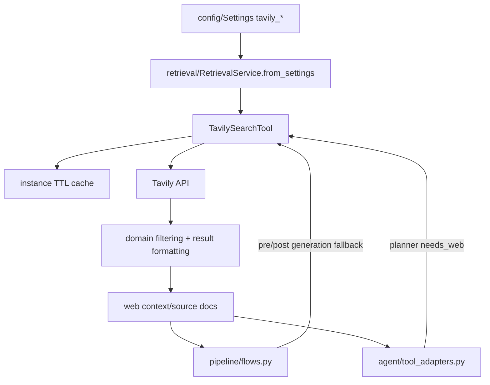

# Module: `tools`

Source-verified: 2026-06-05 from `tools/__init__.py`, `tools/tavily_search.py`, and `config/settings.py`.

## Purpose

`tools` currently contains the Tavily web-search adapter. It is optional infrastructure for fresh or missing information, especially dynamic HUST notices, deadlines, schedules, and external official education sources.

The module does not call an LLM by itself. LLM usage happens in callers after web context is returned.

## File Map

```text
tools/
  __init__.py        Public exports.
  tavily_search.py   TavilySearchTool, domain allowlists, API key validation, TTL cache.
```

## TavilySearchTool

Main responsibilities:

- Lazy import the `tavily` package (`_load_tavily_client`) only when a tool instance is created; raises `RuntimeError` if `tavily-python` is missing.
- Resolve the API key from the `api_key` arg or `TAVILY_API_KEY` env var. `is_valid_tavily_api_key()` (module-level helper) rejects empties and known placeholders (`your-key-here`, `change_me`, `tvly-xxx`, `your-`/`changeme` prefixes, …).
- Normalize `include_domains` / `exclude_domains` and `default_include_domains` to bare hostnames (`_normalize_domains`).
- Enforce a per-instance minimum interval between API calls (`_wait_for_rate_limit`, `DEFAULT_MIN_INTERVAL = 1.0s`).
- Maintain a per-instance TTL cache (`_SimpleTTLCache`, default 200 entries / 3600s) guarded by an `RLock`; `search` results are cached, keyed on query + params + domains.
- Retry transient failures with exponential backoff (`max_retries=3`, base `min_retry_delay=1.0s`); fail fast (no retry) on the Tavily `InvalidAPIKeyError`.

### Methods

- `search(query, max_results=None, search_depth="basic", include_answer=True, include_domains=None, exclude_domains=None) -> dict`:
  calls Tavily search (`search_depth` accepts `"advanced" | "basic" | "fast" | "ultra-fast"`), parses results, applies `filter_results` (min content length 100), then re-ranks via `_rank_result_for_query`. Returns `{query, answer, results, context}` where `context` is a numbered text block.
- `extract(urls, extract_depth="basic", query=None) -> dict`:
  fetches/extracts content directly from specific URLs (bypasses the search index — useful for dynamic pages like `?kehoach=29237`). Returns `{results, failed_results, context}`.
- `filter_results(...)` (staticmethod): drops short content, low Tavily score, site homepages, and (when `query_year` is set) stale results whose only years are older than `query_year - 1`.
- `_rank_result_for_query` (classmethod): accent-folded deterministic re-ranking that boosts semester codes (`20xx[123]`), school-year ranges, summer-semester (`ky he`) hints, and "latest/moi nhat/recent" freshness signals.

## Domain Constants

Current domain groups:

- `HUST_OFFICIAL_DOMAINS`
- `HUST_EXTENDED_DOMAINS`
- `EDU_AUTHORITATIVE_DOMAINS`

Backward-compatible aliases:

- `HUST_DOMAINS = HUST_OFFICIAL_DOMAINS + HUST_EXTENDED_DOMAINS`
- `EDU_DOMAINS = EDU_AUTHORITATIVE_DOMAINS`

News/general domains are not in the default education web scope.

## Integration Points

`RetrievalService.from_settings()` creates one Tavily tool when:

- `settings.tavily_api_key` is valid.
- the key is not empty or a placeholder.

That tool is shared by:

- `RAGPipeline._tavily`
- classic RAG pre-generation web enrichment
- classic RAG post-generation Tavily regeneration
- agent `web_search` tool
- planner-executor `web_search_for_executor()`

## RAG Fallback Semantics

`pipeline/flows.py` has two non-streaming web stages:

1. Pre-generation enrichment:
   - no local sources
   - dynamic/freshness query
   - low retrieval confidence

2. Post-generation quality gate:
   - answer says no information
   - no sources
   - self-eval requests web search with `answer_status` of `insufficient` or `stale_risk`

Both stages require `tavily_fallback_enabled=True`.
The current default is `tavily_fallback_enabled=False`, so local retrieval and
agent/planner paths run without external web fallback unless an admin/runtime
configuration enables it.

Streaming path does not run Tavily fallback to preserve streaming UX.

## Agent Web Search

The agent tool adapter calls Tavily when the local ReAct/planner path needs fresh data or local retrieval is insufficient. Agent web search uses HUST official/extended domains plus authoritative education domains.

Tool output is formatted as a text ToolMessage and also appended to per-request agent docs for API/UI trace.

## Module Flow



External module boundaries:

- `tools` only adapts Tavily; it does not decide when web fallback is allowed or synthesize final answers.
- Callers must degrade gracefully when API key validation, network, or Tavily service errors occur.
- Domain allowlists should remain aligned with HUST/education authority policy in `pipeline` and agent prompts.

## Settings

Main settings:

- `tavily_api_key`
- `tavily_fallback_enabled`
- `tavily_search_depth`
- `tavily_max_results`
- `tavily_web_result_count`
- `tavily_web_content_char_limit`
- `tavily_cache_ttl_seconds`
- `tavily_cache_maxsize`
- `web_fallback_on_dynamic`
- `web_fallback_on_no_info`

## Maintenance Notes

- Keep domain lists tight; answers should favor official HUST and authoritative education sources.
- Do not import Tavily at module import time.
- Domain filters accept domains, not full URLs or paths.
- Web fallback must degrade gracefully to local RAG answer on errors.

## Useful Checks

```bash
python -m py_compile tools/*.py
python -m pytest tests/test_phase7.py tests/test_phase8.py -q -m "not integration"
```
