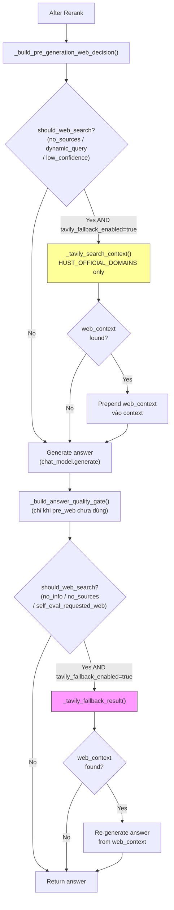
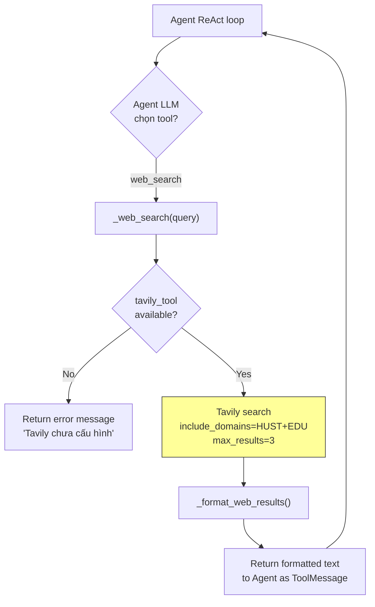

# Module: `tools` — Web Search Layer

## Tổng quan

Module `tools` cung cấp **web search fallback** qua Tavily API, bổ sung thông tin khi kho dữ liệu nội bộ (Qdrant + ES) không đủ để trả lời. Tavily được tích hợp ở **hai điểm** trong hệ thống:

1. **RAG Flow fallback** (hai giai đoạn): Pre-generation (với dynamic query / no sources) và post-generation (khi answer không có thông tin / self-eval yêu cầu). Cả hai đều cần `TAVILY_FALLBACK_ENABLED=true`.
2. **Agent `web_search` tool** (LangGraph ReAct): Agent tự chọn gọi web search khi `rag_search` không đủ thông tin.

---

## Cấu trúc file

```
tools/
├── __init__.py          # Public API: export TavilySearchTool
├── tavily_search.py     # TavilySearchTool + domain whitelists
└── MODULE.md            # Tài liệu này
```

---

## Public API (`__init__.py`)

```python
from tools import TavilySearchTool
from tools.tavily_search import HUST_DOMAINS, EDU_DOMAINS
```

---

## Chi tiết component

### `tavily_search.py` — `TavilySearchTool`

**Nhiệm vụ:** Wrapper an toàn cho Tavily API, cung cấp retry logic, rate limiting, domain filtering, và format kết quả cho LLM context.

#### Domain Whitelists

```python
# Tier 1: Nguồn chính thức HUST — dùng cho self-eval fallback (scope hẹp)
HUST_DOMAINS = [
    "hust.edu.vn",          # Cổng thông tin ĐHBK Hà Nội
    "sis.hust.edu.vn",      # Hệ thống thông tin sinh viên
    "ctt.hust.edu.vn",      # Phòng Đào tạo
    "ctsv.hust.edu.vn",     # Công tác sinh viên
    "soict.hust.edu.vn",    # Viện CNTT-TT
]

# Tier 2: Nguồn giáo dục VN mở rộng — dùng thêm cho agent web_search
EDU_DOMAINS = [
    "moet.gov.vn",          # Bộ Giáo dục và Đào tạo
    "vnexpress.net",        # Tin tức giáo dục
    "tuoitre.vn",           # Tin tức giáo dục
    "thanhnien.vn",         # Tin tức giáo dục
    "dantri.com.vn",        # Tin tức giáo dục
]
```

Danh sách này có thể mở rộng thêm các subdomain viện/trường của HUST (ví dụ: `see.hust.edu.vn`, `sem.hust.edu.vn`, `fee.hust.edu.vn`...).

#### Constructor

```python
TavilySearchTool(
    api_key: str | None = None,          # Falls back to TAVILY_API_KEY env var
    max_results: int = 5,                # Default result count
    max_retries: int = 3,                # Retry transient failures
    min_retry_delay: float = 1.0,        # Base delay for exponential backoff
    default_include_domains: list | None = None,  # Instance-level domain whitelist
)
```

#### Method: `search()`

```python
result = tool.search(
    query="lịch đăng ký học phần 20261",
    max_results=3,                        # Override instance default
    search_depth="basic",                 # "basic" (1 credit) | "advanced" (2 credits)
    include_answer=True,                  # Ask Tavily to generate a short answer
    include_domains=HUST_DOMAINS,         # Per-call override (None → use default_include_domains)
    exclude_domains=None,                 # Exclude specific domains
)
```

**Return value:**

```python
{
    "query": "lịch đăng ký học phần 20261",
    "answer": "Theo thông báo ...",        # Tavily-generated short answer
    "results": [                           # Parsed result list
        {"title": "...", "url": "...", "content": "..."},
        ...
    ],
    "context": "[1] Title\nURL: ...\nContent...\n\n---\n\n[2] ...",  # LLM-ready formatted string
}
```

#### Resilience

| Cơ chế | Chi tiết |
|:---|:---|
| **Rate limiting** | Tối thiểu 1.0s giữa các API call (`DEFAULT_MIN_INTERVAL`) |
| **Retry** | 3 lần với exponential backoff: 1s → 2s → 4s |
| **Auth error** | `InvalidAPIKeyError` → fail ngay, không retry |
| **Transient error** | Network timeout, 5xx → retry với backoff |
| **Domain filtering** | `include_domains` → chỉ lấy kết quả từ domains chỉ định |

---

## Điểm tích hợp trong hệ thống

### 1. RAG Flow Fallback — Hai giai đoạn (Pre-generation + Post-generation)

**File:** `pipeline/flows.py`

Tavily **KHÔNG** chạy cho mọi query. Nó chỉ được kích hoạt theo hai giai đoạn độc lập, mỗi giai đoạn đều phụ thuộc vào điều kiện cụ thể. **Master gate chung: `TAVILY_FALLBACK_ENABLED=true` phải được bật.**

#### Giai đoạn 1 — Pre-generation web search

**Thời điểm:** Sau rerank, **trước** khi generate answer.

**Điều kiện kích hoạt** (bất kỳ một trong các điều kiện sau):

| Điều kiện | Nguồn phát hiện |
|:---|:---|
| `no_sources` | Reranker không trả về tài liệu nào |
| `dynamic_query` | Query match `kehoach` collection **hoặc** chứa keywords: `ke hoach`, `thong bao`, `lich thi/dang ky/hoc`, `han dang ky/nop`, `deadline`, `ky he`, `nam hoc YYYY-YYYY` |
| `low_retrieval_confidence` | Reranker phải dùng raw fusion score fallback (không tìm được doc nào có score dương) |

**Hành vi:** Lấy web context **trước** khi sinh answer → prepend vào context → LLM dùng cả nội dung web + local docs.

#### Giai đoạn 2 — Post-generation quality gate

**Thời điểm:** Sau khi đã generate answer, **chỉ khi** giai đoạn 1 chưa dùng Tavily.

**Điều kiện kích hoạt** (bất kỳ một trong các điều kiện sau):

| Điều kiện | Nguồn phát hiện |
|:---|:---|
| `answer_no_info` | Answer text chứa cụm "không tìm thấy thông tin", "chưa có thông tin"… |
| `no_sources` | Không có tài liệu nào từ retrieval |
| `self_eval_requested_web` | `SelfEvaluator` trả về `should_web_search=True` **VÀ** `answer_status` là `"insufficient"` hoặc `"stale_risk"` |

**Hành vi:** Tìm web context → re-generate answer mới từ web context → thay thế answer gốc.

> **Lưu ý self-eval:** Self-eval **chỉ chạy** khi `self_evaluator is not None` (bật `SELF_EVAL_ENABLED`) **và** top reranker score < `self_eval_min_top_score` (default `100.0`). Self-eval fail đơn thuần **không đủ** để trigger Tavily — cần `should_web_search=True` kết hợp với status `insufficient/stale_risk`.

**Luồng tổng thể:**



**Domain scope (cả hai giai đoạn):** `HUST_OFFICIAL_DOMAINS` only — giữ kết quả hẹp, đảm bảo answer liên quan HUST chính thức.

**Streaming path:** `/chat/stream` **KHÔNG** chạy Tavily fallback — giữ UX streaming real-time.

**Error handling:** Nếu Tavily search thất bại (network error, invalid key…) → log warning, return answer gốc (không crash).

---

### 2. Agent `web_search` Tool (LangGraph ReAct)

**Files:**
- `agent/lc_tools.py` → StructuredTool binding
- `agent/tool_adapters.py` → `_web_search()` implementation

**Khi nào hoạt động:**

Agent LLM (Qwen2.5 local) tự quyết định gọi `web_search` khi:
- `rag_search` trả về không đủ thông tin
- Câu hỏi cần thông tin mới nhất (deadline, lịch thi, thông báo)
- Database nội bộ chưa cập nhật

**Tool schema (LangChain):**

```python
# Bound vào agent ReAct loop
StructuredTool(
    name="web_search",
    description="Tìm thông tin mới nhất trên internet qua Tavily. "
                "Chỉ dùng khi database không có kết quả hoặc cần thông tin rất mới.",
    args_schema=WebSearchInput,  # { query: str }
)
```

**Luồng:**



**Domain scope:** `HUST_DOMAINS + EDU_DOMAINS` (Tier 1 + Tier 2) — agent cần flexibility cho câu hỏi phức tạp, có thể cần thông tin từ Bộ GD-ĐT hoặc tin tức giáo dục.

**Output format (ToolMessage):**

```text
Tom tat Tavily: <short answer>

[1] <title>
<content snippet>
URL: <url>

[2] <title>
<content snippet>
URL: <url>
```

---

### 3. Planner-Executor Path

**File:** `agent/tool_adapters.py` → `web_search_for_executor()`

Public wrapper cho `_web_search()`, dùng bởi `react_agent._executor_node()` khi planner-executor cần web search trong retrieval plan.

---

## Khởi tạo và lifecycle

### Startup

```
RAGPipeline.__init__()
  └→ RetrievalService.from_settings(settings)
       └→ Kiểm tra TAVILY_API_KEY:
            ├→ Key hợp lệ → TavilySearchTool(api_key=key)
            │     Log: "RetrievalService: Tavily web search tool loaded."
            └→ Key rỗng/placeholder → tavily_tool = None
                  (không log lỗi, chỉ skip)
  └→ self._tavily = retrieval_service.tavily_tool
  └→ inject_from_retrieval_service(retrieval_service)
       └→ Agent tool_adapters nhận chung tavily_tool instance
```

**Key validation:** Reject các placeholder values: `""`, `"your-key-here"`, `"CHANGE_ME"`, `"tvly-xxx"`, bất kỳ string bắt đầu bằng `"your-"`.

### Shared instance

`TavilySearchTool` được tạo **một lần** trong `RetrievalService` và shared qua:
- `RAGPipeline._tavily` → truyền vào `rag_flow()` → `_tavily_search_context()` (pre-gen) và `_tavily_fallback_result()` (post-gen)
- `_AdapterRuntime.tavily_tool` → dùng bởi `_web_search()` trong agent

Không cần tạo instance mới ở bất kỳ đâu.

---

## Cấu hình (.env)

```env
# ─── API Key ──────────────────────────────────────────────────────────────────
TAVILY_API_KEY=tvly-xxxxxxxxxxxxx           # Lấy từ app.tavily.com

# ─── Tavily Fallback ──────────────────────────────────────────────────────────
TAVILY_FALLBACK_ENABLED=true                # Master gate: BẮT BUỘC để Tavily hoạt động trong rag_flow
TAVILY_SEARCH_DEPTH=basic                   # basic (1 credit) | advanced (2 credits)
TAVILY_MAX_RESULTS=3                        # Số kết quả mỗi lần search

# ─── Self-eval (tuỳ chọn — chỉ ảnh hưởng đến post-generation gate) ───────────
SELF_EVAL_ENABLED=true                      # Bật SelfEvaluator để có thêm điều kiện trigger post-gen Tavily
SELF_EVAL_MIN_TOP_SCORE=100.0               # BGE raw-logit threshold: self-eval chỉ chạy khi top_score < này
```

**Settings mapping (config/settings.py):**

| Setting | Default | Mô tả |
|:---|:---|:---|
| `tavily_api_key` | `""` | API key Tavily |
| `tavily_fallback_enabled` | `False` | **Master gate** cho cả pre-gen và post-gen Tavily trong `rag_flow` |
| `tavily_search_depth` | `"basic"` | Độ sâu tìm kiếm Tavily |
| `tavily_max_results` | `3` | Số kết quả mỗi search |
| `self_eval_enabled` | `False` | Bật SelfEvaluator (chỉ thêm một điều kiện trigger vào post-gen gate) |
| `self_eval_min_top_score` | `100.0` | BGE raw-logit threshold — self-eval chỉ chạy khi top score < này |

> **Lưu ý:** `tavily_fallback_enabled` là **hard gate** — cả pre-generation và post-generation Tavily đều check `cfg.get("tavily_fallback_enabled", False)`. Nếu False, Tavily bị skip hoàn toàn trong `rag_flow` dù API key hợp lệ. `SELF_EVAL_ENABLED` chỉ ảnh hưởng đến giai đoạn post-generation (thêm điều kiện `self_eval_requested_web`), không phải điều kiện bắt buộc để Tavily hoạt động.

---

## Chi phí Tavily API

| Loại search | Credits/call | Use case |
|:---|:---|:---|
| Basic search | 1 | Self-eval fallback, agent web_search |
| Advanced search | 2 | Khi cần kết quả sâu hơn (chưa dùng) |

**Free tier:** 1,000 credits/tháng (không cần credit card).

**Estimate sử dụng:**

| Scenario | Credits/tháng |
|:---|:---|
| Pre-gen web: dynamic queries (lịch thi, deadline…) ~30% queries × ~50/ngày | ~450 |
| Post-gen web: answer no-info + self-eval fallback ~5% queries × ~50/ngày | ~75 |
| Agent web_search (~20-50 complex queries) | 20–50 |
| **Total** | **~550–575** |

---

## Observability

### Timings (trong `timings_ms` response)

| Key | Xuất hiện khi | Ý nghĩa |
|:---|:---|:---|
| `dynamic_web_query` | `= 1.0` khi query là dynamic | Query match kehoach/deadline patterns |
| `web_fallback_requested` | Pre-gen hoặc post-gen quyết định cần Tavily | Gate đã bật nhưng chưa biết Tavily có dùng không |
| `web_fallback_used` | `= 1.0` khi Tavily thực sự trả về context | Tavily search thành công và context được dùng |
| `tavily_skipped` | `= 1.0` khi `tavily_fallback_enabled=false` | Gate mở nhưng bị disable bởi config |
| `tavily_search` | Tavily API search call chạy | Thời gian API call (ms) |
| `tavily_extract` | Tavily extract (URL trực tiếp) chạy | Thời gian extract call (ms) |
| `tavily_generate` | Post-gen: re-generate từ web context | Thời gian LLM sinh answer mới (ms) |
| `tavily_total` | Tavily pipeline hoàn thành | Tổng thời gian fallback (ms) |
| `self_eval` | Self-eval chạy | Thời gian evaluate (ms) |
| `self_eval_skipped` | `= 1.0` khi skip | Top score ≥ threshold |

### Frontend

`PipelineTrace.tsx` hiển thị Tavily section khi phát hiện `timings_ms['tavily_total']`:

- **Pre-gen web used** → hiển thị web context được prepend trước generation
- **Post-gen web used** → hiển thị ⚡ badge + timing breakdown (`tavily_search`, `tavily_generate`)
- **Tavily skipped** → hiển thị "skipped" badge (config disabled)
- **Self-eval skipped** → hiển thị "skipped" badge (top score ≥ threshold)

### Logs

```
INFO  dynamic_web_query detected, pre-generation Tavily triggered
INFO  Tavily search: query='...' (max=3, domains=5)
INFO  AnswerQualityGate requested web fallback: status=insufficient reasons=[answer_no_info]
INFO  Tavily fallback generated 842 chars
```

---

## Error handling toàn diện

| Lỗi | Xử lý | Kết quả |
|:---|:---|:---|
| API key rỗng/placeholder | `tavily_tool = None` khi startup | Tavily silently disabled |
| `tavily_fallback_enabled=false` | Skip trong cả pre-gen và post-gen gate | `tavily_skipped=1.0` timing |
| `InvalidAPIKeyError` | Fail ngay, không retry | Exception propagate → answer gốc giữ nguyên |
| Network timeout / 5xx | Retry 3 lần (1s → 2s → 4s) | Sau 3 lần → exception → answer gốc giữ nguyên |
| Web context rỗng | Return answer gốc | Không re-generate |
| Re-generate thất bại | Catch exception, log warning | Return answer gốc |
| Self-eval thất bại | Catch exception, log warning | Không trigger Tavily (eval_result=None) |
| Agent `web_search` lỗi | Return error string `[Loi: ...]` | Agent nhận error → tiếp tục reasoning |

**Nguyên tắc:** Tavily là **fallback bổ trợ**, mọi lỗi đều graceful degrade → answer gốc luôn được trả về.

---

## LLM involvement

Module `tools` **không tự dùng LLM**. Chỉ gọi Tavily REST API.

LLM involvement xảy ra ở caller:
- `_tavily_fallback()` → `chat_model.generate(context=web_context)` — dùng Gemini để re-generate answer từ web context
- Agent → LLM quyết định khi nào gọi `web_search`

---

## Latency contribution

| Component | Thời gian điển hình |
|:---|:---|
| Tavily API call (basic search) | 500–2,000ms |
| Rate limit wait (nếu trigger) | 0–1,000ms |
| Re-generate answer (Gemini) | 1,000–3,000ms |
| **Tổng Tavily fallback** | **~2,000–5,000ms** |

> **Pre-generation Tavily** (dynamic query): overhead xảy ra **trước** LLM generate → tổng latency = Tavily + LLM. **Post-generation Tavily** (quality gate): overhead xảy ra **sau** LLM generate → tổng latency = LLM + Tavily + LLM (re-generate). Self-eval thêm ~2,000–5,000ms vào post-gen path nếu được bật.

---

## Mở rộng domain list

Để thêm domain mới vào whitelist:

```python
# tools/tavily_search.py

HUST_DOMAINS: list[str] = [
    "hust.edu.vn",
    "sis.hust.edu.vn",
    "ctt.hust.edu.vn",
    "ctsv.hust.edu.vn",
    "soict.hust.edu.vn",
    # Thêm domain mới ở đây:
    "fee.hust.edu.vn",       # Viện Điện
    "fme.hust.edu.vn",       # Viện Cơ khí
    "see.hust.edu.vn",       # Viện Kinh tế
    "sem.hust.edu.vn",       # Viện Quản lý
]
```

Không cần thay đổi file nào khác — `HUST_DOMAINS` được import trực tiếp bởi `flows.py` và `tool_adapters.py`.

---

## Update 2026-05-17: Tavily optional import and domain normalization

- `tools.tavily_search` no longer imports the `tavily` package at module import
  time. `TavilySearchTool` loads it lazily in the constructor so tests and
  constants such as `HUST_DOMAINS` can be imported without optional runtime deps.
- `include_domains` and `exclude_domains` are normalized before API calls.
  Full URLs such as `https://sv-ctt.hust.edu.vn/#/so-tay-sv` are reduced to
  `sv-ctt.hust.edu.vn`, because Tavily domain filters accept domains, not paths.
- `HUST_DOMAINS` includes `sv-ctt.hust.edu.vn` explicitly for student portal
  SPA content.

## Update 2026-05-17: Tavily authoritative domains and cache

- Domain constants are tiered:
  `HUST_OFFICIAL_DOMAINS`, `HUST_EXTENDED_DOMAINS`, and
  `EDU_AUTHORITATIVE_DOMAINS`. Backward-compatible aliases remain:
  `HUST_DOMAINS = HUST_OFFICIAL_DOMAINS + HUST_EXTENDED_DOMAINS` and
  `EDU_DOMAINS = EDU_AUTHORITATIVE_DOMAINS`.
- News domains were removed from the default education web scope. Agent web
  search now uses HUST official/extended domains plus authoritative education
  sources such as `moet.gov.vn`.
- `TavilySearchTool.search()` has an instance-level TTL cache keyed by query,
  max results, depth, answer flag, and normalized domain filters. Defaults:
  `TAVILY_CACHE_TTL_SECONDS=3600`, `TAVILY_CACHE_MAXSIZE=200`.
- `is_valid_tavily_api_key()` is the shared placeholder-key validator used by
  `RetrievalService` and agent tool adapters.
