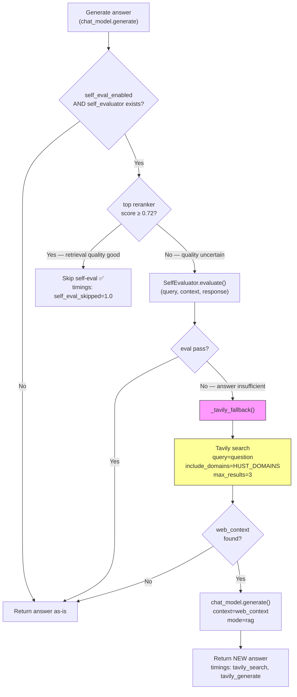
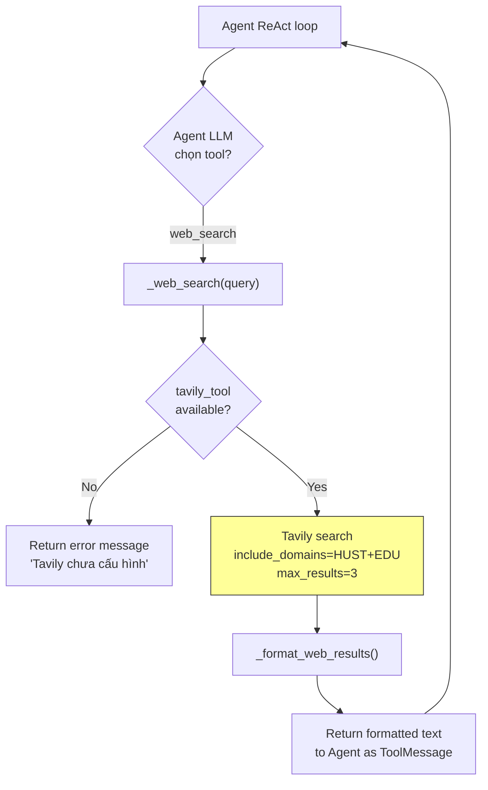

# Module: `tools` — Web Search Layer

## Tổng quan

Module `tools` cung cấp **web search fallback** qua Tavily API, bổ sung thông tin khi kho dữ liệu nội bộ (Qdrant + ES) không đủ để trả lời. Tavily được tích hợp ở **hai điểm** trong hệ thống:

1. **Self-eval fallback** (classic RAG flow): Khi answer bị đánh giá chất lượng thấp, hệ thống tìm kiếm web HUST để bổ sung context rồi sinh lại answer.
2. **Agent `web_search` tool** (LangGraph ReAct): Agent tự chọn gọi web search khi `rag_search` không đủ thông tin.

---

## Cấu trúc file

```
tools/
├── __init__.py          # Public API: export TavilySearchTool
├── tavily_search.py     # TavilySearchTool + domain whitelists
└── MODULE.md            # Tài liệu này
```

---

## Public API (`__init__.py`)

```python
from tools import TavilySearchTool
from tools.tavily_search import HUST_DOMAINS, EDU_DOMAINS
```

---

## Chi tiết component

### `tavily_search.py` — `TavilySearchTool`

**Nhiệm vụ:** Wrapper an toàn cho Tavily API, cung cấp retry logic, rate limiting, domain filtering, và format kết quả cho LLM context.

#### Domain Whitelists

```python
# Tier 1: Nguồn chính thức HUST — dùng cho self-eval fallback (scope hẹp)
HUST_DOMAINS = [
    "hust.edu.vn",          # Cổng thông tin ĐHBK Hà Nội
    "sis.hust.edu.vn",      # Hệ thống thông tin sinh viên
    "ctt.hust.edu.vn",      # Phòng Đào tạo
    "ctsv.hust.edu.vn",     # Công tác sinh viên
    "soict.hust.edu.vn",    # Viện CNTT-TT
]

# Tier 2: Nguồn giáo dục VN mở rộng — dùng thêm cho agent web_search
EDU_DOMAINS = [
    "moet.gov.vn",          # Bộ Giáo dục và Đào tạo
    "vnexpress.net",        # Tin tức giáo dục
    "tuoitre.vn",           # Tin tức giáo dục
    "thanhnien.vn",         # Tin tức giáo dục
    "dantri.com.vn",        # Tin tức giáo dục
]
```

Danh sách này có thể mở rộng thêm các subdomain viện/trường của HUST (ví dụ: `see.hust.edu.vn`, `sem.hust.edu.vn`, `fee.hust.edu.vn`...).

#### Constructor

```python
TavilySearchTool(
    api_key: str | None = None,          # Falls back to TAVILY_API_KEY env var
    max_results: int = 5,                # Default result count
    max_retries: int = 3,                # Retry transient failures
    min_retry_delay: float = 1.0,        # Base delay for exponential backoff
    default_include_domains: list | None = None,  # Instance-level domain whitelist
)
```

#### Method: `search()`

```python
result = tool.search(
    query="lịch đăng ký học phần 20261",
    max_results=3,                        # Override instance default
    search_depth="basic",                 # "basic" (1 credit) | "advanced" (2 credits)
    include_answer=True,                  # Ask Tavily to generate a short answer
    include_domains=HUST_DOMAINS,         # Per-call override (None → use default_include_domains)
    exclude_domains=None,                 # Exclude specific domains
)
```

**Return value:**

```python
{
    "query": "lịch đăng ký học phần 20261",
    "answer": "Theo thông báo ...",        # Tavily-generated short answer
    "results": [                           # Parsed result list
        {"title": "...", "url": "...", "content": "..."},
        ...
    ],
    "context": "[1] Title\nURL: ...\nContent...\n\n---\n\n[2] ...",  # LLM-ready formatted string
}
```

#### Resilience

| Cơ chế | Chi tiết |
|:---|:---|
| **Rate limiting** | Tối thiểu 1.0s giữa các API call (`DEFAULT_MIN_INTERVAL`) |
| **Retry** | 3 lần với exponential backoff: 1s → 2s → 4s |
| **Auth error** | `InvalidAPIKeyError` → fail ngay, không retry |
| **Transient error** | Network timeout, 5xx → retry với backoff |
| **Domain filtering** | `include_domains` → chỉ lấy kết quả từ domains chỉ định |

---

## Điểm tích hợp trong hệ thống

### 1. Self-eval Fallback (Classic RAG Flow)

**File:** `pipeline/flows.py` → `_tavily_fallback()`

**Khi nào hoạt động:**

```
rag_flow()
  └→ Generate answer
  └→ Self-eval check (CHỈ khi SELF_EVAL_ENABLED=true)
       └→ Kiểm tra top reranker score:
            ├→ score ≥ 0.72 → SKIP self-eval (query đã tốt)
            └→ score < 0.72 → RUN SelfEvaluator.evaluate()
                 ├→ pass=True → Return answer gốc
                 └→ pass=False → TRIGGER Tavily fallback
                      └→ Tavily search (HUST_DOMAINS only, max 3, basic)
                           ├→ web_context rỗng → Return answer gốc
                           └→ web_context có data → Re-generate answer
```

**Luồng chi tiết:**



**Domain scope:** `HUST_DOMAINS` only (Tier 1) — giữ kết quả hẹp, đảm bảo answer liên quan HUST.

**Streaming path:** `/chat/stream` **KHÔNG** chạy self-eval/Tavily fallback — giữ UX streaming real-time.

**Error handling:** Nếu Tavily search thất bại (network error, invalid key…) → log warning, return answer gốc (không crash).

---

### 2. Agent `web_search` Tool (LangGraph ReAct)

**Files:**
- `agent/lc_tools.py` → StructuredTool binding
- `agent/tool_adapters.py` → `_web_search()` implementation

**Khi nào hoạt động:**

Agent LLM (Qwen2.5 local) tự quyết định gọi `web_search` khi:
- `rag_search` trả về không đủ thông tin
- Câu hỏi cần thông tin mới nhất (deadline, lịch thi, thông báo)
- Database nội bộ chưa cập nhật

**Tool schema (LangChain):**

```python
# Bound vào agent ReAct loop
StructuredTool(
    name="web_search",
    description="Tìm thông tin mới nhất trên internet qua Tavily. "
                "Chỉ dùng khi database không có kết quả hoặc cần thông tin rất mới.",
    args_schema=WebSearchInput,  # { query: str }
)
```

**Luồng:**



**Domain scope:** `HUST_DOMAINS + EDU_DOMAINS` (Tier 1 + Tier 2) — agent cần flexibility cho câu hỏi phức tạp, có thể cần thông tin từ Bộ GD-ĐT hoặc tin tức giáo dục.

**Output format (ToolMessage):**

```text
Tom tat Tavily: <short answer>

[1] <title>
<content snippet>
URL: <url>

[2] <title>
<content snippet>
URL: <url>
```

---

### 3. Planner-Executor Path

**File:** `agent/tool_adapters.py` → `web_search_for_executor()`

Public wrapper cho `_web_search()`, dùng bởi `react_agent._executor_node()` khi planner-executor cần web search trong retrieval plan.

---

## Khởi tạo và lifecycle

### Startup

```
RAGPipeline.__init__()
  └→ RetrievalService.from_settings(settings)
       └→ Kiểm tra TAVILY_API_KEY:
            ├→ Key hợp lệ → TavilySearchTool(api_key=key)
            │     Log: "RetrievalService: Tavily web search tool loaded."
            └→ Key rỗng/placeholder → tavily_tool = None
                  (không log lỗi, chỉ skip)
  └→ self._tavily = retrieval_service.tavily_tool
  └→ inject_from_retrieval_service(retrieval_service)
       └→ Agent tool_adapters nhận chung tavily_tool instance
```

**Key validation:** Reject các placeholder values: `""`, `"your-key-here"`, `"CHANGE_ME"`, `"tvly-xxx"`, bất kỳ string bắt đầu bằng `"your-"`.

### Shared instance

`TavilySearchTool` được tạo **một lần** trong `RetrievalService` và shared qua:
- `RAGPipeline._tavily` → truyền vào `rag_flow()` → `_tavily_fallback()`
- `_AdapterRuntime.tavily_tool` → dùng bởi `_web_search()` trong agent

Không cần tạo instance mới ở bất kỳ đâu.

---

## Cấu hình (.env)

```env
# ─── API Key ──────────────────────────────────────────────────────────────────
TAVILY_API_KEY=tvly-xxxxxxxxxxxxx           # Lấy từ app.tavily.com

# ─── Self-eval + Tavily Fallback ──────────────────────────────────────────────
SELF_EVAL_ENABLED=true                      # BẮT BUỘC để Tavily fallback hoạt động
SELF_EVAL_MIN_TOP_SCORE=0.72                # Skip self-eval khi retrieval đã tốt
TAVILY_FALLBACK_ENABLED=true                # Flag cho logging/metrics
TAVILY_SEARCH_DEPTH=basic                   # basic (1 credit) | advanced (2 credits)
TAVILY_MAX_RESULTS=3                        # Số kết quả mỗi lần search
```

**Settings mapping (config/settings.py):**

| Setting | Default | Mô tả |
|:---|:---|:---|
| `tavily_api_key` | `""` | API key Tavily |
| `self_eval_enabled` | `False` | Master switch cho self-eval → Tavily chain |
| `self_eval_min_top_score` | `0.72` | Threshold skip self-eval khi retrieval tốt |
| `tavily_fallback_enabled` | `False` | Flag bổ sung (logging/metrics, không gate logic) |
| `tavily_search_depth` | `"basic"` | Độ sâu tìm kiếm Tavily |
| `tavily_max_results` | `3` | Số kết quả mỗi search |

> **Lưu ý:** `tavily_fallback_enabled` hiện **không** được check trong `flows.py` — Tavily fallback được gating thuần bởi `self_evaluator is not None` (từ `self_eval_enabled`) + `tavily_tool is not None` (từ API key hợp lệ). Flag này chủ yếu cho observability/metrics.

---

## Chi phí Tavily API

| Loại search | Credits/call | Use case |
|:---|:---|:---|
| Basic search | 1 | Self-eval fallback, agent web_search |
| Advanced search | 2 | Khi cần kết quả sâu hơn (chưa dùng) |

**Free tier:** 1,000 credits/tháng (không cần credit card).

**Estimate sử dụng:**

| Scenario | Credits/tháng |
|:---|:---|
| Self-eval fallback (~5-10% queries × ~50/ngày) | 75–150 |
| Agent web_search (~20-50 complex queries) | 20–50 |
| **Total** | **~100–200** |

---

## Observability

### Timings (trong `timings_ms` response)

| Key | Xuất hiện khi | Ý nghĩa |
|:---|:---|:---|
| `self_eval` | Self-eval chạy | Thời gian evaluate (ms) |
| `self_eval_skipped` | `= 1.0` khi skip | Top score ≥ threshold |
| `tavily_search` | Tavily search chạy | Thời gian API call (ms) |
| `tavily_generate` | Re-generate chạy | Thời gian LLM sinh answer mới (ms) |
| `tavily_total` | Tavily pipeline chạy | Tổng thời gian fallback (ms) |

### Frontend

`PipelineTrace.tsx` hiển thị Tavily section khi phát hiện `timings_ms['tavily_total']`:

- **Self-eval passed** → hiển thị ✅ badge
- **Self-eval skipped** → hiển thị "skipped" badge
- **Self-eval failed → Tavily triggered** → hiển thị ⚡ badge + timing breakdown (`tavily_search`, `tavily_generate`)

### Logs

```
INFO  Self-eval FAILED (...), attempting Tavily fallback
INFO  Tavily search: query='...' (max=3, domains=5)
INFO  Tavily fallback generated 842 chars
```

---

## Error handling toàn diện

| Lỗi | Xử lý | Kết quả |
|:---|:---|:---|
| API key rỗng/placeholder | `tavily_tool = None` khi startup | Tavily silently disabled |
| `InvalidAPIKeyError` | Fail ngay, không retry | Exception propagate → answer gốc giữ nguyên |
| Network timeout / 5xx | Retry 3 lần (1s → 2s → 4s) | Sau 3 lần → exception → answer gốc giữ nguyên |
| Web context rỗng | Return answer gốc | Không re-generate |
| Re-generate thất bại | Catch exception, log warning | Return answer gốc |
| Self-eval thất bại | Catch exception, log warning | Return answer gốc |
| Agent `web_search` lỗi | Return error string `[Loi: ...]` | Agent nhận error → tiếp tục reasoning |

**Nguyên tắc:** Tavily là **fallback bổ trợ**, mọi lỗi đều graceful degrade → answer gốc luôn được trả về.

---

## LLM involvement

Module `tools` **không tự dùng LLM**. Chỉ gọi Tavily REST API.

LLM involvement xảy ra ở caller:
- `_tavily_fallback()` → `chat_model.generate(context=web_context)` — dùng Gemini để re-generate answer từ web context
- Agent → LLM quyết định khi nào gọi `web_search`

---

## Latency contribution

| Component | Thời gian điển hình |
|:---|:---|
| Tavily API call (basic search) | 500–2,000ms |
| Rate limit wait (nếu trigger) | 0–1,000ms |
| Re-generate answer (Gemini) | 1,000–3,000ms |
| **Tổng Tavily fallback** | **~2,000–5,000ms** |

> Self-eval (`SelfEvaluator.evaluate()`) thêm ~2,000–5,000ms trước khi Tavily trigger. Tổng overhead worst case: ~4,000–10,000ms. Nhưng chỉ xảy ra khi top reranker score < 0.72 (~5-10% queries).

---

## Mở rộng domain list

Để thêm domain mới vào whitelist:

```python
# tools/tavily_search.py

HUST_DOMAINS: list[str] = [
    "hust.edu.vn",
    "sis.hust.edu.vn",
    "ctt.hust.edu.vn",
    "ctsv.hust.edu.vn",
    "soict.hust.edu.vn",
    # Thêm domain mới ở đây:
    "fee.hust.edu.vn",       # Viện Điện
    "fme.hust.edu.vn",       # Viện Cơ khí
    "see.hust.edu.vn",       # Viện Kinh tế
    "sem.hust.edu.vn",       # Viện Quản lý
]
```

Không cần thay đổi file nào khác — `HUST_DOMAINS` được import trực tiếp bởi `flows.py` và `tool_adapters.py`.
