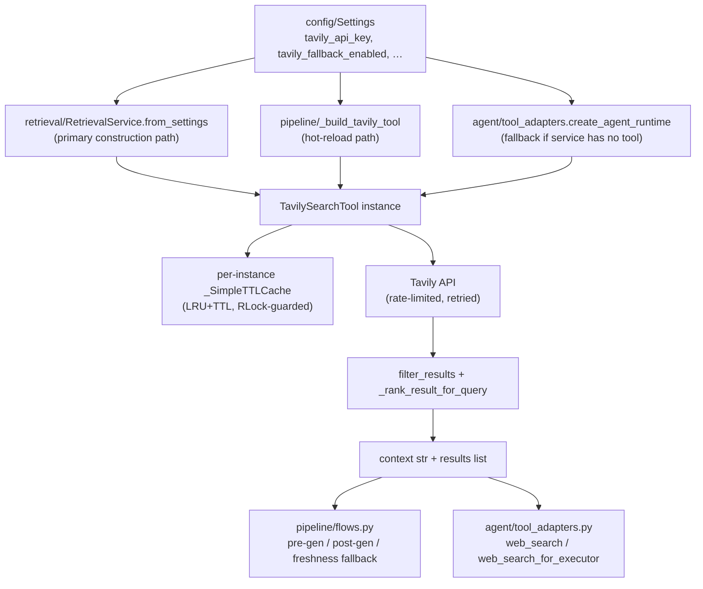

# Module: `tools`

Source-verified: 2026-06-24 from `tools/__init__.py`, `tools/tavily_search.py`, `config/settings.py`, `retrieval/service.py`, `agent/tool_adapters.py`, `pipeline/rag_pipeline.py`.

## Purpose

`tools` is the Tavily web-search adapter layer. It wraps the `tavily-python` SDK into a single reusable class (`TavilySearchTool`) with caching, rate-limiting, retry logic, domain filtering, and result ranking. The module does **not** decide when web fallback is permitted — that policy lives in `pipeline/flows.py` (gated on `tavily_fallback_enabled`) and `agent/tool_adapters.py` (honours the same flag). This module only performs and formats searches.

**Boundaries:**
- Does not call an LLM; LLM use happens in callers after web context is returned.
- Does not route or classify queries; callers pass queries directly.
- Does not write to any store; results are returned in-memory.

## File Map

```text
tools/
  __init__.py        Re-exports public API (TavilySearchTool, is_valid_tavily_api_key, all domain lists).
  tavily_search.py   All implementation: TavilySearchTool, _SimpleTTLCache, domain constants, helpers.
```

## Public Exports (`__init__.py`)

```python
from tools import (
    TavilySearchTool,
    is_valid_tavily_api_key,
    HUST_OFFICIAL_DOMAINS,
    HUST_EXTENDED_DOMAINS,
    HUST_DOMAINS,           # alias: HUST_OFFICIAL_DOMAINS + HUST_EXTENDED_DOMAINS
    EDU_AUTHORITATIVE_DOMAINS,
    EDU_DOMAINS,            # alias: EDU_AUTHORITATIVE_DOMAINS
)
```

## Module-Level Helpers

### `is_valid_tavily_api_key(key: Optional[str]) -> bool`

Returns `True` when `key` is non-empty and not a known placeholder. Rejects:
- Exact matches: `""`, `"your-key-here"`, `"change_me"`, `"tvly-xxx"`, `"your-tavily-api-key-here"`
- Prefix matches (case-insensitive): `"your-"`, `"change_me"`, `"changeme"`

Called by `retrieval/service.py:RetrievalService.from_settings`, `pipeline/rag_pipeline.py:_build_tavily_tool`, and `agent/tool_adapters.py:_is_valid_api_key` (which re-imports it).

### `_load_tavily_client() -> tuple[type[TavilyClient], type[InvalidAPIKeyError]]`

Lazy import of `tavily.TavilyClient` and `tavily.errors.InvalidAPIKeyError`. Raises `RuntimeError("tavily-python is required …")` if the package is absent. Called only from `TavilySearchTool.__init__`, keeping the `tavily` package optional at import time.

## Domain Constants

| Constant | Contents |
|---|---|
| `HUST_OFFICIAL_DOMAINS` | `hust.edu.vn`, `sis.`, `ctt.`, `ctsv.`, `sv-ctt.`, `soict.hust.edu.vn` (6 domains) |
| `HUST_EXTENDED_DOMAINS` | Faculty subdomains: `seee.`, `scls.`, `fami.`, `sme.`, `smse.`, `see.`, `sem.`, `fee.`, `fme.hust.edu.vn` (9 domains) |
| `HUST_DOMAINS` | `HUST_OFFICIAL_DOMAINS + HUST_EXTENDED_DOMAINS` (backward-compat alias) |
| `EDU_AUTHORITATIVE_DOMAINS` | `["moet.gov.vn"]` only |
| `EDU_DOMAINS` | `EDU_AUTHORITATIVE_DOMAINS` (backward-compat alias) |

**Note:** `EDU_AUTHORITATIVE_DOMAINS` currently contains only one domain (`moet.gov.vn`). News and general-web domains are intentionally excluded.

## `_SimpleTTLCache`

Internal LRU+TTL cache backed by `collections.OrderedDict`. Thread-safe only when the caller holds the external `RLock` (which `TavilySearchTool` does). Constructor: `__init__(maxsize: int, ttl_seconds: int)`. Evicts by LRU when over capacity and by TTL on read.

## `TavilySearchTool`

### Constructor

```python
TavilySearchTool(
    api_key: Optional[str] = None,           # falls back to TAVILY_API_KEY env var
    max_results: int = 5,
    max_retries: int = 3,
    min_retry_delay: float = 1.0,            # base delay for exponential backoff
    default_include_domains: Optional[List[str]] = None,
    cache_maxsize: int = 200,
    cache_ttl_seconds: int = 3600,
)
```

`_load_tavily_client()` is called at construction time; missing `tavily-python` raises `RuntimeError` immediately. The API key is **not** validated here — an invalid key surfaces only at the first actual API call as `InvalidAPIKeyError`.

### `search(...) -> Dict[str, Any]`

```python
def search(
    self,
    query: str,
    max_results: Optional[int] = None,
    search_depth: Literal["advanced", "basic", "fast", "ultra-fast"] = "basic",
    include_answer: bool = True,
    include_domains: Optional[List[str]] = None,   # falls back to default_include_domains
    exclude_domains: Optional[List[str]] = None,
    result_count: Optional[int] = None,            # final keep-count after filter/rank
    content_char_limit: Optional[int] = None,      # truncate each result's content
    query_year: Optional[int] = None,              # freshness filter threshold
) -> Dict[str, Any]
```

**Return shape:**
```python
{
    "query":   str,          # original query
    "answer":  str,          # Tavily-generated short answer (empty string if none)
    "results": List[dict],   # each: {"title", "url", "content", "score"}
    "context": str,          # numbered text block: "[1] title\nURL: …\ncontent"
}
```

**Processing pipeline:** fetch from Tavily → `_parse_results` → `filter_results` (min content 100 chars) → `_rank_result_for_query` sort → optional `result_count` slice → optional `content_char_limit` truncation → `_format_context`.

**Caching:** cache key includes `(query, max_results, search_depth, include_answer, include_domains tuple, exclude_domains tuple, result_count, content_char_limit, query_year)`. Cache is per-instance.

**Retry:** exponential backoff up to `max_retries` attempts; `InvalidAPIKeyError` bypasses retries and raises immediately.

**Rate limit:** `DEFAULT_MIN_INTERVAL = 1.0s` enforced by `_wait_for_rate_limit` using the same `_cache_lock` (`RLock`).

### `extract(urls, extract_depth, query) -> Dict[str, Any]`

```python
def extract(
    self,
    urls: List[str],
    extract_depth: Literal["basic", "advanced"] = "basic",
    query: Optional[str] = None,
) -> Dict[str, Any]
```

Bypasses Tavily's search index; fetches content directly from specific URLs. Useful for dynamic pages (e.g. `?kehoach=29237`) not yet indexed. Uses `raw_content` field from Tavily response if present, falls back to `content`.

**Return shape:**
```python
{
    "results":        List[{"title", "url", "content"}],
    "failed_results": List[{"url", "error"}],
    "context":        str,
}
```

Extract results are **not cached**. Same retry/rate-limit logic as `search`.

### `filter_results(...)` (staticmethod)

```python
@staticmethod
def filter_results(
    results: List[Dict[str, Any]],
    *,
    min_content_length: int = 100,
    min_score: float = 0.0,
    query_year: int | None = None,
    exclude_homepages: bool = True,
) -> List[Dict[str, Any]]
```

Drops results that are: too short, below `min_score`, site homepages (paths `""`, `"/vi"`, `"/en"`, `"/index"`, `"/index.html"`), or stale when `query_year` is set (drops if all years in content are `< query_year - 1`).

### `_rank_result_for_query(query, result)` (classmethod)

Deterministic re-ranking on top of Tavily's own `score` field. Uses accent-folded (`_fold_text`) comparison across title + content + url. Boost rules:

| Signal | Boost |
|---|---|
| Semester code match (`20xx[123]`) | +5.0 |
| School-year range match (`20xx-20xx`) | +2.0 |
| Summer-semester (`ky he`) + code `20xx3` in result | +1.0 |
| Summer-semester false match (20243 in result but query wants 20253) | −2.0 |
| Freshness tokens (`moi nhat`, `latest`, `recent`, `hien tai`) + recency | +(max_year−2020)/10 capped at 1.0 |

## Integration Points

### Construction (two independent paths)

1. **`retrieval/service.py: RetrievalService.from_settings()`** — primary path. Creates `TavilySearchTool` with `cache_maxsize` and `cache_ttl_seconds` from settings. Stored as `RetrievalService.tavily_tool`. Subsequently assigned to `RAGPipeline._tavily`.

2. **`pipeline/rag_pipeline.py: _build_tavily_tool(settings)`** — used during hot-reload (`RAGPipeline.reload_llm_config`). Creates a second independent instance if the key changed. Replaces both `RAGPipeline._tavily` and `retrieval_service.tavily_tool`.

3. **`agent/tool_adapters.py: create_agent_runtime()`** — creates yet another instance if `retrieval_service.tavily_tool` is `None` (fallback). In practice the `RetrievalService` instance is normally used via `retrieval_service.tavily_tool or tavily_tool`.

### Callers of `TavilySearchTool.search`

| Caller | Location | Gating condition |
|---|---|---|
| Pre-generation web enrichment | `pipeline/flows.py` | `tavily_fallback_enabled=True` + dynamic/freshness/low-conf trigger |
| Post-generation quality gate | `pipeline/flows.py` | `tavily_fallback_enabled=True` + self-eval returns `insufficient`/`stale_risk` |
| Freshness check (Tier 3 retrieval) | `pipeline/flows.py` | `freshness_tavily_check_enabled=True` (default `False`) |
| Agent `web_search` tool | `agent/tool_adapters.py` | `tavily_fallback_enabled=True` (checked inside `_web_search`); also `tavily_tool is not None` |
| Planner executor | `agent/tool_adapters.py: web_search_for_executor()` | same as agent web_search |

**Streaming path:** runs pre-generation Tavily fetch when `tavily_fallback_enabled=True`; skips the post-generation self-eval/Tavily quality gate to preserve streaming UX.

## Settings Keys (`config/settings.py`)

| Key | Default | Description |
|---|---|---|
| `tavily_api_key` | `""` | API key; also read from `TAVILY_API_KEY` env var |
| `tavily_fallback_enabled` | `False` | Master on/off switch for all Tavily calls in flows + agent |
| `tavily_search_depth` | `"basic"` | `"basic"` (1 credit) or `"advanced"` (2 credits) |
| `tavily_max_results` | `5` | Fetch pool size sent to Tavily before filtering |
| `tavily_web_result_count` | `3` | Final keep count after filter/rank (`result_count` arg) |
| `tavily_web_content_char_limit` | `1500` | Per-result content truncation |
| `tavily_cache_ttl_seconds` | `3600` | Passed to `TavilySearchTool(cache_ttl_seconds=…)` |
| `tavily_cache_maxsize` | `200` | Passed to `TavilySearchTool(cache_maxsize=…)` |
| `web_fallback_on_dynamic` | `False` | Trigger pre-gen fallback for dynamic/freshness queries |
| `web_fallback_on_no_info` | `False` | Trigger pre-gen fallback when local retrieval finds nothing |
| `freshness_tavily_check_enabled` | `False` | Extra freshness-check Tavily call in Tier 3 retrieval flow |

**Gotcha:** `web_fallback_on_dynamic` and `web_fallback_on_no_info` control LLM answer-cache bypass even when `tavily_fallback_enabled=False` — dynamic/freshness queries bypass the answer cache regardless of whether web search itself fires.

## Module Flow



## Maintenance Notes

- `extract()` results are **not cached** — every call hits the Tavily API. If called in a hot path, add caching or call-site deduplication.
- API key validity is checked at construction of `TavilySearchTool`, but `InvalidAPIKeyError` is not raised until the first actual API call. Do not assume a successfully constructed instance has a valid key.
- `EDU_AUTHORITATIVE_DOMAINS` contains only `moet.gov.vn`; other ministerial/education sources are absent. Extend this list if broader authoritative coverage is needed.
- Domain normalisation (`_normalize_domain`) strips scheme, path, and trailing dots. Pass bare hostnames or full URLs — both work.
- `_rank_result_for_query` operates on accent-folded ASCII; Vietnamese diacritics are stripped before comparison. Semester codes like `20251` must appear verbatim in the result content/url to score.
- Keep `tavily_fallback_enabled=False` as the default; enabling it increases per-request latency by 1–3s and Tavily API credit spend.
- Do not import `tavily` at module level — lazy import via `_load_tavily_client` is intentional to keep the package optional.

## Useful Checks

```bash
# Syntax check
python -m py_compile src/RAG_v2/tools/tavily_search.py

# Unit tests (no network calls)
pytest src/RAG_v2/tests/ -q -m "not integration" -k "tavily or web"

# Verify key validation logic
python -c "from tools.tavily_search import is_valid_tavily_api_key; print(is_valid_tavily_api_key('tvly-xxx'))"
```
