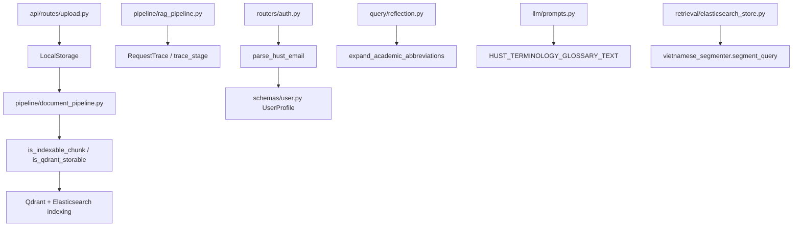

# Module: `utils`

Source-verified: 2026-06-05 from `utils/__init__.py`, `utils/storage.py`, `utils/tracing.py`, `utils/chunk_indexing.py`, `utils/terminology.py`, `utils/parse_hust_email.py`, `utils/vietnamese_segmenter.py`, `utils/extract_questions.py`, `utils/extract_text.py`, plus consumer call sites in `pipeline/`, `query/`, `retrieval/`, `llm/`, `routers/`, and `api/routes/`.

## Purpose

`utils` contains small shared helpers that do not belong to a larger runtime module: storage abstraction, request tracing, chunk indexing policy, academic terminology expansion, HUST email parsing, Vietnamese word segmentation, and standalone text/question extraction scripts.

## File Map

```text
utils/
  __init__.py             Empty package marker.
  storage.py              StorageBackend ABC + LocalStorage (save_upload/save_text/read_text/delete_all).
  tracing.py              RequestTrace (stage/record_stage/set_metadata/record_error/summary/log_summary) and @trace_stage decorator.
  chunk_indexing.py       is_indexable_chunk() (search-index policy) and is_qdrant_storable() (Qdrant storage policy).
  terminology.py          TerminologyAlias, HUST_TERMINOLOGY_ALIASES, HUST_TERMINOLOGY_GLOSSARY_TEXT, expand_academic_abbreviations().
  parse_hust_email.py     parse_hust_email() — derive full_name/student_id/cohort/major from a @sis.hust.edu.vn address.
  vietnamese_segmenter.py segment(), segment_for_indexing(), segment_query(), get_compound_variants(), is_available() for BM25 word segmentation.
  extract_questions.py    CLI script: extract `question` field from a JSONL dataset to text/JSONL.
  extract_text.py         CLI script: dump payload `text` values from a Qdrant scroll JSON to texts_quydinh.json.
```

## Module Flow



External module boundaries:

- `utils` is dependency-light glue; storage is used by admin upload, tracing by the chat pipeline, and chunk policy by document indexing.
- Helpers feed `query`, `retrieval`, `llm`, `routers`, scripts, and tests, but should not own routing, generation, or persistence contracts.
- If a helper starts requiring heavy runtime services, move it into the owning module instead of expanding `utils`.

## Storage

`storage.py` defines:

- `StorageBackend` — async ABC (`save_upload`, `save_text`, `read_text`, `delete_all`).
- `LocalStorage` — local-disk backend storing `original.pdf`, `markdown.md`, `cleaned.md` under `{base_dir}/{doc_id}/`.

Used by `api/routes/upload.py` and `pipeline/document_pipeline.py` to store original PDFs, converted Markdown, cleaned text, and intermediate artifacts.

## Request Tracing

`tracing.py` defines:

- `RequestTrace` — request-scoped timer with `stage()` context manager, `record_stage()`, `set_metadata()`, `record_error()`, `total_ms`/`stages` properties, `summary()`, and `log_summary()`.
- `trace_stage(stage_name)` — decorator that times a function when a `trace=` kwarg is passed (no-op otherwise).

`pipeline/rag_pipeline.py` uses these to expose stage timings and debug metadata in chat responses.

## Chunk Indexing Policy

`chunk_indexing.py` defines two policies keyed off `metadata.level`:

- `is_indexable_chunk()` — excludes `parent`/`header` chunks from the SEARCH index (ES + Qdrant search results).
- `is_qdrant_storable()` — excludes only `header` chunks from Qdrant; parents ARE stored so `ParentContextExpander` can fetch them by ID (search results filter them out via `must_not level=parent`).

Chunks missing `metadata.level` remain indexable/storable for backward compatibility. Consumed by `pipeline/document_pipeline.py`.

Keep this policy aligned with chunker metadata fields:

- `metadata.level`
- `metadata.chunk_type`

## Academic Terminology

`terminology.py` defines:

- `TerminologyAlias` (frozen dataclass: `full`, `abbr`) and `HUST_TERMINOLOGY_ALIASES` (NCS, ĐRL, NCKH, TKB, HVCH, CTĐT).
- `HUST_TERMINOLOGY_GLOSSARY_TEXT` — glossary string injected into generation prompts (`llm/prompts.py`).
- `expand_academic_abbreviations()` — idempotent, accent-folded full↔abbreviation aliasing for query rewrites (`query/reflection.py`).

## HUST Email Parsing

`parse_hust_email.py:parse_hust_email()` parses a `@sis.hust.edu.vn` address into `full_name`, `student_id` (8-digit, `20`+suffix), `cohort` (year→K-label map, `K?` if unmapped), and a hardcoded `major`. Used by `routers/auth.py` to pre-populate the `schemas/user.py` profile.

## Vietnamese Segmentation

`vietnamese_segmenter.py` provides word segmentation for BM25. Uses `underthesea` (CRF) when installed, else a built-in compound-word dictionary. Exposes `segment()`, `segment_for_indexing()` (original + segmented), `segment_query()`, `get_compound_variants()`, and `is_available()`. Consumed by `retrieval/elasticsearch_store.py`.

## Standalone Scripts

- `extract_questions.py` — argparse CLI; reads a JSONL dataset and writes the `question` field (with `--unique`/`--jsonl` options) to a text/JSONL file.
- `extract_text.py` — reads a Qdrant scroll JSON (file arg or stdin) and dumps payload `text` values to `texts_quydinh.json`.

## Maintenance Notes

- Keep utils small and dependency-light.
- If a helper becomes domain-specific, move it into the owning module.
- Storage changes affect admin upload and tests.
- Tracing field changes affect the chat pipeline / trace summaries.
- Cohort/major mappings in `parse_hust_email.py` are hardcoded and HUST-specific.

## Useful Checks

```bash
python -m py_compile utils/*.py
python -m pytest tests/test_storage.py tests/test_chunk_indexing_policy.py tests/test_terminology.py tests/test_parent_context_phase1.py -q -m "not integration"
```
