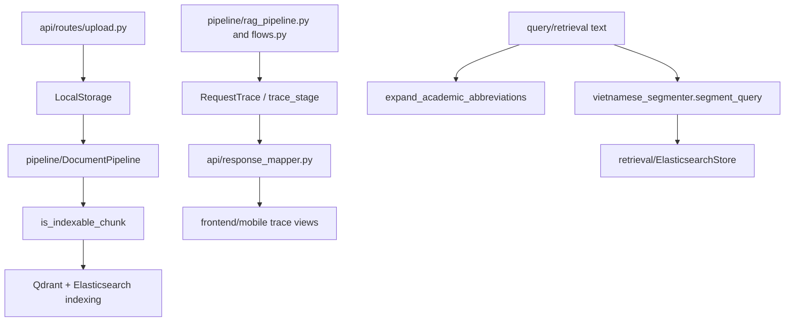

# Module: `utils`

Source-verified: 2026-06-02 from `utils/*.py`, `pipeline/document_pipeline.py`, and API routes.

## Purpose

`utils` contains small shared helpers that do not belong to a larger runtime module: storage abstraction, request tracing, chunk indexing policy, text/question extraction, and HUST email parsing.

## File Map

```text
utils/
  storage.py          StorageBackend interface and LocalStorage implementation.
  tracing.py          RequestTrace and trace_stage timing helpers.
  chunk_indexing.py   is_indexable_chunk() policy for admin upload indexing.
  parse_hust_email.py Parse HUST/SIS-style email metadata.
  terminology.py      HUST abbreviation/full-term expansion helpers.
  vietnamese_segmenter.py Optional underthesea/dictionary segmentation for BM25 text.
  extract_questions.py Extract/normalize questions from text files.
  extract_text.py      Simple recursive text extraction helper.
```

## Module Flow



External module boundaries:

- `utils` is dependency-light glue; storage is used by admin upload, tracing by chat API/UI, and chunk policy by document indexing.
- Text helpers feed `query`, `retrieval`, scripts, and tests, but should not own routing, generation, or persistence contracts.
- If a helper starts requiring heavy runtime services, move it into the owning module instead of expanding `utils`.

## Storage

`storage.py` defines:

- `StorageBackend`
- `LocalStorage`

`LocalStorage` is used by admin upload routes and `DocumentPipeline` to store original PDFs, converted Markdown, cleaned text, and intermediate artifacts under the configured upload directory.

## Request Tracing

`tracing.py` defines:

- `RequestTrace`
- `trace_stage(stage_name)`

Pipeline/API code uses these structures to expose timings and debug metadata in chat responses.

## Chunk Indexing Policy

`chunk_indexing.py:is_indexable_chunk()` prevents parent/header chunks from being embedded/indexed while allowing them to remain in Mongo for admin review.

Keep this policy aligned with chunker metadata fields:

- `metadata.level`
- `metadata.chunk_type`

## Maintenance Notes

- Keep utils small and dependency-light.
- If a helper becomes domain-specific, move it into the owning module.
- Storage changes affect admin upload and tests.
- Tracing field changes affect frontend trace UI.

## Useful Checks

```bash
python -m py_compile utils/*.py
python -m pytest tests/test_storage.py tests/test_chunk_indexing_policy.py -q -m "not integration"
```
