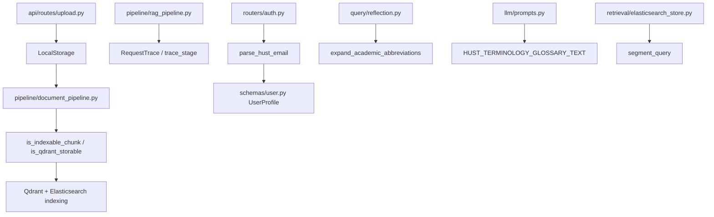

# Module: `utils`

Source-verified: 2026-06-24 from `utils/__init__.py`, `utils/storage.py`, `utils/tracing.py`, `utils/chunk_indexing.py`, `utils/terminology.py`, `utils/parse_hust_email.py`, `utils/vietnamese_segmenter.py`, `utils/extract_questions.py`, `utils/extract_text.py`.

## Purpose

`utils` contains small shared helpers that do not belong to a larger runtime module: storage abstraction, request tracing, chunk indexing policy, academic terminology expansion, HUST email parsing, Vietnamese word segmentation, and two standalone data-extraction scripts.

Boundaries: `utils` must stay dependency-light. It feeds `query/`, `retrieval/`, `llm/`, `routers/`, `api/routes/`, and tests but must not own routing, generation, or persistence contracts. If a helper starts requiring heavy runtime services, move it into the owning module.

## File Map

```text
utils/
  __init__.py             Package marker — single comment line, no exports.
  storage.py              StorageBackend ABC + LocalStorage (save_upload/save_text/read_text/delete_all).
  tracing.py              RequestTrace + @trace_stage decorator (sync-only wrapper).
  chunk_indexing.py       is_indexable_chunk() and is_qdrant_storable() — search/storage policy.
  terminology.py          TerminologyAlias, HUST_TERMINOLOGY_ALIASES, HUST_TERMINOLOGY_GLOSSARY_TEXT, expand_academic_abbreviations().
  parse_hust_email.py     parse_hust_email() — derive full_name/student_id/cohort/major from @sis.hust.edu.vn address.
  vietnamese_segmenter.py segment/segment_for_indexing/segment_query/get_compound_variants/is_available.
  extract_questions.py    CLI + library: extract `question` field from JSONL dataset.
  extract_text.py         CLI script: dump payload `text` values from Qdrant scroll JSON to texts_quydinh.json.
```

## Module Flow



## Storage (`storage.py`)

```python
class StorageBackend(ABC):
    async def save_upload(self, file: UploadFile, doc_id: str) -> str: ...
    async def save_text(self, content: str, doc_id: str, suffix: str) -> str: ...
    async def read_text(self, path: str) -> str: ...
    async def delete_all(self, doc_id: str) -> None: ...

class LocalStorage(StorageBackend):
    def __init__(self, base_dir: str = "uploads") -> None: ...
```

`LocalStorage` stores files under `{base_dir}/{doc_id}/` (creates dirs on init). Canonical files: `original.pdf`, `markdown.md`, `cleaned.md` — the `suffix` parameter in `save_text()` is a bare filename, not an extension.

Return values of `save_upload` and `save_text` are paths **relative to `base_dir`** (not absolute).

**Gotcha — path traversal guard:** `read_text()` resolves the full path and rejects anything that escapes `base_dir` (e.g. `../../etc/passwd`), raising `FileNotFoundError`. This means callers must pass only relative paths obtained from previous `save_*` calls.

Used by `api/routes/upload.py` and `pipeline/document_pipeline.py`.

## Request Tracing (`tracing.py`)

```python
class RequestTrace:
    def __init__(self, correlation_id: Optional[str] = None, query: Optional[str] = None) -> None: ...
    @contextmanager
    def stage(self, name: str) -> Generator[None, None, None]: ...
    def record_stage(self, name: str, elapsed_ms: float) -> None: ...
    def set_metadata(self, key: str, value: Any) -> None: ...
    def record_error(self, stage: str, error: str) -> None: ...
    @property
    def total_ms(self) -> float: ...
    @property
    def stages(self) -> Dict[str, float]: ...
    def summary(self) -> Dict[str, Any]: ...
    def log_summary(self, label: str = "Pipeline") -> None: ...

def trace_stage(stage_name: str) -> Callable: ...
```

`correlation_id` auto-generates a 12-char UUID prefix if not supplied. Calling `stage()` or `record_stage()` multiple times with the same name **accumulates** (sums) the elapsed time.

`summary()` returns:
```python
{
    "correlation_id": str,
    "query": str,          # truncated to 100 chars
    "stages": dict,
    "total_ms": float,
    "metadata": dict,
    "errors": list | None, # None (not []) when no errors
    "created_at": float,   # Unix timestamp
}
```

`log_summary()` emits one INFO line sorted by slowest stage descending; silently returns early if no stages were recorded.

**Gotcha — `trace_stage` is sync-only.** The `trace_stage(stage_name)` decorator wraps a plain `def` function. It does **not** handle `async def` — do not apply it to coroutines. The `trace=` kwarg must be passed by the caller; if absent or `None` the decorator is a no-op.

Used by `pipeline/rag_pipeline.py` to expose stage timings in chat responses.

## Chunk Indexing Policy (`chunk_indexing.py`)

```python
def is_indexable_chunk(chunk: Mapping[str, Any]) -> bool: ...
def is_qdrant_storable(chunk: Mapping[str, Any]) -> bool: ...
```

Both functions read `chunk["metadata"]["level"]` (case-insensitive, strip-normalized).

| `level` value | `is_indexable_chunk` | `is_qdrant_storable` |
|---|---|---|
| `child` / `recursive` / `appendix` | `True` | `True` |
| `parent` | `False` | `True` |
| `header` | `False` | `False` |
| missing / unknown | `True` (backward compat) | `True` (backward compat) |

Rationale: parent chunks are stored in Qdrant so `ParentContextExpander` can fetch them by ID after rerank. They are excluded from search results via the `must_not level=parent` filter in `MultiCollectionSearch`, NOT by this policy.

Consumed by `pipeline/document_pipeline.py`. Keep this table aligned with chunker metadata fields `metadata.level` and `metadata.chunk_type`.

## Academic Terminology (`terminology.py`)

```python
@dataclass(frozen=True)
class TerminologyAlias:
    full: str
    abbr: str

HUST_TERMINOLOGY_ALIASES: tuple[TerminologyAlias, ...] = (...)  # 6 entries
HUST_TERMINOLOGY_GLOSSARY_TEXT: str = "NCS = ...; ĐRL = ...; ..."

def expand_academic_abbreviations(
    text: str,
    aliases: Iterable[TerminologyAlias] = HUST_TERMINOLOGY_ALIASES,
) -> str: ...
```

`HUST_TERMINOLOGY_ALIASES` covers: NCS, ĐRL, NCKH, TKB, HVCH, CTĐT.

`expand_academic_abbreviations()` appends a parenthetical alias (e.g. `"NCS (nghiên cứu sinh)"`) when exactly one side is present. Matching uses accent-folded, caseless word-boundary regex. Idempotent: if both full term and abbreviation already appear, nothing is added.

`HUST_TERMINOLOGY_GLOSSARY_TEXT` is a plain string injected into generation prompts (`llm/prompts.py`).

Private helpers `_fold_text`, `_contains_term`, `_replace_term_once` are not part of the public API.

## HUST Email Parsing (`parse_hust_email.py`)

```python
def parse_hust_email(email: str) -> dict[str, str]: ...
# Returns: {"full_name": str, "student_id": str, "cohort": str, "major": str}
# Raises: ValueError — if domain != @sis.hust.edu.vn or no trailing digits found
```

Parsing rules (verified against source):

- `full_name` — the **first dot-segment** of the local part, `.capitalize()`'d. This is the given name only (e.g. `"nam"` → `"Nam"`), not a full name.
- `student_id` — `"20"` prepended to the trailing digit run of the **last** dot-segment (e.g. `"nh225653"` → `"20225653"`).
- `cohort` — derived from `student_id[:4]`. Map: `2020→K65`, `2021→K66`, `2022→K67`, `2023→K68`, `2024→K69`. Unmapped years return `"K?"`.
- `major` — hardcoded constant `"CNTT Việt Nhật"` for all users.

**Gotchas:**
- `full_name` is the given name only, not a full Vietnamese name.
- `major` is hardcoded `_DEFAULT_MAJOR`; no logic derives it from the email.
- Cohort map stops at 2024 (K69); students matriculating 2025+ will get `"K?"` until the map is updated.
- Input is lowercased before parsing, so the returned `full_name` is always title-case of the lowercased segment.

Used by `routers/auth.py` to pre-populate `schemas/user.py UserProfile`.

## Vietnamese Segmentation (`vietnamese_segmenter.py`)

```python
def is_available() -> bool: ...
def segment(text: str) -> str: ...
def segment_for_indexing(text: str) -> str: ...
def segment_query(query: str) -> str: ...
def get_compound_variants(query: str) -> List[str]: ...
```

Uses `underthesea.word_tokenize` (CRF) when installed; falls back to a built-in `_COMPOUND_WORDS` set (~60 common Vietnamese academic terms) with greedy longest-match.

`segment()` joins multi-syllable words with **underscores** (e.g. `"sinh viên"` → `"sinh_viên"`).

`segment_for_indexing(text)` returns `"<original>\n<segmented>"` when segmentation changes the text, otherwise returns `text` unchanged. Concatenating both forms ensures syllable-level and word-level BM25 matches both work.

`segment_query(query)` delegates directly to `segment()`.

`get_compound_variants(query)` returns `[original]` if segmentation is a no-op, else `[original, segmented]`.

**Gotcha — no async:** all functions are synchronous. The caller (`retrieval/elasticsearch_store.py`) is responsible for offloading to a thread if needed.

Private: `_segment_by_dictionary`, `_COMPOUND_WORDS`, `_SORTED_COMPOUNDS`, `_COMPOUND_PATTERNS`.

## Standalone Scripts

### `extract_questions.py`

Has both a library API and a CLI entry point.

```python
def normalize_question(text: str) -> str: ...
    # Collapses all whitespace/newlines to single-line.

def extract_questions(
    input_path: Path,
    output_path: Path,
    unique: bool,
    keep_jsonl: bool,
) -> tuple[int, int, int]:  # (total, written, skipped)
    ...

def build_parser() -> argparse.ArgumentParser: ...
def main() -> int: ...
```

CLI defaults: input `training_data/train_qa_pairs.jsonl`, output `training_data/questions.txt`. Flags: `--unique` (deduplicate), `--jsonl` (write `{"question": ...}` records instead of plain text).

### `extract_text.py`

Minimal script, no CLI argument parsing beyond `sys.argv[1]`.

```python
def extract_texts(data: dict | list) -> list[str]: ...
    # Accepts either {"result": {"points": [...]}} or a bare list of points.
    # Extracts point["payload"]["text"] values.
```

**Hardcoded output path:** always writes to `texts_quydinh.json` in the current working directory. No flag to change the output path. Pass a file path as `sys.argv[1]` or pipe JSON to stdin.

## Maintenance Notes

- Keep `utils` small and dependency-light. No heavy runtime services.
- Storage changes affect admin upload, document pipeline, and storage-related tests.
- Tracing field changes affect chat pipeline / trace summaries exposed in API responses.
- Cohort/major mappings in `parse_hust_email.py` are hardcoded — update `_COHORT_MAP` each year and add `major` derivation if HUST email format ever encodes it.
- `extract_text.py` has a hardcoded output path (`texts_quydinh.json`) — it is a one-off data script, not a general utility.
- `trace_stage` decorator is sync-only; do not apply to async functions.
- `is_available()` in `vietnamese_segmenter.py` reflects import-time detection — it will not change at runtime.

## Useful Checks

```bash
python -m py_compile utils/*.py
python -m pytest tests/test_storage.py tests/test_chunk_indexing_policy.py tests/test_terminology.py tests/test_parent_context_phase1.py -q -m "not integration"
```
